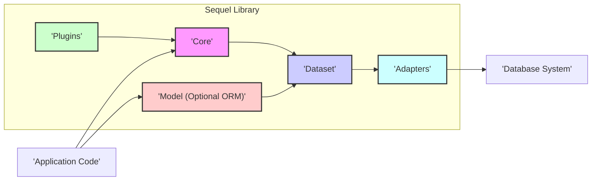
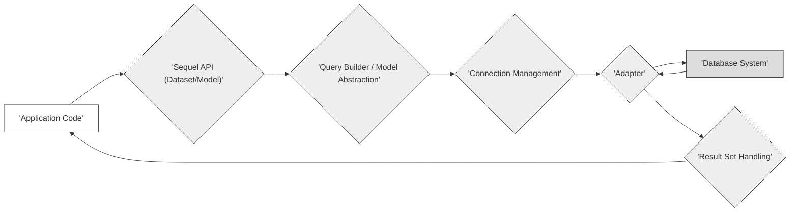

## Project Design Document: Sequel Ruby Library (Improved)

**1. Project Overview**

This document provides a detailed design overview of the Sequel Ruby library, a robust and adaptable database access toolkit for Ruby developers. Sequel offers a fluent and expressive interface for constructing and executing SQL queries across various database systems. It incorporates advanced features such as connection pooling, schema management, transaction control, and an optional Object-Relational Mapping (ORM) layer. The primary purpose of this document is to elucidate Sequel's internal architecture and key interactions, thereby establishing a solid foundation for subsequent threat modeling and security analysis.

**2. Goals and Objectives**

*   Present a clear and comprehensive description of Sequel's architectural design.
*   Identify and detail the core components of the library and their interdependencies.
*   Illustrate the flow of data within the Sequel library during database operations.
*   Proactively highlight potential security considerations and attack vectors based on the design.
*   Serve as a definitive reference for developers, security engineers, and architects involved with Sequel.

**3. Target Audience**

*   Security engineers responsible for conducting threat modeling and security assessments.
*   Software developers who utilize or contribute to the Sequel library.
*   System architects integrating Sequel into larger software systems.
*   Quality assurance engineers involved in testing and validating Sequel integrations.

**4. Scope**

This document focuses specifically on the internal architecture and fundamental functionalities of the Sequel library. The scope explicitly excludes:

*   Implementation details of specific database systems (e.g., PostgreSQL internals, MySQL storage engines).
*   The security posture of the application code that utilizes Sequel.
*   Security considerations at the operating system or infrastructure level where the application runs.
*   Third-party Ruby gems or libraries that interact with Sequel, unless they are integral to Sequel's core functionality or explicitly mentioned.

**5. Architecture Overview**

Sequel's architecture is structured in a layered fashion, promoting modularity and separation of concerns. The main layers are:

*   **Core:** The foundational layer providing essential services like connection management, query parsing, and result set handling.
*   **Dataset:**  Represents an abstraction over a collection of database records, offering a high-level interface for querying and manipulating data.
*   **Model (Optional ORM):** Provides an Object-Relational Mapping layer, allowing interaction with database tables as Ruby objects.
*   **Plugins:** An extensible mechanism for adding and customizing Sequel's functionality.
*   **Adapters:** Database-specific implementations responsible for communication with different database systems.

**6. Component Details**

*   **Core:**
    *   **Connection Management:** Responsible for establishing, maintaining, and releasing database connections. This includes connection pooling, handling connection timeouts, and parsing connection strings. It also manages authentication details.
    *   **Query Builder & Parser:** Provides a fluent API for programmatically constructing SQL queries. It includes logic for escaping and quoting identifiers and values to prevent SQL injection. The parser component analyzes the query structure.
    *   **SQL Generation:** Translates the abstract query representation into the specific SQL dialect required by the target database.
    *   **Result Set Handling:** Processes the raw data returned by the database, converting it into Ruby-friendly data structures. This includes handling different data types and potential errors.
    *   **Transaction Management:** Offers mechanisms for initiating, committing, and rolling back database transactions, ensuring data consistency.
    *   **Logging and Instrumentation:** Provides facilities for logging SQL queries, execution times, and potential errors, aiding in debugging and performance monitoring. This might include sensitive data if not configured carefully.

*   **Dataset:**
    *   **Querying Interface:** Offers a rich set of methods for filtering (`where`, `exclude`), ordering (`order`), grouping (`group`), and limiting (`limit`, `offset`) data.
    *   **Data Manipulation Interface:** Provides methods for inserting (`insert`), updating (`update`), and deleting (`delete`) records.
    *   **SQL Generation (Dataset-Specific):**  Translates Dataset operations into corresponding SQL queries, leveraging the Core's SQL Generation capabilities.
    *   **Caching (Optional):**  Supports optional caching mechanisms for query results to improve performance. Cache invalidation strategies are important here.
    *   **Hooks and Callbacks:** Allows defining custom logic to be executed before or after certain Dataset operations.

*   **Model (Optional ORM):**
    *   **Object Mapping:** Maps database tables to Ruby classes and columns to object attributes, simplifying data access.
    *   **CRUD Operations (Model-Level):** Provides convenient methods for creating, reading, updating, and deleting model instances, abstracting away direct SQL interaction.
    *   **Associations:** Defines relationships between different models (e.g., `has_many`, `belongs_to`), simplifying data retrieval across related tables.
    *   **Validations:** Enables defining rules for data integrity before saving model instances, helping to prevent invalid data from entering the database.
    *   **Callbacks:**  Provides mechanisms to execute code at specific points in the model lifecycle (e.g., `before_save`, `after_create`).

*   **Plugins:**
    *   **Authentication Plugins:** Handle database-specific authentication methods beyond basic username/password.
    *   **Connection Validator Plugins:** Periodically check the validity of database connections, ensuring resilience.
    *   **Pagination Plugins:** Implement logic for dividing large result sets into smaller, manageable pages.
    *   **Sharding Plugins:**  Provide support for distributing data across multiple database servers.
    *   **Custom Functionality:** Allows developers to extend Sequel with application-specific features, potentially introducing custom security risks.

*   **Adapters:**
    *   **Database-Specific Implementation:** Contains the logic necessary to interact with a particular database system, including handling differences in SQL dialects, data types, and connection protocols.
    *   **Connection Handling (Adapter-Specific):** Utilizes database-specific drivers or libraries (e.g., `pg` for PostgreSQL, `mysql2` for MySQL) to establish and manage connections.
    *   **Query Execution (Adapter-Specific):**  Sends the generated SQL queries to the database and retrieves the results using the database's native communication mechanisms.

**7. Data Flow**

A typical database interaction using Sequel follows these steps:

1. **Application Code Request:** The application code initiates a database operation using Sequel's API (either through the Dataset or Model layer). This could be a query, an insert, an update, or a delete operation.
2. **Query Construction/Abstraction:** If using the Dataset API, Sequel's Query Builder constructs the appropriate SQL query based on the specified methods. If using the Model API, the Model layer translates the object-oriented operation into a corresponding SQL query. Parameterization is ideally used at this stage.
3. **Connection Acquisition:** Sequel's Connection Management component retrieves an available database connection from the connection pool or establishes a new connection using the appropriate Adapter, based on the configured database.
4. **SQL Generation (Specific Dialect):** The Core's SQL Generation component translates the abstract query representation into the specific SQL dialect understood by the target database system (handled by the chosen Adapter).
5. **Query Execution via Adapter:** The generated SQL query is passed to the relevant Adapter. The Adapter uses the database's specific driver to send the query to the database system.
6. **Database Processing:** The database system receives and executes the SQL query.
7. **Result Retrieval via Adapter:** The database system returns the query results to the Adapter.
8. **Result Processing:** Sequel's Result Set Handling component processes the raw results received from the Adapter, converting them into Ruby data structures (e.g., arrays of hashes, model instances).
9. **Data Return to Application:** The processed data is returned to the application code through the Sequel API.

**8. Security Considerations**

Based on Sequel's architecture and data flow, potential security considerations include:

*   **SQL Injection Vulnerabilities:**  Failure to properly sanitize or parameterize user input within the application code before passing it to Sequel could lead to SQL injection attacks. While Sequel provides mechanisms for safe query construction, the application developer is ultimately responsible.
*   **Connection String Exposure:**  Storing database credentials (username, password, host) insecurely in configuration files or code can lead to unauthorized database access. Environment variables or secure configuration management practices should be used.
*   **Malicious Plugins:**  Using untrusted or poorly vetted Sequel plugins can introduce vulnerabilities or backdoors into the application. Plugin sources and code should be carefully reviewed.
*   **Database-Specific Vulnerabilities:**  Sequel relies on the security of the underlying database system. Vulnerabilities in the database software itself could be exploited through Sequel. Keeping the database software up-to-date is crucial.
*   **Denial of Service (DoS):**  Malicious actors could attempt to overload the database with excessive queries through the Sequel interface. Implementing rate limiting and query timeouts can mitigate this.
*   **Information Disclosure through Logging:**  Overly verbose logging of SQL queries, especially those containing sensitive data, can lead to information disclosure if log files are not properly secured.
*   **Insecure Deserialization (Potential Plugin Issue):** If plugins handle deserialization of data, vulnerabilities related to insecure deserialization could arise.
*   **Cross-Site Scripting (XSS) via Database Content:** While less direct, if data retrieved from the database via Sequel is not properly sanitized before being displayed in a web application, it could lead to XSS vulnerabilities.

**9. Deployment Considerations**

Deploying applications using Sequel involves several security-relevant considerations:

*   **Secure Credential Management:**  Employing secure methods for storing and accessing database credentials, such as environment variables, secrets management systems (e.g., HashiCorp Vault), or encrypted configuration files. Avoid hardcoding credentials.
*   **Principle of Least Privilege:**  Granting only the necessary database permissions to the user account used by Sequel. Avoid using administrative accounts for routine operations.
*   **Network Security:**  Restricting network access to the database server to only authorized hosts and networks. Using firewalls and network segmentation.
*   **Regular Security Audits:**  Conducting periodic security audits of the application code, Sequel configuration, and database setup to identify potential vulnerabilities.
*   **Dependency Management:**  Keeping the Sequel gem and its dependencies up-to-date to patch known security vulnerabilities. Using tools like `bundler audit` can help identify vulnerable dependencies.
*   **Input Validation and Sanitization:**  Implementing robust input validation and sanitization in the application code before data is passed to Sequel to prevent SQL injection and other injection attacks.
*   **Secure Logging Practices:**  Configuring logging to avoid logging sensitive data and ensuring that log files are stored securely with appropriate access controls.

**10. Assumptions and Constraints**

*   It is assumed that the underlying database system is configured and maintained according to security best practices.
*   This document primarily focuses on the security aspects inherent to the design of the Sequel library itself.
*   The information presented is based on the current understanding of Sequel's architecture and may be subject to change with future development.
*   It is assumed that developers using Sequel have a basic understanding of SQL and database security principles.

This improved design document provides a more detailed and security-focused overview of the Sequel Ruby library. It serves as a valuable resource for understanding the library's architecture and identifying potential areas of security concern for thorough threat modeling.