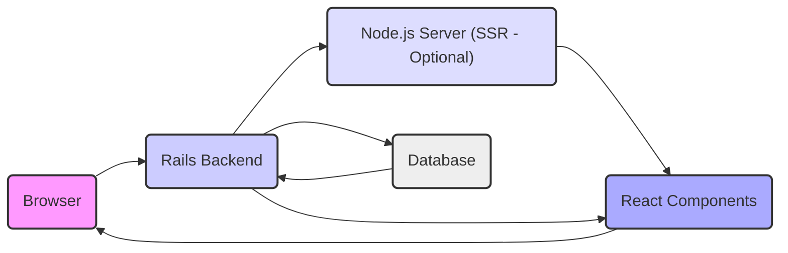
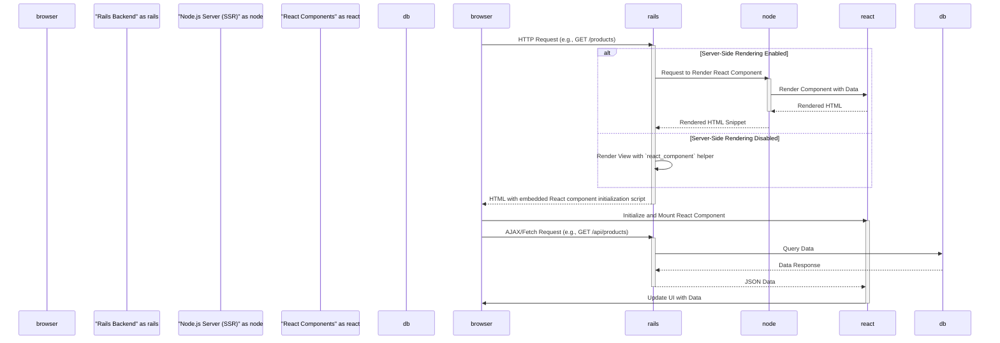

# Project Design Document: React on Rails Integration

**Version:** 1.1
**Date:** October 26, 2023
**Author:** AI Software Architect

## 1. Introduction

This document details the architecture of a web application built using the `react_on_rails` gem. This gem seamlessly integrates React.js for building dynamic user interfaces within a robust Ruby on Rails backend. The primary purpose of this document is to provide a clear and comprehensive understanding of the system's design, components, and data flow, specifically for use in subsequent threat modeling exercises.

## 2. Goals and Objectives

*   Provide a precise and detailed description of the architectural components and their interactions within a `react_on_rails` application.
*   Clearly illustrate the communication pathways and data exchange between the React frontend and the Rails backend.
*   Identify critical data flows and potential interaction points that require thorough security analysis.
*   Serve as a definitive reference document for security engineers and developers during the threat modeling process.

## 3. Scope

This design document focuses on the essential architectural elements and interactions that define a typical `react_on_rails` application. The scope includes:

*   The interplay between the user's web browser, the Rails backend server, and an optional Node.js server for server-side rendering.
*   The mechanism by which React components are rendered and integrated within the Rails application's view layer.
*   The flow of data between the client-side React application and the server-side Rails application.
*   The key components responsible for managing and delivering JavaScript assets.

This document explicitly excludes:

*   Detailed specifications of application-specific business logic or functional requirements.
*   In-depth configuration details of the `react_on_rails` gem or specific library configurations.
*   Precise database schema definitions or intricate database interaction patterns.
*   Granular deployment procedures beyond a high-level architectural overview.

## 4. High-Level Architecture

**Description:**

*   **Browser:** The user's web browser, responsible for interpreting and rendering HTML, CSS, and executing JavaScript code.
*   **Rails Backend:** The core Ruby on Rails application responsible for handling server-side logic, routing user requests, managing authentication and authorization, and providing API endpoints for the frontend.
*   **Node.js Server (SSR - Optional):** When server-side rendering (SSR) is implemented, a dedicated Node.js server pre-renders React components on the server. This improves initial load times and SEO.
*   **Database:** The persistent storage layer for the application's data. This could be a relational database (e.g., PostgreSQL, MySQL) or a NoSQL database.
*   **React Components:** The modular and reusable UI elements built using the React JavaScript library. These components manage the application's user interface and client-side interactions.

## 5. Component Breakdown

This section provides a more detailed breakdown of the key components within the `react_on_rails` architecture and their respective roles.

*   **Rails Application:**
    *   **Controllers:**  Receive incoming HTTP requests from the browser, process them, interact with models, and determine the appropriate response. They may render views containing embedded React components or serve JSON responses for API calls.
    *   **Models:** Represent the application's data structures and encapsulate business logic related to that data. They typically interact with the database to retrieve and persist information.
    *   **Views:**  Templates (typically ERB files) that define the structure of HTML pages. With `react_on_rails`, these views utilize the `react_component` helper to embed and initialize React components within the HTML structure.
    *   **Routes:** Define the mapping between incoming URLs and specific controller actions. This determines how the application responds to different user requests.
    *   **Webpacker:** The recommended asset pipeline for modern Rails applications, responsible for bundling JavaScript, CSS, and other frontend assets. `react_on_rails` integrates tightly with Webpacker to manage React components and their dependencies. Configuration files within the `webpack/` directory define the bundling process.
    *   **Configuration Files:** Various configuration files (e.g., `config/routes.rb`, `config/application.rb`, `config/webpacker.yml`) define the application's behavior, dependencies, and environment settings.

*   **React Frontend:**
    *   **React Components:** Reusable and composable UI building blocks written in JavaScript (or TypeScript). These components manage their own state and rendering logic, creating dynamic user interfaces.
    *   **State Management:** Libraries or patterns (e.g., Redux, Zustand, React Context API) used to manage the application's data and state in a predictable and organized manner, especially for complex applications.
    *   **Routing:** Client-side routing libraries (e.g., React Router) handle navigation and URL changes within the single-page application, providing a seamless user experience without full page reloads.
    *   **API Client:**  JavaScript libraries or custom functions (e.g., `fetch` API, Axios) used to make asynchronous HTTP requests to the Rails backend API to retrieve or send data.
    *   **JavaScript Modules and Dependencies:** Managed using package managers like npm or yarn. These include the core React library and other necessary third-party libraries.

*   **`react_on_rails` Gem:**
    *   **View Helpers (`react_component`):**  Provides helper methods that simplify the process of embedding and initializing React components within Rails views. This helper handles the necessary JavaScript setup and data passing.
    *   **Server-Side Rendering (SSR) Integration:**  Manages the communication and data transfer between the Rails backend and the Node.js server for pre-rendering React components. This involves passing data required for rendering to the Node.js server.
    *   **JavaScript Integration:**  Facilitates the inclusion of compiled JavaScript bundles (generated by Webpacker) into the Rails asset pipeline, making them available to the browser.

*   **Node.js Server (for SSR):**
    *   **JavaScript Runtime Environment:** Provides the environment necessary to execute JavaScript code on the server to render React components.
    *   **Potentially an Express.js Application:** A lightweight web application framework for Node.js that can be used to handle requests from the Rails backend for rendering and manage the SSR process.
    *   **Communication with Rails Backend:**  Receives requests from the Rails backend, typically containing the name of the component to render and any necessary props (data).

## 6. Data Flow

This section illustrates the typical flow of data within the `react_on_rails` application, highlighting key interactions between components.

**Detailed Description of Data Flow:**

1. **Initial Page Load:** The user's browser initiates an HTTP request to the Rails backend server, typically for a specific route (e.g., `/`, `/users`).
2. **Server-Side Rendering (Conditional):**
    *   **If SSR is enabled:** The Rails backend receives the request and, for routes configured for SSR, sends a request to the Node.js server. This request includes information about the React component to render and any initial data (props) required by the component.
    *   The Node.js server executes the React component rendering logic, generating the initial HTML markup.
    *   The Node.js server sends the rendered HTML snippet back to the Rails backend.
3. **Rails View Rendering:** The Rails backend renders the appropriate view. This view includes the pre-rendered HTML received from the Node.js server (if SSR was used) or a `div` element where the React component will be mounted on the client-side. The `react_component` helper is used to embed the necessary JavaScript to initialize the React component.
4. **Client-Side Initialization:** The browser receives the HTML response from the Rails backend. The embedded JavaScript initializes the React component and mounts it onto the designated DOM element.
5. **Client-Side Data Fetching (Optional):** Once the React component is mounted, it may need to fetch additional data from the Rails backend API. This is typically done using asynchronous requests (e.g., AJAX calls using `fetch` or Axios).
6. **Backend API Processing:** The Rails backend receives the API request, authenticates and authorizes the request (if necessary), interacts with the database to retrieve the requested data, and formats the data as a JSON response.
7. **Data Update and UI Rendering:** The React component receives the JSON data from the backend API and updates its internal state. This state change triggers a re-render of the component, updating the user interface in the browser.

## 7. Security Considerations (For Threat Modeling)

This section outlines potential security considerations based on the architecture, serving as a starting point for a more in-depth threat modeling exercise.

*   **Server-Side Rendering Vulnerabilities:**
    *   **Code Injection:** If data passed from Rails to the Node.js server for rendering is not properly sanitized, it could lead to code injection vulnerabilities on the server.
    *   **Denial of Service (DoS):**  Malicious requests to the SSR server could consume excessive resources, leading to denial of service.
*   **Cross-Site Scripting (XSS):**
    *   **Stored XSS:**  User-provided data stored in the database and later rendered by React components without proper sanitization can lead to persistent XSS.
    *   **Reflected XSS:**  Data provided in the URL or request parameters that is directly rendered by React components can be exploited for reflected XSS.
    *   **DOM-based XSS:** Vulnerabilities in client-side JavaScript code that manipulate the DOM based on attacker-controlled input.
*   **Cross-Site Request Forgery (CSRF):**
    *   Ensure all state-changing requests to the Rails backend API are protected with CSRF tokens. Verify that React components are correctly including these tokens in their requests.
*   **Authentication and Authorization:**
    *   **Insecure Authentication:** Weak password policies, lack of multi-factor authentication, or vulnerabilities in the authentication logic on the Rails backend.
    *   **Broken Authorization:**  Insufficient checks to ensure users can only access resources they are authorized to access.
*   **API Security:**
    *   **Injection Attacks:**  SQL injection, command injection, etc., due to improper input validation on the Rails backend API.
    *   **Mass Assignment Vulnerabilities:**  Allowing users to modify unintended database fields through API requests.
    *   **Insecure Direct Object References (IDOR):**  Exposing internal object IDs that can be easily guessed or manipulated to access unauthorized resources.
*   **Dependency Management:**
    *   **Vulnerable Dependencies:** Using outdated or vulnerable versions of frontend (npm) or backend (gem) dependencies. Regularly audit and update dependencies.
    *   **Supply Chain Attacks:**  Compromised third-party libraries used in the React frontend. Implement mechanisms to verify the integrity of dependencies.
*   **Data Serialization and Deserialization:**
    *   **Insecure Deserialization:**  Vulnerabilities arising from deserializing untrusted data, potentially leading to remote code execution on the backend.
*   **Session Management:**
    *   **Session Fixation:**  Allowing attackers to hijack user sessions.
    *   **Insecure Session Storage:**  Storing session identifiers in a way that makes them vulnerable to interception.

## 8. Deployment Model

A typical deployment architecture for a `react_on_rails` application involves the following components:

*   **Rails Application Server(s):**  The core Rails application deployed on platforms like:
    *   **Platform as a Service (PaaS):** Heroku, AWS Elastic Beanstalk.
    *   **Infrastructure as a Service (IaaS):** AWS EC2, Google Compute Engine.
    *   **Containerization:** Docker containers orchestrated with Kubernetes or Docker Swarm.
*   **Database Server:** A separate, managed database instance for persistent data storage. Examples include:
    *   **Relational Databases:** PostgreSQL, MySQL, Amazon RDS, Google Cloud SQL.
    *   **NoSQL Databases:** MongoDB, Redis (for caching), Amazon DynamoDB.
*   **Node.js Server(s) (for SSR):** If server-side rendering is used, a dedicated Node.js server or cluster of servers is required. This can be deployed:
    *   Alongside the Rails application on the same infrastructure.
    *   As a separate service using platforms like AWS Lambda, Google Cloud Functions, or dedicated Node.js hosting.
*   **Content Delivery Network (CDN):**  Used to efficiently serve static assets (JavaScript bundles, CSS, images) to users globally, reducing latency and improving performance. Examples include:
    *   Amazon CloudFront, Cloudflare, Fastly.
*   **Load Balancer:** Distributes incoming traffic across multiple Rails application server instances to ensure high availability and scalability.
*   **Reverse Proxy (e.g., Nginx, Apache):**  Sits in front of the application servers, handling tasks like SSL termination, request routing, and serving static assets.

## 9. Assumptions and Constraints

*   The application is built upon a standard Ruby on Rails framework.
*   The frontend user interface is developed using the React.js library.
*   The `react_on_rails` gem is the primary integration mechanism between the frontend and backend.
*   Webpacker is used for bundling and managing frontend assets.
*   This design document serves as the foundation for subsequent threat modeling activities.

This document provides a comprehensive design overview of a `react_on_rails` application, intended to facilitate a thorough and effective threat modeling process. The detailed component descriptions, data flow diagrams, and security considerations offer a solid understanding of the system's architecture and potential vulnerabilities.
