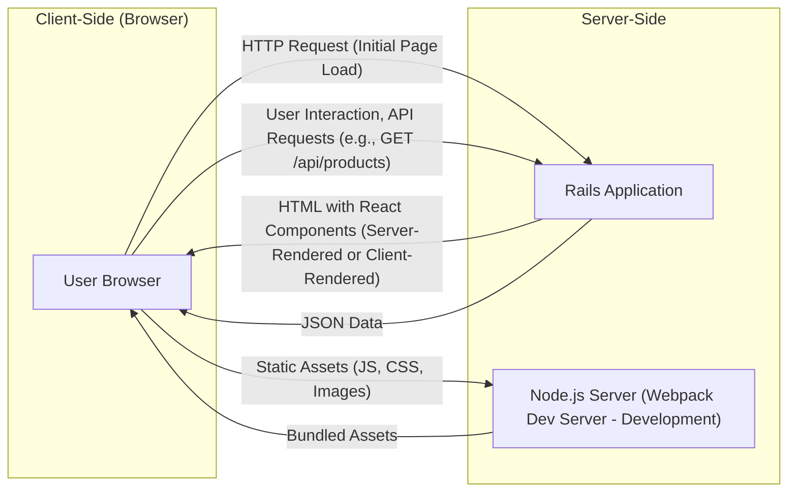
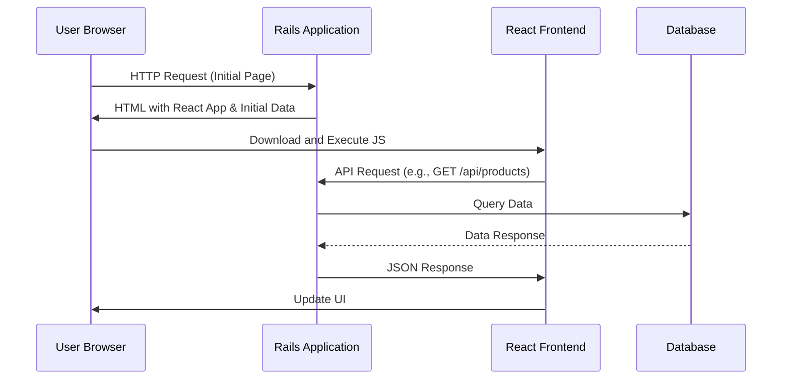

# Project Design Document: React on Rails Integration

**Project Name:** React on Rails Integration

**Project Repository:** [https://github.com/shakacode/react_on_rails](https://github.com/shakacode/react_on_rails)

**Document Version:** 1.1

**Date:** October 26, 2023

**Author:** AI Software Architect

## 1. Introduction

This document provides a detailed architectural design of a web application built using the "React on Rails" integration pattern, facilitated by the `react_on_rails` gem. This pattern effectively combines the robust backend capabilities of the Ruby on Rails framework with the dynamic and interactive user interface features of the React JavaScript library. The primary goal of this document is to clearly delineate the components, data flows, and interactions within such an application, thereby establishing a solid foundation for subsequent threat modeling activities. Understanding these architectural details is crucial for identifying potential security vulnerabilities.

## 2. Goals and Objectives

*   Clearly define the architectural components of a "React on Rails" application, emphasizing the role of the `react_on_rails` gem.
*   Illustrate the data flow between different parts of the system, including specific examples of interactions.
*   Identify key technologies and their specific roles within the architecture, highlighting potential security implications.
*   Provide a comprehensive and detailed overview specifically tailored for security analysis and threat identification.

## 3. High-Level Architecture

The "React on Rails" architecture fundamentally comprises a frontend (React) and a backend (Rails) that communicate to deliver a rich web application experience. The `react_on_rails` gem acts as the bridge, simplifying the integration and data exchange between these two layers.



**Components:**

*   **User Browser:** The client-side environment where the user interacts with the application's user interface.
*   **Rails Application:** The core backend server responsible for handling initial requests, managing data persistence, serving API endpoints, and potentially rendering the initial HTML structure. The `react_on_rails` gem is integral to this component.
*   **Node.js Server (Webpack Dev Server - Development):**  Primarily used in development environments. This server, often utilizing Webpack Dev Server, efficiently serves the bundled JavaScript, CSS, and other static assets, enabling features like hot module replacement for faster development. In production, these assets are typically served directly by the Rails application or a dedicated Content Delivery Network (CDN).

## 4. Detailed Component Description

### 4.1. Frontend (React)

*   **Purpose:** To construct a dynamic, interactive, and responsive user interface, providing a seamless user experience.
*   **Key Technologies:**
    *   React: The foundational JavaScript library for building declarative and component-based user interfaces.
    *   JavaScript (ES6+): The primary programming language for React components and client-side logic.
    *   JSX: A syntax extension to JavaScript that allows developers to write HTML-like structures within JavaScript code, enhancing readability and component definition.
    *   Component-Based Architecture: The UI is structured as a hierarchy of reusable and independent components, promoting modularity and maintainability.
    *   State Management (e.g., Redux, Zustand, React Context):  Crucial for managing application state, especially in complex applications with intricate data flows and interactions between components.
    *   Routing (e.g., React Router):  Enables navigation within the single-page application, managing different views and URLs without full page reloads.
    *   Build Tools (e.g., Webpack, Babel):  Essential for bundling, transpiling (converting modern JavaScript into browser-compatible code), and optimizing the frontend codebase for production.
*   **Functionality:**
    *   Rendering UI components based on the current application state and data received from the backend API.
    *   Handling user interactions, such as button clicks, form submissions, and keyboard inputs, triggering updates and actions.
    *   Making asynchronous API requests to the Rails backend to fetch data or submit changes.
    *   Updating the UI dynamically based on the responses received from API calls, providing a real-time experience.
    *   Managing client-side routing and navigation, allowing users to move between different sections of the application.

### 4.2. Backend (Rails)

*   **Purpose:** To manage server-side logic, data persistence, API endpoints, and potentially the initial rendering of the React application. The `react_on_rails` gem plays a key role in facilitating the integration with the frontend.
*   **Key Technologies:**
    *   Ruby on Rails: A robust server-side web application framework written in Ruby, known for its convention-over-configuration approach.
    *   Ruby: The dynamic, object-oriented programming language used for implementing backend logic.
    *   Active Record: An Object-Relational Mapping (ORM) system that simplifies interaction with databases.
    *   Controllers: Handle incoming HTTP requests, orchestrate the application's response, and interact with models.
    *   Models: Represent the application's data and encapsulate business logic related to that data.
    *   Views (Server-Side Rendering): While React handles the majority of UI rendering, Rails might render the initial HTML structure containing the root element where the React application is mounted. The `react_on_rails` gem provides helpers for this.
    *   API Endpoints: Provide structured data to the frontend, typically in JSON format, enabling communication between the frontend and backend.
    *   Authentication and Authorization (e.g., Devise, Pundit): Manage user authentication (verifying identity) and authorization (controlling access to resources).
    *   Database (e.g., PostgreSQL, MySQL): Stores the application's persistent data.
    *   `react_on_rails` Gem:  This gem is crucial for integrating React with Rails. It provides helpers for server-side rendering of React components, passing data from Rails to React, and managing the frontend build process.
*   **Functionality:**
    *   Serving the initial HTML page that bootstraps the React application. The `react_on_rails` gem assists in embedding the necessary JavaScript and data.
    *   Providing secure and well-defined API endpoints for the frontend to fetch, create, update, and delete data.
    *   Handling user authentication and authorization, ensuring only authorized users can access specific resources.
    *   Interacting with the database to store, retrieve, and manipulate application data.
    *   Executing server-side business logic, including data validation and processing.
    *   Managing background jobs for asynchronous tasks (if applicable).

### 4.3. Shared Components and Considerations

*   **Configuration:** Both the frontend and backend require configuration settings. Secure management of sensitive information, such as API keys and database credentials, is paramount.
*   **Environment Variables:** Used to configure the application differently across various environments (development, staging, production), allowing for environment-specific settings.
*   **Internationalization (i18n):** If the application supports multiple languages, both the frontend and backend need to implement mechanisms for localization and translation.
*   **Logging:** Comprehensive logging on both the frontend and backend is essential for debugging, monitoring application health, and security auditing.
*   **Error Handling:** Implementing robust error handling on both sides ensures a better user experience and aids in identifying and resolving issues.

## 5. Data Flow

The typical data flow in a "React on Rails" application, leveraging the `react_on_rails` gem, involves these key steps:

1. **Initial Page Load:**
    *   The user's browser sends an HTTP request to the Rails application.
    *   The Rails application, potentially using `react_on_rails` helpers for server-side rendering, renders an initial HTML page. This page includes:
        *   Basic HTML structure.
        *   Links to the bundled JavaScript and CSS files.
        *   A designated DOM element where the React application will be mounted.
        *   Potentially, server-rendered data that the React application needs on initial load, passed using `react_on_rails`'s data passing mechanisms (e.g., `props` or data attributes).
    *   The browser receives the HTML and begins downloading the linked assets.

2. **Frontend Initialization:**
    *   The browser executes the bundled JavaScript code.
    *   React initializes and mounts its components onto the designated DOM element.
    *   If initial data was passed from the server, React utilizes it to render the initial UI state.

3. **User Interaction and API Requests:**
    *   The user interacts with the React application (e.g., clicks a button to "Add to Cart," submits a search form).
    *   React handles the interaction and determines if it needs to fetch or update data from the backend.
    *   The frontend makes asynchronous API requests (typically using `fetch` or a library like `axios`) to specific endpoints on the Rails backend. For example, a `POST` request to `/api/cart_items` with product details. These requests are usually in JSON format.

4. **Backend Processing:**
    *   The Rails application receives the API request (e.g., the `POST` request to `/api/cart_items`).
    *   The appropriate controller action handles the request, potentially authenticating and authorizing the user.
    *   The controller interacts with models to access or modify data in the database (e.g., creating a new `CartItem` record).
    *   The backend performs any necessary business logic (e.g., validating the product, updating inventory).
    *   The backend constructs a JSON response containing the requested data or the result of the operation (e.g., the newly created `CartItem` or a success/failure message).

5. **Frontend Update:**
    *   The browser receives the JSON response from the Rails backend.
    *   React updates its state based on the response data (e.g., adding the new item to the cart state).
    *   React re-renders the affected components, updating the user interface to reflect the changes (e.g., displaying the updated cart).



## 6. Security Considerations (Pre-Threat Modeling)

This section outlines potential security areas that require careful consideration and will be the focus of subsequent threat modeling activities.

*   **Cross-Site Scripting (XSS):**  Vulnerabilities in either the frontend or backend that could allow attackers to inject malicious scripts into web pages viewed by other users. This includes both reflected XSS (where the malicious script is part of the request) and stored XSS (where the malicious script is stored in the database). Proper input sanitization on the backend and output encoding on the frontend are crucial mitigations.
*   **Cross-Site Request Forgery (CSRF):**  Attackers trick authenticated users into performing unintended actions on the web application. Rails has built-in CSRF protection mechanisms (like authenticity tokens) that must be correctly implemented and validated for all state-changing requests.
*   **SQL Injection:**  If the backend directly incorporates user-provided input into SQL queries without proper sanitization or parameterization, attackers could execute arbitrary SQL commands, potentially leading to data breaches or manipulation. Utilizing an ORM like Active Record with parameterized queries significantly reduces this risk.
*   **Authentication and Authorization:**  Securely managing user identities and access permissions is paramount. Weak authentication mechanisms (e.g., easily guessable passwords, lack of multi-factor authentication) or flawed authorization logic (e.g., insecure direct object references) can lead to unauthorized access to sensitive data and functionality.
*   **API Security:**  API endpoints must be protected against unauthorized access and abuse. This includes implementing robust authentication and authorization mechanisms (e.g., OAuth 2.0, JWT), rate limiting to prevent denial-of-service attacks, and input validation to prevent injection attacks.
*   **Data Security:**  Protecting sensitive data both in transit (using HTTPS to encrypt communication between the browser and the server) and at rest (encrypting sensitive data stored in the database) is essential to maintain confidentiality.
*   **Dependency Vulnerabilities:**  Both the frontend (npm packages) and backend (gems) rely on external libraries that may contain known security vulnerabilities. Regularly updating dependencies and using vulnerability scanning tools are crucial for mitigating this risk.
*   **Server-Side Rendering (SSR) Security:** If server-side rendering is employed, it introduces additional security considerations, such as the risk of injecting malicious data during the rendering process. Proper handling of user input and secure component rendering practices are necessary.
*   **Webpack Configuration:** Misconfigured Webpack settings can inadvertently expose sensitive information (e.g., API keys embedded in the frontend bundle) or create security vulnerabilities. Careful review and hardening of the Webpack configuration are important.
*   **Third-Party Integrations:**  Any integrations with external services (e.g., payment gateways, social media logins) introduce potential security risks. Thoroughly vetting third-party services and implementing secure integration practices are necessary.

## 7. Deployment

A typical deployment of a "React on Rails" application involves the following stages and components:

*   **Building Frontend Assets:**  Utilizing Webpack or a similar build tool to bundle, optimize, and minify the React application's JavaScript, CSS, and other assets for production.
*   **Deploying Rails Application:**  Deploying the packaged Rails application to a server environment. Common platforms include:
    *   Platform as a Service (PaaS): Heroku, AWS Elastic Beanstalk, Google App Engine.
    *   Infrastructure as a Service (IaaS): AWS EC2, Google Compute Engine.
    *   Containerization: Docker, Kubernetes.
*   **Serving Static Assets:**  Configuring the Rails application or a dedicated Content Delivery Network (CDN) to efficiently serve the bundled frontend assets. Using a CDN can improve performance and reduce load on the application servers.
*   **Database Setup:**  Provisioning and configuring the database server (e.g., PostgreSQL, MySQL) that the Rails application will connect to.
*   **Environment Configuration:**  Setting up environment variables on the deployment server to configure the application for the production environment (e.g., database credentials, API keys).
*   **Process Management:**  Employing a process manager (e.g., Puma, Unicorn) to manage the Rails application processes, ensuring they are running and can be restarted if necessary.
*   **Reverse Proxy (e.g., Nginx, Apache):**  Often used in front of the Rails application servers to handle tasks such as:
    *   Load balancing: Distributing incoming traffic across multiple application servers.
    *   SSL termination: Handling the encryption and decryption of HTTPS traffic.
    *   Serving static assets (alternatively or in conjunction with a CDN).
    *   Request routing and filtering.

```mermaid
graph LR
    subgraph "Deployment Environment"
        D["Load Balancer"]
        E["Web Server (Nginx/Apache)"]
        F["Rails Application Servers"]
        G["Database Server"]
        H["CDN (Optional)"]
    end

    "User Browser" --> D
    D --> E
    E --> F
    F --> G
    H --> "User Browser"
```

## 8. Technologies Used

*   **Frontend:**
    *   React
    *   JavaScript (ES6+)
    *   JSX
    *   npm or Yarn (Package Managers)
    *   Webpack or Parcel (Module Bundlers)
    *   Babel (JavaScript Transpiler)
    *   (Optional) State Management Libraries (Redux, Zustand, React Context)
    *   (Optional) Routing Libraries (React Router)
*   **Backend:**
    *   Ruby on Rails
    *   Ruby
    *   Bundler (Dependency Manager)
    *   Active Record (ORM)
    *   `react_on_rails` Gem
    *   (Optional) Authentication Libraries (Devise)
    *   (Optional) Authorization Libraries (Pundit)
*   **Database:**
    *   PostgreSQL
    *   MySQL
    *   SQLite (Primarily for development)
*   **Deployment:**
    *   Heroku
    *   AWS (EC2, ECS, Elastic Beanstalk, S3, CloudFront)
    *   Google Cloud (Compute Engine, App Engine, Cloud Storage, Cloud CDN)
    *   Docker
    *   Kubernetes
    *   Nginx or Apache

This revised document provides a more detailed and comprehensive architectural overview of a "React on Rails" application, with a specific focus on elements relevant to security considerations and threat modeling. The inclusion of the `react_on_rails` gem's role and more specific examples enhances its value for security analysis.