# BUSINESS POSTURE

This project, represented by the 'react_on_rails' GitHub repository, aims to facilitate the integration of React.js, a popular JavaScript library for building user interfaces, with Ruby on Rails, a widely-used web application framework. The primary business goal is to enhance the user experience and development efficiency of web applications built with Ruby on Rails by leveraging the component-based architecture and rich ecosystem of React.

Business Priorities:
- Enhance User Interface (UI) and User Experience (UX): React enables building dynamic, interactive, and responsive user interfaces, leading to improved user engagement and satisfaction.
- Increase Development Velocity and Efficiency: React's component reusability and vibrant community can accelerate front-end development and reduce development costs.
- Modernize Technology Stack: Adopting React allows organizations to modernize their Rails applications with a contemporary front-end technology, attracting and retaining skilled developers.
- Maintainability and Scalability: Component-based architecture of React promotes code modularity, making applications easier to maintain and scale.

Business Risks:
- Integration Complexity: Integrating two distinct frameworks (Rails and React) can introduce complexity in development, deployment, and maintenance.
- Security Vulnerabilities in Dependencies: Relying on external JavaScript packages (npm ecosystem) can introduce supply chain risks and potential security vulnerabilities.
- Skill Gap: Developers need to be proficient in both Ruby on Rails and React, potentially requiring training or hiring new talent.
- Performance Overhead: Incorrect integration or inefficient React code can lead to performance bottlenecks in the application.
- Increased Attack Surface: Introducing a JavaScript-heavy frontend might expose new attack vectors if not properly secured.

# SECURITY POSTURE

Existing Security Controls:
- security control: Ruby on Rails framework incorporates several built-in security features, including protection against Cross-Site Scripting (XSS), Cross-Site Request Forgery (CSRF), and SQL Injection. These are documented in the official Rails Security Guide.
- security control: Dependency management using Bundler for Ruby gems and npm/yarn for JavaScript packages helps in tracking and managing dependencies, although vulnerability scanning might not be automatically enabled.
- security control: Web application firewalls (WAFs) might be in place at the infrastructure level to protect against common web attacks.
- security control: Regular security audits and penetration testing might be conducted on the overall infrastructure and applications, but specific focus on 'react_on_rails' integration might be lacking.
- security control: Secure coding practices are generally followed by development teams, including input validation and output encoding, but might not be consistently applied across both Rails and React codebases.

Accepted Risks:
- accepted risk: Potential vulnerabilities in third-party JavaScript libraries used in the React frontend, with reliance on community-driven updates and manual vulnerability scanning.
- accepted risk: Complexity of managing security configurations across both Rails backend and React frontend, potentially leading to misconfigurations.
- accepted risk:  Performance impact of certain security measures on the React frontend, potentially leading to trade-offs between security and user experience.

Recommended Security Controls:
- security control: Implement automated Dependency Scanning for both Ruby gems and npm/yarn packages in the CI/CD pipeline to identify and address known vulnerabilities.
- security control: Integrate Static Application Security Testing (SAST) tools into the CI/CD pipeline to analyze both Rails and React code for security vulnerabilities early in the development lifecycle.
- security control: Implement Content Security Policy (CSP) to mitigate XSS attacks in the React frontend.
- security control: Regularly update both Ruby gems and npm/yarn packages to patch security vulnerabilities.
- security control: Conduct specific security reviews and penetration testing focused on the 'react_on_rails' integration points and potential attack vectors introduced by the React frontend.

Security Requirements:
- Authentication:
    - requirement: Securely authenticate users accessing the application, leveraging Rails authentication mechanisms like Devise or similar.
    - requirement: Ensure consistent authentication context is maintained between the Rails backend and the React frontend, especially for API interactions.
    - requirement: Implement multi-factor authentication (MFA) for privileged user accounts.
- Authorization:
    - requirement: Implement fine-grained authorization controls to restrict user access to specific features and data based on roles and permissions, enforced in the Rails backend.
    - requirement: Ensure authorization checks are consistently applied to API endpoints accessed by the React frontend.
    - requirement: Follow the principle of least privilege when granting permissions to users and applications.
- Input Validation:
    - requirement: Validate all user inputs on both the React frontend and the Rails backend to prevent injection attacks (XSS, SQL Injection, etc.).
    - requirement: Sanitize user inputs before displaying them on the frontend to prevent XSS vulnerabilities.
    - requirement: Implement robust error handling and input validation error messages that do not reveal sensitive information.
- Cryptography:
    - requirement: Use HTTPS for all communication between the client and the server to protect data in transit.
    - requirement: Securely store sensitive data at rest, such as user credentials and personal information, using appropriate encryption techniques in the database.
    - requirement: Implement secure session management and cookie handling to prevent session hijacking and other session-related attacks.
    - requirement: Use strong cryptographic algorithms and libraries for all cryptographic operations.

# DESIGN

## C4 CONTEXT

```mermaid
flowchart LR
    subgraph "React on Rails Application Context"
    center["React on Rails Application"]
    end

    user["Web Application User"]
    rails_app["Ruby on Rails Backend"]
    database["Database System"]
    external_api["External API Services"]

    user -->> center: Uses
    center -->> rails_app: API Requests
    center -->> database: Data Storage
    center -->> external_api: Integrates with

    style center fill:#f9f,stroke:#333,stroke-width:2px
```

Context Diagram Elements:

- Name: Web Application User
    - Type: Person
    - Description: End-users who interact with the web application through a web browser.
    - Responsibilities: Accessing application features, providing input, and consuming output.
    - Security controls: Browser security controls, user authentication.

- Name: React on Rails Application
    - Type: Software System
    - Description: The web application built using React on Rails, providing user interface and application logic.
    - Responsibilities: Presenting user interface, handling user interactions, processing user requests, interacting with backend services and data storage.
    - Security controls: Authentication, authorization, input validation, session management, output encoding, error handling, logging, monitoring.

- Name: Ruby on Rails Backend
    - Type: Software System
    - Description: The backend server built with Ruby on Rails, providing API endpoints, business logic, and data access.
    - Responsibilities: Handling API requests from the React frontend, enforcing business logic, managing data persistence, providing data to the frontend.
    - Security controls: API authentication and authorization, input validation, database access controls, secure data storage, rate limiting, logging, monitoring.

- Name: Database System
    - Type: Data Store
    - Description: Relational or NoSQL database used to store application data, including user data, application configuration, and business data.
    - Responsibilities: Persisting application data, providing data access to the Rails backend.
    - Security controls: Database access controls, encryption at rest, data backups, audit logging.

- Name: External API Services
    - Type: External System
    - Description: Third-party API services that the application integrates with for functionalities like payment processing, social media integration, or external data sources.
    - Responsibilities: Providing external functionalities and data to the application.
    - Security controls: API key management, secure API communication (HTTPS), input validation of external data, rate limiting.

## C4 CONTAINER

```mermaid
flowchart LR
    subgraph "React on Rails Application Containers"
    react_frontend["React Frontend\n(JavaScript/Node.js)"]
    rails_backend["Rails Application\n(Ruby)"]
    web_server["Web Server\n(e.g., Nginx, Apache)"]
    application_server["Application Server\n(e.g., Puma, Unicorn)"]
    database_container["Database\n(e.g., PostgreSQL, MySQL)"]
    end

    user["Web Application User"]

    user -->> web_server: HTTPS Requests
    web_server -->> react_frontend: Static Assets, Bundled JavaScript
    web_server -->> application_server: Proxy Requests
    application_server -->> rails_backend: Rails Application Logic
    rails_backend -->> database_container: Data Persistence
    react_frontend -->> rails_backend: API Requests (JSON)

    style react_frontend fill:#ccf,stroke:#333,stroke-width:2px
    style rails_backend fill:#cff,stroke:#333,stroke-width:2px
    style web_server fill:#fcc,stroke:#333,stroke-width:2px
    style application_server fill:#cfc,stroke:#333,stroke-width:2px
    style database_container fill:#ffc,stroke:#333,stroke-width:2px
```

Container Diagram Elements:

- Name: React Frontend
    - Type: Container
    - Description: JavaScript code built with React, responsible for rendering the user interface in the web browser. May be served by Node.js server or integrated into Rails asset pipeline.
    - Responsibilities: Rendering UI components, handling user interactions, making API requests to the Rails backend, client-side routing and state management.
    - Security controls: Input validation (client-side), output encoding, Content Security Policy (CSP), secure handling of API responses, protection against client-side vulnerabilities (e.g., prototype pollution).

- Name: Rails Backend
    - Type: Container
    - Description: Ruby on Rails application, responsible for handling business logic, data access, and API endpoints.
    - Responsibilities: Handling API requests from the React frontend, implementing business logic, interacting with the database, authentication and authorization, data validation and sanitization.
    - Security controls: Server-side input validation, authorization, secure database interactions (ORM, parameterized queries), session management, CSRF protection, protection against common web attacks (e.g., SQL injection, XSS), rate limiting, logging, monitoring.

- Name: Web Server
    - Type: Container
    - Description: Web server (e.g., Nginx or Apache) responsible for serving static assets (HTML, CSS, JavaScript) and proxying requests to the application server.
    - Responsibilities: Serving static content, handling HTTPS termination, load balancing, reverse proxying to the application server, basic security features (e.g., request filtering).
    - Security controls: HTTPS configuration, TLS/SSL certificate management, request filtering, rate limiting, protection against DDoS attacks, access logging.

- Name: Application Server
    - Type: Container
    - Description: Application server (e.g., Puma or Unicorn) responsible for running the Rails application code.
    - Responsibilities: Executing Rails application code, managing application processes, handling requests from the web server.
    - Security controls: Application-level firewalls, resource limits, process isolation, secure configuration management.

- Name: Database
    - Type: Container
    - Description: Database system (e.g., PostgreSQL or MySQL) used for persistent data storage.
    - Responsibilities: Storing and retrieving application data, ensuring data integrity and availability.
    - Security controls: Database access controls, user authentication and authorization, encryption at rest, data backups, audit logging, database hardening.

## DEPLOYMENT

Deployment Architecture: Cloud Platform (e.g., AWS, Heroku)

```mermaid
flowchart LR
    subgraph "Cloud Deployment Environment"
    load_balancer["Load Balancer\n(AWS ELB, Heroku Load Balancer)"]
    web_server_instance["Web Server Instance\n(EC2, Heroku Dyno)"]
    application_server_instance["Application Server Instance\n(EC2, Heroku Dyno)"]
    database_service["Database Service\n(AWS RDS, Heroku Postgres)"]
    cdn["Content Delivery Network\n(AWS CloudFront, Cloudflare)"]
    end

    user["Web Application User"]

    user -->> load_balancer: HTTPS Requests
    load_balancer -->> web_server_instance: Proxy Requests
    web_server_instance -->> application_server_instance: Application Requests
    application_server_instance -->> database_service: Database Queries
    cdn -->> user: Static Assets (React Frontend)
    web_server_instance -->> cdn: Serve Static Assets to CDN

    style load_balancer fill:#fcc,stroke:#333,stroke-width:2px
    style web_server_instance fill:#fcc,stroke:#333,stroke-width:2px
    style application_server_instance fill:#cfc,stroke:#333,stroke-width:2px
    style database_service fill:#ffc,stroke:#333,stroke-width:2px
    style cdn fill:#ccf,stroke:#333,stroke-width:2px
```

Deployment Diagram Elements:

- Name: Load Balancer
    - Type: Infrastructure Component
    - Description: Distributes incoming traffic across multiple web server instances for scalability and high availability.
    - Responsibilities: Load balancing, traffic routing, health checks, SSL termination.
    - Security controls: DDoS protection, SSL/TLS configuration, access control lists (ACLs), web application firewall (WAF) integration.

- Name: Web Server Instance
    - Type: Compute Instance
    - Description: Virtual machine or container instance running the web server software (e.g., Nginx).
    - Responsibilities: Serving static assets, reverse proxying to application server instances.
    - Security controls: Instance hardening, security patching, firewall configuration, intrusion detection system (IDS), access logging.

- Name: Application Server Instance
    - Type: Compute Instance
    - Description: Virtual machine or container instance running the application server software (e.g., Puma) and the Rails application code.
    - Responsibilities: Executing Rails application logic, handling API requests, interacting with the database.
    - Security controls: Instance hardening, security patching, application-level firewalls, resource limits, intrusion detection system (IDS), access logging.

- Name: Database Service
    - Type: Managed Database Service
    - Description: Managed database service provided by the cloud platform (e.g., AWS RDS, Heroku Postgres).
    - Responsibilities: Persistent data storage, database management, backups, high availability.
    - Security controls: Database access controls, encryption at rest and in transit, automated backups, security patching, audit logging, compliance certifications.

- Name: Content Delivery Network (CDN)
    - Type: Content Delivery Network
    - Description: Global network of servers that caches and delivers static assets (React frontend) to users based on their geographic location, improving performance and reducing latency.
    - Responsibilities: Caching and delivering static content, reducing load on web servers, improving website performance.
    - Security controls: DDoS protection, SSL/TLS encryption, access controls, cache invalidation mechanisms, security headers.

## BUILD

```mermaid
flowchart LR
    developer["Developer"] --> code_commit["Code Commit\n(Git)"]
    code_commit --> github_actions["GitHub Actions\n(CI/CD Pipeline)"]
    subgraph "GitHub Actions Pipeline"
    dependency_scan["Dependency Scan\n(Bundler Audit, npm audit)"]
    sast["SAST\n(Static Analysis Security Testing)"]
    build_backend["Build Backend\n(Rails Assets, Bundler)"]
    build_frontend["Build Frontend\n(Webpack, Yarn/npm)"]
    containerize["Containerize\n(Docker)"]
    artifact_store["Artifact Store\n(Container Registry)"]
    end
    github_actions --> dependency_scan
    dependency_scan --> sast
    sast --> build_backend
    build_backend --> build_frontend
    build_frontend --> containerize
    containerize --> artifact_store
    artifact_store --> deployment["Deployment\n(Cloud Platform)"]

    style github_actions fill:#cfc,stroke:#333,stroke-width:2px
    style dependency_scan fill:#ccf,stroke:#333,stroke-width:2px
    style sast fill:#ccf,stroke:#333,stroke-width:2px
    style build_backend fill:#ccf,stroke:#333,stroke-width:2px
    style build_frontend fill:#ccf,stroke:#333,stroke-width:2px
    style containerize fill:#ccf,stroke:#333,stroke-width:2px
    style artifact_store fill:#ccf,stroke:#333,stroke-width:2px
```



Build Process Description:

1. Developer commits code changes to a Git repository (e.g., GitHub).
2. Code commit triggers a CI/CD pipeline in GitHub Actions.
3. Dependency Scan step analyzes project dependencies (Ruby gems and npm/yarn packages) for known vulnerabilities using tools like Bundler Audit and npm audit.
4. SAST (Static Application Security Testing) step analyzes the source code (both Rails and React) for potential security vulnerabilities using SAST tools.
5. Build Backend step builds the Rails backend application, including asset compilation and dependency management using Bundler.
6. Build Frontend step builds the React frontend application, including bundling JavaScript, CSS, and other assets using tools like Webpack and Yarn/npm.
7. Containerize step packages the built application and its dependencies into a Docker container image.
8. Artifact Store step pushes the Docker container image to a container registry (e.g., Docker Hub, AWS ECR).
9. Deployment step deploys the container image from the artifact store to the target deployment environment (e.g., cloud platform).

Build Security Controls:

- security control: Automated CI/CD pipeline to ensure consistent and repeatable build process.
- security control: Dependency scanning to identify and mitigate vulnerabilities in third-party libraries.
- security control: Static Application Security Testing (SAST) to detect code-level vulnerabilities early in the development lifecycle.
- security control: Secure build environment with restricted access and hardened configurations.
- security control: Code signing and artifact verification to ensure integrity and authenticity of build artifacts.
- security control: Access control to the artifact store to prevent unauthorized access to container images.
- security control: Regular security audits of the CI/CD pipeline and build process.
- security control: Supply chain security considerations, including using trusted base images and minimizing dependencies.

# RISK ASSESSMENT

Critical Business Processes:
- User Authentication and Authorization: Ensuring only authorized users can access specific features and data.
- Data Management: Securely storing, processing, and retrieving sensitive user and application data.
- Application Availability: Maintaining application uptime and responsiveness to ensure business continuity.
- API Integrations: Securely interacting with external API services to provide application functionalities.

Data Sensitivity:
- User Credentials: Highly sensitive (usernames, passwords, API keys). Requires strong encryption and access controls.
- Personal Identifiable Information (PII): Sensitive (names, email addresses, addresses, etc.). Requires protection according to privacy regulations (e.g., GDPR, CCPA).
- Application Configuration: Moderately sensitive (database credentials, API keys, environment variables). Requires secure storage and access controls.
- Business Data: Sensitivity depends on the specific application (financial data, customer data, etc.). Requires appropriate security measures based on data classification.

# QUESTIONS & ASSUMPTIONS

Questions:
- What is the specific business application being built using 'react_on_rails'? (e.g., e-commerce, SaaS platform, internal tool). This will help to refine the risk assessment and security requirements.
- What are the specific data sensitivity levels for the application? (e.g., confidential, internal, public).
- What are the compliance requirements for the application? (e.g., GDPR, HIPAA, PCI DSS).
- What existing security infrastructure and tools are already in place? (e.g., WAF, SIEM, vulnerability scanners).
- What is the organization's risk appetite and security maturity level?
- What are the performance requirements for the application? (This might influence security control choices).
- What is the expected user base and traffic volume? (This might influence deployment architecture and scalability considerations).

Assumptions:
- The 'react_on_rails' application is a web application accessible over the internet.
- User authentication and authorization are required to protect application resources and data.
- Sensitive data is processed and stored by the application.
- The application is deployed to a cloud platform for scalability and availability.
- A CI/CD pipeline is used for automated build and deployment processes.
- Standard web application security best practices are intended to be followed.
- The organization has some level of security awareness and is concerned about protecting the application and its data.