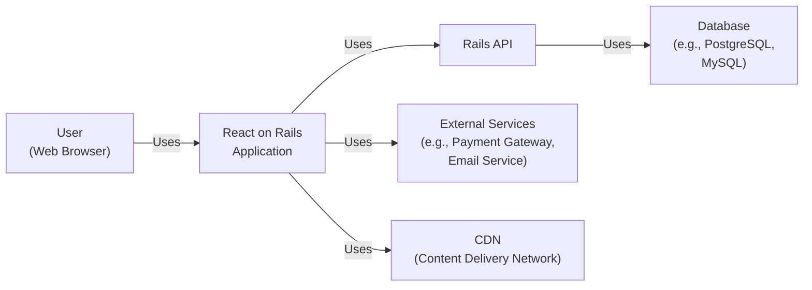
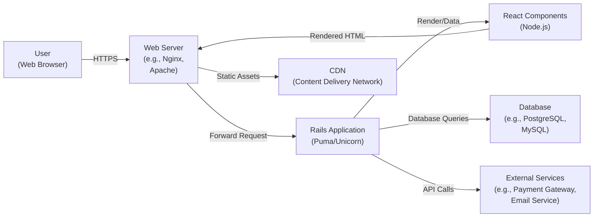
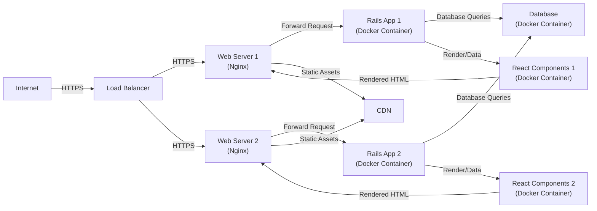
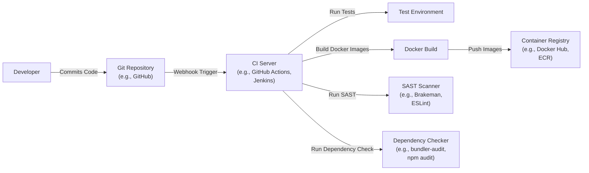

Okay, let's create a design document for the `react_on_rails` project.

# BUSINESS POSTURE

Business Priorities and Goals:

*   Provide a seamless integration between React and Ruby on Rails.
*   Simplify the setup and configuration of React within Rails applications.
*   Enable developers to leverage the benefits of both frameworks (Rails' backend capabilities and React's frontend UI rendering).
*   Offer a well-maintained and documented solution for building modern web applications.
*   Reduce development time and complexity for projects using both React and Rails.
*   Provide server-side rendering (SSR) capabilities for improved SEO and initial load performance.
*   Support modern JavaScript features and tooling.

Business Risks:

*   Incompatibility with specific versions of Rails or React, leading to integration issues.
*   Security vulnerabilities introduced by the integration layer or dependencies.
*   Performance bottlenecks due to inefficient communication between Rails and React.
*   Complexity in debugging issues that span both the frontend and backend.
*   Lack of up-to-date documentation or support, hindering adoption and troubleshooting.
*   Reliance on third-party libraries that may become unmaintained or introduce vulnerabilities.
*   Difficulty in scaling applications built with React on Rails, especially with server-side rendering.

# SECURITY POSTURE

Existing Security Controls:

*   security control: The project's documentation and examples likely encourage the use of Rails' built-in security features, such as CSRF protection, strong parameters, and authentication mechanisms (Devise, etc.). Implemented in examples and documentation.
*   security control: Dependency management using Bundler and Yarn/npm, allowing for vulnerability scanning and updates. Implemented in Gemfile and package.json.
*   security control: The project itself is open-source, allowing for community scrutiny and contributions to identify and fix security issues. Implemented on GitHub.

Accepted Risks:

*   accepted risk: Potential for XSS vulnerabilities if user-supplied data is not properly sanitized before being rendered by React components.
*   accepted risk: Reliance on the security of underlying Rails and React frameworks, as well as their dependencies.
*   accepted risk: Potential for misconfiguration by developers, leading to security vulnerabilities.

Recommended Security Controls:

*   security control: Implement a robust Content Security Policy (CSP) to mitigate XSS attacks.
*   security control: Regularly run static analysis tools (e.g., Brakeman for Rails, ESLint with security plugins for React) to identify potential vulnerabilities.
*   security control: Conduct regular security audits and penetration testing.
*   security control: Implement automated dependency vulnerability scanning (e.g., bundler-audit, npm audit, Dependabot).
*   security control: Provide clear security guidelines and best practices in the project documentation.

Security Requirements:

*   Authentication:
    *   The system should integrate with existing Rails authentication mechanisms (e.g., Devise).
    *   Securely handle user sessions and prevent session hijacking.
    *   Support multi-factor authentication (MFA) where appropriate.
*   Authorization:
    *   Implement role-based access control (RBAC) to restrict access to resources based on user roles.
    *   Ensure that users can only access data and functionality they are authorized to use.
*   Input Validation:
    *   Validate all user-supplied data on both the client-side (React) and server-side (Rails) to prevent injection attacks (SQL injection, XSS, etc.).
    *   Use strong parameter sanitization in Rails controllers.
    *   Sanitize data before rendering it in React components.
*   Cryptography:
    *   Use secure cryptographic libraries for storing sensitive data (e.g., passwords, API keys).
    *   Use HTTPS for all communication between the client and server.
    *   Protect against CSRF attacks using Rails' built-in mechanisms.

# DESIGN

## C4 CONTEXT

Context Diagram Element Descriptions:

*   Element:
    *   Name: User
    *   Type: Person
    *   Description: A user interacting with the application through a web browser.
    *   Responsibilities: Accessing the application, providing input, viewing output.
    *   Security controls: Browser-based security controls (e.g., same-origin policy, cookie security).

*   Element:
    *   Name: React on Rails Application
    *   Type: Software System
    *   Description: The main application built using React on Rails.
    *   Responsibilities: Handling user requests, rendering UI, interacting with the Rails API and external services.
    *   Security controls: Input validation, authentication, authorization, CSRF protection, CSP.

*   Element:
    *   Name: Rails API
    *   Type: Software System
    *   Description: The backend API built with Ruby on Rails.
    *   Responsibilities: Handling business logic, data access, interacting with the database and external services.
    *   Security controls: Input validation, authentication, authorization, secure coding practices.

*   Element:
    *   Name: External Services
    *   Type: Software System
    *   Description: Third-party services used by the application (e.g., payment gateways, email services).
    *   Responsibilities: Providing specific functionalities (e.g., processing payments, sending emails).
    *   Security controls: Secure communication (HTTPS), API keys, authentication tokens.

*   Element:
    *   Name: Database
    *   Type: Software System
    *   Description: The database used to store application data.
    *   Responsibilities: Storing and retrieving data.
    *   Security controls: Access control, encryption at rest, regular backups.

*   Element:
    *   Name: CDN
    *   Type: Software System
    *   Description: Content Delivery Network used to server static assets.
    *   Responsibilities: Deliver static assets to users.
    *   Security controls: HTTPS, Access control.

## C4 CONTAINER

Container Diagram Element Descriptions:

*   Element:
    *   Name: User
    *   Type: Person
    *   Description: A user interacting with the application through a web browser.
    *   Responsibilities: Accessing the application, providing input, viewing output.
    *   Security controls: Browser-based security controls (e.g., same-origin policy, cookie security).

*   Element:
    *   Name: Web Server
    *   Type: Container (Software)
    *   Description: A web server (e.g., Nginx, Apache) that handles incoming requests.
    *   Responsibilities: Routing requests, serving static assets, SSL termination.
    *   Security controls: HTTPS configuration, access control, rate limiting.

*   Element:
    *   Name: Rails Application
    *   Type: Container (Software)
    *   Description: The Ruby on Rails application server (e.g., Puma, Unicorn).
    *   Responsibilities: Handling application logic, interacting with the database and external services, rendering views.
    *   Security controls: Input validation, authentication, authorization, secure coding practices.

*   Element:
    *   Name: React Components
    *   Type: Container (Software)
    *   Description: Node.js server for server-side rendering of React components.
    *   Responsibilities: Rendering React components, potentially handling some client-side logic.
    *   Security controls: Input validation, XSS prevention, secure coding practices.

*   Element:
    *   Name: Database
    *   Type: Container (Database)
    *   Description: The database used to store application data.
    *   Responsibilities: Storing and retrieving data.
    *   Security controls: Access control, encryption at rest, regular backups.

*   Element:
    *   Name: External Services
    *   Type: Software System
    *   Description: Third-party services used by the application (e.g., payment gateways, email services).
    *   Responsibilities: Providing specific functionalities (e.g., processing payments, sending emails).
    *   Security controls: Secure communication (HTTPS), API keys, authentication tokens.

*   Element:
    *   Name: CDN
    *   Type: Software System
    *   Description: Content Delivery Network used to server static assets.
    *   Responsibilities: Deliver static assets to users.
    *   Security controls: HTTPS, Access control.

## DEPLOYMENT

Possible Deployment Solutions:

1.  Traditional Server Deployment (e.g., AWS EC2, DigitalOcean Droplet):
    *   Deploy the Rails application and Node.js server on a virtual machine.
    *   Configure a web server (Nginx/Apache) to handle requests and proxy them to the appropriate server.
2.  Containerized Deployment (e.g., Docker, Kubernetes):
    *   Containerize the Rails application, Node.js server, and database.
    *   Deploy the containers using Docker Compose or Kubernetes.
3.  Platform-as-a-Service (PaaS) (e.g., Heroku):
    *   Deploy the application using a PaaS provider like Heroku, which simplifies the deployment process.
4.  Serverless Deployment (e.g., AWS Lambda, Vercel):
    *   It's less common to use serverless for the entire Rails application, but parts of it (e.g., specific API endpoints or background jobs) could be deployed as serverless functions.

Chosen Deployment Solution (Containerized Deployment with Docker Compose):

Deployment Diagram Element Descriptions:

*   Element:
    *   Name: Internet
    *   Type: External
    *   Description: The public internet.
    *   Responsibilities: Routing traffic to the application.
    *   Security controls: N/A

*   Element:
    *   Name: Load Balancer
    *   Type: Infrastructure Node
    *   Description: Distributes incoming traffic across multiple web servers.
    *   Responsibilities: Load balancing, health checks.
    *   Security controls: SSL termination, DDoS protection.

*   Element:
    *   Name: Web Server 1 & 2
    *   Type: Infrastructure Node
    *   Description: Instances of a web server (e.g., Nginx) running on separate servers.
    *   Responsibilities: Routing requests, serving static assets, SSL termination.
    *   Security controls: HTTPS configuration, access control, rate limiting.

*   Element:
    *   Name: Rails App 1 & 2
    *   Type: Container Instance
    *   Description: Instances of the Rails application running in Docker containers.
    *   Responsibilities: Handling application logic, interacting with the database.
    *   Security controls: Container security best practices, limited privileges.

*   Element:
    *   Name: React Components 1 & 2
    *   Type: Container Instance
    *   Description: Instances of Node.js server for server-side rendering of React components.
    *   Responsibilities: Rendering React components.
    *   Security controls: Container security best practices, limited privileges.

*   Element:
    *   Name: Database
    *   Type: Container Instance
    *   Description: The database server running in a Docker container.
    *   Responsibilities: Storing and retrieving data.
    *   Security controls: Access control, encryption at rest, regular backups, container security.

*   Element:
    *   Name: CDN
    *   Type: Software System
    *   Description: Content Delivery Network used to server static assets.
    *   Responsibilities: Deliver static assets to users.
    *   Security controls: HTTPS, Access control.

## BUILD

Build Process Description:

1.  Developer commits code to the Git repository (e.g., GitHub).
2.  A webhook triggers the CI server (e.g., GitHub Actions, Jenkins).
3.  The CI server checks out the code and sets up the build environment.
4.  The CI server runs tests (unit tests, integration tests) in a test environment.
5.  The CI server builds Docker images for the Rails application and Node.js server.
6.  The CI server pushes the Docker images to a container registry (e.g., Docker Hub, ECR).
7.  The CI server runs a SAST scanner (e.g., Brakeman for Rails, ESLint with security plugins for React) to identify potential vulnerabilities in the code.
8.  The CI server runs a dependency checker (e.g., bundler-audit, npm audit) to identify vulnerable dependencies.
9.  If any tests fail, the SAST scanner finds high-severity vulnerabilities, or the dependency checker finds vulnerable dependencies, the build fails.
10. If all steps are successful, the build is considered successful, and the artifacts (Docker images) are ready for deployment.

Security Controls in Build Process:

*   Automated Testing: Running unit and integration tests to catch bugs and regressions early.
*   SAST Scanning: Using static analysis tools to identify potential security vulnerabilities in the code.
*   Dependency Checking: Scanning dependencies for known vulnerabilities.
*   Build Automation: Ensuring a consistent and repeatable build process.
*   Limited Access to CI Server: Restricting access to the CI server to authorized personnel.
*   Secure Storage of Secrets: Storing sensitive information (e.g., API keys, database credentials) securely (e.g., using environment variables, secrets management tools).

# RISK ASSESSMENT

Critical Business Processes:

*   User authentication and authorization.
*   Data management (CRUD operations on application data).
*   Interaction with external services (if applicable, e.g., payment processing).
*   Server-side rendering (if used) for SEO and performance.

Data Sensitivity:

*   User data (e.g., usernames, passwords, email addresses, personal information): High sensitivity.
*   Application data (depending on the specific application): Could range from low to high sensitivity.
*   Session data: High sensitivity.
*   API keys and secrets: High sensitivity.

# QUESTIONS & ASSUMPTIONS

Questions:

*   What specific external services does the application interact with?
*   What is the expected traffic volume and scaling requirements?
*   Are there any specific compliance requirements (e.g., GDPR, HIPAA)?
*   What is the existing infrastructure and deployment environment?
*   What level of logging and monitoring is required?
*   Are there any specific performance requirements?
*   What is the team's experience with security best practices?

Assumptions:

*   BUSINESS POSTURE: The primary goal is to provide a robust and easy-to-use integration between React and Rails. The organization has a moderate risk appetite, prioritizing functionality and developer experience while maintaining a reasonable level of security.
*   SECURITY POSTURE: The development team is familiar with basic security concepts and will follow secure coding practices. Existing Rails security mechanisms (CSRF protection, strong parameters) are used.
*   DESIGN: The application will be deployed using a containerized approach (Docker). A load balancer will distribute traffic across multiple instances of the application. A CDN will be used for static assets. The build process will include automated testing, SAST scanning, and dependency checking.