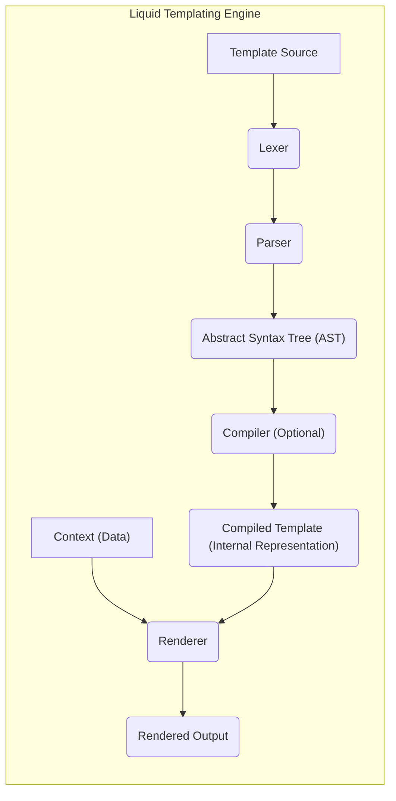
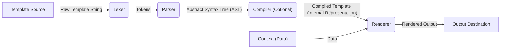

## Project Design Document: Liquid Templating Engine (Improved)

**1. Introduction**

This document provides an enhanced design overview of the Liquid templating engine, based on the project hosted at [https://github.com/Shopify/liquid](https://github.com/Shopify/liquid). This improved document aims to offer a more granular understanding of the system's architecture, internal components, and data flow, specifically tailored for effective threat modeling.

**2. Goals and Objectives**

The core objectives of the Liquid templating engine are:

*   **Strict Separation of Concerns:** Enforce a clear boundary between presentation logic residing in templates and the underlying application data.
*   **Intuitive and Safe Syntax:** Offer a template syntax that is easy for non-programmers to understand while minimizing the risk of introducing security vulnerabilities.
*   **Robust Security Posture:** Provide a secure environment for rendering dynamic content, actively mitigating common web application vulnerabilities such as Cross-Site Scripting (XSS) and template injection.
*   **Flexible Extensibility Mechanisms:** Allow developers to extend the engine's functionality through custom filters, tags, and potentially other extension points, while maintaining security.
*   **Optimized Rendering Performance:** Ensure templates are rendered efficiently to provide a responsive user experience.

**3. High-Level Architecture**

The Liquid engine operates through a well-defined pipeline, transforming template source code and data into rendered output.

**4. Component Details**

This section provides a more detailed breakdown of the key components within the Liquid templating engine:

*   **Template Source:** The initial input to the engine, a string containing Liquid markup. This source can originate from:
    *   Files stored on disk.
    *   Database records.
    *   Content Management Systems (CMS).
    *   Network responses.
*   **Lexer (Tokenizer):**  The Lexer's role is to analyze the raw template source code character by character and group them into meaningful units called tokens. Key aspects include:
    *   Identifying different token types: variable tags (`{{ ... }}`), logic tags (``), comment tags (`{# ... #}`), and raw text.
    *   Extracting relevant information from tokens, such as variable names, tag names, and filter names.
    *   Handling whitespace and line breaks according to Liquid's syntax rules.
*   **Parser:** The Parser takes the stream of tokens produced by the Lexer and builds a hierarchical representation of the template's structure, known as the Abstract Syntax Tree (AST). Its responsibilities include:
    *   Enforcing the grammatical rules of the Liquid language.
    *   Identifying and structuring different Liquid constructs like `if`, `for`, `case`, and variable output statements.
    *   Detecting syntax errors in the template and providing informative error messages.
    *   Creating a tree-like structure where nodes represent different parts of the template (e.g., variable nodes, tag nodes, text nodes).
*   **Abstract Syntax Tree (AST):**  A tree-like data structure that represents the parsed template. Each node in the tree corresponds to a specific element in the template. Key characteristics:
    *   Provides a structured and easily traversable representation of the template's logic.
    *   Facilitates further processing by the Compiler and Renderer.
    *   Represents the relationships between different template elements.
*   **Compiler (Optional):**  Depending on the specific Liquid implementation, a compilation step might be present. The Compiler transforms the AST into an optimized internal representation for faster rendering. This might involve:
    *   Generating bytecode or an intermediate representation.
    *   Performing static analysis and optimizations on the template.
    *   Caching compiled templates for reuse.
*   **Compiled Template (Internal Representation):** The output of the Compiler (if present), or an optimized representation derived directly from the AST. This representation is designed for efficient execution by the Renderer.
*   **Context (Data):**  The data that will be dynamically inserted into the template during the rendering process. This is typically a collection of key-value pairs or objects. Important considerations:
    *   The Context provides the values for variables referenced in the template.
    *   The structure and content of the Context are crucial for the final output.
    *   Security implications arise from the data contained within the Context.
*   **Renderer:** The core component responsible for processing the compiled template (or AST) and the Context to produce the final rendered output. Key functions include:
    *   Traversing the template structure (either the compiled template or the AST).
    *   Evaluating Liquid tags and expressions based on the provided Context.
    *   Substituting variable values from the Context into the output.
    *   Applying filters to modify the output of variables or expressions.
    *   Handling control flow logic defined by tags like `if`, `for`, and `case`.
*   **Rendered Output:** The final output generated by the Liquid engine, typically a string containing the dynamically generated content. This output is then used by the application, for example, to:
    *   Send HTML content to a web browser.
    *   Generate emails.
    *   Create other types of documents.

**5. Data Flow**

The flow of data through the Liquid engine is a crucial aspect for understanding its operation and potential vulnerabilities.

**Detailed Data Flow Steps:**

1. The **Template Source** (the raw template string) is the initial input to the **Lexer**.
2. The **Lexer** analyzes the template string and generates a stream of **Tokens**, representing the basic building blocks of the template.
3. The **Parser** consumes the stream of **Tokens** and constructs the **Abstract Syntax Tree (AST)**, representing the hierarchical structure of the template.
4. The **Compiler (Optional)** takes the **AST** and transforms it into a more efficient **Compiled Template (Internal Representation)**. This step might be skipped in some implementations.
5. The **Renderer** receives the **Compiled Template (Internal Representation)** (or the AST directly) and the **Context (Data)**.
6. The **Renderer** processes the template and the data from the Context to generate the **Rendered Output**. This involves evaluating tags, substituting variables, and applying filters.
7. The **Rendered Output** is then delivered to the **Output Destination**, which could be a web browser, a file, or another system.

**6. Security Considerations**

Security is a paramount concern in template engines. Here are key security considerations for Liquid:

*   **Cross-Site Scripting (XSS) Prevention:** Liquid employs automatic output escaping by default to mitigate XSS risks.
    *   **Mechanism:**  HTML entities in variable outputs are automatically escaped (e.g., `<` becomes `&lt;`).
    *   **Bypass Risks:**  The `| raw` filter can bypass escaping, requiring careful usage to avoid introducing XSS vulnerabilities. For example, `{{ user_provided_html | raw }}` could be dangerous if `user_provided_html` is not properly sanitized.
    *   **Context-Aware Escaping:**  Modern implementations might offer context-aware escaping, adapting the escaping strategy based on the output context (e.g., HTML attributes, JavaScript).
*   **Template Injection:** Preventing attackers from controlling the template source is crucial.
    *   **Risk:** If an attacker can inject arbitrary Liquid code into a template, they could potentially execute arbitrary code on the server or access sensitive data.
    *   **Mitigation:**  Template sources should be treated as trusted and managed securely. User-provided input should never be directly used as template source.
    *   **Example Attack:** An attacker might try to inject tags like `{{ file }}` if template source is dynamically constructed from user input.
*   **Resource Exhaustion (Denial of Service):** Maliciously crafted templates can consume excessive resources.
    *   **Attack Vectors:**  Templates with deeply nested loops, excessive recursion, or very large data sets can lead to CPU and memory exhaustion.
    *   **Mitigation Strategies:**
        *   **Template Complexity Limits:**  Imposing limits on the complexity of templates (e.g., maximum nesting depth, maximum loop iterations).
        *   **Timeout Mechanisms:**  Setting timeouts for template rendering to prevent runaway processes.
        *   **Resource Monitoring:**  Monitoring resource usage during template rendering.
*   **Information Disclosure:** Improper handling of data within the Context or during error conditions can leak sensitive information.
    *   **Risk:**  Error messages revealing internal paths or data structures, or the unintentional inclusion of sensitive data in the Context.
    *   **Mitigation:**
        *   Carefully control the data added to the Context.
        *   Implement robust error handling that avoids exposing sensitive details.
        *   Sanitize error messages before displaying them to users.
*   **Filter and Tag Security:** Custom filters and tags can introduce vulnerabilities if not implemented securely.
    *   **Risk:**  A poorly written custom filter could allow arbitrary code execution or access to restricted resources.
    *   **Mitigation:**
        *   Thoroughly review and test custom filters and tags.
        *   Implement security checks within custom filter and tag logic.
        *   Restrict the ability to create or install custom filters and tags to trusted users.
*   **Sandboxing:** The degree to which the Liquid engine operates within a sandbox environment affects its security.
    *   **Purpose:**  Sandboxing aims to restrict the engine's access to system resources and prevent malicious actions.
    *   **Limitations:**  Understanding the boundaries and limitations of the sandbox is crucial for assessing security.
    *   **Example:** A sandbox might restrict file system access or network operations.

**7. Assumptions and Dependencies**

*   **Trusted Template Authors (Generally):** While security measures are in place, it's generally assumed that those creating and managing templates are not intentionally malicious. However, the system should be resilient against accidental errors or vulnerabilities.
*   **Secure Context Provisioning:** The security of the rendered output is heavily dependent on the security of the data provided in the Context. Liquid's escaping mechanisms can only protect against certain types of vulnerabilities if the underlying data is safe.
*   **Secure Hosting Environment:** The security of the environment where Liquid is running (e.g., web server, application server) is a fundamental requirement. Vulnerabilities in the hosting environment can undermine the security of the template engine.
*   **Secure Dependencies:** The security of any underlying libraries or components that Liquid relies on is critical. Vulnerabilities in these dependencies could potentially be exploited.

**8. Future Considerations (Beyond Initial Threat Model)**

*   **Caching Security:**  If rendered output or compiled templates are cached, the security implications of caching sensitive data need to be considered (e.g., cache poisoning, access control).
*   **Internationalization (i18n) and Localization (l10n) Security:**  Handling different character encodings and localized content can introduce security challenges if not done carefully (e.g., encoding issues leading to XSS).
*   **Logging and Auditing:**  The security of logging mechanisms and the ability to audit template rendering activities are important for detecting and responding to security incidents.

This improved design document provides a more detailed and security-focused overview of the Liquid templating engine, making it a more effective resource for subsequent threat modeling activities.
