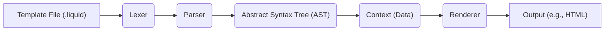
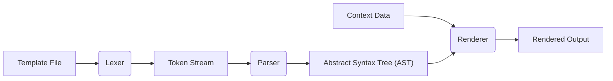

# Project Design Document: Shopify Liquid Templating Engine

**Version:** 1.1
**Date:** October 26, 2023
**Author:** Gemini (AI Language Model)

## 1. Introduction

This document provides an enhanced and detailed design overview of the Shopify Liquid templating engine, specifically tailored for threat modeling activities. It meticulously describes the architecture, core components, and data flow within Liquid to facilitate the identification of potential security vulnerabilities and the design of appropriate mitigation strategies. This document serves as a critical input for security assessments and informs secure development practices.

## 2. Goals and Objectives

*   To furnish a precise and in-depth description of the Liquid templating engine's architecture and operational mechanisms.
*   To clearly delineate the key components of Liquid and articulate their interactions within the system's boundaries.
*   To comprehensively document the flow of data and the processing steps involved in the rendering of Liquid templates, highlighting potential points of interest for security analysis.
*   To establish a robust and well-defined foundation for conducting thorough and effective threat modeling exercises.
*   To serve as a reliable and up-to-date reference for security evaluations, penetration testing, and ongoing development efforts.

## 3. High-Level Architecture

Liquid operates by processing template files that interweave static content with dynamic data, ultimately generating output, commonly in HTML format. The central process involves the Liquid engine interpreting template files containing markup and specific Liquid syntax to produce the final rendered content.

*   **Template File (.liquid):** The initial input to the Liquid engine. It comprises a mixture of static textual content and Liquid-specific directives (tags and filters).
*   **Lexer:**  The initial processing stage where the template file is scanned and broken down into a sequence of meaningful units called tokens. These tokens represent distinct elements like text blocks, Liquid tags, and variable outputs.
*   **Parser:**  This component takes the stream of tokens from the Lexer and analyzes their structure according to the Liquid grammar rules. It constructs an Abstract Syntax Tree (AST), which represents the hierarchical organization of the template.
*   **Abstract Syntax Tree (AST):** A tree-like representation of the parsed template. This structure facilitates the Renderer's ability to traverse and process the template in a structured manner.
*   **Context (Data):**  The collection of data that will be dynamically inserted into the template during the rendering process. This typically includes variables, objects, and collections provided by the host application.
*   **Renderer:**  The core processing unit that traverses the AST. It interprets Liquid tags and applies filters to variables using the data available in the Context, ultimately generating the final output string.
*   **Output (e.g., HTML):** The final rendered content produced by the Liquid engine. This is often HTML, but can also be other text-based formats like JSON or plain text.

## 4. Detailed Design

This section provides a more granular examination of the key components within the Liquid engine and their specific functionalities.

### 4.1. Lexer

*   **Functionality:**  The Lexer reads the raw template string character by character and groups them into tokens. It identifies different types of Liquid syntax based on delimiters and keywords.
*   **Input:** Raw template string.
*   **Output:** An ordered stream of tokens, each representing a distinct element of the template.
*   **Key Responsibilities:**
    *   Identifying and categorizing different Liquid syntax elements (e.g., `{{`, `{%`, `}}`, `}`).
    *   Distinguishing between static text, Liquid tags, output statements, and comments.
    *   Handling whitespace and line breaks appropriately.
    *   Performing basic validation, such as detecting unclosed tags or mismatched delimiters.
    *   Potential vulnerability: Improper handling of escape sequences or malformed input could lead to bypasses or errors.

### 4.2. Parser

*   **Functionality:** The Parser consumes the token stream from the Lexer and builds the Abstract Syntax Tree (AST). It enforces the grammatical rules of the Liquid language, ensuring the template structure is valid.
*   **Input:** Stream of tokens from the Lexer.
*   **Output:** A hierarchical Abstract Syntax Tree (AST) representing the parsed template structure.
*   **Key Responsibilities:**
    *   Arranging tokens into a hierarchical structure based on Liquid grammar.
    *   Identifying and reporting syntax errors (e.g., misplaced tags, invalid filter usage).
    *   Associating tag arguments and filter parameters with their respective nodes in the AST.
    *   Potential vulnerability:  Bugs in the parsing logic could allow for the creation of unexpected AST structures, leading to vulnerabilities in later stages. Stack overflow vulnerabilities could arise from deeply nested templates.

### 4.3. Abstract Syntax Tree (AST)

*   **Functionality:** The AST serves as an intermediate representation of the template, making it easier for the Renderer to process the template's logic and content in a structured way.
*   **Structure:**  A tree-like data structure composed of nodes, where each node represents a specific element of the template. Common node types include:
    *   **Text Nodes:** Represent static content to be output directly.
    *   **Variable Nodes:** Represent variables whose values need to be fetched from the Context and output.
    *   **Tag Nodes:** Represent Liquid control structures (e.g., `if`, `for`, `assign`) and custom tags. These nodes contain information about the tag type and its arguments.
    *   **Filter Nodes:** Represent filters to be applied to variables or expressions.
*   **Purpose:** Provides a structured and easily traversable representation of the template for the Renderer.
*   **Potential vulnerability:** If the AST can be manipulated or constructed in unexpected ways (due to parser vulnerabilities), it could lead to unintended code execution or information disclosure during rendering.

### 4.4. Context

*   **Functionality:** The Context acts as a data container and scope manager for variables and objects accessible within the Liquid template. It provides the data necessary for dynamic content generation.
*   **Data Source:**  Typically provided by the application embedding the Liquid engine. This data can come from databases, user input, or other sources.
*   **Structure:** Often implemented as a stack of scopes, allowing for nested contexts and variable shadowing. This enables local variable definitions within loops or conditional blocks.
*   **Key Responsibilities:**
    *   Storing and retrieving variable values based on their names.
    *   Providing access to object properties and methods.
    *   Managing the scope and lifetime of variables within the template execution.
    *   Potential vulnerability: If the Context contains sensitive information and is not handled securely, vulnerabilities like information disclosure could arise. Improperly sanitized data within the Context could lead to XSS if not handled by filters.

### 4.5. Renderer

*   **Functionality:** The Renderer traverses the AST, interpreting each node and generating the final output string. It evaluates Liquid tags, resolves variable values from the Context, and applies filters.
*   **Input:** The Abstract Syntax Tree (AST) and the Context data.
*   **Output:** The final rendered output string (e.g., HTML).
*   **Key Responsibilities:**
    *   Visiting each node in the AST in a defined order.
    *   Executing the logic associated with each Liquid tag (e.g., evaluating conditions for `if` tags, iterating through collections for `for` tags).
    *   Resolving variable names to their corresponding values in the Context.
    *   Applying specified filters to variable values or expressions before outputting them.
    *   Handling errors encountered during rendering (e.g., undefined variables, invalid filter arguments).
    *   Potential vulnerability: This is a critical component for security. Improper handling of filters, tags, or context data can lead to XSS, injection attacks, or denial-of-service.

### 4.6. Tags

*   **Functionality:** Liquid tags (``) provide control flow and logic within templates. They dictate actions to be performed during the rendering process.
*   **Examples:**
    *   `if`, `elsif`, `else`: Conditional execution of template sections.
    *   `for`: Iterating over collections of data.
    *   `assign`: Creating or modifying variables within the current Context.
    *   `include`: Including other Liquid templates or snippets.
    *   `render`: Similar to `include`, but with potentially isolated scope.
    *   Custom tags: Extensions to the core Liquid language, providing application-specific functionality.
*   **Processing:** The Renderer executes the code associated with each tag. This might involve evaluating expressions, modifying the Context, or including other templates.
*   **Potential vulnerability:**  Custom tags, in particular, can introduce significant security risks if not carefully implemented and reviewed. Unrestricted use of `include` or `render` could lead to unauthorized access to files or templates.

### 4.7. Filters

*   **Functionality:** Liquid filters are used to modify the output of variables or expressions (`{{ variable | filter }}`). They transform data before it is inserted into the rendered output.
*   **Examples:**
    *   `escape`: Escapes HTML characters to prevent XSS.
    *   `json`: Converts a variable to its JSON representation.
    *   `capitalize`: Capitalizes the first word of a string.
    *   `date`: Formats a date according to a specified pattern.
    *   Custom filters: Extensions to the core Liquid language, providing application-specific data transformations.
*   **Processing:** The Renderer applies the specified filter function to the value before outputting it.
*   **Potential vulnerability:**  Security vulnerabilities can arise from:
    *   Missing or incorrect application of crucial filters like `escape`, leading to XSS.
    *   Vulnerabilities within the filter implementations themselves.
    *   Maliciously crafted filter arguments that could exploit underlying functionality.

## 5. Data Flow

The following diagram illustrates the detailed flow of data through the Liquid engine, highlighting key transformations and component interactions.

*   The process initiates with the **Template File**, the source code containing Liquid syntax and static content.
*   The **Lexer** processes the **Template File**, breaking it down into a **Token Stream**.
*   The **Parser** consumes the **Token Stream** and constructs the **Abstract Syntax Tree (AST)**, representing the template's structure.
*   Separately, **Context Data** is provided to the **Renderer**.
*   The **Renderer** takes both the **AST** and the **Context Data** as input.
*   The **Renderer** traverses the **AST**, using the **Context Data** to evaluate expressions, apply filters, and ultimately generate the **Rendered Output**.

## 6. Security Considerations (Detailed)

This section expands upon the initial security considerations, providing more specific examples and potential attack vectors.

*   **Template Injection:**
    *   **Threat:** Attackers inject malicious Liquid code into templates, potentially gaining arbitrary code execution on the server.
    *   **Examples:** Storing user-provided content directly in templates without sanitization, allowing users to upload template files.
    *   **Mitigation:**  Treat template creation as a privileged operation. Sanitize or sandbox user-provided content if it needs to be included in templates.
*   **Cross-Site Scripting (XSS):**
    *   **Threat:** Malicious scripts are injected into the rendered output, potentially stealing user credentials or performing actions on their behalf.
    *   **Examples:** Displaying user-provided data within templates without proper escaping using the `escape` filter.
    *   **Mitigation:**  Enforce output escaping by default or provide clear guidelines and mechanisms for developers to escape user-provided data.
*   **Denial of Service (DoS):**
    *   **Threat:** Attackers craft complex or deeply nested templates that consume excessive server resources, leading to service disruption.
    *   **Examples:** Templates with infinite loops, extremely large data sets, or excessive recursion.
    *   **Mitigation:** Implement resource limits on template rendering (e.g., execution time, memory usage, recursion depth).
*   **Information Disclosure:**
    *   **Threat:** Sensitive information is unintentionally exposed through error messages, verbose output, or access to internal variables.
    *   **Examples:** Displaying stack traces in production environments, allowing access to internal system variables through the Context.
    *   **Mitigation:**  Implement proper error handling and logging. Restrict access to sensitive data within the Context.
*   **Access Control:**
    *   **Threat:** Unauthorized users gain the ability to create, modify, or execute templates, potentially leading to various security breaches.
    *   **Examples:** Lack of authentication and authorization for template management interfaces.
    *   **Mitigation:** Implement robust authentication and authorization mechanisms for template management.
*   **Filter Security:**
    *   **Threat:** Vulnerabilities within filter implementations or the misuse of filters can introduce security risks.
    *   **Examples:** Custom filters with exploitable bugs, using filters in unintended ways to bypass security checks.
    *   **Mitigation:** Thoroughly review and test custom filters. Provide secure and well-defined APIs for filter development.
*   **Include/Render Tag Security:**
    *   **Threat:** Uncontrolled use of `include` or `render` tags can allow access to sensitive files or templates, or lead to circular dependencies causing DoS.
    *   **Examples:** Allowing users to specify arbitrary file paths in `include` tags.
    *   **Mitigation:** Restrict the paths that can be included or rendered. Implement safeguards against circular includes.
*   **Resource Limits:**
    *   **Threat:** Lack of limitations on template size, complexity, or execution time can be exploited for DoS attacks.
    *   **Examples:** Uploading extremely large template files, creating templates with excessive nesting.
    *   **Mitigation:** Implement limits on template size, parsing time, rendering time, and memory usage.

## 7. Deployment Environment

Liquid is designed to be embedded within a host application to provide templating functionality. Its deployment context significantly impacts security considerations.

*   **Common Use Cases:**
    *   **Web Servers:** Generating dynamic HTML content for web pages. This is a primary use case and requires careful attention to XSS prevention.
    *   **Email Generation:** Creating personalized email content. Security considerations include preventing email injection and protecting sensitive data.
    *   **Content Management Systems (CMS):** Allowing users to customize website layouts and content. Template injection is a major concern here.
    *   **Static Site Generators:** Pre-rendering website content. While runtime vulnerabilities are less of a concern, the build process needs to be secure.
*   **Integration:** Liquid engines are typically implemented as libraries or modules in various programming languages (e.g., Ruby, JavaScript, Python). The security of the integration points is crucial.

## 8. Assumptions and Constraints

*   The security of the host application providing the Context data is paramount. Liquid relies on the host application to provide safe and sanitized data.
*   Custom tags and filters introduce a significant attack surface and require rigorous security review.
*   The underlying operating system and infrastructure are assumed to be reasonably secure.
*   Developers using Liquid are expected to have a basic understanding of web security principles, particularly regarding XSS.

## 9. Future Considerations

*   Exploring sandboxing techniques to further isolate template execution and limit potential damage from malicious code.
*   Implementing static analysis tools to automatically detect potential security vulnerabilities in Liquid templates.
*   Developing more robust mechanisms for managing and auditing custom tags and filters.
*   Providing clearer and more comprehensive security guidelines and best practices for Liquid developers.

This improved design document provides a more detailed and security-focused overview of the Shopify Liquid templating engine. It should serve as a valuable resource for conducting thorough threat modeling and implementing appropriate security measures.
