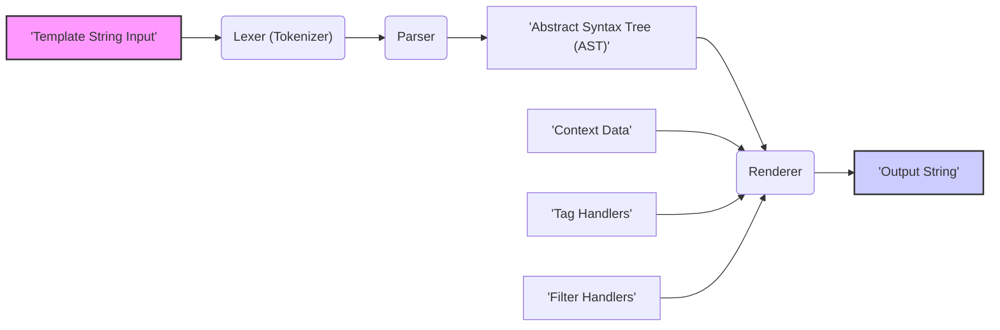

# Project Design Document: Shopify Liquid Templating Engine

**Version:** 1.1
**Date:** October 26, 2023
**Author:** AI Software Architect

## 1. Introduction

This document provides an enhanced architectural design of the Shopify Liquid templating engine. Building upon the previous version, it offers a more detailed understanding of the system's components, data flow, and key functionalities. This refined document will serve as a robust foundation for subsequent threat modeling activities, enabling a more granular assessment of potential security vulnerabilities.

## 2. Goals

*   Provide a clear, concise, and more detailed architectural overview of the Liquid templating engine.
*   Elaborate on the core components and their interactions with specific examples where applicable.
*   Describe the data flow within the system with greater clarity.
*   Highlight key security considerations relevant to the architecture, providing more context for potential threats.
*   Serve as an improved basis for future threat modeling exercises, facilitating a deeper analysis.

## 3. Target Audience

This document is intended for:

*   Security engineers involved in threat modeling, penetration testing, and security audits.
*   Software developers actively working on the Liquid engine or integrating it into other systems.
*   Software and security architects requiring a comprehensive understanding of Liquid's design and security implications.

## 4. System Overview

Liquid is a template language developed by Shopify, implemented in Ruby. Its primary function is to generate dynamic content for various formats, including HTML, email, and other text-based outputs. Liquid's design emphasizes the separation of presentation logic from underlying application logic, empowering designers and developers to work collaboratively. It achieves this through a syntax comprising tags for control flow and logic, objects for accessing data, and filters for modifying output.

## 5. Core Components

The Liquid engine comprises several interconnected components, each with a specific responsibility:

*   **Lexer (Tokenizer):**
    *   **Function:**  Receives the raw template string as input.
    *   **Process:**  Analyzes the input character by character, identifying and categorizing meaningful units called tokens.
    *   **Output:**  Generates a stream of tokens representing tags (e.g., ``), variables (e.g., `{{ product.title }}`), literals (e.g., strings, numbers), and plain text.
*   **Parser:**
    *   **Input:** The stream of tokens produced by the Lexer.
    *   **Function:**  Organizes the tokens into a hierarchical structure, ensuring the template syntax adheres to Liquid's grammar rules.
    *   **Output:**  Constructs an Abstract Syntax Tree (AST), which represents the parsed template's structure and relationships between different elements.
*   **Context:**
    *   **Purpose:**  Acts as a container for the data that will be dynamically inserted into the template during rendering.
    *   **Content:**  Typically a collection of key-value pairs, where keys are strings and values can be various data types (strings, numbers, objects, arrays).
    *   **Scope Management:**  Manages variable scopes, ensuring that variables are resolved correctly based on their context within the template (e.g., within `` loops).
*   **Tag Handlers:**
    *   **Role:**  Responsible for executing the logic associated with specific Liquid tags.
    *   **Mechanism:**  Each tag (e.g., `if`, `for`, `assign`) has a corresponding handler class or function.
    *   **Interaction:**  Tag handlers interact with the Context to access data, control the rendering flow, and potentially modify the output.
*   **Filter Handlers:**
    *   **Purpose:**  Provide mechanisms to modify the output of variables.
    *   **Usage:**  Applied to variables using the pipe symbol (`|`), e.g., `{{ product.title | upcase }}`.
    *   **Implementation:**  Each filter (e.g., `upcase`, `downcase`, `date`) has a corresponding handler that performs the transformation.
*   **Object Resolution:**
    *   **Function:**  Responsible for retrieving the actual values of variables referenced in the template.
    *   **Process:**  Navigates the Context based on the variable path (e.g., `product.title`), resolving nested objects and potentially invoking methods on objects.
    *   **Security Implication:**  Needs to be carefully designed to prevent access to sensitive or unintended data within the Context.
*   **Renderer:**
    *   **Core Function:**  Traverses the AST, interpreting each node and generating the final output string.
    *   **Process:**  Executes tag handlers, resolves variable values using Object Resolution, applies filters, and concatenates the resulting strings.
    *   **Dependency:**  Relies heavily on the Context, Tag Handlers, and Filter Handlers.
*   **Template Cache:**
    *   **Optimization:**  Stores compiled templates in memory to avoid repeated parsing and compilation, improving rendering performance for frequently used templates.
    *   **Invalidation:**  Requires a mechanism to invalidate cached templates when the underlying template source changes.
    *   **Security Consideration:**  Needs to ensure the integrity and confidentiality of cached templates.
*   **Error Handling:**
    *   **Responsibility:**  Manages errors that occur during the parsing or rendering process.
    *   **Actions:**  Provides informative error messages to developers, prevents the entire rendering process from crashing, and may offer options for error recovery or fallback behavior.

## 6. Data Flow

The following diagram illustrates the data flow within the Liquid engine during the rendering process:

**Detailed Data Flow:**

1. **'Template String Input'**: The rendering process begins with the raw Liquid template string.
2. **Lexer (Tokenizer)**: The lexer breaks down the input string into a stream of individual tokens.
3. **Parser**: The parser analyzes the token stream and constructs the Abstract Syntax Tree (AST), representing the template's structure.
4. **'Abstract Syntax Tree (AST)'**: The AST is the structured representation of the template, ready for rendering.
5. **'Context Data'**: The data to be used in the template is provided through the Context.
6. **Renderer**: The renderer traverses the AST.
7. **'Tag Handlers'**: When the renderer encounters a tag node in the AST, it invokes the corresponding tag handler to execute its logic, potentially interacting with the Context.
8. **'Filter Handlers'**: When a filter is applied to a variable, the renderer calls the appropriate filter handler to modify the variable's value.
9. **'Output String'**: The renderer combines the processed template content and data to produce the final output string.

## 7. Security Considerations

Security is a paramount concern when using templating engines like Liquid. Here are key considerations:

*   **Server-Side Template Injection (SSTI):**
    *   **Threat:**  Occurs when user-controlled input is directly embedded into Liquid templates without proper sanitization or escaping.
    *   **Impact:**  Attackers can inject malicious Liquid code, potentially leading to remote code execution on the server, access to sensitive data, or other forms of compromise.
    *   **Mitigation:**  Strictly avoid directly embedding user input into templates. Sanitize and escape user-provided data before rendering. Utilize parameterized templates or a secure templating context.
*   **Information Disclosure:**
    *   **Threat:**  Improperly designed templates or overly permissive context data can expose sensitive information to unauthorized users.
    *   **Impact:**  Leakage of confidential data, such as API keys, database credentials, or personal information.
    *   **Mitigation:**  Minimize the data exposed in the template context. Implement access controls and carefully review template logic to prevent unintended data access.
*   **Denial of Service (DoS):**
    *   **Threat:**  Maliciously crafted templates with computationally expensive logic, infinite loops, or excessive resource consumption can overwhelm the server.
    *   **Impact:**  Service disruption, making the application unavailable to legitimate users.
    *   **Mitigation:**  Implement safeguards against resource-intensive templates, such as timeouts for rendering, limits on loop iterations, and restrictions on complex operations.
*   **Cross-Site Scripting (XSS):**
    *   **Threat:**  While Liquid operates on the server-side, the generated output (often HTML) can be vulnerable to XSS if user-provided data within the context is not properly escaped before rendering.
    *   **Impact:**  Attackers can inject malicious scripts into the rendered output, potentially stealing user credentials, redirecting users to malicious sites, or performing other client-side attacks.
    *   **Mitigation:**  Utilize Liquid's output filters (e.g., `escape`, `h`) to properly encode user-provided data before it is included in the HTML output. Employ Content Security Policy (CSP) as an additional layer of defense.
*   **Security of Custom Tags and Filters:**
    *   **Threat:**  If the application allows for the creation of custom Liquid tags or filters, vulnerabilities in their implementation can introduce significant security risks.
    *   **Impact:**  Potential for arbitrary code execution, access to internal resources, or other security breaches depending on the custom logic.
    *   **Mitigation:**  Thoroughly review and test custom tag and filter implementations. Enforce strict coding standards and security best practices. Consider sandboxing or limiting the capabilities of custom extensions.
*   **Context Security:**
    *   **Threat:**  The security of the data provided in the template context is crucial. If the context contains sensitive information and is not properly secured, it can be exploited.
    *   **Impact:**  Unauthorized access to sensitive data, potentially leading to further attacks.
    *   **Mitigation:**  Implement robust access controls for the data provided in the context. Avoid including unnecessary sensitive information. Encrypt sensitive data at rest and in transit.
*   **Template Cache Security:**
    *   **Threat:**  If a template cache is used, vulnerabilities in its implementation or configuration could allow for tampering with cached templates or unauthorized access to their content.
    *   **Impact:**  Serving outdated or malicious content, potentially leading to various security issues.
    *   **Mitigation:**  Ensure the integrity of the template cache. Implement appropriate access controls to prevent unauthorized modification or access. Use secure storage mechanisms for cached templates.

## 8. Dependencies

Liquid relies on the Ruby programming language and may utilize other Ruby gems (libraries) for various functionalities. Understanding these dependencies is important for identifying potential vulnerabilities within those external components.

*   Ruby (core programming language).
*   Potentially various Ruby Gems for tasks such as:
    *   Parsing and lexical analysis.
    *   String manipulation and encoding.
    *   Caching mechanisms.

## 9. Deployment Considerations

Liquid is typically embedded within a larger application, such as a web framework or content management system. The security of the deployment environment significantly impacts the overall security posture.

*   Commonly deployed within Ruby on Rails applications.
*   Used in various content management systems and e-commerce platforms.
*   May be utilized in email generation and other text-based output systems.
*   The security of the underlying operating system, web server, and application framework is crucial.

## 10. Configuration

Liquid may offer various configuration options that can impact its behavior and security. Understanding these options is important for secure deployment.

*   **Template Loading:**  Configuration options related to how templates are loaded (e.g., from the file system, database). Securely configure template paths and access permissions.
*   **Caching:**  Settings related to template caching, including cache size, expiration policies, and storage mechanisms. Configure caching securely to prevent tampering or unauthorized access.
*   **Security Policies:**  Potential configuration options for enforcing security policies, such as restrictions on certain tags or filters.
*   **Custom Tag/Filter Registration:**  Mechanisms for registering custom tags and filters. Implement secure registration processes and thoroughly vet custom extensions.

## 11. Future Considerations

*   Detailed analysis of the implementation of specific tag and filter handlers to identify potential vulnerabilities.
*   In-depth examination of the template caching mechanism, including cache invalidation strategies and security measures.
*   Investigation of any sandboxing or security policies enforced by the Liquid engine to restrict potentially dangerous operations.
*   Analysis of the mechanisms for extending Liquid with custom functionality and the associated security implications of these extensions.

This enhanced document provides a more comprehensive understanding of the Shopify Liquid templating engine's architecture and security considerations. This detailed information will be invaluable for conducting thorough and effective threat modeling exercises.