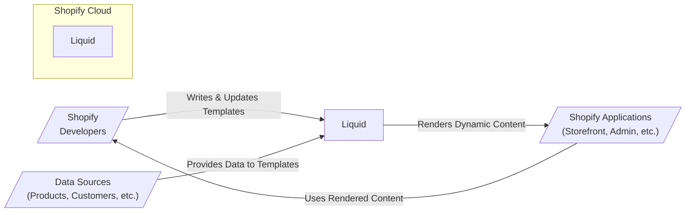

# BUSINESS POSTURE

- Business Priorities and Goals:
  - Provide a flexible and performant templating language for rendering dynamic content.
  - Enable developers to create and customize user interfaces and data presentations.
  - Ensure reliability and stability of the templating engine to avoid service disruptions.
  - Maintain security of the templating engine to prevent vulnerabilities like template injection.
- Business Risks:
  - Template injection vulnerabilities leading to data breaches or service disruption.
  - Performance bottlenecks in template rendering impacting user experience.
  - Incompatibility issues with different data sources or rendering environments.
  - Lack of maintainability and extensibility hindering future development.

# SECURITY POSTURE

- Existing Security Controls:
  - security control: GitHub repository with access control (described in GitHub repository settings).
  - security control: Code review process (assumed based on standard software development practices).
  - security control: Issue tracking system for reporting and addressing bugs and vulnerabilities (described in GitHub issues).
  - accepted risk: Reliance on community contributions for security vulnerability identification and patching.
- Recommended Security Controls:
  - security control: Implement automated Static Application Security Testing (SAST) in the CI/CD pipeline to detect potential vulnerabilities in the code.
  - security control: Implement automated Dependency Scanning to identify and manage vulnerable dependencies.
  - security control: Conduct regular security code reviews focusing on template injection and other common web application vulnerabilities.
  - security control: Establish a clear process for reporting and handling security vulnerabilities, including a security contact and vulnerability disclosure policy.
  - security control: Implement fuzz testing to identify unexpected behavior and potential vulnerabilities in the template rendering engine.
- Security Requirements:
  - Authentication:
    - Liquid itself does not handle authentication. Authentication is assumed to be managed by the application embedding Liquid.
  - Authorization:
    - Liquid should provide mechanisms to restrict access to sensitive data and functionality within templates, based on the context provided by the embedding application.
    - The embedding application is responsible for providing the correct context and ensuring proper authorization before rendering templates.
  - Input Validation:
    - Liquid must perform robust input validation on both template code and data provided to templates to prevent injection attacks.
    - Implement context-aware output encoding to mitigate cross-site scripting (XSS) vulnerabilities when rendering user-provided data.
  - Cryptography:
    - If Liquid is used to handle sensitive data, ensure that any cryptographic operations are performed using secure and well-vetted libraries.
    - Avoid storing sensitive data directly within templates if possible. Pass sensitive data as parameters and handle encryption/decryption outside of the template rendering process.

# DESIGN

## C4 CONTEXT



- C4 Context Elements:
  - - Name: Shopify Developers
    - Type: Person
    - Description: Shopify developers and potentially app developers who create and maintain Liquid templates.
    - Responsibilities: Writing, updating, and maintaining Liquid templates to define the presentation of data.
    - Security controls: Access control to template repositories, code review process for template changes.
  - - Name: Data Sources (Products, Customers, etc.)
    - Type: System
    - Description: Various Shopify systems and databases that provide data to be rendered by Liquid templates. Examples include product catalogs, customer databases, and configuration settings.
    - Responsibilities: Providing structured data in a format that Liquid can process. Ensuring data integrity and availability.
    - Security controls: Data access controls, data encryption at rest and in transit, data validation.
  - - Name: Liquid
    - Type: Software System
    - Description: The Liquid templating engine itself, responsible for parsing templates, processing data, and rendering dynamic content.
    - Responsibilities: Securely and efficiently rendering templates, preventing injection vulnerabilities, and providing a flexible templating language.
    - Security controls: Input validation, output encoding, secure coding practices, SAST/DAST, dependency scanning.
  - - Name: Shopify Applications (Storefront, Admin, etc.)
    - Type: Software System
    - Description: Shopify applications like the online storefront, admin panel, and other services that embed and utilize Liquid to render dynamic user interfaces.
    - Responsibilities: Embedding Liquid, providing data context to templates, handling user requests, and displaying rendered content.
    - Security controls: Authentication, authorization, input validation, secure session management, web application firewall (WAF).

## C4 CONTAINER

```mermaid
flowchart LR
    subgraph Shopify Cloud
        subgraph Liquid Engine Container
            LiquidCore[/"Liquid Core\n(Ruby, C++)"/]
            LiquidParser[/"Template Parser\n(Ruby, C++)"/]
            LiquidRenderer[/"Template Renderer\n(Ruby, C++)"/]
        end
        subgraph Embedding Application Container
            TemplateCache[/"Template Cache\n(Memory, Redis)"/]
            DataContext[/"Data Context Provider\n(Application Code)"/]
            ContentDelivery[/"Content Delivery\n(Web Server)"/]
        end
    end

    LiquidParser --> LiquidCore
    LiquidRenderer --> LiquidCore
    Embedding Application Container -->> Liquid Engine Container: Uses
    DataContext -->> Liquid Engine Container: Provides Data
    TemplateCache -->> Liquid Engine Container: Provides Templates
    Liquid Engine Container -->> ContentDelivery: Renders Content
```

- C4 Container Elements:
  - - Name: Liquid Core (Ruby, C++)
    - Type: Container - Library/Runtime
    - Description: The core Liquid engine implemented in Ruby and potentially C++ for performance-critical parts. This includes the core logic for parsing, rendering, and executing template code.
    - Responsibilities: Parsing template syntax, managing template execution context, providing core template language features, and ensuring performance.
    - Security controls: Secure coding practices in Ruby and C++, input validation within the core engine, memory safety in C++ components.
  - - Name: Template Parser (Ruby, C++)
    - Type: Container - Module
    - Description:  A module responsible for parsing Liquid template code into an Abstract Syntax Tree (AST) or an intermediate representation that can be processed by the renderer.
    - Responsibilities: Validating template syntax, converting template code into a usable structure, and detecting syntax errors.
    - Security controls: Input validation to prevent malicious template code from causing parser errors or vulnerabilities, protection against parser exploits.
  - - Name: Template Renderer (Ruby, C++)
    - Type: Container - Module
    - Description: A module that takes the parsed template representation and data context to generate the final output. This involves executing template logic, substituting data, and formatting the output.
    - Responsibilities: Securely rendering templates, applying output encoding, handling data injection safely, and managing template execution flow.
    - Security controls: Context-aware output encoding, input validation of data provided to templates, protection against template injection vulnerabilities.
  - - Name: Template Cache (Memory, Redis)
    - Type: Container - Data Store
    - Description: A caching mechanism to store compiled templates in memory or a distributed cache like Redis to improve performance by reducing template parsing and compilation overhead.
    - Responsibilities: Efficiently storing and retrieving compiled templates, invalidating cache entries when templates are updated, and ensuring cache consistency.
    - Security controls: Access control to the cache, secure configuration of the cache (e.g., Redis authentication), protection against cache poisoning attacks.
  - - Name: Data Context Provider (Application Code)
    - Type: Container - Application Component
    - Description: Application code within the embedding Shopify application that is responsible for fetching data from various sources and providing it to the Liquid engine as the data context for template rendering.
    - Responsibilities: Fetching relevant data, structuring data in a format suitable for Liquid templates, and ensuring data is authorized for the current user/context.
    - Security controls: Data access controls, data validation, secure data retrieval practices, authorization checks before providing data to templates.
  - - Name: Content Delivery (Web Server)
    - Type: Container - Web Server
    - Description: The web server or application server that hosts the Shopify application and delivers the rendered HTML content to users' browsers.
    - Responsibilities: Serving rendered content, handling user requests, managing sessions, and providing overall web application functionality.
    - Security controls: Web application firewall (WAF), TLS/HTTPS encryption, secure server configuration, input validation at the application level, output encoding.

## DEPLOYMENT

```mermaid
flowchart LR
    subgraph Shopify Cloud - Production Environment
        subgraph Load Balancer
            LB[/"Load Balancer"/]
        end
        subgraph Application Servers
            AS1[/"Application Server 1\n(Containerized)"/]
            AS2[/"Application Server 2\n(Containerized)"/]
            ASn[/"Application Server N\n(Containerized)"/]
        end
        subgraph Cache Cluster
            Cache1[/"Cache Server 1\n(Redis Cluster)"/]
            Cache2[/"Cache Server 2\n(Redis Cluster)"/]
            Cachen[/"Cache Server N\n(Redis Cluster)"/]
        end
        subgraph Database Cluster
            DB1[/"Database Server 1\n(PostgreSQL Cluster)"/]
            DB2[/"Database Server 2\n(PostgreSQL Cluster)"/]
            DBn[/"Database Server N\n(PostgreSQL Cluster)"/]
        end
    end

    UserBrowser[/"User Browser"/] --> LB
    LB --> AS1
    LB --> AS2
    LB --> ASn
    AS1 --> Cache1
    AS1 --> DB1
    AS2 --> Cache2
    AS2 --> DB2
    ASn --> Cachen
    ASn --> DBn
    AS1 & AS2 & ASn -->> Liquid Engine Container
```

- Deployment Elements:
  - - Name: Load Balancer
    - Type: Infrastructure - Load Balancer
    - Description: Distributes incoming user traffic across multiple application servers to ensure high availability and performance.
    - Responsibilities: Traffic distribution, health checks of application servers, SSL termination, and protection against DDoS attacks.
    - Security controls: DDoS protection, rate limiting, SSL/TLS encryption, access control lists (ACLs).
  - - Name: Application Servers (Containerized)
    - Type: Infrastructure - Compute Instance (Containers)
    - Description: Containerized application servers running the Shopify application and the embedded Liquid engine. These servers handle user requests, render templates, and interact with data stores.
    - Responsibilities: Running application code, rendering Liquid templates, processing user requests, and interacting with cache and database clusters.
    - Security controls: Container security (image scanning, vulnerability management), application-level firewalls, intrusion detection systems (IDS), secure container orchestration (e.g., Kubernetes).
  - - Name: Cache Cluster (Redis Cluster)
    - Type: Infrastructure - Data Store (Cache)
    - Description: A distributed Redis cluster used for caching compiled Liquid templates and potentially other application data to improve performance and reduce database load.
    - Responsibilities: Caching template data, providing fast data retrieval, ensuring cache consistency and availability.
    - Security controls: Redis authentication, access control lists (ACLs), encryption in transit and at rest (if sensitive data is cached), regular security patching.
  - - Name: Database Cluster (PostgreSQL Cluster)
    - Type: Infrastructure - Data Store (Database)
    - Description: A PostgreSQL database cluster storing persistent application data, including product information, customer data, and template definitions.
    - Responsibilities: Persistent data storage, data integrity, data availability, and transactional consistency.
    - Security controls: Database access controls, encryption at rest and in transit, database firewalls, regular backups, vulnerability management, and database activity monitoring.
  - - Name: User Browser
    - Type: Person - Client Application
    - Description: The web browser used by users to access the Shopify storefront or admin panel.
    - Responsibilities: Rendering HTML content, executing JavaScript, and interacting with the Shopify application.
    - Security controls: Browser security features (e.g., Content Security Policy, XSS protection), user awareness of phishing and malware threats.

## BUILD

```mermaid
flowchart LR
    subgraph Developer Workstation
        Dev[/"Developer"/]
        CodeEditor[/"Code Editor\n(VS Code, etc.)"/]
    end
    subgraph Version Control System
        VCS[/"GitHub\nRepository"/]
    end
    subgraph CI/CD Pipeline
        BuildServer[/"CI Server\n(GitHub Actions)"/]
        SASTScanner[/"SAST Scanner"/]
        DependencyScanner[/"Dependency Scanner"/]
        TestRunner[/"Test Runner"/]
        ArtifactRepo[/"Artifact Repository\n(GitHub Packages)"/]
    end

    Dev --> CodeEditor
    CodeEditor --> VCS: Commit & Push
    VCS --> BuildServer: Trigger Build
    BuildServer --> SASTScanner: Run SAST
    BuildServer --> DependencyScanner: Scan Dependencies
    BuildServer --> TestRunner: Run Tests
    BuildServer --> ArtifactRepo: Publish Artifacts
    ArtifactRepo --> Deployment Pipeline: Deploy
```

- Build Elements:
  - - Name: Developer
    - Type: Person
    - Description: Software developers who write and modify the Liquid engine code.
    - Responsibilities: Writing secure and efficient code, performing local testing, and committing code changes to the version control system.
    - Security controls: Secure coding training, code review participation, access control to development environments.
  - - Name: Code Editor (VS Code, etc.)
    - Type: Tool - IDE
    - Description: Integrated Development Environment used by developers for writing and editing code.
    - Responsibilities: Providing code editing features, syntax highlighting, debugging tools, and integration with version control systems.
    - Security controls: IDE security updates, secure plugins, and protection against malware on developer workstations.
  - - Name: GitHub Repository
    - Type: Tool - Version Control System
    - Description: GitHub repository hosting the Liquid source code and managing code changes through version control.
    - Responsibilities: Source code management, version history tracking, collaboration, and access control.
    - Security controls: Access control (branch protection, permissions), audit logging, and vulnerability scanning of the repository platform.
  - - Name: CI Server (GitHub Actions)
    - Type: Tool - CI/CD System
    - Description: Continuous Integration server (e.g., GitHub Actions) that automates the build, test, and deployment pipeline.
    - Responsibilities: Automating build processes, running tests, performing security scans, and deploying artifacts.
    - Security controls: Secure CI/CD pipeline configuration, access control to CI/CD system, secrets management, and audit logging.
  - - Name: SAST Scanner
    - Type: Tool - Security Scanner
    - Description: Static Application Security Testing (SAST) scanner integrated into the CI/CD pipeline to automatically analyze source code for potential vulnerabilities.
    - Responsibilities: Identifying potential security vulnerabilities in the code, providing reports, and failing builds based on vulnerability severity.
    - Security controls: Regularly updated vulnerability rules, accurate vulnerability detection, and integration with the CI/CD pipeline.
  - - Name: Dependency Scanner
    - Type: Tool - Security Scanner
    - Description: Dependency scanning tool to identify known vulnerabilities in third-party libraries and dependencies used by Liquid.
    - Responsibilities: Identifying vulnerable dependencies, providing reports, and alerting developers to update or replace vulnerable components.
    - Security controls: Regularly updated vulnerability databases, accurate dependency scanning, and integration with the CI/CD pipeline.
  - - Name: Test Runner
    - Type: Tool - Testing Framework
    - Description: Automated test runner that executes unit tests, integration tests, and potentially security tests to ensure code quality and functionality.
    - Responsibilities: Running automated tests, providing test reports, and ensuring code meets quality standards.
    - Security controls: Secure test environment, test data management, and integration with the CI/CD pipeline.
  - - Name: Artifact Repository (GitHub Packages)
    - Type: Tool - Artifact Storage
    - Description: Repository for storing build artifacts (e.g., compiled libraries, packages) produced by the CI/CD pipeline.
    - Responsibilities: Securely storing build artifacts, managing artifact versions, and providing access to artifacts for deployment.
    - Security controls: Access control to the artifact repository, artifact integrity checks (e.g., checksums), and vulnerability scanning of stored artifacts.

# RISK ASSESSMENT

- Critical Business Processes:
  - Rendering Shopify storefronts and admin panels.
  - Processing and displaying product information, customer data, and other dynamic content.
  - Ensuring the availability and performance of Shopify online stores.
- Data to Protect and Sensitivity:
  - Template Code: Medium sensitivity. Compromise could lead to injection vulnerabilities.
  - Product Data: High sensitivity. Confidentiality, integrity, and availability are important for business operations.
  - Customer Data: High sensitivity. Confidentiality, integrity, and availability are critical for privacy and compliance (GDPR, CCPA, etc.).
  - Business Logic within Templates: High sensitivity. Intellectual property and competitive advantage.

# QUESTIONS & ASSUMPTIONS

- Questions:
  - What are the specific deployment environments for Liquid (e.g., cloud provider, container orchestration platform)?
  - What types of data are typically processed by Liquid templates in Shopify applications?
  - What is the process for managing and deploying Liquid templates within Shopify?
  - Are there specific compliance requirements (e.g., PCI DSS, HIPAA) that Liquid needs to adhere to?
  - What is the current security incident response plan for Liquid and related Shopify services?
- Assumptions:
  - Liquid is primarily used within the Shopify ecosystem for rendering dynamic content in storefronts and admin panels.
  - Shopify has a mature software development lifecycle and security practices in place.
  - Liquid is deployed in a cloud environment, likely using containerization and orchestration technologies.
  - Security is a high priority for Shopify, and they are actively working to mitigate potential vulnerabilities in their systems.
  - The provided GitHub repository represents the core Liquid engine, and there might be Shopify-specific extensions or customizations not publicly available.