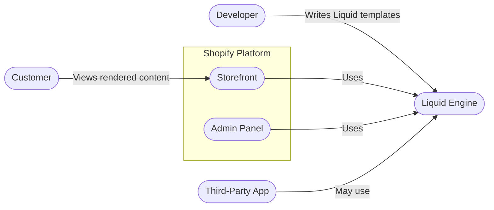
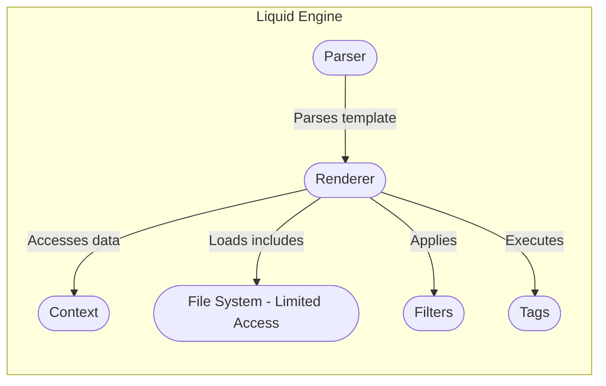
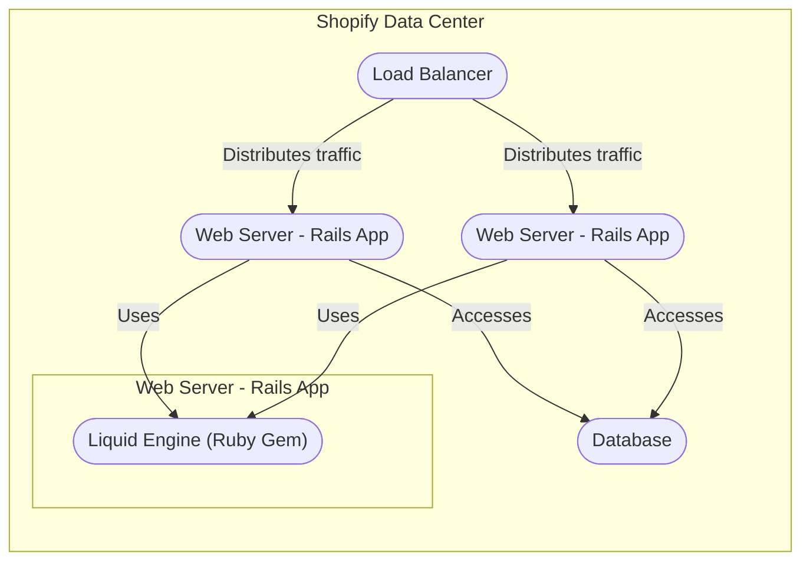

Okay, let's create a design document for the Shopify Liquid project, focusing on aspects relevant for threat modeling.

# BUSINESS POSTURE

Shopify Liquid is a template engine created by Shopify and written in Ruby. It is used to load dynamic content on storefronts and other applications.  It's a core component of the Shopify platform and is also open-sourced and used by other projects (like Jekyll).

Priorities and Goals:

*   Reliability: Liquid must be highly reliable, as any failures or instability directly impact the availability and functionality of Shopify stores and other applications using it.
*   Performance:  Liquid templates need to be rendered quickly to ensure fast page load times for storefronts, impacting user experience and potentially sales.
*   Security:  As a template engine handling potentially untrusted input (template code), security is paramount to prevent vulnerabilities like Cross-Site Scripting (XSS), Remote Code Execution (RCE), and data leakage.
*   Maintainability:  The codebase should be maintainable and extensible to allow for new features, bug fixes, and ongoing support.
*   Usability: The template language should be easy to learn and use for theme developers and content creators.

Most Important Business Risks:

*   RCE in Liquid parsing:  A malicious actor crafting a specially designed Liquid template that exploits a vulnerability to execute arbitrary code on the server. This is the highest risk.
*   Denial of Service (DoS):  A malicious actor crafting a template that consumes excessive resources (CPU, memory) leading to a denial of service for the storefront or application.
*   Data Leakage:  A vulnerability that allows sensitive data (e.g., customer information, internal configuration) to be exposed through the template engine.
*   XSS: While Liquid itself aims to prevent XSS, improper usage or vulnerabilities in custom filters/tags could introduce XSS risks.
*   Supply Chain Attacks: Compromise of dependencies used by Liquid, leading to the introduction of malicious code.

# SECURITY POSTURE

Existing Security Controls:

*   security control: Input Validation: Liquid has built-in mechanisms to sanitize and escape output, reducing the risk of XSS. (Described in Liquid documentation and source code).
*   security control: Limited Functionality: Liquid intentionally restricts access to the underlying system and filesystem, preventing direct execution of system commands. (Described in Liquid documentation).
*   security control: Resource Limits: Liquid provides mechanisms to limit resource consumption (e.g., rendering time, memory usage) to mitigate DoS attacks. (Described in Liquid documentation and source code).
*   security control: Regular Security Audits: Shopify likely conducts regular security audits and penetration testing of Liquid as part of its overall security program. (Assumed based on Shopify's security practices).
*   security control: Dependency Management: Shopify likely uses dependency management tools (e.g., Bundler) to manage and update Liquid's dependencies, reducing the risk of known vulnerabilities. (Observed in the repository).
*   security control: Code Reviews: The open-source nature of Liquid encourages community code reviews, which can help identify and address security issues. (Observed in the repository).
*   security control: Static Analysis: Shopify likely uses static analysis tools to scan the Liquid codebase for potential vulnerabilities. (Assumed based on industry best practices).

Accepted Risks:

*   accepted risk: Complex Template Logic: While Liquid limits functionality, complex or poorly written templates can still lead to performance issues or unexpected behavior.
*   accepted risk: Custom Filters/Tags: Users can extend Liquid with custom filters and tags, which introduce a potential attack surface if not carefully implemented.
*   accepted risk: Third-Party Dependencies: While dependency management is in place, there's always a residual risk of vulnerabilities in third-party libraries.

Recommended Security Controls:

*   Implement a robust Content Security Policy (CSP) to mitigate the impact of any potential XSS vulnerabilities.
*   Provide clear documentation and guidelines for developers on securely implementing custom filters and tags.
*   Implement a regular dynamic application security testing (DAST) program to identify vulnerabilities in running instances of Liquid.
*   Consider using a Web Application Firewall (WAF) to provide an additional layer of protection against common web attacks.

Security Requirements:

*   Authentication: Not directly applicable to Liquid itself, as it's a template engine. Authentication is handled by the application using Liquid.
*   Authorization: Not directly applicable to Liquid itself. Authorization is handled by the application using Liquid. However, Liquid should provide mechanisms to access user context information (if available) in a secure manner.
*   Input Validation: Liquid must rigorously validate and sanitize all input to prevent injection attacks. This includes template code, variables, and data passed to filters.
*   Cryptography: Liquid should use secure cryptographic practices when handling sensitive data (e.g., hashing passwords, encrypting data). This is more relevant to the application using Liquid, but Liquid should provide secure helpers for common cryptographic tasks if needed.
*   Output Encoding: Liquid must properly encode output to prevent XSS vulnerabilities. This should be automatic and transparent to the user.

# DESIGN

## C4 CONTEXT



Element Descriptions:

*   Element:
    *   Name: Developer
    *   Type: Person
    *   Description: A person who creates and modifies Liquid templates.
    *   Responsibilities: Writing Liquid templates, creating themes, and customizing storefronts.
    *   Security controls: Code reviews, secure coding training, access controls to development environments.

*   Element:
    *   Name: Customer
    *   Type: Person
    *   Description: A person who interacts with a Shopify storefront.
    *   Responsibilities: Browsing products, placing orders, viewing content.
    *   Security controls: Browser security features, HTTPS, Content Security Policy (CSP).

*   Element:
    *   Name: Storefront
    *   Type: System
    *   Description: The customer-facing part of a Shopify store.
    *   Responsibilities: Displaying products, handling orders, rendering content using Liquid.
    *   Security controls: Input validation, output encoding, XSS protection, session management, HTTPS.

*   Element:
    *   Name: Admin Panel
    *   Type: System
    *   Description: The administrative interface for managing a Shopify store.
    *   Responsibilities: Managing products, orders, customers, settings, and themes.  May use Liquid for some rendering tasks.
    *   Security controls: Authentication, authorization, input validation, output encoding, session management, HTTPS.

*   Element:
    *   Name: Third-Party App
    *   Type: System
    *   Description: An application developed by a third-party that integrates with Shopify.
    *   Responsibilities: Varies depending on the app. May use Liquid for rendering.
    *   Security controls: Shopify App Store review process, API authentication, authorization, input validation, output encoding.

*   Element:
    *   Name: Liquid Engine
    *   Type: System
    *   Description: The core Liquid template engine.
    *   Responsibilities: Parsing and rendering Liquid templates.
    *   Security controls: Input validation, output encoding, resource limits, restricted functionality, regular security audits.

## C4 CONTAINER



Element Descriptions:

*   Element:
    *   Name: Parser
    *   Type: Container
    *   Description: The component responsible for parsing Liquid template code.
    *   Responsibilities: Lexing, parsing, and creating an Abstract Syntax Tree (AST).
    *   Security controls: Input validation, secure parsing techniques, fuzzing.

*   Element:
    *   Name: Renderer
    *   Type: Container
    *   Description: The component responsible for rendering the parsed template.
    *   Responsibilities: Traversing the AST, evaluating expressions, and generating output.
    *   Security controls: Output encoding, resource limits, sandboxing.

*   Element:
    *   Name: Context
    *   Type: Container
    *   Description: The data context available to the template.
    *   Responsibilities: Providing variables and data to the template.
    *   Security controls: Access controls, data sanitization.

*   Element:
    *   Name: File System (Limited Access)
    *   Type: Container
    *   Description: Limited access to the file system for loading includes.
    *   Responsibilities: Providing access to template partials.
    *   Security controls: Restricted file system access, path validation.

*   Element:
    *   Name: Filters
    *   Type: Container
    *   Description: Built-in and custom filters for transforming data.
    *   Responsibilities: Modifying data values (e.g., formatting, escaping).
    *   Security controls: Input validation, output encoding, secure coding practices for custom filters.

*   Element:
    *   Name: Tags
    *   Type: Container
    *   Description: Built-in and custom tags for controlling template logic.
    *   Responsibilities: Implementing control flow, loops, and other logic.
    *   Security controls: Input validation, secure coding practices for custom tags.

## DEPLOYMENT

Possible Deployment Solutions:

1.  Embedded within Ruby on Rails applications (Shopify's primary use case).
2.  Used as a standalone library in other Ruby applications.
3.  Integrated into static site generators like Jekyll.
4.  Potentially used in serverless environments (e.g., AWS Lambda) through Ruby runtimes.

Chosen Deployment (Shopify's primary use case - Embedded within Ruby on Rails):



Element Descriptions:

*   Element:
    *   Name: Load Balancer
    *   Type: Infrastructure
    *   Description: Distributes incoming traffic across multiple web servers.
    *   Responsibilities: Load balancing, health checks.
    *   Security controls: DDoS protection, SSL termination, WAF.

*   Element:
    *   Name: Web Server (Rails App)
    *   Type: Infrastructure
    *   Description: A server running the Ruby on Rails application, which embeds the Liquid engine.
    *   Responsibilities: Handling HTTP requests, running application logic, rendering Liquid templates.
    *   Security controls: Server hardening, OS patching, intrusion detection/prevention systems, application firewall.

*   Element:
    *   Name: Liquid Engine (Ruby Gem)
    *   Type: Software
    *   Description: The Liquid template engine, packaged as a Ruby gem.
    *   Responsibilities: Parsing and rendering Liquid templates.
    *   Security controls: (See C4 Container diagram and descriptions).

*   Element:
    *   Name: Database
    *   Type: Infrastructure
    *   Description: The database storing Shopify store data.
    *   Responsibilities: Storing and retrieving data.
    *   Security controls: Database security hardening, encryption at rest and in transit, access controls, auditing.

## BUILD

The Liquid project uses a combination of Rake and Bundler for build and dependency management.  It does not appear to have a dedicated CI/CD pipeline in the public repository, but Shopify likely has internal CI/CD processes.

```mermaid
graph LR
    Developer([Developer]) --> GitHubRepo([GitHub Repository])
    GitHubRepo -- "git clone" --> LocalMachine([Local Machine])
    LocalMachine -- "bundle install" --> Dependencies([Dependencies (RubyGems)])
    LocalMachine -- "rake test" --> TestResults([Test Results])
    LocalMachine -- "gem build" --> LiquidGem([Liquid Gem File])
    LiquidGem -- "gem push" --> RubyGemsOrg([RubyGems.org])

```
Build Process Description:

1.  Developer clones the repository from GitHub.
2.  Dependencies are installed using `bundle install`.
3.  Tests are run using `rake test`.
4.  A gem file is built using `gem build liquid.gemspec`.
5.  The gem is published to RubyGems.org using `gem push`.

Security Controls:

*   security control: Dependency Management (Bundler): Bundler helps manage dependencies and ensures consistent versions, reducing the risk of using vulnerable libraries.
*   security control: Automated Testing (Rake): The test suite helps identify bugs and regressions, including potential security issues.
*   security control: Code Reviews (GitHub): The open-source nature of the project encourages community code reviews.
*   security control: (Likely Internal) Static Analysis: Shopify likely uses static analysis tools internally to scan the codebase.
*   security control: (Likely Internal) Vulnerability Scanning: Shopify likely uses vulnerability scanning tools to identify known vulnerabilities in dependencies.

# RISK ASSESSMENT

Critical Business Processes:

*   Rendering storefronts and displaying dynamic content.
*   Processing Liquid templates submitted by theme developers.
*   Maintaining the availability and performance of Shopify stores.

Data to Protect:

*   Liquid template code (Sensitivity: Medium - Contains logic, but should not contain secrets directly).
*   Data passed to Liquid templates (Sensitivity: Variable - Can range from public product information to sensitive customer data, depending on the context).  The application using Liquid is responsible for protecting this data.
*   Shopify internal configuration (Sensitivity: High - Should not be accessible through Liquid).

# QUESTIONS & ASSUMPTIONS

Questions:

*   What specific static analysis and vulnerability scanning tools are used internally by Shopify for Liquid?
*   What are the specific resource limits (CPU, memory, rendering time) enforced by Liquid?
*   What is the process for handling security vulnerabilities reported in Liquid?
*   Are there any specific security certifications or compliance requirements that Liquid needs to meet?
*   What is the frequency and scope of security audits and penetration testing performed on Liquid?

Assumptions:

*   Shopify has internal CI/CD pipelines and processes for building, testing, and deploying Liquid that are not visible in the public repository.
*   Shopify conducts regular security audits and penetration testing of Liquid.
*   Shopify uses static analysis and vulnerability scanning tools to analyze the Liquid codebase and its dependencies.
*   The application using Liquid is responsible for authenticating users and authorizing access to data.
*   The application using Liquid is responsible for protecting sensitive data passed to the template engine.
*   Shopify has a process for handling security vulnerabilities reported in Liquid.