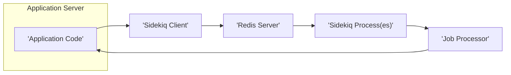
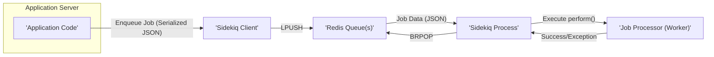

# Project Design Document: Sidekiq

**Version:** 1.1
**Date:** October 26, 2023
**Author:** AI Software Architect

## 1. Introduction

This document provides an enhanced architectural design of Sidekiq, a widely adopted background job processing library for Ruby applications. The primary goal is to offer a clear and detailed understanding of Sidekiq's components, data flow, and security implications, specifically for threat modeling purposes.

## 2. Project Overview

Sidekiq is a powerful and efficient background processing framework for Ruby. It leverages the speed and reliability of Redis as a message broker to manage and execute asynchronous tasks. By offloading time-consuming or resource-intensive operations to background jobs, Sidekiq significantly improves the responsiveness and overall performance of web applications and other systems.

## 3. Goals and Objectives

*   Provide a more refined and comprehensive understanding of Sidekiq's architecture and its constituent components.
*   Elaborate on the data flow within the Sidekiq system with greater clarity.
*   Sharpen the focus on key areas and interactions that are critical for security assessments and threat modeling exercises.
*   Serve as an improved foundational document for subsequent security analysis, design enhancements, and operational considerations.

## 4. Architectural Overview

Sidekiq employs a client-server architecture, with Redis acting as the central nervous system for job management and communication.

### 4.1. High-Level Architecture Diagram

### 4.2. Key Components

*   **Application Code:** The Ruby code within an application that needs to execute tasks asynchronously. This code utilizes the Sidekiq client to enqueue jobs.
*   **Sidekiq Client:** A Ruby library integrated into the application. It handles the serialization of job information and its transmission to Redis.
*   **Redis Server:** An in-memory data store that functions as the message queue and persistent store for Sidekiq jobs.
*   **Sidekiq Process(es):** Independent Ruby processes dedicated to running Sidekiq worker code. These processes connect to Redis to fetch and execute jobs.
*   **Job Processor (Worker):**  The specific Ruby code, defined by the application, that contains the logic for the background task. Sidekiq processes execute these workers.

## 5. Detailed Component Description

### 5.1. Application Code

*   **Role:**  Identifies and initiates tasks suitable for asynchronous execution.
*   **Functionality:**
    *   Defines Ruby classes that inherit from `Sidekiq::Worker` (or include the `Sidekiq::Job` module).
    *   Uses the Sidekiq client API (e.g., `MyWorker.perform_async(args)`) to enqueue jobs, specifying the worker class and its arguments.
    *   Interacts directly with the Sidekiq client library.

### 5.2. Sidekiq Client

*   **Role:**  Acts as the interface between the application and the Redis message broker.
*   **Functionality:**
    *   Serializes job data, including the worker class name, arguments, and options, into a format suitable for Redis storage (typically JSON).
    *   Pushes the serialized job data onto specific Redis lists, which represent the queues.
    *   Provides configuration options for specifying queue names, retry behavior, and other job-related settings.

### 5.3. Redis Server

*   **Role:**  Serves as the central message broker, job storage, and coordination point for Sidekiq.
*   **Functionality:**
    *   Stores enqueued jobs in Redis lists, with each list representing a specific queue.
    *   Provides atomic operations (`LPUSH`, `BRPOP`) for efficiently adding and retrieving jobs from queues.
    *   Supports job prioritization by allowing jobs to be enqueued to different queues with varying processing priorities.
    *   Persists job data to disk (depending on the configured Redis persistence strategy: RDB, AOF, or a combination) to ensure durability and prevent data loss.
    *   Can be configured with authentication (`requirepass`) and access control lists (ACLs) to restrict access.

### 5.4. Sidekiq Process(es)

*   **Role:**  The workhorses of the Sidekiq system, responsible for executing the background jobs.
*   **Functionality:**
    *   Connect to the configured Redis server.
    *   Monitor one or more specified Redis queues for new jobs.
    *   Atomically pull jobs from the queues using blocking pop operations (`BRPOP`).
    *   Deserialize the job data received from Redis.
    *   Instantiate the corresponding worker class.
    *   Execute the worker's `perform` method (or similar entry point) with the provided arguments.
    *   Implement a robust retry mechanism for handling job failures, including configurable retry attempts and backoff strategies.
    *   Utilize dead-letter queues (e.g., the `dead` queue) for jobs that fail after all retry attempts.
    *   Achieve concurrency through the use of multiple threads within a single process or by running multiple Sidekiq processes.
    *   Optionally include a web UI (Sidekiq UI) for monitoring queues, viewing job status, and managing workers.

### 5.5. Job Processor (Worker)

*   **Role:**  Contains the application-specific business logic that needs to be executed in the background.
*   **Functionality:**
    *   Implements the `perform` method (or a similar method designated for job execution).
    *   Receives arguments passed during the job enqueueing process.
    *   Performs the intended background task, which may involve interacting with databases, external APIs, file systems, or other services.
    *   Can raise exceptions to indicate job failure, triggering Sidekiq's retry mechanism.

## 6. Data Flow

The journey of a Sidekiq job involves the following steps:

1. **Job Enqueueing:**
    *   The application code determines that a specific task should be executed asynchronously.
    *   The application code utilizes the Sidekiq client to enqueue a job, specifying the target worker class and the necessary arguments.
    *   The Sidekiq client serializes the job data into a JSON format.
    *   The Sidekiq client uses the Redis `LPUSH` command to push the serialized job data onto the designated Redis queue.

2. **Job Processing:**
    *   One or more Sidekiq processes are running and have established connections to the Redis server.
    *   A Sidekiq process monitors one or more configured Redis queues for the arrival of new jobs.
    *   When a new job is available, a Sidekiq process uses the blocking `BRPOP` command to atomically retrieve the job data from the queue.
    *   The Sidekiq process deserializes the job data from the JSON format.
    *   The Sidekiq process instantiates an instance of the specified worker class.
    *   The Sidekiq process invokes the worker's `perform` method, passing the deserialized job arguments.

3. **Job Completion or Failure:**
    *   If the worker's `perform` method executes successfully without raising any exceptions, the job is considered complete.
    *   If the worker's `perform` method raises an exception, Sidekiq's retry mechanism is activated.
    *   Failed jobs are retried a configurable number of times, with potential delays between retries (exponential backoff).
    *   If a job continues to fail after all configured retry attempts, it is moved to the dead-letter queue (typically named `dead`).

### 6.1. Data Flow Diagram

## 7. Security Considerations

This section details critical security aspects relevant for threat modeling and risk assessment of Sidekiq deployments.

### 7.1. Redis Security

*   **Authentication:**  Enforce strong authentication using the `requirepass` directive in the Redis configuration to prevent unauthorized access to Redis data and commands.
*   **Access Control Lists (ACLs):** Utilize Redis ACLs for more granular control over user permissions, restricting access to specific commands and keys based on the connecting client.
*   **Network Security:** Restrict network access to the Redis port (default 6379) using firewalls or network segmentation to allow connections only from trusted hosts (application servers and Sidekiq processes).
*   **TLS/SSL Encryption:** For sensitive job data, configure Redis to use TLS/SSL encryption for all client-server communication to protect data in transit.
*   **Command Injection Prevention:**  Carefully sanitize any data used to dynamically construct Redis commands within the application or Sidekiq workers to prevent command injection vulnerabilities.

### 7.2. Web UI Security (Sidekiq UI)

*   **Authentication and Authorization:**  Implement robust authentication (e.g., HTTP Basic Auth, OAuth) and authorization mechanisms for the Sidekiq web UI to prevent unauthorized access to sensitive job information and administrative controls. Consider using Rack middleware for authentication.
*   **Cross-Site Scripting (XSS) Prevention:**  Ensure the Sidekiq web UI properly escapes user-generated content and output to prevent XSS attacks. Regularly update Sidekiq to benefit from security patches.
*   **Cross-Site Request Forgery (CSRF) Protection:** Implement CSRF protection measures (e.g., CSRF tokens) to prevent malicious actions from being performed through an authenticated user's session without their knowledge.
*   **Secure Configuration:**  Avoid exposing the Sidekiq web UI publicly if it's not necessary. If public access is required, implement strong security measures and consider using a reverse proxy with additional security features.

### 7.3. Job Data Security

*   **Sensitive Data Handling:** Avoid storing highly sensitive information directly within job arguments. Instead, consider using references (e.g., IDs) to securely stored data or encrypting sensitive data before enqueueing.
*   **Data Encryption at Rest:** If sensitive data must be included in job arguments, encrypt it before enqueueing and decrypt it within the worker process. Use established encryption libraries and best practices.
*   **Logging Practices:** Be cautious about what information is logged by Sidekiq and worker processes. Avoid logging sensitive data in plain text. Configure logging levels appropriately.

### 7.4. Worker Code Security

*   **Code Injection Vulnerabilities:**  Thoroughly validate and sanitize any external input or data used within worker code to prevent code injection attacks. Be particularly careful when constructing dynamic queries or commands.
*   **Dependency Management:**  Keep Sidekiq and all its dependencies up-to-date to patch known security vulnerabilities. Regularly audit dependencies using tools like `bundler-audit`.
*   **Resource Management:** Design workers to handle potential resource exhaustion scenarios gracefully (e.g., network timeouts, API rate limits) to prevent denial-of-service conditions. Implement appropriate timeouts and error handling.
*   **Secrets Management:** Avoid hardcoding sensitive credentials (API keys, database passwords) within worker code. Use secure secrets management solutions (e.g., environment variables, dedicated secrets management services).

### 7.5. Process Security

*   **Principle of Least Privilege:** Run Sidekiq processes with the minimum necessary user permissions to reduce the potential impact of a security breach.
*   **Resource Limits:** Configure appropriate resource limits (e.g., memory, CPU) for Sidekiq processes using operating system tools or containerization platforms to prevent resource exhaustion and potential denial-of-service.
*   **Security Auditing:** Implement security auditing and monitoring for Sidekiq processes to detect suspicious activity or potential security incidents.

## 8. Deployment Considerations

*   **Scaling Sidekiq Processes:** Scale the number of Sidekiq processes based on the anticipated job volume and processing demands. Consider using process managers like `systemd` or container orchestration tools like Kubernetes.
*   **Queue Management:**  Strategically configure queues to prioritize different types of jobs and manage workload effectively. Use queue prefixes or namespaces for better organization.
*   **Monitoring and Logging Infrastructure:** Implement comprehensive monitoring and logging for Sidekiq processes, Redis, and job execution to proactively identify and diagnose issues. Utilize tools like Prometheus, Grafana, and centralized logging systems.
*   **Redis High Availability:** For production environments, deploy Redis in a highly available configuration using Redis Sentinel or Redis Cluster to ensure resilience and prevent single points of failure.

## 9. Future Considerations

*   **End-to-End Job Data Encryption:** Explore and potentially implement mechanisms for end-to-end encryption of job data, ensuring confidentiality from the point of enqueueing to processing.
*   **Integration with Security Information and Event Management (SIEM) Systems:**  Investigate how Sidekiq's activity and logs can be integrated with SIEM systems for centralized security monitoring and incident response.
*   **Fine-grained Queue Access Control:**  Research and potentially implement more granular access control mechanisms for Redis queues, allowing for more precise control over which Sidekiq processes can access specific queues.

This revised document provides a more detailed and nuanced understanding of Sidekiq's architecture and security considerations. It serves as an enhanced foundation for conducting thorough threat modeling and implementing robust security measures for systems utilizing Sidekiq.