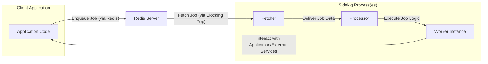

# Project Design Document: Sidekiq

**Version:** 1.1
**Date:** October 26, 2023
**Author:** AI Software Architect

## 1. Introduction

This document provides a comprehensive design overview of Sidekiq, a robust and efficient background job processing library for Ruby. It is specifically crafted to facilitate thorough threat modeling by clearly outlining Sidekiq's architecture, key components, and data flow. This document focuses on the core functionality of the open-source Sidekiq library. The information presented here is intended to provide security professionals with the necessary context to identify potential vulnerabilities and risks.

## 2. Goals

The primary objectives of this design document are to:

*   Provide a clear and concise description of Sidekiq's architecture and its constituent components.
*   Detail the flow of data throughout the Sidekiq system, from job creation to execution.
*   Offer sufficient technical detail to enable effective and targeted threat modeling activities.
*   Serve as a valuable reference for understanding Sidekiq's design and operational principles.

## 3. High-Level Architecture

Sidekiq employs a client-server architecture, leveraging the capabilities of Redis as a central message broker and persistent storage mechanism. Client applications enqueue background jobs by pushing them onto Redis queues. Independent Sidekiq processes (workers) then consume these jobs from the queues and execute the associated tasks.

## 4. Detailed Component Description

This section provides an in-depth look at the core components that constitute the Sidekiq system:

*   **Client Application:**
    *   Represents the Ruby application requiring asynchronous task execution.
    *   Utilizes the Sidekiq client API to create and enqueue jobs.
        *   Example: `MyWorker.perform_async(argument1, argument2)`
    *   Defines specific job classes encapsulating the logic to be executed in the background.
        *   These classes typically inherit from `Sidekiq::Worker`.
    *   Interacts with the Redis server to persist job data onto designated queues.

*   **Redis Server:**
    *   Serves as the central message broker and persistent data store for Sidekiq.
    *   Stores job data as serialized messages within Redis lists, representing individual queues.
        *   Job data includes worker class name, arguments, queue name, and other metadata.
    *   Leverages Redis's atomic operations to ensure reliable and consistent job processing.
    *   Can be implemented as a single Redis instance or a clustered setup for enhanced availability and scalability.
    *   Provides persistence mechanisms to prevent job loss in the event of Sidekiq process restarts or failures.

*   **Sidekiq Process (Worker):**
    *   A dedicated Ruby process, operating independently from the client application, responsible for processing background jobs.
    *   Multiple Sidekiq processes can run concurrently to achieve parallel job execution and increased throughput.
    *   Comprises the following key sub-components:
        *   **Fetcher:**
            *   The component responsible for retrieving jobs from the designated Redis queues.
            *   Monitors one or more specified queues for new jobs.
            *   Employs Redis's `BRPOP` (blocking pop) command, enabling efficient waiting for new jobs without excessive polling.
        *   **Processor:**
            *   Receives job data from the Fetcher.
            *   Deserializes the job data, typically from JSON format, back into Ruby objects.
            *   Identifies and instantiates the appropriate worker class based on the stored class name.
            *   Manages the execution of configured middleware, allowing for cross-cutting concerns to be applied to job processing.
        *   **Worker Instance:**
            *   An instance of the user-defined job class.
            *   Executes the primary job logic contained within the `perform` method (or a method with a similar designation).
            *   Any exceptions raised during the execution of the `perform` method are handled by Sidekiq's error handling mechanisms.

*   **Job:**
    *   Represents an individual unit of work intended for asynchronous processing.
    *   Defined as a standard Ruby class, typically inheriting from `Sidekiq::Worker`.
    *   Contains the specific logic to be executed in the background, encapsulated within a designated method (e.g., `perform`).
    *   Arguments passed to the job are serialized and stored within Redis alongside other job metadata.

*   **Web UI (Optional):**
    *   An optional web-based interface provided by Sidekiq, often integrated into a Rails application.
    *   Offers capabilities for monitoring queue status, job statistics, retry attempts, and failed jobs.
    *   Provides basic administrative functions such as pausing queues and terminating running jobs.
    *   Security measures, including authentication and authorization, are critical for protecting the Web UI from unauthorized access.

## 5. Data Flow

The following steps illustrate the typical data flow within the Sidekiq system:

1. **Job Enqueueing:**
    *   The Client Application invokes the Sidekiq client API, for example, by calling `MyWorker.perform_async(argument1, argument2)`.
    *   Sidekiq serializes the worker class name and provided arguments into a format suitable for storage (typically JSON).
    *   This serialized job data is then pushed onto the designated Redis queue (a Redis list) using Redis commands like `LPUSH`. The specific queue is often determined by the worker class or explicitly configured.

2. **Job Fetching:**
    *   A Sidekiq Process's Fetcher actively monitors one or more configured Redis queues for new jobs.
    *   The Fetcher utilizes Redis's `BRPOP` command, which allows it to block and wait efficiently until a new job becomes available in one of the monitored queues.
    *   Upon the arrival of a new job, the Fetcher retrieves the job data from the queue.

3. **Job Processing:**
    *   The Fetcher passes the raw job data retrieved from Redis to the Processor.
    *   The Processor deserializes the job data, converting it back into Ruby objects from its serialized form (e.g., JSON).
    *   Based on the stored class name, the Processor identifies the corresponding worker class.
    *   The Processor then instantiates an instance of the identified worker class.
    *   If configured, any associated middleware is executed before and after the invocation of the worker's `perform` method.

4. **Job Execution:**
    *   The Processor calls the `perform` method (or a similarly named method) on the instantiated worker object, passing the deserialized arguments as parameters.
    *   The worker instance executes the specific background task logic defined within its `perform` method. This may involve interactions with databases, external APIs, or other services.

5. **Job Completion or Failure:**
    *   If the `perform` method completes its execution without raising any exceptions, the job is considered successful and is removed from the Redis queue.
    *   If an exception occurs during the execution of the `perform` method:
        *   Sidekiq's error handling mechanism is triggered.
        *   The job may be pushed onto a retry queue (typically named `retry`) for subsequent attempts.
        *   After a configurable number of retry attempts, the job may be moved to a dead set (often named `dead`) for manual inspection or handling.
        *   Details about the error, including backtraces, are typically stored in Redis for monitoring and debugging purposes.

## 6. Security Considerations (Pre-Threat Modeling)

This section outlines key security considerations relevant to Sidekiq, providing a foundation for subsequent threat modeling activities:

*   **Redis Security:**
    *   **Access Control:** Restricting network access to the Redis server to only authorized hosts is crucial. Employing firewalls and network segmentation can help achieve this.
    *   **Authentication:** Enabling Redis authentication using the `requirepass` directive prevents unauthorized clients from interacting with the Redis instance.
    *   **Encryption:** Utilizing TLS/SSL encryption for communication between Sidekiq processes and the Redis server protects sensitive job data in transit from eavesdropping.
    *   **Configuration Hardening:** Reviewing and hardening the Redis configuration file (`redis.conf`) to disable unnecessary features and minimize the attack surface is recommended.

*   **Data Handling:**
    *   **Serialization/Deserialization Vulnerabilities:** Be aware of potential vulnerabilities arising from the deserialization of untrusted data. Ensure that the data being deserialized originates from a trusted source and is validated appropriately.
    *   **Job Argument Injection:** Treat job arguments as potentially malicious input. Implement robust input validation and sanitization within worker code to prevent injection attacks (e.g., SQL injection, command injection).
    *   **Sensitive Data Handling:** Avoid storing sensitive information directly within job arguments if possible. Consider using secure storage mechanisms and passing only references or identifiers.

*   **Web UI Security:**
    *   **Authentication and Authorization:** Implement strong authentication mechanisms to verify the identity of users accessing the Sidekiq Web UI. Employ role-based access control to restrict access to sensitive functionalities based on user roles.
    *   **Protection Against Common Web Vulnerabilities:** Implement standard security measures to protect the Web UI from common web vulnerabilities such as Cross-Site Scripting (XSS), Cross-Site Request Forgery (CSRF), and clickjacking.

*   **Code Security:**
    *   **Dependency Management:** Regularly audit and update Sidekiq and its dependencies to patch known security vulnerabilities. Utilize dependency management tools to track and manage dependencies effectively.
    *   **Avoid Dynamic Code Execution:** Refrain from using dynamic code execution constructs (e.g., `eval`) within worker code, as this can introduce significant security risks.
    *   **Secure Third-Party Integrations:** Exercise caution when integrating with third-party services within worker code. Ensure that interactions with external services are secure and follow best practices.

*   **Process Security:**
    *   **Principle of Least Privilege:** Run Sidekiq processes with the minimum necessary privileges to reduce the potential impact of a security breach.
    *   **Resource Monitoring:** Monitor Sidekiq process resource usage (CPU, memory) to detect potential denial-of-service attacks or resource exhaustion.

## 7. Open Questions and Future Considerations

*   **Scalability Strategies:**  What are the recommended strategies for scaling Sidekiq horizontally to handle increasing job volumes? How does scaling impact Redis performance and configuration?
*   **Advanced Monitoring and Alerting:** What advanced monitoring tools and techniques can be employed to gain deeper insights into Sidekiq's performance and identify potential issues proactively? How can alerts be configured for critical events?
*   **Custom Middleware Security Implications:** What are the security considerations when developing and deploying custom Sidekiq middleware? How can middleware be designed to avoid introducing vulnerabilities?
*   **Job Prioritization and Throttling Mechanisms:** How can job prioritization be implemented in Sidekiq to ensure critical jobs are processed promptly? What mechanisms are available for throttling job processing to prevent resource overload?
*   **Integration with Security Auditing Tools:** How can Sidekiq be integrated with security auditing tools to track job execution, identify suspicious activity, and maintain an audit trail?

This improved design document provides a more detailed and nuanced understanding of Sidekiq's architecture and data flow, specifically tailored for security professionals undertaking threat modeling. The enhanced explanations and expanded security considerations aim to facilitate a more comprehensive and effective security analysis.