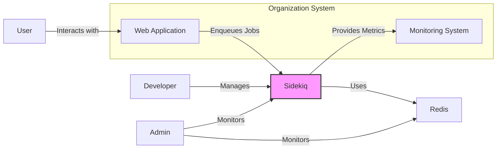
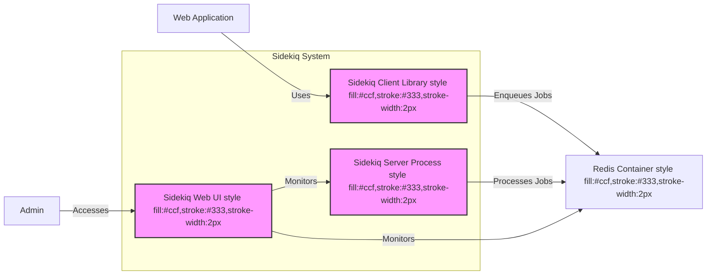
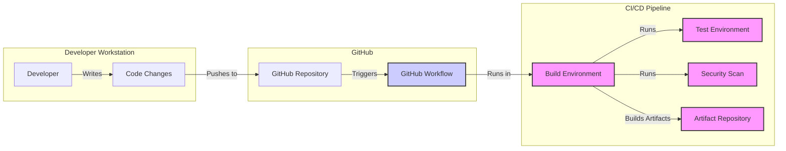

# BUSINESS POSTURE

Sidekiq is a background job processing library for Ruby. It is designed to perform asynchronous tasks outside of the main request-response cycle of web applications. By offloading tasks to Sidekiq, web applications can remain responsive and handle user requests quickly, while background tasks are processed in the background.

Business priorities and goals that Sidekiq addresses:
- Improve web application responsiveness and user experience by offloading time-consuming tasks.
- Enhance application scalability by processing background jobs asynchronously and independently of web servers.
- Increase application reliability by ensuring background tasks are processed even if web servers are busy or unavailable.
- Simplify development of applications requiring background processing capabilities.

Most important business risks that need to be addressed:
- Job processing failures: If background jobs fail to process correctly, it can lead to data inconsistencies, missed business logic execution, and impact business operations.
- Data loss: If jobs are not reliably enqueued or processed, data associated with those jobs might be lost, leading to incomplete transactions or business process failures.
- Security vulnerabilities in job processing: If job processing logic is vulnerable, it can be exploited to gain unauthorized access, manipulate data, or disrupt application functionality.
- Operational complexity: Managing and monitoring background job processing infrastructure can add operational complexity.

# SECURITY POSTURE

Existing security controls:
- security control: Open source code - publicly available for review and scrutiny. Implemented: GitHub repository.
- security control: Community contributions - benefits from community security reviews and patches. Implemented: GitHub community.
- security control: Redis security - relies on Redis security features for data storage and access control. Implemented: Redis configuration and deployment.
- security control: Standard Ruby security practices - follows general secure coding practices for Ruby applications. Implemented: Codebase.
- security control: Dependency management - uses Bundler for managing dependencies and potentially addressing known vulnerabilities in dependencies. Implemented: Gemfile and Bundler.

Accepted risks:
- accepted risk: Reliance on Redis security - security posture is dependent on the security configuration and management of the Redis instance.
- accepted risk: Open source vulnerabilities - potential for undiscovered vulnerabilities in the codebase or dependencies.
- accepted risk: Misconfiguration - risk of misconfiguring Sidekiq or Redis leading to security issues.

Recommended security controls:
- security control: Regular security audits - conduct periodic security audits of the Sidekiq codebase and its dependencies.
- security control: Automated security scanning - integrate automated security scanning tools (SAST, DAST, dependency scanning) into the development and CI/CD pipeline.
- security control: Secure job serialization - ensure job arguments are serialized and deserialized securely to prevent injection attacks.
- security control: Rate limiting and throttling - implement rate limiting and throttling mechanisms for job processing to prevent abuse and denial-of-service attacks.
- security control: Monitoring and alerting - implement comprehensive monitoring and alerting for Sidekiq and Redis to detect and respond to security incidents.

Security requirements:
- Authentication:
    - Requirement: Access to the Sidekiq web UI should be authenticated to prevent unauthorized access to job monitoring and management features.
    - Requirement: If Sidekiq processes sensitive data, consider authentication and authorization mechanisms for job enqueueing to ensure only authorized applications can submit jobs.
- Authorization:
    - Requirement: Authorization should be implemented in the application code to control which users or services can enqueue specific types of jobs.
    - Requirement: Access to sensitive job data within Sidekiq processing logic should be authorized based on application-specific roles and permissions.
- Input validation:
    - Requirement: Job arguments should be validated to prevent injection attacks and ensure data integrity.
    - Requirement: Input validation should be performed both at the job enqueueing stage and within the job processing logic.
- Cryptography:
    - Requirement: Sensitive data in job arguments should be encrypted at rest in Redis and during transit if necessary.
    - Requirement: Use strong cryptographic algorithms and key management practices for encryption.

# DESIGN

## C4 CONTEXT



Context Diagram Elements:

- Name: Web Application
    - Type: Software System
    - Description: The main web application that requires background job processing. It interacts with users and enqueues jobs for Sidekiq to process.
    - Responsibilities: Handling user requests, executing business logic, enqueuing background jobs.
    - Security controls: Web application security controls (authentication, authorization, input validation, output encoding, etc.).

- Name: Monitoring System
    - Type: Software System
    - Description: A system used to monitor the health and performance of Sidekiq and the overall application. Examples include Prometheus, Grafana, Datadog.
    - Responsibilities: Collecting metrics from Sidekiq, visualizing performance data, alerting on anomalies.
    - Security controls: Access control to monitoring dashboards, secure data transmission.

- Name: Sidekiq
    - Type: Software System
    - Description: The background job processing system. It receives jobs from web applications, processes them asynchronously, and uses Redis as a job queue and data store.
    - Responsibilities: Receiving and processing background jobs, managing job queues, providing job status and metrics.
    - Security controls: Authentication for web UI, secure job serialization, input validation of job arguments, rate limiting.

- Name: Redis
    - Type: Software System
    - Description: An in-memory data store used by Sidekiq for job queuing, persistence, and coordination.
    - Responsibilities: Storing job data, providing fast data access for Sidekiq, ensuring data persistence.
    - Security controls: Access control lists (ACLs), password protection, network security (firewalls), data encryption at rest and in transit.

- Name: User
    - Type: Person
    - Description: End-users who interact with the Web Application.
    - Responsibilities: Using the web application to perform actions that may trigger background jobs.
    - Security controls: Authentication to the Web Application.

- Name: Developer
    - Type: Person
    - Description: Developers who build and maintain the Web Application and Sidekiq integration.
    - Responsibilities: Developing and deploying the Web Application, configuring Sidekiq, writing background jobs.
    - Security controls: Access to code repositories, development environments, and deployment pipelines.

- Name: Admin
    - Type: Person
    - Description: System administrators or operations team responsible for managing and monitoring Sidekiq and Redis in production.
    - Responsibilities: Deploying and configuring Sidekiq and Redis, monitoring system health, troubleshooting issues.
    - Security controls: Access to server infrastructure, monitoring systems, and configuration management tools.

## C4 CONTAINER



Container Diagram Elements:

- Name: Sidekiq Server Process
    - Type: Container - Process
    - Description: The core Sidekiq process that runs in the background and processes jobs from Redis queues. It is a Ruby process.
    - Responsibilities: Polling Redis for new jobs, executing job processing logic, managing job queues, handling job retries and failures.
    - Security controls: Process isolation, resource limits, logging and monitoring, secure job processing logic, rate limiting.

- Name: Sidekiq Client Library
    - Type: Container - Library
    - Description: A Ruby library integrated into the Web Application to enqueue jobs to Sidekiq.
    - Responsibilities: Providing API for enqueuing jobs, serializing job arguments, communicating with Redis to push jobs onto queues.
    - Security controls: Input validation of job arguments before enqueueing, secure communication with Redis.

- Name: Sidekiq Web UI
    - Type: Container - Web Application
    - Description: A web-based user interface for monitoring Sidekiq queues, jobs, workers, and system metrics.
    - Responsibilities: Providing a dashboard for monitoring Sidekiq, allowing job inspection and management (e.g., retries, deletions).
    - Security controls: Authentication and authorization to access the UI, secure session management, protection against common web vulnerabilities (CSRF, XSS).

- Name: Redis Container
    - Type: Container - Database
    - Description: A Redis instance used by Sidekiq for job queuing and data persistence.
    - Responsibilities: Storing job queues, persisting job data, providing fast data access to Sidekiq Server Process.
    - Security controls: Network security (firewalls), access control lists (ACLs), password protection, data encryption at rest and in transit, regular security updates.

## DEPLOYMENT

Deployment Solution: Cloud-based Containerized Deployment (using Docker and Kubernetes)

```mermaid
flowchart LR
    subgraph "Kubernetes Cluster"
        subgraph "Nodes"
            subgraph "Node 1"
                deployment1["Sidekiq Server Pod"]
                container11["Sidekiq Server Container"]
                container12["Redis Client Container"]
            end
            subgraph "Node 2"
                deployment2["Sidekiq Server Pod"]
                container21["Sidekiq Server Container"]
                container22["Redis Client Container"]
            end
            subgraph "Node 3"
                deployment3["Redis Pod"]
                container31["Redis Container"]
            end
        end
        service["Load Balancer Service"]
    end
    cloud["Cloud Provider Infrastructure"]

    deployment1 -- Contains --> container11
    deployment1 -- Contains --> container12
    deployment2 -- Contains --> container21
    deployment2 -- Contains --> container22
    deployment3 -- Contains --> container31
    service -- Routes Traffic to --> deployment3
    deployment1 -- Connects to --> deployment3
    deployment2 -- Connects to --> deployment3
    container12 -- Connects to --> container31
    container22 -- Connects to --> container31
    deployment1 -- Deployed on --> "Node 1"
    deployment2 -- Deployed on --> "Node 2"
    deployment3 -- Deployed on --> "Node 3"

    subgraph "External Network"
        box1["Web Application"]
        box2["Monitoring System"]
        Admin
    end

    box1 -- Connects to --> deployment1 & deployment2
    box2 -- Connects to --> deployment1 & deployment2 & deployment3
    Admin -- Accesses --> service
    Admin -- Accesses --> deployment1 & deployment2 & deployment3 via Kubernetes API
    cloud -- Provides Infrastructure for --> "Kubernetes Cluster"

    style deployment1 fill:#ccf,stroke:#333,stroke-width:2px
    style deployment2 fill:#ccf,stroke:#333,stroke-width:2px
    style deployment3 fill:#ccf,stroke:#333,stroke-width:2px
    style container11 fill:#f9f,stroke:#333,stroke-width:2px
    style container12 fill:#f9f,stroke:#333,stroke-width:2px
    style container21 fill:#f9f,stroke:#333,stroke-width:2px
    style container22 fill:#f9f,stroke:#333,stroke-width:2px
    style container31 fill:#f9f,stroke:#333,stroke-width:2px
    style service fill:#ccf,stroke:#333,stroke-width:2px
```

Deployment Diagram Elements:

- Name: Kubernetes Cluster
    - Type: Environment - Container Orchestration Platform
    - Description: A Kubernetes cluster deployed on cloud provider infrastructure, used to orchestrate and manage Sidekiq and Redis containers.
    - Responsibilities: Container orchestration, scaling, health management, service discovery, resource management.
    - Security controls: Kubernetes RBAC, network policies, pod security policies, secrets management, security audits of Kubernetes configuration.

- Name: Node 1, Node 2, Node 3
    - Type: Infrastructure - Virtual Machine/Physical Server
    - Description: Worker nodes in the Kubernetes cluster, providing compute resources for running containers.
    - Responsibilities: Running container workloads, providing compute, memory, and network resources.
    - Security controls: Operating system hardening, security patching, access control, monitoring, intrusion detection.

- Name: Sidekiq Server Pod (Deployment 1, Deployment 2)
    - Type: Deployment - Kubernetes Deployment
    - Description: Kubernetes Deployments managing Sidekiq Server Pods, ensuring desired number of replicas and rolling updates.
    - Responsibilities: Managing lifecycle of Sidekiq Server Pods, ensuring high availability and scalability of Sidekiq processing.
    - Security controls: Pod security context, resource limits, network policies, security monitoring.

- Name: Sidekiq Server Container (Container 11, Container 21)
    - Type: Container - Docker Container
    - Description: Docker container running the Sidekiq Server Process.
    - Responsibilities: Processing background jobs, connecting to Redis, providing metrics.
    - Security controls: Container image security scanning, least privilege user, resource limits, logging.

- Name: Redis Client Container (Container 12, Container 22)
    - Type: Container - Docker Container (Sidecar)
    - Description:  A lightweight container within the Sidekiq Server Pod that provides Redis client utilities or acts as a proxy for Redis connections. (Optional, depending on specific setup).
    - Responsibilities: Facilitating communication between Sidekiq Server Container and Redis Container, potentially handling connection pooling or security.
    - Security controls: Container image security scanning, least privilege user, secure communication with Redis.

- Name: Redis Pod (Deployment 3)
    - Type: Deployment - Kubernetes Pod
    - Description: Kubernetes Pod running the Redis container.
    - Responsibilities: Providing Redis service for Sidekiq, storing job queues and data.
    - Security controls: Pod security context, resource limits, network policies, persistent volume security, Redis security configuration.

- Name: Redis Container (Container 31)
    - Type: Container - Docker Container
    - Description: Docker container running the Redis server.
    - Responsibilities: Data storage, job queuing, providing Redis API.
    - Security controls: Redis security configuration (ACLs, password), container image security scanning, persistent volume security, network policies.

- Name: Load Balancer Service
    - Type: Service - Kubernetes Service
    - Description: Kubernetes Load Balancer Service to expose the Redis service externally if needed (e.g., for monitoring or external access - generally not recommended for direct external access to Redis in production). In this diagram, it's shown for potential admin access for monitoring, but direct external access to Redis should be carefully considered.
    - Responsibilities: Load balancing traffic to Redis Pods, providing a stable endpoint for Redis access.
    - Security controls: Network security (firewalls), access control to the Load Balancer service, TLS termination if applicable.

## BUILD



Build Process Description:

1. Developer writes code changes on their workstation.
2. Developer pushes code changes to the GitHub Repository.
3. GitHub Repository triggers a GitHub Workflow (CI/CD pipeline).
4. GitHub Workflow starts a Build Environment.
5. Build Environment performs the following steps:
    - Fetches code from the GitHub Repository.
    - Builds the project artifacts (e.g., gems, Docker images).
    - Runs automated tests (unit tests, integration tests).
    - Performs security scans (SAST, dependency scanning, container image scanning).
    - Publishes build artifacts to an Artifact Repository (e.g., GitHub Packages, Gemfury, Docker Hub).

Build Process Security Controls:

- security control: Secure development environment - developer workstations should be secured and regularly updated. Implemented: Developer workstation security policies.
- security control: Code review - code changes should be reviewed by other developers before being merged into the main branch. Implemented: GitHub Pull Request process.
- security control: Automated testing - automated tests should be run in the CI/CD pipeline to ensure code quality and prevent regressions. Implemented: GitHub Workflow, Test Environment.
- security control: Static Application Security Testing (SAST) - SAST tools should be integrated into the CI/CD pipeline to scan the codebase for potential vulnerabilities. Implemented: Security Scan step in GitHub Workflow.
- security control: Dependency scanning - dependency scanning tools should be used to identify known vulnerabilities in project dependencies. Implemented: Security Scan step in GitHub Workflow.
- security control: Container image scanning - if Docker images are built, they should be scanned for vulnerabilities. Implemented: Security Scan step in GitHub Workflow.
- security control: Secure artifact repository - the artifact repository should be secured to prevent unauthorized access and tampering. Implemented: Artifact Repository access controls.
- security control: Build environment security - the build environment should be hardened and regularly updated. Implemented: Build Environment configuration and maintenance.
- security control: Supply chain security - minimize dependencies, use trusted sources for dependencies, and verify checksums of downloaded dependencies. Implemented: Dependency management practices, Gemfile.lock verification.

# RISK ASSESSMENT

Critical business processes protected by Sidekiq:
- Background processing of user actions (e.g., sending emails, processing payments, updating data).
- Scheduled tasks and maintenance operations.
- Asynchronous communication with external systems.
- Data synchronization and batch processing.

Data being protected and sensitivity:
- Job arguments: Can contain sensitive data depending on the application, such as user IDs, email addresses, payment information, API keys, and other business-critical data. Sensitivity varies depending on the data type and application context.
- Job metadata: Includes job status, queue names, timestamps, and other operational data. Less sensitive than job arguments but can still reveal information about application behavior.
- Redis data: All job data and metadata stored in Redis. Sensitivity is the same as job arguments.

Data sensitivity levels:
- High: Personally Identifiable Information (PII), financial data, API keys, secrets. Requires encryption at rest and in transit, strict access control, and audit logging.
- Medium: Business-critical data, application configuration, operational data. Requires access control and monitoring.
- Low: Publicly available data, non-sensitive operational logs. Requires basic security measures.

# QUESTIONS & ASSUMPTIONS

Questions:
- What is the sensitivity of data processed by Sidekiq in the target application?
- What are the specific compliance requirements for the target application (e.g., GDPR, PCI DSS, HIPAA)?
- What is the organization's risk appetite regarding security vulnerabilities in open-source components?
- What existing security monitoring and incident response capabilities are in place?
- What are the performance and scalability requirements for Sidekiq in the target environment?

Assumptions:
- Sidekiq is used in a web application to process background jobs.
- Redis is used as the data store for Sidekiq.
- Security is a concern for the project, and a threat model will be created based on this design document.
- The target deployment environment is a cloud-based infrastructure using containers and Kubernetes.
- Standard security best practices for open-source projects and web applications are applicable.
- The organization has a development team familiar with Ruby, Redis, and cloud deployments.