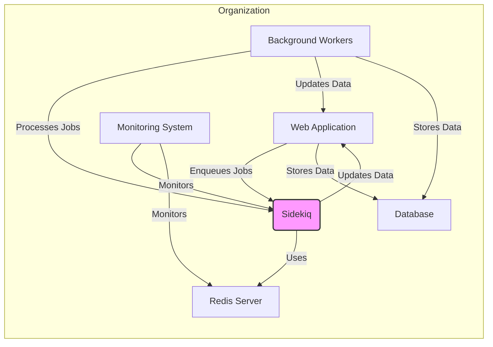
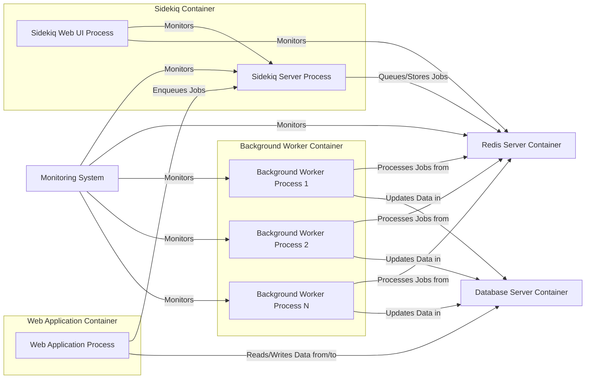
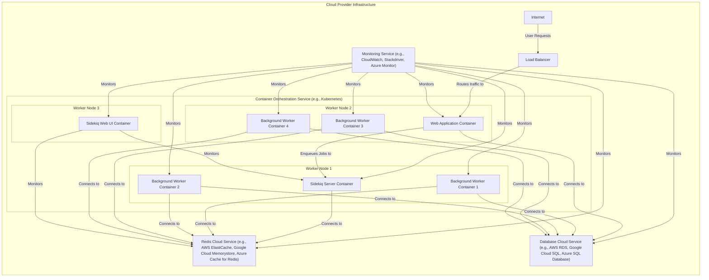
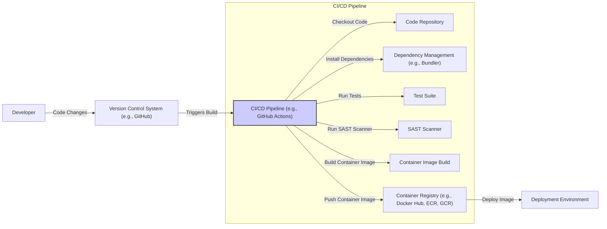

# BUSINESS POSTURE

Sidekiq is a background job processing library for Ruby. It is designed to perform asynchronous tasks outside of the main request-response cycle of web applications.

*   Business Priorities and Goals:
    *   Improve web application performance by offloading time-consuming tasks to the background.
    *   Increase application reliability by ensuring tasks are processed even if the main application process fails.
    *   Enhance application scalability by distributing workload across multiple background job processors.
    *   Enable asynchronous processing for tasks such as email sending, data processing, and integrations with external services.

*   Business Risks:
    *   Data loss or corruption if background jobs are not processed reliably or are lost due to system failures.
    *   Service disruption if the background job processing system becomes unavailable or overloaded.
    *   Performance degradation if background jobs consume excessive resources or are not processed efficiently.
    *   Security breaches if background jobs handle sensitive data or perform privileged operations without proper authorization and security controls.
    *   Operational complexity in managing and monitoring a distributed background job processing system.

# SECURITY POSTURE

*   Existing Security Controls:
    *   security control: Redis Authentication - Sidekiq relies on Redis for job queuing and storage. Redis authentication mechanisms can be configured to control access to the Redis server. Described in Redis documentation.
    *   security control: Network Segmentation - Deploying Redis and Sidekiq within a private network can limit exposure to external threats. Typically implemented at the infrastructure level.
    *   security control: Code Review - Standard software development practice to identify potential security vulnerabilities in the codebase. Implemented as part of the software development lifecycle.
    *   security control: Input Validation - Application code that enqueues jobs is responsible for validating job arguments. Implemented in application code.
    *   security control: Dependency Management - Using Bundler to manage Ruby dependencies helps ensure consistent and potentially more secure dependency versions. Implemented via Bundler in Ruby projects.

*   Accepted Risks:
    *   accepted risk: Lack of Built-in Job Encryption - Sidekiq does not natively encrypt job data in Redis. Sensitive data in job arguments might be stored in plaintext in Redis.
    *   accepted risk: Reliance on Application-Level Authorization - Sidekiq itself does not enforce job authorization. Authorization logic must be implemented within the application code that processes jobs.
    *   accepted risk: Potential for Injection Attacks in Job Arguments - If job arguments are not properly validated and sanitized by the application, they could be vulnerable to injection attacks when processed by job handlers.
    *   accepted risk: Denial of Service through Job Queue Flooding - An attacker or misconfigured application could flood the job queue, leading to resource exhaustion and denial of service.

*   Recommended Security Controls:
    *   security control: Job Data Encryption - Implement encryption for sensitive job data before enqueuing and decryption when processing jobs. This can be achieved using application-level encryption libraries.
    *   security control: Job Authorization - Implement a robust authorization mechanism to control which jobs can be enqueued and processed, based on user roles or permissions.
    *   security control: Rate Limiting and Queue Monitoring - Implement rate limiting on job enqueueing and monitor job queue depth to detect and mitigate potential queue flooding attacks.
    *   security control: Secure Logging and Auditing - Implement secure logging of job processing activities, including enqueueing, processing, failures, and retries, for security monitoring and auditing.
    *   security control: Vulnerability Scanning - Regularly scan dependencies and application code for known vulnerabilities using SAST and DAST tools. Integrate into CI/CD pipeline.

*   Security Requirements:
    *   Authentication:
        *   Requirement: Access to the Redis server used by Sidekiq MUST be restricted to authorized Sidekiq processes and application components.
        *   Requirement: If Sidekiq Web UI is exposed, access MUST be authenticated and authorized to prevent unauthorized monitoring and control.
    *   Authorization:
        *   Requirement: Application MUST implement authorization checks to ensure that only authorized users or processes can enqueue specific types of jobs.
        *   Requirement: If sensitive operations are performed within jobs, application MUST implement authorization checks within job handlers to prevent unauthorized actions.
    *   Input Validation:
        *   Requirement: Application MUST validate and sanitize job arguments before enqueuing jobs to prevent injection attacks and data integrity issues.
        *   Requirement: Job handlers MUST validate and sanitize job arguments received from Sidekiq before processing them.
    *   Cryptography:
        *   Requirement: Sensitive data within job arguments MUST be encrypted at rest in Redis and in transit if necessary.
        *   Requirement: Cryptographic keys used for job data encryption MUST be securely managed and protected.

# DESIGN

## C4 CONTEXT

*   Context Diagram Elements:
    *   Element:
        *   Name: Web Application
        *   Type: Software System
        *   Description: The main web application that utilizes Sidekiq for background job processing. This could be a Ruby on Rails application or any other web application capable of interacting with Sidekiq.
        *   Responsibilities:
            *   Handles user requests and web application logic.
            *   Enqueues background jobs to Sidekiq for asynchronous processing.
            *   Retrieves and displays data updated by background jobs.
        *   Security controls:
            *   security control: Web Application Firewall (WAF) - To protect against common web application attacks.
            *   security control: Authentication and Authorization - To control user access to the web application and its functionalities.
            *   security control: Input Validation - To prevent injection attacks and ensure data integrity.
    *   Element:
        *   Name: Sidekiq
        *   Type: Software System
        *   Description: The Sidekiq background job processing system. It consists of Sidekiq server processes and the Redis server.
        *   Responsibilities:
            *   Receives jobs from the Web Application.
            *   Queues jobs in Redis.
            *   Distributes jobs to Background Workers for processing.
            *   Provides a web UI for monitoring job queues and workers (optional).
        *   Security controls:
            *   security control: Redis Authentication - To control access to the Redis server.
            *   security control: Network Segmentation - To isolate Redis and Sidekiq within a private network.
            *   security control: Rate Limiting - To prevent job queue flooding.
    *   Element:
        *   Name: Background Workers
        *   Type: Software System
        *   Description:  Processes that execute the background jobs enqueued in Sidekiq. These are typically Ruby processes running the Sidekiq client library.
        *   Responsibilities:
            *   Fetch jobs from Sidekiq/Redis.
            *   Execute job logic as defined in the application code.
            *   Update data in the Database or Web Application based on job results.
            *   Handle job failures and retries.
        *   Security controls:
            *   security control: Process Isolation - To limit the impact of vulnerabilities in worker processes.
            *   security control: Resource Limits - To prevent resource exhaustion by worker processes.
            *   security control: Secure Coding Practices - To minimize vulnerabilities in job handler code.
    *   Element:
        *   Name: Redis Server
        *   Type: External System
        *   Description:  An in-memory data store used by Sidekiq for job queuing, storage, and coordination.
        *   Responsibilities:
            *   Store job queues.
            *   Provide message broker functionality for Sidekiq.
            *   Persist job data (optional, depending on Redis configuration).
        *   Security controls:
            *   security control: Redis Authentication - To control access to Redis.
            *   security control: Network Segmentation - To isolate Redis within a private network.
            *   security control: Access Control Lists (ACLs) - To restrict Redis commands and data access based on user roles (if Redis ACLs are used).
    *   Element:
        *   Name: Database
        *   Type: External System
        *   Description:  The primary database used by the Web Application to store application data. Background jobs may interact with this database to read or update data.
        *   Responsibilities:
            *   Persist application data.
            *   Provide data access to the Web Application and Background Workers.
        *   Security controls:
            *   security control: Database Authentication and Authorization - To control access to the database.
            *   security control: Encryption at Rest - To protect sensitive data stored in the database.
            *   security control: Database Auditing - To monitor database access and activities.
    *   Element:
        *   Name: Monitoring System
        *   Type: External System
        *   Description:  A system used to monitor the health and performance of Sidekiq, Redis, and Background Workers. Examples include Prometheus, Grafana, or cloud-provider monitoring services.
        *   Responsibilities:
            *   Collect metrics from Sidekiq, Redis, and Background Workers.
            *   Provide dashboards and alerts for monitoring system health and performance.
            *   Enable proactive identification and resolution of issues.
        *   Security controls:
            *   security control: Authentication and Authorization - To control access to monitoring data and dashboards.
            *   security control: Secure Communication - To protect monitoring data in transit.

## C4 CONTAINER

*   Container Diagram Elements:
    *   Element:
        *   Name: Web Application Process
        *   Type: Container - Process
        *   Description: The running process of the web application. It includes the application code, web server, and necessary libraries.
        *   Responsibilities:
            *   Handles HTTP requests.
            *   Executes web application logic.
            *   Enqueues jobs to Sidekiq using the Sidekiq client library.
        *   Security controls:
            *   security control: Web Application Firewall (WAF) - Protects against web application attacks.
            *   security control: Input Validation - Validates user inputs to prevent injection attacks.
            *   security control: Output Encoding - Encodes outputs to prevent cross-site scripting (XSS) attacks.
    *   Element:
        *   Name: Sidekiq Server Process
        *   Type: Container - Process
        *   Description: The main Sidekiq server process responsible for fetching jobs from Redis and dispatching them to worker processes.
        *   Responsibilities:
            *   Connects to Redis.
            *   Fetches jobs from Redis queues.
            *   Manages worker processes.
            *   Handles job retries and dead letter queue.
        *   Security controls:
            *   security control: Redis Authentication - Authenticates to Redis server.
            *   security control: Process User - Runs under a non-privileged user account.
            *   security control: Resource Limits - Limits resource consumption to prevent denial of service.
    *   Element:
        *   Name: Sidekiq Web UI Process
        *   Type: Container - Process
        *   Description: An optional web interface provided by Sidekiq for monitoring job queues, workers, and statistics.
        *   Responsibilities:
            *   Provides a web dashboard for monitoring Sidekiq.
            *   Allows for basic job management (e.g., retries, deletions).
        *   Security controls:
            *   security control: Authentication - Requires authentication to access the web UI.
            *   security control: Authorization - Restricts access to administrative functions based on user roles.
            *   security control: HTTPS - Encrypts communication between the web browser and the web UI.
    *   Element:
        *   Name: Background Worker Process 1, 2, ..., N
        *   Type: Container - Process
        *   Description: Multiple processes that execute the actual job logic. These processes are managed by the Sidekiq server process.
        *   Responsibilities:
            *   Fetch jobs from Sidekiq server.
            *   Execute job handler code.
            *   Interact with the database and other services.
            *   Report job status and results.
        *   Security controls:
            *   security control: Process Isolation - Isolates worker processes from each other.
            *   security control: Resource Limits - Limits resource consumption of each worker process.
            *   security control: Secure Coding Practices - Ensures job handler code is written securely.
    *   Element:
        *   Name: Redis Server Container
        *   Type: Container - Database
        *   Description: A containerized instance of the Redis server.
        *   Responsibilities:
            *   Stores Sidekiq job queues and data.
            *   Provides fast data access for Sidekiq.
        *   Security controls:
            *   security control: Redis Authentication - Requires authentication for connections.
            *   security control: Network Policies - Restricts network access to the Redis container.
            *   security control: Data Persistence - Configured for data persistence based on requirements.
    *   Element:
        *   Name: Database Server Container
        *   Type: Container - Database
        *   Description: A containerized instance of the application database server (e.g., PostgreSQL, MySQL).
        *   Responsibilities:
            *   Stores persistent application data.
            *   Provides data access to the Web Application and Background Workers.
        *   Security controls:
            *   security control: Database Authentication and Authorization - Controls access to the database.
            *   security control: Encryption at Rest - Encrypts data stored in the database.
            *   security control: Network Policies - Restricts network access to the database container.
    *   Element:
        *   Name: Monitoring System
        *   Type: Container - External System
        *   Description:  An external monitoring system used to observe the health and performance of the containers.
        *   Responsibilities:
            *   Collects logs and metrics from all containers.
            *   Provides dashboards and alerts.
        *   Security controls:
            *   security control: Secure Access - Access to monitoring system is secured with authentication and authorization.
            *   security control: Data Encryption in Transit - Communication with monitoring agents is encrypted.

## DEPLOYMENT

Deployment Scenario: Cloud-based Containerized Deployment (e.g., AWS ECS, Google Kubernetes Engine, Azure Kubernetes Service)

*   Deployment Diagram Elements:
    *   Element:
        *   Name: Container Orchestration Service (e.g., Kubernetes)
        *   Type: Infrastructure - Platform as a Service (PaaS)
        *   Description: A managed container orchestration platform that automates deployment, scaling, and management of containerized applications.
        *   Responsibilities:
            *   Orchestrates and manages containers across worker nodes.
            *   Provides service discovery and load balancing within the cluster.
            *   Handles container scaling and health checks.
        *   Security controls:
            *   security control: Role-Based Access Control (RBAC) - Controls access to the Kubernetes API and resources.
            *   security control: Network Policies - Enforces network segmentation within the cluster.
            *   security control: Secrets Management - Securely manages secrets and credentials used by containers.
    *   Element:
        *   Name: Worker Node 1, 2, 3
        *   Type: Infrastructure - Compute Instance (Virtual Machine or Physical Server)
        *   Description: Virtual machines or physical servers that run container workloads within the container orchestration service.
        *   Responsibilities:
            *   Provides compute resources for running containers.
            *   Runs the container runtime (e.g., Docker, containerd).
        *   Security controls:
            *   security control: Operating System Hardening - Hardened operating system configuration.
            *   security control: Security Patching - Regular patching of the operating system and container runtime.
            *   security control: Host-Based Intrusion Detection System (HIDS) - Monitors host system for malicious activity.
    *   Element:
        *   Name: Sidekiq Server Container, Background Worker Container 1, 2, 3, 4, Sidekiq Web UI Container, Web Application Container
        *   Type: Software - Container Instance
        *   Description: Instances of the application containers deployed within the container orchestration service.
        *   Responsibilities: (Same as described in Container Diagram)
        *   Security controls: (Same as described in Container Diagram)
    *   Element:
        *   Name: Redis Cloud Service (e.g., AWS ElastiCache)
        *   Type: Infrastructure - Managed Database Service
        *   Description: A managed Redis service provided by the cloud provider, offering scalability, reliability, and security.
        *   Responsibilities: (Same as described in Container Diagram for Redis Server)
        *   Security controls:
            *   security control: Managed Security - Cloud provider manages security aspects of the Redis service.
            *   security control: Encryption at Rest and in Transit - Data encryption provided by the cloud service.
            *   security control: Access Control Lists (ACLs) or Security Groups - Controls network access to the Redis service.
    *   Element:
        *   Name: Database Cloud Service (e.g., AWS RDS)
        *   Type: Infrastructure - Managed Database Service
        *   Description: A managed database service provided by the cloud provider.
        *   Responsibilities: (Same as described in Container Diagram for Database Server)
        *   Security controls:
            *   security control: Managed Security - Cloud provider manages security aspects of the database service.
            *   security control: Encryption at Rest and in Transit - Data encryption provided by the cloud service.
            *   security control: Database Auditing - Auditing capabilities provided by the cloud service.
    *   Element:
        *   Name: Load Balancer
        *   Type: Infrastructure - Network Component
        *   Description: A load balancer that distributes incoming user requests to the Web Application containers.
        *   Responsibilities:
            *   Distributes traffic across Web Application containers for high availability and scalability.
            *   Provides SSL/TLS termination.
        *   Security controls:
            *   security control: SSL/TLS Termination - Encrypts traffic between users and the load balancer.
            *   security control: DDoS Protection - Protects against distributed denial-of-service attacks.
            *   security control: Web Application Firewall (WAF) - (Optional) Integrated WAF for additional web application protection.
    *   Element:
        *   Name: Monitoring Service (e.g., CloudWatch)
        *   Type: Infrastructure - Monitoring Service
        *   Description: A cloud-based monitoring service used to collect metrics, logs, and traces from the deployed application and infrastructure.
        *   Responsibilities: (Same as described in Container Diagram for Monitoring System)
        *   Security controls:
            *   security control: Secure Access - Access to monitoring data is secured with authentication and authorization provided by cloud provider.
            *   security control: Data Encryption in Transit and at Rest - Monitoring data is encrypted by the cloud service.

## BUILD

*   Build Process Elements:
    *   Element:
        *   Name: Developer
        *   Type: Person
        *   Description: A software developer who writes and modifies the application code.
        *   Responsibilities:
            *   Writes and commits code changes.
            *   Performs local testing.
            *   Participates in code reviews.
        *   Security controls:
            *   security control: Secure Workstation - Developer workstation is secured and up-to-date.
            *   security control: Code Review - Code changes are reviewed for security vulnerabilities.
            *   security control: Authentication - Developer uses strong authentication to access development tools and repositories.
    *   Element:
        *   Name: Version Control System (e.g., GitHub)
        *   Type: Tool - Code Repository
        *   Description: A version control system used to manage the source code of the application.
        *   Responsibilities:
            *   Stores and versions source code.
            *   Manages code branches and merges.
            *   Triggers CI/CD pipeline on code changes.
        *   Security controls:
            *   security control: Access Control - Access to the repository is controlled and restricted to authorized developers.
            *   security control: Audit Logging - Repository activities are logged for auditing purposes.
            *   security control: Branch Protection - Branch protection rules are enforced to prevent unauthorized changes to critical branches.
    *   Element:
        *   Name: CI/CD Pipeline (e.g., GitHub Actions)
        *   Type: Tool - Automation System
        *   Description: An automated CI/CD pipeline that builds, tests, and deploys the application.
        *   Responsibilities:
            *   Automates the build, test, and deployment process.
            *   Integrates security checks into the pipeline.
            *   Ensures consistent and repeatable builds.
        *   Security controls:
            *   security control: Pipeline Security - CI/CD pipeline configuration is secured and access is controlled.
            *   security control: Secure Build Environment - Build environment is hardened and isolated.
            *   security control: Secret Management - Secrets used in the pipeline are securely managed.
    *   Element:
        *   Name: Code Repository
        *   Type: Tool - Workspace
        *   Description: A temporary workspace used by the CI/CD pipeline to checkout and build the code.
        *   Responsibilities:
            *   Provides a temporary environment for building the application.
        *   Security controls:
            *   security control: Ephemeral Environment - Workspace is temporary and destroyed after build.
            *   security control: Access Control - Access to the workspace is limited to the CI/CD pipeline.
    *   Element:
        *   Name: Dependency Management (e.g., Bundler)
        *   Type: Tool - Software Package Manager
        *   Description: A tool used to manage and install application dependencies.
        *   Responsibilities:
            *   Resolves and installs application dependencies.
            *   Ensures consistent dependency versions.
        *   Security controls:
            *   security control: Dependency Scanning - Scans dependencies for known vulnerabilities.
            *   security control: Verified Dependencies - Uses trusted and verified dependency sources.
    *   Element:
        *   Name: Test Suite
        *   Type: Tool - Testing Framework
        *   Description: Automated tests that verify the functionality and security of the application.
        *   Responsibilities:
            *   Executes unit tests, integration tests, and security tests.
            *   Provides feedback on code quality and security.
        *   Security controls:
            *   security control: Security Tests - Includes security-specific tests (e.g., vulnerability tests, penetration tests).
            *   security control: Test Coverage - Ensures sufficient test coverage for critical functionalities and security aspects.
    *   Element:
        *   Name: SAST Scanner
        *   Type: Tool - Security Scanner
        *   Description: Static Application Security Testing (SAST) scanner that analyzes the source code for potential security vulnerabilities.
        *   Responsibilities:
            *   Analyzes source code for security vulnerabilities.
            *   Provides reports on identified vulnerabilities.
        *   Security controls:
            *   security control: Up-to-date Signatures - Uses up-to-date vulnerability signatures.
            *   security control: Configured for Project - Properly configured for the specific project and language.
    *   Element:
        *   Name: Container Image Build
        *   Type: Process - Build Step
        *   Description: The process of building a container image for the application.
        *   Responsibilities:
            *   Creates a container image containing the application and its dependencies.
            *   Optimizes image size and security.
        *   Security controls:
            *   security control: Base Image Security - Uses secure and minimal base images.
            *   security control: Image Scanning - Scans container image for vulnerabilities.
            *   security control: Layer Minimization - Minimizes image layers to reduce attack surface.
    *   Element:
        *   Name: Container Registry (e.g., Docker Hub, ECR, GCR)
        *   Type: Tool - Image Repository
        *   Description: A registry used to store and manage container images.
        *   Responsibilities:
            *   Stores container images.
            *   Provides access control for container images.
            *   Distributes container images to deployment environments.
        *   Security controls:
            *   security control: Access Control - Access to the registry is controlled and restricted to authorized users and systems.
            *   security control: Image Scanning - Registry may scan images for vulnerabilities.
            *   security control: Private Registry - Uses a private registry to restrict access to container images.
    *   Element:
        *   Name: Deployment Environment
        *   Type: Environment - Target Infrastructure
        *   Description: The target environment where the application is deployed (e.g., Kubernetes cluster).
        *   Responsibilities:
            *   Runs the deployed application.
        *   Security controls: (Covered in DEPLOYMENT section)

# RISK ASSESSMENT

*   Critical Business Processes:
    *   Asynchronous Job Processing: Ensuring background jobs are processed reliably and efficiently is critical for application performance and functionality. Failure to process jobs can lead to data inconsistencies, missed deadlines, and degraded user experience.
    *   Data Integrity: Background jobs often involve data processing and updates. Maintaining data integrity throughout the job processing lifecycle is crucial for business operations.

*   Data Sensitivity:
    *   Job Arguments: Job arguments may contain sensitive data, including user IDs, email addresses, API keys, and other application-specific data. The sensitivity depends on the specific application and jobs being processed.
    *   Application Data in Database: Background jobs often interact with the application database, which may contain highly sensitive data such as user credentials, financial information, and personal data.
    *   Logs: Logs generated by Sidekiq and background workers may contain sensitive information if not properly managed and sanitized.

# QUESTIONS & ASSUMPTIONS

*   Questions:
    *   What type of data is typically processed by background jobs in the context of Sidekiq's usage? (e.g., PII, financial data, operational data)
    *   What are the specific compliance requirements for the application using Sidekiq? (e.g., GDPR, HIPAA, PCI DSS)
    *   What is the organization's risk appetite regarding security vulnerabilities in background job processing?
    *   Are there any specific security policies or standards that must be adhered to?
    *   What monitoring and logging solutions are currently in place or planned for the application and infrastructure?

*   Assumptions:
    *   The application using Sidekiq handles some level of sensitive data.
    *   Security is a relevant concern for the application and its background job processing.
    *   The deployment environment is a cloud-based containerized environment.
    *   A CI/CD pipeline is used for building and deploying the application.
    *   The organization has a general understanding of security best practices but may need guidance on specific controls for background job processing.