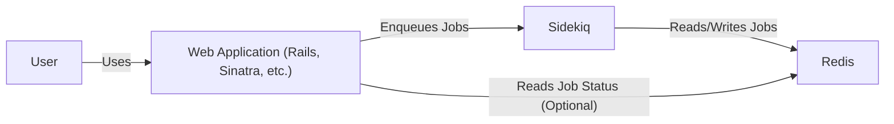
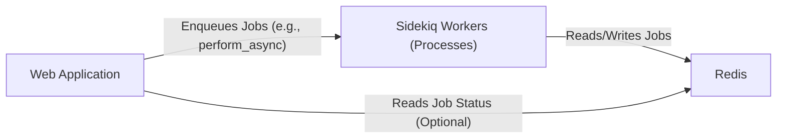

Okay, let's create a design document for Sidekiq, focusing on aspects relevant for threat modeling.

# BUSINESS POSTURE

Sidekiq is a background job processing library for Ruby.  It aims to provide a robust, efficient, and scalable way for Ruby applications to handle tasks asynchronously.  The core business priorities and goals are:

*   Reliability:  Jobs should be processed reliably, even in the face of failures.  Loss of jobs should be minimized.
*   Performance:  Jobs should be processed quickly and efficiently, minimizing latency.
*   Scalability:  The system should be able to handle a large volume of jobs and scale horizontally to meet increasing demand.
*   Maintainability:  The system should be easy to understand, operate, and maintain.
*   Extensibility: The system should allow for extensions and integrations with other systems.

Based on these, the most important business risks are:

*   Job Loss:  Failure to process jobs reliably can lead to data loss, inconsistent application state, and user dissatisfaction.
*   Performance Degradation:  Slow job processing can negatively impact user experience and overall application performance.
*   System Outages:  Complete failure of the Sidekiq infrastructure can halt critical business processes.
*   Security Breaches:  Vulnerabilities in Sidekiq or its dependencies (primarily Redis) could be exploited to compromise the application or its data.
*   Data Corruption: Incorrect job processing or errors in job handling logic can lead to data corruption.

# SECURITY POSTURE

Sidekiq itself, as a library, relies heavily on the security of the surrounding application and the Redis instance it uses.  Here's a breakdown:

*   security control: Secure coding practices within the Sidekiq codebase itself (e.g., avoiding known vulnerabilities, regular updates). Implemented in Sidekiq codebase.
*   security control: Dependency management: Keeping Sidekiq and its dependencies (especially Redis) up-to-date with security patches. Implemented in Gemfile and project's dependency management process.
*   security control: Redis Authentication: Using strong passwords and potentially TLS for Redis connections. Implemented in Redis configuration and application configuration.
*   security control: Network Security: Restricting network access to the Redis instance to only authorized hosts/applications. Implemented in network configuration (firewalls, security groups).
*   security control: Monitoring and Logging:  Monitoring Sidekiq's performance and error logs to detect and respond to issues. Implemented in application monitoring and logging infrastructure.
*   accepted risk: Sidekiq's core functionality does not include built-in encryption of job data at rest within Redis. This is left to the application using Sidekiq.
*   accepted risk: Sidekiq does not inherently provide granular authorization controls for different types of jobs.  Authorization is typically handled within the application logic that enqueues the jobs.
*   accepted risk: Sidekiq relies on the application to properly sanitize and validate job arguments. Sidekiq itself does not perform input validation on job data.

Recommended Security Controls (High Priority):

*   security control: Implement Redis ACLs (Access Control Lists) to restrict Sidekiq's access to only necessary Redis commands.
*   security control: Encrypt sensitive data within job arguments before enqueuing them.
*   security control: Implement a robust monitoring and alerting system specifically for Sidekiq, including metrics on queue sizes, processing times, and error rates.
*   security control: Regularly audit the security of the Redis deployment, including network access, authentication, and configuration.

Security Requirements:

*   Authentication:
    *   Sidekiq's connection to Redis must be authenticated using strong credentials.
    *   If a web UI is used, it must require authentication.
*   Authorization:
    *   The application using Sidekiq should implement authorization checks to ensure that only authorized users/processes can enqueue specific types of jobs.
    *   Consider using Redis ACLs to limit Sidekiq's capabilities within Redis.
*   Input Validation:
    *   The application *must* validate and sanitize all data passed as arguments to Sidekiq jobs. Sidekiq itself does *not* perform input validation.
*   Cryptography:
    *   Sensitive data stored within job arguments *should* be encrypted before being enqueued.
    *   Connections to Redis *should* use TLS if transmitting sensitive data.

# DESIGN

## C4 CONTEXT



Element Descriptions:

*   Element:
    *   Name: User
    *   Type: Person
    *   Description: A user of the web application.
    *   Responsibilities: Interacts with the web application, triggering actions that may result in background jobs.
    *   Security controls: Authentication and authorization within the web application.

*   Element:
    *   Name: Web Application (Rails, Sinatra, etc.)
    *   Type: Software System
    *   Description: The main application that uses Sidekiq for background processing.
    *   Responsibilities: Handles user requests, enqueues jobs to Sidekiq, and potentially interacts with Redis directly for job status.
    *   Security controls: Input validation, authentication, authorization, secure coding practices, session management, etc.

*   Element:
    *   Name: Sidekiq
    *   Type: Software System
    *   Description: The background job processing library.
    *   Responsibilities: Retrieves jobs from Redis, executes them, and updates job status in Redis.
    *   Security controls: Secure connection to Redis (authentication, potentially TLS), secure coding practices.

*   Element:
    *   Name: Redis
    *   Type: Database
    *   Description: An in-memory data store used by Sidekiq to store job queues and metadata.
    *   Responsibilities: Persisting job data and providing fast access for Sidekiq.
    *   Security controls: Authentication (password, ACLs), network access control, potentially TLS, regular security audits.

## C4 CONTAINER



Element Descriptions:

*   Element:
    *   Name: Web Application
    *   Type: Container
    *   Description: The main application code, potentially running within a web server (e.g., Puma, Unicorn).
    *   Responsibilities: Handles user requests, interacts with databases, and enqueues jobs to Sidekiq.
    *   Security controls: All web application security controls (input validation, authentication, authorization, etc.).

*   Element:
    *   Name: Sidekiq Workers (Processes)
    *   Type: Container
    *   Description:  One or more Sidekiq worker processes that run independently of the web application.
    *   Responsibilities:  Poll Redis for jobs, execute job logic, and update job status in Redis.
    *   Security controls: Secure connection to Redis, secure coding practices within job handlers.

*   Element:
    *   Name: Redis
    *   Type: Container
    *   Description: The Redis server instance.
    *   Responsibilities:  Stores job queues and metadata.
    *   Security controls:  Authentication, network access control, potentially TLS, regular security audits.

## DEPLOYMENT

Sidekiq can be deployed in various ways, including:

1.  **Heroku:** Using the Heroku Redis add-on and deploying Sidekiq workers as separate processes.
2.  **Kubernetes:** Deploying Redis as a StatefulSet and Sidekiq workers as Deployments.
3.  **Bare Metal/VMs:** Installing Redis and running Sidekiq processes directly on servers.
4.  **Cloud Provider Managed Redis:** Using services like AWS ElastiCache or GCP Memorystore for Redis, and deploying Sidekiq workers on compute instances (EC2, GCE).

We'll describe the Kubernetes deployment in detail:

```mermaid
graph LR
    Internet["Internet"]
    LoadBalancer["Load Balancer"]
    WebAppPods["Web Application Pods"]
    SidekiqPods["Sidekiq Worker Pods"]
    RedisService["Redis Service"]
    RedisStatefulSet["Redis StatefulSet"]

    Internet -- "HTTPS" --> LoadBalancer
    LoadBalancer -- "HTTP" --> WebAppPods
    WebAppPods -- "Redis Protocol" --> RedisService
    SidekiqPods -- "Redis Protocol" --> RedisService
    RedisService -- "" --> RedisStatefulSet

```

Element Descriptions:

*   Element:
    *   Name: Internet
    *   Type: External Entity
    *   Description: The public internet.
    *   Responsibilities: Provides access to the application.
    *   Security controls: Firewall, DDoS protection.

*   Element:
    *   Name: Load Balancer
    *   Type: Infrastructure Node
    *   Description: Distributes incoming traffic across multiple web application pods.
    *   Responsibilities: Load balancing, SSL termination.
    *   Security controls: SSL/TLS configuration, access control lists.

*   Element:
    *   Name: Web Application Pods
    *   Type: Container Instance
    *   Description:  Instances of the web application container running within Kubernetes pods.
    *   Responsibilities:  Handling user requests, enqueuing jobs.
    *   Security controls:  All web application security controls, network policies.

*   Element:
    *   Name: Sidekiq Worker Pods
    *   Type: Container Instance
    *   Description: Instances of the Sidekiq worker container running within Kubernetes pods.
    *   Responsibilities: Processing background jobs.
    *   Security controls: Secure connection to Redis, network policies.

*   Element:
    *   Name: Redis Service
    *   Type: Kubernetes Service
    *   Description: A Kubernetes service that provides a stable endpoint for accessing the Redis StatefulSet.
    *   Responsibilities: Service discovery.
    *   Security controls: Network policies.

*   Element:
    *   Name: Redis StatefulSet
    *   Type: Kubernetes StatefulSet
    *   Description:  Manages the deployment and scaling of the Redis instance(s).
    *   Responsibilities:  Ensuring Redis data persistence and availability.
    *   Security controls:  Redis authentication, network policies, persistent volume security.

## BUILD

Sidekiq, as a library, is typically included in a Ruby project via Bundler. The build process focuses on the *application* using Sidekiq, rather than Sidekiq itself. A typical build process might involve:

1.  **Developer:** Writes code, including Sidekiq job definitions and application logic.
2.  **Version Control (Git):** Code is committed and pushed to a Git repository (e.g., GitHub, GitLab).
3.  **Continuous Integration (CI) Server (e.g., GitHub Actions, Jenkins, CircleCI):**
    *   Checks out the code.
    *   Runs linters (e.g., Rubocop) to enforce code style and identify potential issues.
    *   Runs static analysis tools (e.g., Brakeman) to detect security vulnerabilities.
    *   Runs unit and integration tests.
    *   Builds a Docker image (if using containers).
    *   Pushes the Docker image to a container registry (e.g., Docker Hub, ECR, GCR).

```mermaid
graph LR
    Developer["Developer"]
    Git["Git Repository"]
    CI["CI Server"]
    Linters["Linters (Rubocop)"]
    SAST["SAST (Brakeman)"]
    Tests["Unit/Integration Tests"]
    Docker["Docker Build"]
    Registry["Container Registry"]

    Developer -- "Commits Code" --> Git
    Git -- "Webhook Trigger" --> CI
    CI -- "" --> Linters
    CI -- "" --> SAST
    CI -- "" --> Tests
    CI -- "" --> Docker
    Docker -- "Push Image" --> Registry
```

Security Controls in Build Process:

*   security control: Linting: Enforces code style and identifies potential errors.
*   security control: Static Analysis (SAST): Detects security vulnerabilities in the code.
*   security control: Dependency Scanning: Identifies vulnerable dependencies (e.g., using `bundle audit`).
*   security control: Automated Testing: Ensures code quality and helps prevent regressions.
*   security control: Secure Container Build: Using minimal base images, avoiding unnecessary tools, and scanning images for vulnerabilities.

# RISK ASSESSMENT

*   Critical Business Processes:
    *   Asynchronous task execution:  Sidekiq is critical for any business process that relies on background jobs (e.g., sending emails, processing payments, generating reports).
    *   Maintaining application responsiveness: By offloading tasks to the background, Sidekiq helps keep the main application responsive to user requests.

*   Data We Are Trying to Protect:
    *   Job arguments:  These can contain sensitive data, depending on the application's functionality (e.g., user data, API keys, financial information). Sensitivity: Varies greatly depending on the application.  Could range from low (e.g., a user ID) to very high (e.g., credit card details).
    *   Job metadata:  Information about the jobs themselves (e.g., status, timestamps, error messages). Sensitivity: Generally low, but error messages could potentially leak sensitive information.
    *   Redis data:  The entire Redis dataset, which includes job queues and metadata. Sensitivity:  Reflects the sensitivity of the job arguments and metadata.

# QUESTIONS & ASSUMPTIONS

*   Questions:
    *   What specific types of sensitive data will be processed by Sidekiq jobs in this particular application?
    *   What are the regulatory compliance requirements (e.g., GDPR, PCI DSS) that apply to the data being processed?
    *   What is the expected volume of jobs and the required throughput?
    *   What is the acceptable downtime for the Sidekiq infrastructure?
    *   What existing monitoring and alerting systems are in place?

*   Assumptions:
    *   BUSINESS POSTURE: The application using Sidekiq has a moderate risk appetite. While reliability and performance are crucial, there's an understanding that perfect security is unattainable.
    *   SECURITY POSTURE: The application development team has basic security awareness and follows some secure coding practices. There is a basic level of monitoring and logging in place.
    *   DESIGN: The application is deployed in a relatively modern environment (e.g., cloud-based, containerized). Redis is used as the backing store for Sidekiq.