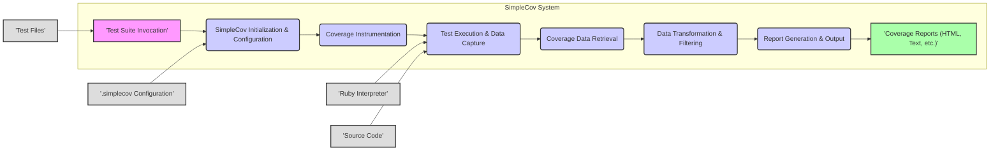
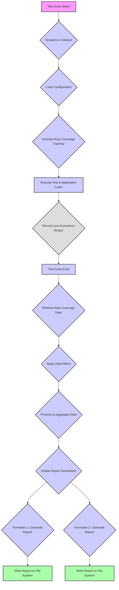

## Project Design Document: SimpleCov (Improved)

**1. Introduction**

This document provides an enhanced design overview of the SimpleCov project, a code coverage analysis tool for Ruby. This detailed description is specifically tailored to facilitate comprehensive threat modeling, offering a clear understanding of the system's architecture, components, data flow, and potential security considerations.

**2. Project Overview**

SimpleCov is a Ruby library designed to measure code coverage during the execution of automated tests. It leverages Ruby's built-in coverage functionality to track which lines of Ruby code are executed when a test suite runs. SimpleCov then aggregates, processes, and formats this raw coverage data into human-readable reports. These reports, typically generated in HTML or text formats, help developers assess the effectiveness of their testing efforts and pinpoint areas of the codebase lacking sufficient test coverage.

**3. System Architecture**

The operational architecture of SimpleCov can be broken down into distinct stages, each with specific responsibilities:

*   **Test Suite Invocation:** The developer initiates the execution of their Ruby test suite using a chosen testing framework (e.g., RSpec, Minitest).
*   **SimpleCov Initialization and Configuration:**  SimpleCov is initialized, typically within a test helper file, and its configuration settings are loaded.
*   **Coverage Instrumentation:** SimpleCov activates Ruby's built-in code coverage tracking mechanism, instructing the Ruby interpreter to record line execution data.
*   **Test Execution and Data Capture:** As the test suite runs, the Ruby interpreter executes the code and simultaneously records which lines are executed, storing this raw coverage data in memory.
*   **Coverage Data Retrieval:** Upon completion of the test suite, SimpleCov retrieves the raw coverage data from the Ruby interpreter's memory.
*   **Data Transformation and Filtering:** SimpleCov processes the raw data, applying user-defined filters (e.g., excluding specific files or directories) and transforming it into a more usable format.
*   **Report Generation and Output:** Based on the configured report formatters, SimpleCov generates the final coverage reports in the specified formats (e.g., HTML, text).

**4. Detailed Component Description**

*   **SimpleCov Core Library:** The central component providing the primary functionality.
    *   **Configuration Manager:** Responsible for loading and managing user-defined settings from configuration files or code.
    *   **Coverage Data Handler:** Interacts directly with Ruby's `Coverage` module to initiate tracking, retrieve raw data, and perform initial processing.
    *   **Data Processor:** Implements logic for filtering, merging, and transforming the raw coverage data based on configuration.
    *   **Report Generator:** Orchestrates the report generation process, delegating to registered report formatters.
*   **Report Formatters:** Modules responsible for generating reports in specific formats.
    *   **HTML Formatter:** Creates interactive HTML reports displaying coverage information.
    *   **Text Formatter:** Generates plain text reports suitable for console output or simple file storage.
    *   **JSON Formatter (Optional):**  May be available for generating coverage data in JSON format for machine readability.
    *   **Custom Formatter Interface:** Allows developers to create and integrate their own report generation logic.
*   **Configuration Files (`.simplecov` or `simplecov.rb`):** Optional files allowing users to customize SimpleCov's behavior through Ruby code or specific configuration directives.
*   **Gem Integration (`simplecov` gem):**  Packages and distributes the SimpleCov library and its components through the RubyGems ecosystem.

**5. Data Flow (Detailed)**

The movement and transformation of data within SimpleCov follows these steps:

1. **Test Execution Commences:** The testing framework begins executing the test suite.
2. **SimpleCov Initialization:**  SimpleCov is initialized, often via a `require 'simplecov'` statement in a test helper file.
3. **Configuration Loading:** SimpleCov loads configuration settings from `.simplecov` files, environment variables, or inline code.
4. **Coverage Tracking Activation:** SimpleCov calls Ruby's `Coverage.start` to begin tracking line executions.
5. **Test Code Execution:** The Ruby interpreter executes the test code and the application code under test.
6. **Line Execution Recording:** The Ruby `Coverage` module records which lines of code are executed during the test run, storing this raw data in a data structure within the Ruby interpreter's memory. This data typically includes file paths and arrays indicating execution counts for each line.
7. **Test Suite Completion:** The test suite finishes execution.
8. **Coverage Data Retrieval:** SimpleCov retrieves the raw coverage data by calling `Coverage.result`.
9. **Data Filtering:** SimpleCov applies configured filters (e.g., `SimpleCov.filters.add`) to exclude specific files or directories from the coverage results.
10. **Data Processing and Aggregation:** SimpleCov processes the raw data, potentially merging coverage data from multiple test runs or applying transformations.
11. **Report Generation Initiation:** SimpleCov iterates through the configured report formatters.
12. **Formatter-Specific Report Generation:** Each formatter receives the processed coverage data and generates a report according to its logic.
13. **Report Output to File System:** The generated reports (e.g., HTML files) are written to the file system, typically within a `coverage` directory.

**6. Key Components and their Interactions**

*   **Ruby Interpreter:** Executes the Ruby code, including the test suite and the SimpleCov library. Provides the core coverage tracking functionality through its `Coverage` module.
*   **Testing Framework (e.g., RSpec, Minitest):**  Manages the execution of individual tests and provides hooks or mechanisms for integrating with tools like SimpleCov.
*   **SimpleCov Gem:** The packaged library containing the core logic, report formatters, and configuration management.
*   **Project Source Code:** The Ruby code being analyzed for test coverage.
*   **Configuration Files (`.simplecov`, `simplecov.rb`):**  Define settings that customize SimpleCov's behavior, such as report formatters, filters, and coverage thresholds.
*   **File System:** Used for reading configuration files, accessing source code for analysis, and writing the generated coverage reports.

**7. External Dependencies**

*   **Ruby Standard Library:**  Relies heavily on core Ruby libraries, particularly the `Coverage` module for coverage tracking and file system access.
*   **RubyGems:**  The package manager used for installing and managing the SimpleCov gem.
*   **Testing Frameworks (e.g., RSpec, Minitest):**  While SimpleCov can function independently, it is typically used in conjunction with a testing framework to drive test execution.
*   **Optional Gem Dependencies (for specific formatters or features):** Certain report formatters or advanced features might introduce additional gem dependencies.

**8. Security Considerations (Detailed for Threat Modeling)**

*   **Data Integrity of Coverage Information:**  Ensuring the accuracy and trustworthiness of the collected coverage data is paramount. Malicious actors could potentially manipulate the data to hide gaps in testing or falsely inflate coverage metrics.
    *   **Threat:** Tampering with the raw coverage data before SimpleCov processes it.
    *   **Threat:** Modifying SimpleCov's code to report inaccurate coverage.
*   **Report Tampering and Spoofing:** If coverage reports are stored in publicly accessible locations without proper protection, they could be altered to present a misleading view of the project's testing status.
    *   **Threat:** Modifying HTML reports to show higher coverage than actual.
    *   **Threat:** Replacing legitimate reports with fake ones.
*   **Configuration Vulnerabilities:**  Improperly secured or overly permissive `.simplecov` configuration files could be exploited.
    *   **Threat:** Modifying the configuration to disable coverage tracking or exclude critical files.
    *   **Threat:** Injecting malicious code into a `simplecov.rb` configuration file if it allows arbitrary code execution.
*   **Dependency Vulnerabilities:**  Vulnerabilities in SimpleCov's dependencies (including Ruby itself or other gems) could introduce security risks.
    *   **Threat:** Exploiting known vulnerabilities in dependent gems.
    *   **Mitigation:** Regularly updating dependencies.
*   **Code Injection through Custom Formatters:** Allowing users to define arbitrary code for custom formatters presents a significant code injection risk.
    *   **Threat:** Injecting malicious code that executes when the custom formatter is used.
    *   **Mitigation:**  Carefully vetting or restricting the use of custom formatters.
*   **Information Disclosure in Reports:** Coverage reports might inadvertently reveal sensitive information about the codebase structure, internal logic, or file paths.
    *   **Threat:** Exposure of internal API endpoints or sensitive data through file paths in reports.
    *   **Mitigation:**  Carefully consider the information included in reports and restrict access.
*   **Denial of Service (Resource Exhaustion):** While less likely, processing very large codebases or generating complex reports could potentially lead to resource exhaustion.
    *   **Threat:**  Crafting extremely large projects or complex test suites to overload SimpleCov.
    *   **Mitigation:** Implementing safeguards against excessive resource consumption.
*   **Path Traversal:** If SimpleCov processes file paths from untrusted sources (e.g., in configuration), path traversal vulnerabilities could arise.
    *   **Threat:**  Manipulating file paths to access or modify files outside the intended project directory.
    *   **Mitigation:**  Sanitizing and validating file paths.

**9. Deployment Considerations**

SimpleCov is primarily a development-time dependency. It is typically included in the `Gemfile` of a Ruby project and activated during the execution of the test suite. The generated coverage reports are usually stored within the project's directory structure, often in a `coverage` subdirectory. Considerations for deployment include:

*   **Secure Storage of Reports:** If coverage reports are to be archived or shared, ensure they are stored securely with appropriate access controls.
*   **Integration with CI/CD:**  SimpleCov is commonly integrated into CI/CD pipelines to automatically generate coverage reports on each build. Ensure the CI/CD environment is secure.

**10. Future Considerations (Out of Scope for Initial Threat Model)**

*   Enhanced integration with CI/CD platforms for automated reporting and analysis.
*   Support for more granular coverage metrics (e.g., branch coverage, path coverage).
*   Advanced reporting features, such as trend analysis and coverage diffs.
*   Potential for remote reporting or aggregation of coverage data from multiple sources.

This improved design document provides a more detailed and security-focused overview of the SimpleCov project. The enhanced descriptions of components, data flows, and interactions, along with the expanded security considerations, will be valuable for conducting a thorough threat modeling exercise.