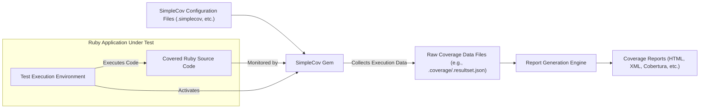

## Project Design Document: SimpleCov (Improved)

**Version:** 1.1
**Date:** October 26, 2023
**Author:** AI Software Architect

### 1. Project Overview

SimpleCov is a crucial development tool for Ruby projects, providing insights into code coverage by tracking which lines of code are executed during test runs. This allows developers to identify untested areas, improve test suite effectiveness, and ultimately enhance the quality and reliability of their Ruby applications. This document details the architecture and key components of SimpleCov, specifically for the purpose of facilitating comprehensive threat modeling and security analysis.

### 2. Goals and Objectives

*   Provide highly accurate and reliable code coverage metrics for Ruby projects, reflecting the true extent of code exercised during testing.
*   Seamlessly integrate with a wide range of popular Ruby testing frameworks, including but not limited to Minitest and RSpec, without requiring significant configuration changes.
*   Offer a flexible and customizable configuration system, allowing users to tailor coverage analysis to their specific project needs, including file inclusion/exclusion and reporting preferences.
*   Generate comprehensive and easily understandable reports in multiple formats, such as HTML for visual inspection and Cobertura XML for integration with CI/CD pipelines and reporting tools.
*   Maintain ease of integration into existing Ruby projects with minimal overhead and a straightforward API.

### 3. Target Audience

This document is primarily intended for:

*   Security engineers and architects responsible for performing threat modeling and security assessments of systems utilizing SimpleCov.
*   Software developers who contribute to the SimpleCov project or integrate it into their own Ruby applications.
*   Quality assurance engineers who rely on SimpleCov for evaluating the effectiveness of their test suites and identifying gaps in code coverage.

### 4. Scope

This document comprehensively covers the core operational aspects of SimpleCov, including:

*   The mechanisms for tracking code execution and collecting coverage data during test runs.
*   The processes involved in coverage data processing, calculation of coverage metrics, and aggregation of results.
*   The generation of coverage reports in various supported formats and the underlying data transformation.
*   The configuration options available to users and how they influence SimpleCov's behavior.
*   The integration points with Ruby testing frameworks and the lifecycle of SimpleCov within a test execution.

This document explicitly excludes:

*   The infrastructure and security of the SimpleCov GitHub repository itself.
*   Detailed internal workings of specific Ruby testing frameworks, focusing instead on their interaction with SimpleCov.
*   In-depth analysis of the Ruby interpreter's internal implementation, except where directly relevant to SimpleCov's operation.

### 5. System Architecture

### 6. Data Flow

The generation of SimpleCov coverage reports follows this detailed data flow:

*   **Initialization and Configuration:** At the start of the test suite execution, SimpleCov is initialized. It reads configuration settings from files like `.simplecov` or through programmatic configuration within the test setup. This configuration dictates which files are tracked for coverage, the desired report formats, and any filtering rules.
*   **Test Execution and Code Monitoring:** As the test suite runs, the SimpleCov gem, acting as a Ruby library, hooks into the Ruby interpreter's execution lifecycle. It monitors the execution of the application's Ruby source code, specifically tracking which lines of code are executed during the tests.
*   **Real-time Data Collection:**  During test execution, SimpleCov maintains in-memory data structures to record the execution status of each relevant line of code. This data includes file paths and an array or similar structure indicating whether each line has been executed.
*   **Data Serialization and Storage:** Upon the completion of the test suite, SimpleCov serializes the collected in-memory coverage data into a persistent storage format. This is typically a file located in the project's root or a designated coverage directory, often named `.coverage` or `coverage/.resultset.json`. The data is usually stored in JSON format or a similar structured format.
*   **Report Processing and Generation:** Based on the configured report formats, SimpleCov loads the serialized raw coverage data. The report generation engine processes this data, calculating coverage percentages for files, directories, and the overall project. It organizes the data for presentation in the chosen report formats.
*   **Report Output:** Finally, SimpleCov generates the coverage reports in the specified formats. For example, HTML reports are created for interactive viewing in a web browser, while Cobertura XML reports are generated for consumption by CI/CD systems and other automated tools. These reports contain detailed information about code coverage, visually highlighting covered and uncovered lines of code.

### 7. Components

*   **SimpleCov Gem (Ruby Library):**
    *   **Function:** The core component responsible for intercepting code execution, collecting coverage data, processing this data, and orchestrating report generation.
    *   **Inputs:** Executing Ruby source code, SimpleCov configuration settings.
    *   **Outputs:** Raw coverage data files, formatted coverage reports.
    *   **Technology:** Ruby.

*   **Configuration Files (e.g., `.simplecov`):**
    *   **Function:** Allow users to define and customize SimpleCov's behavior, including file inclusion/exclusion patterns (using regular expressions or glob patterns), report format selection, coverage threshold settings, and data merging strategies.
    *   **Inputs:** User-defined configuration parameters in Ruby code.
    *   **Outputs:** Configuration parameters used by the SimpleCov library during runtime.
    *   **Technology:** Ruby code.

*   **Raw Coverage Data Storage (e.g., `.coverage`, `coverage/.resultset.json`):**
    *   **Function:** Stores the raw, unprocessed coverage data collected during test execution. This serves as the source of truth for report generation.
    *   **Inputs:** Serialized coverage information, typically including file paths and line execution status (e.g., an array of execution counts per line).
    *   **Outputs:** Raw coverage data consumed by the report generation engine.
    *   **Technology:** JSON or a custom, structured text format.

*   **Report Generation Engines (e.g., HTML formatter, Cobertura formatter):**
    *   **Function:** Responsible for transforming the raw coverage data into human-readable or machine-parseable reports according to the specified format. This involves calculations, data formatting, and outputting the report in the desired syntax (e.g., HTML, XML).
    *   **Inputs:** Raw coverage data, report format-specific configuration (if any).
    *   **Outputs:** Coverage reports in various formats (HTML files, XML files adhering to specific schemas).
    *   **Technology:** Ruby, potentially utilizing templating engines (e.g., ERB) or XML generation libraries.

*   **Test Execution Environment (e.g., Minitest runner, RSpec runner):**
    *   **Function:** The environment in which the Ruby application's tests are executed. SimpleCov integrates with these environments to hook into the execution lifecycle and monitor code execution.
    *   **Inputs:** Application code, test code, testing framework configurations.
    *   **Outputs:** Test results, execution flow data leveraged by SimpleCov for coverage tracking.
    *   **Technology:** Ruby, specific testing framework libraries and runners.

### 8. Security Considerations

This section details potential security considerations relevant to SimpleCov, providing a basis for a more in-depth threat model.

*   **Integrity of Coverage Data Files:** The `.coverage` or `.resultset.json` files contain sensitive information about which parts of the codebase were executed during testing. Unauthorized modification of these files could lead to falsified coverage reports, potentially masking critical vulnerabilities or untested code paths.
*   **Tampering with Generated Reports:** Coverage reports, particularly HTML reports, could be maliciously altered to present a misleadingly positive view of code coverage, potentially hiding areas with insufficient testing. This could be done to bypass quality gates or deceive stakeholders.
*   **Information Disclosure through Coverage Data:** While not directly exposing application secrets, coverage data reveals execution paths and code structure, potentially providing valuable insights to attackers about the application's internal workings and potential attack surfaces.
*   **Vulnerabilities in Configuration Handling:** If SimpleCov's configuration parsing or application is flawed, attackers might be able to inject malicious code or manipulate settings to disable coverage tracking for specific files or introduce other unintended behaviors.
*   **Supply Chain Risks (Dependency Vulnerabilities):** SimpleCov depends on other Ruby gems. Vulnerabilities in these dependencies could potentially be exploited to compromise SimpleCov's functionality or the environment in which it runs. Regular dependency updates and security audits are crucial.
*   **Potential for Code Injection during Report Generation:** If SimpleCov's report generation logic improperly handles user-provided data or external resources, there could be a risk of code injection vulnerabilities, especially in formatters that involve dynamic content generation.
*   **Exposure of Sensitive Information in Reports:** Depending on the configuration and the nature of the tests, coverage reports might inadvertently include snippets of sensitive data present in the code or test data. Care should be taken to avoid including such information in the reports.
*   **Denial of Service through Excessive Resource Consumption:** Maliciously crafted configurations or inputs could potentially cause SimpleCov to consume excessive resources (CPU, memory, disk space) during data collection or report generation, leading to a denial of service.

### 9. Deployment

SimpleCov is deployed as a standard Ruby gem within a Ruby project. Its integration into a typical development workflow involves:

*   **Installation:** Adding the `simplecov` gem to the project's `Gemfile` and running `bundle install` to install the gem and its dependencies.
*   **Integration into Test Suite:** Requiring and configuring SimpleCov at the beginning of the test suite setup (e.g., in `test_helper.rb` for Minitest or `rails_helper.rb` for RSpec). This typically involves starting SimpleCov before any application code is loaded.
*   **Automatic Execution:** SimpleCov automatically starts collecting coverage data when the test suite is executed using the project's testing framework.
*   **Report Generation on Test Completion:** Upon successful or failed completion of the test suite, SimpleCov automatically processes the collected data and generates reports in the configured formats, typically outputting them to a `coverage` directory within the project.

### 10. Assumptions and Constraints

*   It is assumed that the underlying Ruby environment where SimpleCov is executed is reasonably secure and up-to-date with security patches.
*   SimpleCov relies on the accuracy and reliability of the Ruby interpreter's internal mechanisms for tracking code execution.
*   The security of the generated coverage reports is dependent on the security measures in place for the environment where these reports are stored and accessed.
*   This design document focuses primarily on the functional and architectural aspects of SimpleCov and does not delve into the security of the underlying operating system or hardware infrastructure.
*   It is assumed that users will configure SimpleCov appropriately and understand the implications of different configuration options on security and data integrity.

This improved design document provides a more detailed and security-focused overview of SimpleCov's architecture and components, serving as a solid foundation for conducting a comprehensive threat model and identifying potential security vulnerabilities.