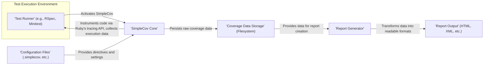
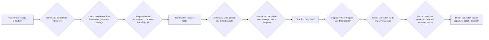

# Project Design Document: SimpleCov

**Version:** 1.1
**Date:** October 26, 2023
**Author:** AI Software Architect

## 1. Introduction

This document provides a detailed design overview of the SimpleCov project, a code coverage tool for Ruby. This document aims to clearly articulate the architecture, components, and data flow within SimpleCov to facilitate subsequent threat modeling activities. This version includes more detailed descriptions and enhanced security considerations to better support the threat modeling process.

## 2. Goals

The primary goals of this design document are to:

*   Provide a comprehensive and detailed understanding of SimpleCov's architecture and functionality.
*   Clearly identify key components, their specific responsibilities, and their interactions.
*   Thoroughly describe the data flow within the system, highlighting potential points of interest for security analysis.
*   Serve as a robust foundation for identifying potential security vulnerabilities and attack vectors during threat modeling.
*   Document key assumptions, constraints, and potential security implications.

## 3. Scope

This document covers the core functionality of SimpleCov, encompassing:

*   The process of instrumenting Ruby code to track execution.
*   Mechanisms for collecting and aggregating code coverage data during test runs.
*   The storage and management of raw coverage data.
*   The generation of various coverage report formats (e.g., HTML, Cobertura).
*   Configuration options that influence SimpleCov's behavior and data processing.
*   Integration points with Ruby testing frameworks (e.g., RSpec, Minitest).

This document does not cover:

*   The intricate implementation details of every specific report format.
*   The low-level workings of the Ruby Virtual Machine (VM) or interpreter.
*   The internal implementation details of specific testing frameworks beyond their interaction with SimpleCov.
*   The user interface or presentation layer of any tools that might consume SimpleCov's output.

## 4. High-Level Architecture

SimpleCov functions as a Ruby library that integrates closely with Ruby testing frameworks. It intercepts code execution during tests to meticulously track which lines of code are executed.

**Components:**

*   **Test Runner:** The specific Ruby testing framework (e.g., RSpec, Minitest, Test::Unit) responsible for orchestrating and executing the test suite. This component initiates the environment where SimpleCov operates.
*   **SimpleCov Core:** The central engine of SimpleCov. Its responsibilities include:
    *   Loading and interpreting configuration settings.
    *   Utilizing Ruby's tracing API (`TracePoint`) to instrument the code being tested.
    *   Collecting detailed code execution data, including which lines are executed and how many times.
    *   Managing the temporary storage and merging of coverage data, especially in parallel testing scenarios.
    *   Initiating the report generation process once the test suite has completed.
*   **Coverage Data Storage:**  Typically the local filesystem, where SimpleCov persists raw coverage data. This often involves creating files (e.g., `.coverage_results`) containing serialized data structures.
*   **Report Generator:**  The component responsible for taking the raw coverage data from storage, processing it, calculating coverage metrics (e.g., line coverage percentage), and generating human-readable reports in various formats like HTML, Cobertura XML, or text.
*   **Configuration Files:** Files (e.g., `.simplecov`, `simplecov.rb` within `spec/rails_helper.rb`) that allow users to define SimpleCov's operational parameters. These settings can include report formats, coverage thresholds, file inclusion/exclusion patterns, and other customizations.
*   **Report Output:** The final generated coverage reports, presented in the format specified in the configuration. These reports are typically files written to the filesystem.

## 5. Detailed Design

### 5.1. SimpleCov Core

*   **Functionality:**
    *   **Initialization and Configuration:** Upon being required or activated, SimpleCov loads configuration settings from specified files and any programmatic configurations. This dictates how SimpleCov will behave during the test run.
    *   **Code Instrumentation:**  Leverages Ruby's `TracePoint` API to monitor code execution events. It inserts probes or hooks at the line level to track which lines of code are executed. This instrumentation is crucial for gathering coverage data.
    *   **Data Collection and Aggregation:** As the test suite runs, SimpleCov records each executed line of code and the number of times it was hit. It aggregates this data, potentially merging results from parallel test processes.
    *   **Storage Management:**  Manages the temporary storage of raw coverage data, often in files within a `.coverage` directory. It handles the serialization and deserialization of this data.
    *   **Report Generation Orchestration:** After the test suite finishes, SimpleCov triggers the Report Generator, passing the location of the stored coverage data and relevant configuration settings.
    *   **Filtering and Exclusion:** Applies configured filters to exclude specific files or directories from coverage analysis.

*   **Inputs:**
    *   The Ruby code being executed by the Test Runner.
    *   Configuration settings loaded from files (e.g., `.simplecov`) and programmatic calls.
    *   Notifications and events from the Test Runner regarding test start and completion.

*   **Outputs:**
    *   Raw coverage data serialized and stored in files within the Coverage Data Storage.
    *   Instructions and data passed to the Report Generator to initiate report creation.

*   **Potential Security Considerations:**
    *   **Malicious Configuration Injection:** If configuration files are writable by untrusted users, an attacker could modify settings to disable coverage tracking, exclude malicious code from analysis, or manipulate report generation.
    *   **Vulnerabilities in Instrumentation Logic:** While unlikely to allow direct code execution, flaws in the `TracePoint` usage or instrumentation logic could potentially be exploited to disrupt the testing process or leak information about the code structure.
    *   **Data Tampering during Aggregation:** If the process of merging coverage data from parallel runs is not secure, an attacker could potentially inject or modify coverage data.
    *   **Exposure of Internal Paths:** Error messages or logging could inadvertently reveal internal file paths or configuration details.

### 5.2. Coverage Data Storage

*   **Functionality:**
    *   **Persistence of Raw Data:** Stores the raw, unprocessed coverage data collected by the SimpleCov Core. This data typically includes file paths and arrays indicating which lines were executed.
    *   **Data Retrieval:** Provides access to the stored raw coverage data for the Report Generator.
    *   **Potential Merging:** In some configurations, it might handle the merging of coverage data files from different test processes or environments.

*   **Inputs:**
    *   Serialized raw coverage data from the SimpleCov Core.

*   **Outputs:**
    *   Raw coverage data provided to the Report Generator for processing.

*   **Potential Security Considerations:**
    *   **Insecure File Permissions:** If the storage directory (e.g., `.coverage`) has overly permissive file permissions, unauthorized users could read or modify the coverage data.
    *   **Lack of Data Integrity Checks:** Absence of mechanisms to verify the integrity of the stored data could allow for undetected tampering.
    *   **Information Disclosure in Data:** The raw coverage data itself might contain information about the application's structure or execution flow that could be valuable to an attacker.
    *   **Storage Location Exposure:** The location of the coverage data storage might be predictable or easily discoverable, making it a target for attack.

### 5.3. Report Generator

*   **Functionality:**
    *   **Data Ingestion:** Reads and parses the raw coverage data from the Coverage Data Storage.
    *   **Coverage Calculation:** Processes the raw data to calculate various coverage metrics, such as line coverage percentage, branch coverage (if supported), and method coverage.
    *   **Report Formatting:** Generates reports in the configured formats (e.g., HTML, XML, text). This involves transforming the processed data into the specific syntax and structure of the chosen format.
    *   **Output to Destination:** Writes the generated reports to the specified output directory or location.

*   **Inputs:**
    *   Raw coverage data from the Coverage Data Storage.
    *   Configuration settings related to report generation (e.g., report formats, output directory, custom report templates).

*   **Outputs:**
    *   Coverage reports in the specified formats, written to the filesystem.

*   **Potential Security Considerations:**
    *   **Cross-Site Scripting (XSS) in HTML Reports:** If the report generation process doesn't properly sanitize data before embedding it in HTML reports, malicious JavaScript could be injected, potentially compromising systems viewing the reports.
    *   **Information Disclosure in Reports:** Reports might inadvertently expose sensitive information present in the codebase (e.g., comments, internal logic) or test results.
    *   **Path Traversal Vulnerabilities:** If report output paths are not properly validated, an attacker might be able to write reports to arbitrary locations on the filesystem.
    *   **Denial of Service (DoS) through Report Generation:**  Generating extremely large or complex reports could potentially consume excessive system resources, leading to a denial of service.
    *   **Inclusion of Sensitive Data in XML Reports:** XML report formats might include more detailed information than intended, potentially exposing sensitive data if not handled carefully.

### 5.4. Configuration Files

*   **Functionality:**
    *   **Customization of Behavior:** Allow users to tailor SimpleCov's operation, including report formats, coverage thresholds, file filtering (inclusion and exclusion), and other settings.
    *   **Definition of Report Output:** Specify the desired formats for coverage reports and their output locations.
    *   **Control over Coverage Analysis:** Define which files and directories should be included or excluded from coverage analysis.

*   **Inputs:**
    *   Read by the SimpleCov Core during its initialization phase.

*   **Outputs:**
    *   Configuration settings that govern the behavior of the SimpleCov Core and the Report Generator.

*   **Potential Security Considerations:**
    *   **Unprotected Configuration Files:** If configuration files are writable by unauthorized users, malicious actors could modify settings to compromise the integrity of coverage analysis or reports.
    *   **Insecure Defaults:**  Default configuration settings might not be secure, potentially leading to vulnerabilities if users don't explicitly configure them.
    *   **Path Traversal in Configuration:** Configuration options that involve file paths (e.g., output directories, custom report template paths) could be exploited for path traversal attacks if not properly validated by SimpleCov.
    *   **Exposure of Secrets:**  While less common for SimpleCov itself, configuration files in general can sometimes inadvertently contain sensitive information.

### 5.5. Test Runner Integration

*   **Functionality:**
    *   **Environment Provisioning:** The Test Runner sets up the execution environment in which SimpleCov operates.
    *   **Lifecycle Hooks:** SimpleCov integrates with the Test Runner's lifecycle (e.g., before and after test runs) to start and stop coverage tracking.
    *   **Code Execution:** The Test Runner executes the application code, which is instrumented by SimpleCov.

*   **Inputs:**
    *   Ruby code and test definitions.
    *   Potentially environment variables or command-line arguments that influence the test run.

*   **Outputs:**
    *   Execution of the test suite, triggering SimpleCov's data collection.

*   **Potential Security Considerations:**
    *   **Interaction Vulnerabilities:** While not directly a SimpleCov component, vulnerabilities in the interaction between SimpleCov and the Test Runner could be exploited. For example, if the Test Runner allows arbitrary code execution through plugins or extensions, this could indirectly impact SimpleCov.
    *   **Environment Variable Manipulation:**  Malicious actors might try to manipulate environment variables to influence SimpleCov's behavior if it relies on them.

## 6. Data Flow

The typical data flow within SimpleCov during a test run is as follows:

**Detailed Data Flow Description:**

1. The **Test Runner Starts Execution**, initiating the testing process.
2. **SimpleCov Initialization** occurs, typically when SimpleCov is required in the test helper or a configuration file.
3. **Load Configuration** involves SimpleCov reading and parsing settings from configuration files (e.g., `.simplecov`) and any programmatic configurations within the test suite.
4. The **SimpleCov Core** instruments the application code using Ruby's `TracePoint` API, setting up hooks to monitor code execution.
5. The **Test Runner executes tests**, running through the defined test cases.
6. As code is executed during the tests, the **SimpleCov Core collects line execution data**, recording which lines of code are hit.
7. The **SimpleCov Core stores raw coverage data** in the filesystem, typically in a `.coverage` directory, serializing the collected data.
8. The **Test Run Completes**, signaling the end of the test execution phase.
9. The **SimpleCov Core triggers Report Generation**, initiating the process of creating coverage reports.
10. The **Report Generator reads raw coverage data** from the storage location.
11. The **Report Generator processes data and generates reports** in the configured formats (e.g., HTML, XML), calculating coverage metrics.
12. The **Report Generator outputs reports** to the specified location on the filesystem.

## 7. Security Considerations (Detailed for Threat Modeling)

Based on the design, potential areas of security concern for threat modeling include:

*   **Configuration File Tampering:**
    *   **Threat:** Malicious modification of configuration files to disable coverage, exclude malicious code, or redirect report output to unauthorized locations.
    *   **Impact:** Compromised coverage data, potential hiding of vulnerabilities, information leakage.
*   **Insecure Coverage Data Storage:**
    *   **Threat:** Unauthorized access, modification, or deletion of raw coverage data due to weak file permissions.
    *   **Impact:** Tampered coverage reports, denial of service (deletion), potential information disclosure.
*   **Cross-Site Scripting (XSS) in HTML Reports:**
    *   **Threat:** Injection of malicious JavaScript into generated HTML reports due to insufficient data sanitization.
    *   **Impact:** Client-side attacks on users viewing the reports, potential session hijacking, or further system compromise.
*   **Path Traversal Vulnerabilities:**
    *   **Threat:** Exploitation of insufficient validation of file paths in configuration or report generation to read or write files outside the intended directories.
    *   **Impact:** Information disclosure (reading sensitive files), arbitrary file write/overwrite, potential code execution.
*   **Information Disclosure in Reports:**
    *   **Threat:** Accidental inclusion of sensitive information (e.g., API keys, internal paths, confidential comments) in coverage reports.
    *   **Impact:** Exposure of sensitive data to unauthorized individuals.
*   **Denial of Service (DoS) through Report Generation:**
    *   **Threat:** Triggering the generation of extremely large or complex reports to consume excessive system resources.
    *   **Impact:**  Unavailability of the system or slow performance.
*   **Dependency Vulnerabilities:**
    *   **Threat:**  Vulnerabilities in SimpleCov's dependencies could be exploited.
    *   **Impact:**  Various security issues depending on the vulnerability.
*   **Code Injection (Indirect):**
    *   **Threat:** While SimpleCov doesn't directly execute arbitrary code provided by the user, vulnerabilities in how it interacts with the Ruby runtime or handles specific code constructs could potentially be exploited in unforeseen ways.
    *   **Impact:** Could lead to unexpected behavior or potentially exploitable conditions.

## 8. Assumptions and Constraints

*   The environment where SimpleCov runs is assumed to have basic security measures in place, such as appropriate file system permissions.
*   The primary storage mechanism for raw coverage data is the local filesystem of the machine running the tests.
*   Configuration files are expected to be located within the project directory or a standard configuration path.
*   SimpleCov relies on the security and stability of the underlying Ruby runtime environment and its `TracePoint` API.
*   Users are expected to configure SimpleCov appropriately for their security needs.

## 9. Future Considerations

*   Exploring more secure storage options for coverage data, such as encrypted storage or integration with secure artifact repositories.
*   Implementing robust input validation and sanitization throughout the report generation process to mitigate XSS and path traversal risks.
*   Adding mechanisms for verifying the integrity of coverage data to detect tampering.
*   Providing more granular control over access to coverage data and generated reports through access control lists or similar mechanisms.
*   Regularly auditing and updating dependencies to address potential vulnerabilities.
*   Consider implementing Content Security Policy (CSP) in HTML reports to further mitigate XSS risks.

This document provides a more detailed and enhanced understanding of the SimpleCov project's design, specifically tailored to support thorough threat modeling activities. It highlights potential security considerations and serves as a valuable resource for identifying and mitigating potential risks.