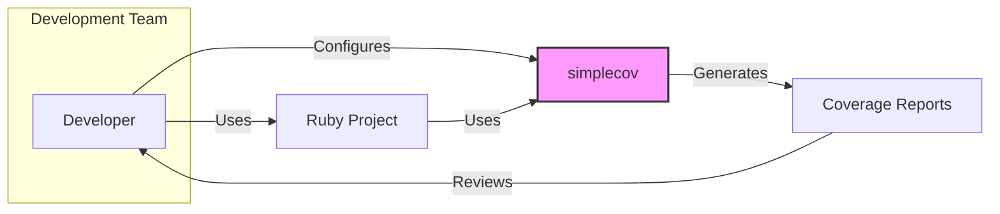
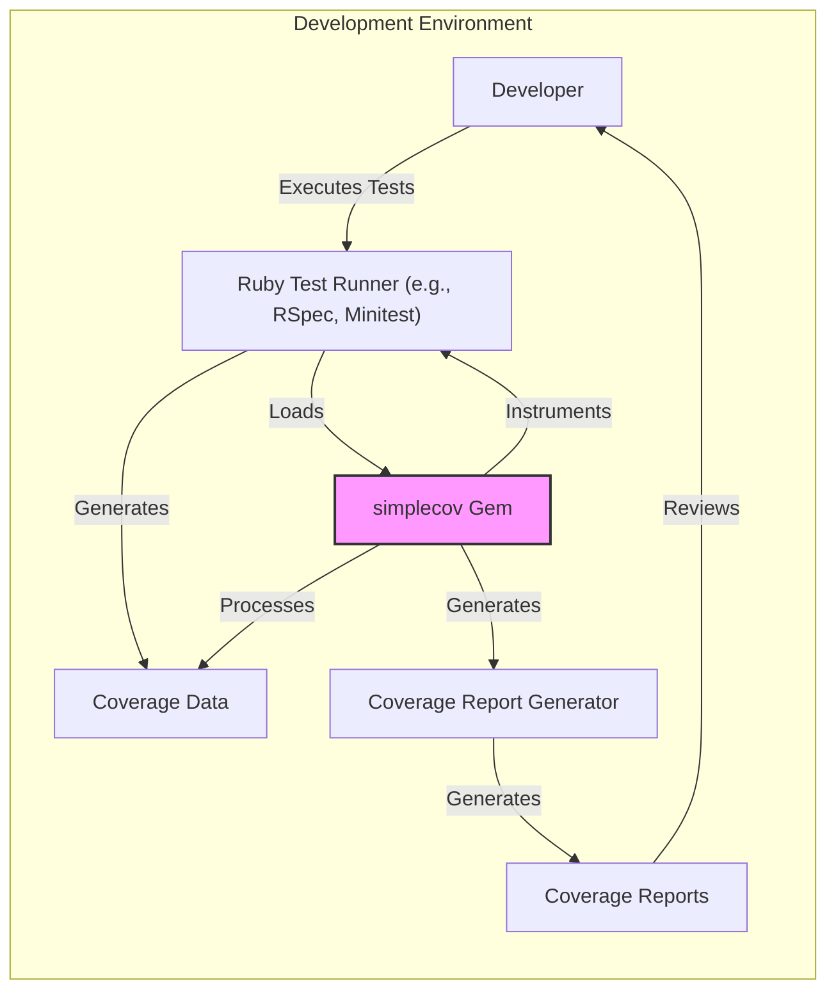
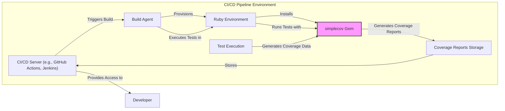
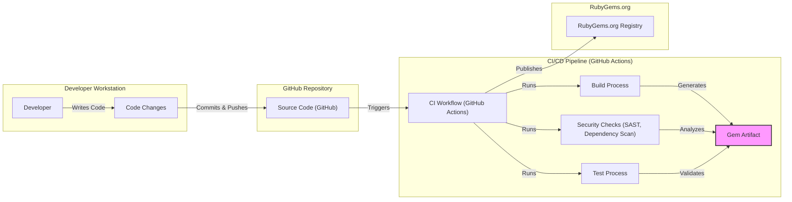

# BUSINESS POSTURE

This project, `simplecov-ruby/simplecov`, provides a code coverage tool for Ruby projects. Code coverage is a metric used in software testing to measure the percentage of code that is executed when running automated tests. By using `simplecov`, development teams can gain insights into how well their tests cover the codebase, identify areas that are not adequately tested, and improve the overall quality and reliability of their Ruby software.

Business priorities and goals for using `simplecov` include:
- Improving software quality: By identifying untested code, `simplecov` helps ensure that a larger portion of the codebase is exercised by tests, reducing the likelihood of bugs and defects in production.
- Reducing technical debt: Identifying and addressing gaps in test coverage can prevent the accumulation of technical debt related to untested or poorly tested code.
- Enhancing developer productivity: Code coverage metrics can guide developers in writing more effective tests and focusing their testing efforts on critical areas of the application.
- Supporting compliance and regulatory requirements: In some industries, code coverage metrics may be required for compliance or regulatory purposes to demonstrate software quality and testing rigor.

Most important business risks related to using `simplecov` include:
- Misinterpretation of coverage metrics: High code coverage does not guarantee the absence of bugs. It's possible to have high coverage with ineffective tests that do not adequately test the functionality or edge cases. Over-reliance on coverage metrics without considering the quality of tests can lead to a false sense of security.
- Performance overhead: Running code coverage analysis can introduce performance overhead during testing, potentially slowing down development cycles.
- Security vulnerabilities in `simplecov` itself: Like any software, `simplecov` could potentially have security vulnerabilities. If exploited, these vulnerabilities could impact the development process or the security of projects using `simplecov`.
- Incorrect coverage reporting: Bugs in `simplecov` could lead to inaccurate coverage reports, providing misleading information to developers and potentially undermining the benefits of using the tool.

# SECURITY POSTURE

Existing security controls for the `simplecov` project and its usage are primarily focused on general software development best practices and the Ruby ecosystem.

Security controls:
- security control: Using publicly available GitHub repository for source code, allowing community review and contributions. (Implemented: GitHub repository)
- security control: Relying on RubyGems.org for distribution of the gem, which provides some level of package integrity and versioning. (Implemented: RubyGems.org)
- security control: Utilizing standard Ruby testing frameworks (e.g., RSpec, Minitest) for testing `simplecov` itself. (Implemented: Test suite within the repository)
- security control: Following general secure coding practices in Ruby development. (Implemented: Implicit in development process)

Accepted risks:
- accepted risk: Potential vulnerabilities in dependencies used by `simplecov`.
- accepted risk: Risk of vulnerabilities in `simplecov` code itself, requiring community vigilance and timely security updates.
- accepted risk: Reliance on the security of the RubyGems.org platform.
- accepted risk: Potential for denial-of-service if coverage analysis significantly slows down test suites in development or CI environments.

Recommended security controls to implement:
- security control: Implement automated dependency scanning to identify known vulnerabilities in `simplecov`'s dependencies.
- security control: Integrate static application security testing (SAST) tools into the `simplecov` development pipeline to automatically detect potential security flaws in the code.
- security control: Establish a clear process for reporting and handling security vulnerabilities in `simplecov`, including a security policy and contact information.
- security control: Consider code signing releases of the `simplecov` gem to enhance trust and integrity.

Security requirements for `simplecov` and projects using it:

Authentication:
- Not directly applicable to `simplecov` itself as it is a library.
- For projects using `simplecov`, standard authentication mechanisms for development environments and CI/CD pipelines should be in place.

Authorization:
- Not directly applicable to `simplecov` itself.
- Access control to development environments, CI/CD pipelines, and code repositories should be properly configured for projects using `simplecov`.

Input validation:
- `simplecov` takes configuration options as input. Input validation should be performed to prevent unexpected behavior or potential vulnerabilities due to malicious or malformed configurations. This includes validating file paths, regular expressions, and other configuration parameters.

Cryptography:
- Cryptography is not a core requirement for `simplecov`. However, if `simplecov` were to handle sensitive data (which is not the current case), appropriate cryptographic measures would be necessary. For now, ensure no sensitive data is inadvertently collected or exposed by `simplecov`.

# DESIGN

## C4 CONTEXT

Context Diagram Elements:

- Element:
  - Name: Developer
  - Type: Person
  - Description: Software developers who write and test Ruby code.
  - Responsibilities: Writing code, writing tests, running tests with code coverage analysis, reviewing coverage reports, improving code and tests.
  - Security controls: Authentication to development environment, authorization to access code repositories and CI/CD systems, secure coding practices.

- Element:
  - Name: Ruby Project
  - Type: Software System
  - Description: The Ruby codebase being developed and tested.
  - Responsibilities: Contains the application code, tests, and project configuration.
  - Security controls: Access control to the code repository, secure coding practices within the project, input validation, output encoding, protection of sensitive data within the application.

- Element:
  - Name: simplecov
  - Type: Software System
  - Description: Ruby library for code coverage analysis.
  - Responsibilities: Instrumenting Ruby code, collecting coverage data during test execution, generating coverage reports in various formats.
  - Security controls: Input validation of configuration, secure coding practices in `simplecov` development, dependency scanning, vulnerability management.

- Element:
  - Name: Coverage Reports
  - Type: Data Store
  - Description: Reports generated by `simplecov` showing code coverage metrics.
  - Responsibilities: Storing and presenting code coverage information.
  - Security controls: Access control to coverage reports, protection of sensitive information potentially revealed in coverage reports (e.g., code structure).

## C4 CONTAINER

Container Diagram Elements:

- Element:
  - Name: Developer
  - Type: Person
  - Description: Software developer working in their development environment.
  - Responsibilities: Writing code and tests, running tests, configuring `simplecov`, reviewing coverage reports.
  - Security controls: Local workstation security, developer authentication, secure coding practices.

- Element:
  - Name: Ruby Test Runner (e.g., RSpec, Minitest)
  - Type: Software Container
  - Description: The Ruby testing framework used to execute tests.
  - Responsibilities: Running tests, providing test execution environment, interacting with `simplecov` gem.
  - Security controls: Secure configuration of test runner, isolation of test environment.

- Element:
  - Name: simplecov Gem
  - Type: Software Container
  - Description: The `simplecov` Ruby gem installed in the development environment.
  - Responsibilities: Code instrumentation, coverage data collection, report generation, configuration management.
  - Security controls: Input validation of configuration, secure coding practices within the gem, dependency management, vulnerability scanning.

- Element:
  - Name: Coverage Data
  - Type: Data Store (In-memory/File)
  - Description: Temporary data collected during test execution, representing code coverage information.
  - Responsibilities: Storing coverage data during test runs.
  - Security controls: Temporary and transient nature of data, access control to development environment.

- Element:
  - Name: Coverage Report Generator
  - Type: Software Container (Part of simplecov Gem)
  - Description: Component within `simplecov` responsible for generating reports from coverage data.
  - Responsibilities: Processing coverage data, generating reports in various formats (HTML, text, etc.).
  - Security controls: Secure coding practices in report generation logic, output encoding to prevent injection vulnerabilities in reports.

- Element:
  - Name: Coverage Reports
  - Type: Data Store (Files)
  - Description: Generated reports stored as files in the development environment or CI/CD system.
  - Responsibilities: Persisting and presenting coverage information.
  - Security controls: Access control to report files, secure storage of reports, protection against unauthorized access or modification.

## DEPLOYMENT

`simplecov` itself is not deployed as a standalone application. It is used within development and CI/CD environments. A typical deployment scenario is within a developer's local machine and a CI/CD pipeline. We will focus on the CI/CD pipeline deployment for code coverage analysis.

Deployment Diagram Elements (CI/CD Pipeline):

- Element:
  - Name: CI/CD Server (e.g., GitHub Actions, Jenkins)
  - Type: Infrastructure
  - Description: Central server managing the CI/CD pipeline.
  - Responsibilities: Orchestrating build and test processes, managing pipeline configurations, storing build artifacts and reports, providing user interface for pipeline management.
  - Security controls: Authentication and authorization for access, secure configuration of CI/CD pipelines, audit logging, secure storage of credentials and secrets.

- Element:
  - Name: Build Agent
  - Type: Infrastructure
  - Description: Worker machine that executes build and test jobs.
  - Responsibilities: Running build scripts, executing tests, interacting with Ruby environment and `simplecov`.
  - Security controls: Secure provisioning and configuration of build agents, isolation of build environments, access control, regular patching and updates.

- Element:
  - Name: Ruby Environment
  - Type: Software Environment
  - Description: Runtime environment for Ruby applications, including Ruby interpreter, libraries, and dependencies.
  - Responsibilities: Providing environment for running Ruby tests and `simplecov`.
  - Security controls: Secure configuration of Ruby environment, dependency management, vulnerability scanning of Ruby environment components.

- Element:
  - Name: simplecov Gem
  - Type: Software Component
  - Description: `simplecov` Ruby gem installed within the Ruby environment in the CI/CD pipeline.
  - Responsibilities: Code instrumentation, coverage data collection, report generation in CI/CD environment.
  - Security controls: Same as in development environment - input validation, secure coding, dependency management.

- Element:
  - Name: Test Execution
  - Type: Process
  - Description: The process of running automated tests within the CI/CD pipeline.
  - Responsibilities: Executing tests, generating test results and coverage data.
  - Security controls: Secure test execution environment, isolation from production environment, prevention of test pollution.

- Element:
  - Name: Coverage Reports Storage
  - Type: Data Store
  - Description: Storage location for generated coverage reports within the CI/CD pipeline.
  - Responsibilities: Persisting coverage reports for analysis and historical tracking.
  - Security controls: Access control to coverage reports storage, secure storage mechanisms, data retention policies.

## BUILD

The build process for `simplecov` itself typically involves standard Ruby gem development practices.

Build Process Elements:

- Element:
  - Name: Developer
  - Type: Person
  - Description: `simplecov` developers writing and maintaining the code.
  - Responsibilities: Writing code, fixing bugs, adding features, performing code reviews, managing releases.
  - Security controls: Secure development workstations, code review process, secure coding practices, access control to repository.

- Element:
  - Name: Code Changes
  - Type: Data
  - Description: Modifications to the `simplecov` codebase.
  - Responsibilities: Representing changes to the software.
  - Security controls: Version control system (Git), code review process.

- Element:
  - Name: Source Code (GitHub)
  - Type: Code Repository
  - Description: GitHub repository hosting the `simplecov` source code.
  - Responsibilities: Storing and versioning source code, managing contributions, issue tracking.
  - Security controls: Access control to repository, branch protection, audit logging, vulnerability scanning of GitHub platform.

- Element:
  - Name: CI Workflow (GitHub Actions)
  - Type: CI/CD System
  - Description: GitHub Actions workflow automating the build, test, and release process for `simplecov`.
  - Responsibilities: Automating build, test, security checks, and release processes.
  - Security controls: Secure configuration of CI workflows, secret management, access control to CI system, audit logging.

- Element:
  - Name: Build Process
  - Type: Automated Process
  - Description: Steps to compile and package the `simplecov` gem.
  - Responsibilities: Compiling code, packaging gem, creating release artifacts.
  - Security controls: Build environment isolation, dependency management, reproducible builds, integrity checks of build artifacts.

- Element:
  - Name: Test Process
  - Type: Automated Process
  - Description: Automated tests executed in the CI pipeline to verify `simplecov` functionality.
  - Responsibilities: Running unit tests, integration tests, ensuring code quality.
  - Security controls: Test environment isolation, secure test data management, test coverage analysis.

- Element:
  - Name: Security Checks (SAST, Dependency Scan)
  - Type: Automated Process
  - Description: Automated security scans performed in the CI pipeline.
  - Responsibilities: Static application security testing (SAST), dependency vulnerability scanning, identifying potential security flaws.
  - Security controls: Integration of SAST and dependency scanning tools, vulnerability reporting and management.

- Element:
  - Name: Gem Artifact
  - Type: Software Artifact
  - Description: The packaged `simplecov` gem file.
  - Responsibilities: Distributable package of `simplecov`.
  - Security controls: Integrity checks (checksums), code signing (optional), secure storage of artifacts.

- Element:
  - Name: RubyGems.org Registry
  - Type: Package Registry
  - Description: Public registry for Ruby gems, used to distribute `simplecov`.
  - Responsibilities: Hosting and distributing Ruby gems, providing gem installation service.
  - Security controls: Security of RubyGems.org platform, package integrity checks, malware scanning (by RubyGems.org).

# RISK ASSESSMENT

Critical business process we are trying to protect:
- Secure Software Development Lifecycle (SSDLC) for projects using `simplecov`. Ensuring the integrity and reliability of code coverage analysis as part of the testing process.
- Distribution of `simplecov` gem to the Ruby community, maintaining trust and preventing supply chain attacks.

Data we are trying to protect and their sensitivity:
- `simplecov` source code: Sensitivity: Medium. Confidentiality is less critical as it's open source, but integrity and availability are important to prevent malicious modifications.
- Coverage data generated by `simplecov`: Sensitivity: Low to Medium. Coverage data itself is generally not highly sensitive, but it can reveal information about the structure and logic of the codebase. In some cases, this might be considered sensitive.
- Build artifacts (gem files): Sensitivity: Medium. Integrity is critical to prevent distribution of compromised or malicious versions of `simplecov`.

# QUESTIONS & ASSUMPTIONS

Questions:
- What is the primary audience for this design document? Is it for the `simplecov` development team, security auditors, or users of `simplecov`?
- Are there any specific regulatory or compliance requirements that `simplecov` or projects using it need to adhere to?
- What is the threat model for `simplecov` and projects using it? What are the most likely attack vectors and threat actors?
- Are there any specific concerns about the performance impact of `simplecov` in development or CI/CD environments?
- What is the process for reporting and handling security vulnerabilities in `simplecov`?

Assumptions:
- `simplecov` is intended to be used in development and CI/CD environments to improve software quality and testing effectiveness.
- The primary security concerns are related to the integrity of the `simplecov` gem itself and the potential for vulnerabilities in `simplecov` to impact projects using it.
- The development and distribution of `simplecov` follow standard open-source practices and rely on the security of platforms like GitHub and RubyGems.org.
- Code coverage data generated by `simplecov` is generally considered to be of low to medium sensitivity.
- The focus of security controls is on preventing supply chain attacks, ensuring code integrity, and mitigating potential vulnerabilities in `simplecov` itself.