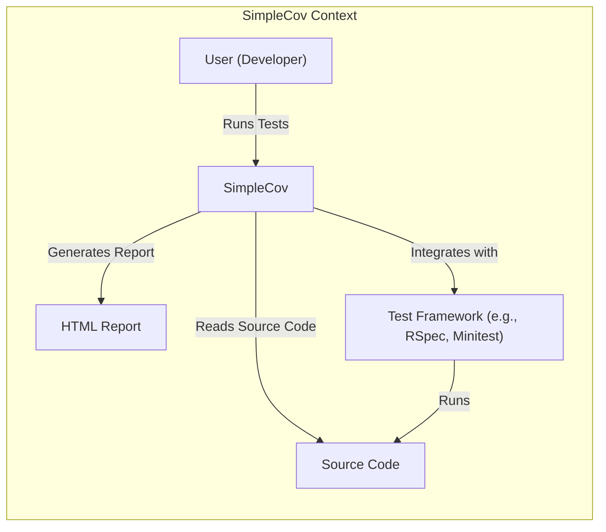
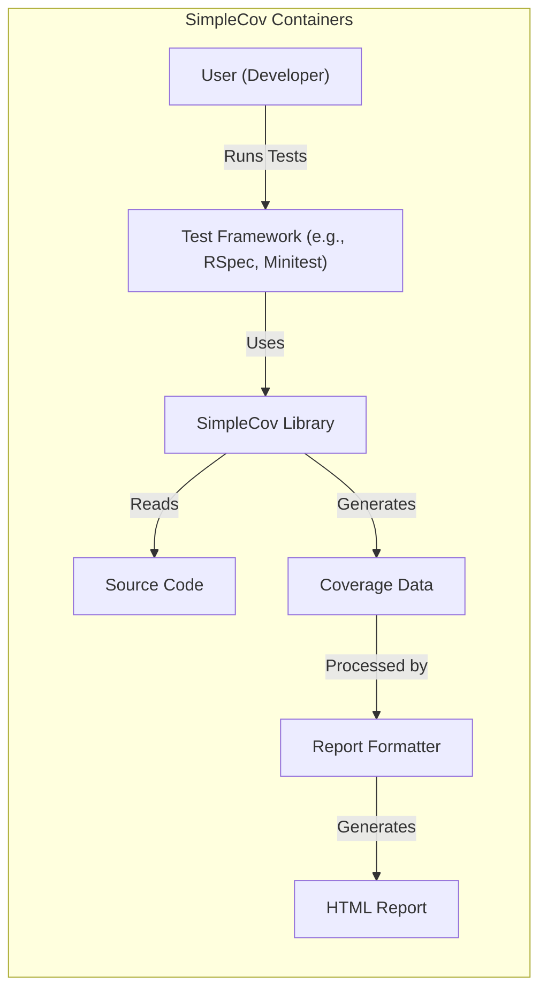
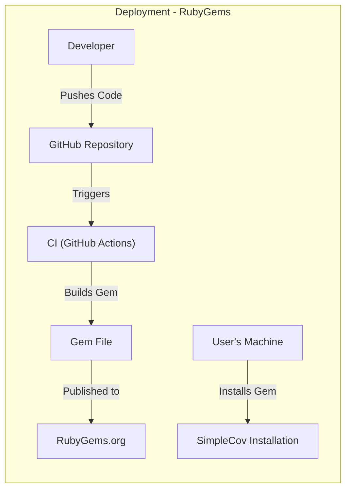
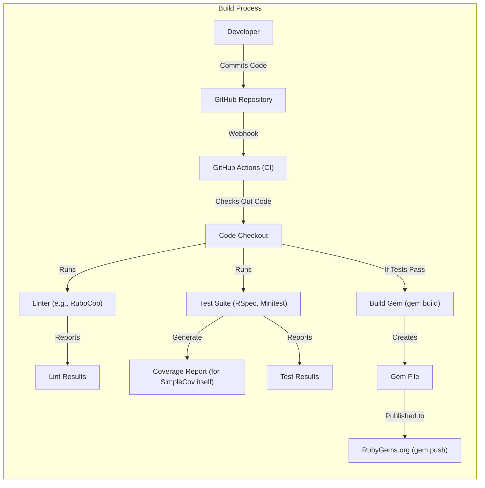

# BUSINESS POSTURE

SimpleCov is a code coverage analysis tool for Ruby. It's a widely used, open-source project that helps developers ensure their code is thoroughly tested.

Priorities and Goals:

*   Provide accurate and reliable code coverage reports.
*   Maintain ease of use and integration with various Ruby testing frameworks.
*   Ensure the tool itself is robust and doesn't introduce vulnerabilities into projects using it.
*   Maintain a high level of community trust and adoption.
*   Support a wide range of Ruby versions and testing frameworks.

Business Risks:

*   Inaccurate Coverage Reports: False positives or negatives in coverage reports could mislead developers, leading to untested code being deployed.
*   Security Vulnerabilities: If SimpleCov itself contains vulnerabilities, it could be exploited, potentially compromising the projects that use it. This is a significant risk as it could be a supply chain attack vector.
*   Performance Overhead: Excessive performance overhead could slow down test suites, discouraging developers from using the tool.
*   Compatibility Issues: Failure to support new Ruby versions or testing frameworks could lead to decreased adoption and relevance.
*   Loss of Community Trust: Any of the above issues could damage the project's reputation and lead to a decline in usage.

# SECURITY POSTURE

Existing Security Controls:

*   security control: Test Suite: SimpleCov has its own test suite to ensure its functionality and detect regressions. (Described in the project's README and test files.)
*   security control: Code Reviews: Contributions to the project are subject to code review by maintainers. (Visible in the GitHub pull request process.)
*   security control: Static Analysis: The project may use static analysis tools, although this isn't explicitly stated. (This is a common practice, but needs confirmation.)
*   security control: Dependency Management: The project uses Bundler to manage dependencies, which helps ensure known vulnerable versions are not used. (Gemfile and Gemfile.lock)

Accepted Risks:

*   accepted risk: Limited Formal Security Audits: As an open-source project, it likely doesn't have regular, formal security audits.
*   accepted risk: Reliance on Community Reporting: Vulnerability reporting relies heavily on the community discovering and reporting issues.
*   accepted risk: Potential for Unknown Vulnerabilities: Like any software, there's always the risk of unknown vulnerabilities.

Recommended Security Controls:

*   security control: Integrate SAST Tools: Integrate static application security testing (SAST) tools into the CI pipeline to automatically scan for potential vulnerabilities.
*   security control: Implement DAST Scanning: Consider using dynamic application security testing (DAST) to test the running application for vulnerabilities, particularly focusing on how SimpleCov interacts with the file system and other system resources.
*   security control: Formal Security Review: Conduct a formal security review, potentially through a community bug bounty program or by engaging a security consultant.
*   security control: Supply Chain Security: Implement measures to secure the software supply chain, such as signing releases and using tools to detect malicious dependencies.
*   security control: Security Policy: Create and publish a security policy that outlines how to report vulnerabilities and the project's approach to security.

Security Requirements:

*   Authentication: Not directly applicable, as SimpleCov is a command-line tool and doesn't involve user authentication.
*   Authorization: Not directly applicable, as SimpleCov operates within the permissions of the user running it.
*   Input Validation:
    *   File Paths: SimpleCov must handle file paths securely, preventing path traversal vulnerabilities.
    *   Configuration Files: If SimpleCov uses configuration files, it must validate their contents to prevent injection attacks.
    *   User-Provided Input: Any user-provided input (e.g., command-line arguments) must be validated to prevent injection attacks.
*   Cryptography:
    *   Data at Rest: If SimpleCov stores any sensitive data (which it ideally shouldn't), it should be encrypted.
    *   Data in Transit: Not directly applicable, as SimpleCov primarily operates locally.
*   Output Encoding: SimpleCov generates HTML reports. It must properly encode output to prevent cross-site scripting (XSS) vulnerabilities.

# DESIGN

## C4 CONTEXT

Element Descriptions:

*   Element:
    *   Name: User (Developer)
    *   Type: Person
    *   Description: A developer who uses SimpleCov to analyze code coverage.
    *   Responsibilities: Runs tests, configures SimpleCov, reviews coverage reports.
    *   Security controls: N/A - This is the user initiating the process.

*   Element:
    *   Name: SimpleCov
    *   Type: Software System
    *   Description: The code coverage analysis tool.
    *   Responsibilities: Analyzes code coverage, generates reports.
    *   Security controls: Input validation, output encoding, secure file handling.

*   Element:
    *   Name: HTML Report
    *   Type: Output
    *   Description: The HTML report generated by SimpleCov.
    *   Responsibilities: Displays code coverage information.
    *   Security controls: Output encoding (to prevent XSS).

*   Element:
    *   Name: Source Code
    *   Type: Input
    *   Description: The Ruby source code being analyzed.
    *   Responsibilities: N/A - This is the subject of analysis.
    *   Security controls: N/A - This is the input being analyzed.

*   Element:
    *   Name: Test Framework
    *   Type: Software System
    *   Description: The testing framework used by the project (e.g., RSpec, Minitest).
    *   Responsibilities: Executes tests.
    *   Security controls: Relies on the security of the test framework itself.

## C4 CONTAINER

Element Descriptions:

*   Element:
    *   Name: User (Developer)
    *   Type: Person
    *   Description: A developer who uses SimpleCov to analyze code coverage.
    *   Responsibilities: Runs tests, configures SimpleCov, reviews coverage reports.
    *   Security controls: N/A - This is the user initiating the process.

*   Element:
    *   Name: Test Framework
    *   Type: Container (Library/Framework)
    *   Description: The testing framework used by the project (e.g., RSpec, Minitest).
    *   Responsibilities: Executes tests, integrates with SimpleCov.
    *   Security controls: Relies on the security of the test framework itself.

*   Element:
    *   Name: SimpleCov Library
    *   Type: Container (Library)
    *   Description: The core SimpleCov library.
    *   Responsibilities: Analyzes code coverage during test execution.
    *   Security controls: Input validation (file paths, configuration), secure file handling.

*   Element:
    *   Name: Source Code
    *   Type: Input
    *   Description: The Ruby source code being analyzed.
    *   Responsibilities: N/A - This is the subject of analysis.
    *   Security controls: N/A - This is the input being analyzed.

*   Element:
    *   Name: Coverage Data
    *   Type: Data
    *   Description: Intermediate coverage data generated by SimpleCov.
    *   Responsibilities: Stores coverage information.
    *   Security controls: Secure file handling (if stored temporarily).

*   Element:
    *   Name: Report Formatter
    *   Type: Container (Component)
    *   Description: Processes coverage data and generates the final report.
    *   Responsibilities: Formats coverage data into a human-readable report (e.g., HTML).
    *   Security controls: Output encoding (to prevent XSS in HTML reports).

*   Element:
    *   Name: HTML Report
    *   Type: Output
    *   Description: The HTML report generated by SimpleCov.
    *   Responsibilities: Displays code coverage information.
    *   Security controls: Output encoding (to prevent XSS).

## DEPLOYMENT

Possible Deployment Solutions:

1.  RubyGems: SimpleCov is primarily distributed as a Ruby gem via RubyGems.org. This is the standard and recommended way to install and use SimpleCov.
2.  Source Code (GitHub): Users can also clone the repository directly from GitHub and build it themselves, although this is less common for typical usage.

Chosen Solution (RubyGems):

Element Descriptions:

*   Element:
    *   Name: Developer
    *   Type: Person
    *   Description: A SimpleCov maintainer.
    *   Responsibilities: Develops and maintains SimpleCov.
    *   Security controls: Code review, secure coding practices.

*   Element:
    *   Name: GitHub Repository
    *   Type: Code Repository
    *   Description: The SimpleCov source code repository on GitHub.
    *   Responsibilities: Stores the source code, manages versions.
    *   Security controls: Access controls, branch protection rules.

*   Element:
    *   Name: CI (GitHub Actions)
    *   Type: Continuous Integration System
    *   Description: GitHub Actions, used for automated builds and testing.
    *   Responsibilities: Runs tests, builds the gem.
    *   Security controls: Secure configuration, dependency checks.

*   Element:
    *   Name: Gem File
    *   Type: Artifact
    *   Description: The packaged SimpleCov gem file.
    *   Responsibilities: Contains the compiled code and metadata.
    *   Security controls: Gem signing (recommended).

*   Element:
    *   Name: RubyGems.org
    *   Type: Package Repository
    *   Description: The RubyGems package repository.
    *   Responsibilities: Hosts and distributes the SimpleCov gem.
    *   Security controls: RubyGems.org's security measures.

*   Element:
    *   Name: User's Machine
    *   Type: Environment
    *   Description: The developer's local machine or CI environment.
    *   Responsibilities: Where SimpleCov is installed and used.
    *   Security controls: User's system security.

*   Element:
    *   Name: SimpleCov Installation
    *   Type: Installed Software
    *   Description: The installed SimpleCov gem on the user's machine.
    *   Responsibilities: Runs code coverage analysis.
    *   Security controls: Relies on the security of the installed gem.

## BUILD

Build Process Description:

1.  Developer commits code to the GitHub repository.
2.  GitHub Actions is triggered via a webhook.
3.  The code is checked out.
4.  A linter (e.g., RuboCop) is run to check for code style and potential errors.
5.  The test suite (RSpec, Minitest) is run. This includes tests for SimpleCov itself, which generate a coverage report.
6.  Linting and test results are reported.
7.  If the tests pass, the gem is built using `gem build`.
8.  The resulting gem file is created.
9.  The gem file is published to RubyGems.org using `gem push` (this step typically requires authentication and may be restricted to maintainers).

Security Controls in Build Process:

*   security control: Code Review: All code changes are reviewed before being merged.
*   security control: Automated Testing: The test suite ensures functionality and helps prevent regressions.
*   security control: Linting: RuboCop (or similar) enforces code style and helps identify potential issues.
*   security control: CI/CD: GitHub Actions automates the build and testing process, ensuring consistency.
*   security control: Dependency Management: Bundler manages dependencies, reducing the risk of using vulnerable versions.
*   security control: (Recommended) SAST: Integrate a SAST tool into the GitHub Actions workflow.
*   security control: (Recommended) Gem Signing: Sign the gem file before publishing to RubyGems.org.

# RISK ASSESSMENT

Critical Business Processes:

*   Software Development: SimpleCov is a tool used in the software development process. Its primary function is to support the creation of well-tested, high-quality software.
*   Continuous Integration/Continuous Delivery (CI/CD): SimpleCov is often integrated into CI/CD pipelines to automatically assess code coverage.

Data Protection:

*   Source Code (Indirectly): SimpleCov processes source code, but it doesn't store it permanently. The sensitivity of the source code depends on the project using SimpleCov.
*   Coverage Data: SimpleCov generates coverage data, which represents which lines of code were executed during testing. This data is generally not considered highly sensitive, but it could potentially reveal information about the structure and logic of the code.
*   HTML Reports: The HTML reports generated by SimpleCov contain coverage data and may include snippets of source code. These reports should be treated with appropriate care, especially if they contain sensitive information.

Data Sensitivity:

*   Source Code: Varies depending on the project.
*   Coverage Data: Low to Medium.
*   HTML Reports: Low to Medium (potentially higher if source code snippets reveal sensitive information).

# QUESTIONS & ASSUMPTIONS

Questions:

*   Are there any specific compliance requirements (e.g., GDPR, HIPAA) that apply to projects using SimpleCov? (Assumption: No specific compliance requirements beyond general best practices.)
*   What is the expected level of security expertise of the typical SimpleCov user? (Assumption: Users have basic security awareness but may not be security experts.)
*   Are there any plans to add features that might introduce new security concerns (e.g., remote data collection, integration with external services)? (Assumption: No major feature changes planned that would significantly alter the security posture.)
*   Is there a documented process for handling security vulnerabilities? (Assumption: There is an informal process, but a formal security policy is recommended.)
*   What static analysis tools are currently used, if any? (Assumption: Some static analysis may be used, but needs confirmation.)
*   Is gem signing currently used when publishing to RubyGems.org? (Assumption: Not currently used, but highly recommended.)

Assumptions:

*   BUSINESS POSTURE: The primary goal is to provide a reliable and useful code coverage tool. Security is a high priority, but the project has limited resources.
*   SECURITY POSTURE: The project relies on community contributions and best practices for security. Formal security audits are not regularly performed.
*   DESIGN: SimpleCov operates primarily locally and doesn't involve complex network interactions or data storage. The main security concerns are related to input validation, output encoding, and potential vulnerabilities in the library itself.