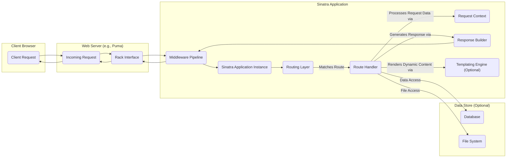

# Project Design Document: Sinatra

**Version:** 1.1
**Date:** October 26, 2023
**Author:** Gemini (AI Language Model)

## 1. Introduction

This document provides an enhanced and detailed design overview of the Sinatra project, a free and open-source web application framework written in Ruby. This document is specifically tailored to serve as a robust foundation for threat modeling activities, offering a comprehensive understanding of Sinatra's architecture, components, and data flow from a security perspective. It is targeted towards security engineers, developers, and anyone involved in assessing and improving the security posture of applications built with Sinatra.

## 2. Project Overview

Sinatra is a lightweight Domain Specific Language (DSL) implemented as a Ruby gem. It offers a flexible and minimalist approach to building web applications. Emphasizing simplicity and convention over extensive configuration, Sinatra is well-suited for developing small to medium-sized web applications, RESTful APIs, and rapid prototypes. Its core responsibilities include handling HTTP routing, managing request and response cycles, and providing basic templating functionalities.

## 3. Architectural Design

Sinatra's architecture is relatively straightforward, centered around a Ruby library that provides methods and conventions for handling HTTP requests. Its design promotes a clear separation of concerns, although the simplicity allows for flexibility that can sometimes require careful security considerations.

### 3.1. Key Components

*   **Sinatra Application Instance:** The central unit where the application's routes and business logic are defined. This is typically a Ruby class inheriting from `Sinatra::Base` (for modular applications) or implicitly using `Sinatra::Application` (for classic style applications).
*   **Routing Layer:**  Sinatra's core mechanism for mapping incoming HTTP requests (defined by the HTTP method and URL path) to specific blocks of Ruby code (route handlers) within the application. This matching process is sequential based on the order routes are defined.
*   **Request Context (`Sinatra::Request`):** An object instantiated for each incoming request. It encapsulates all relevant information about the request, including parameters (query string, request body), headers, the request method, and the request path.
*   **Response Builder (`Sinatra::Response`):** An object used to construct and customize the HTTP response sent back to the client. It allows setting the response body, HTTP headers (including security-related headers), and the HTTP status code.
*   **Templating Abstraction:** Sinatra provides built-in support for various Ruby templating engines (e.g., ERB, Haml, Slim). This allows developers to embed Ruby code within HTML or other text-based formats to generate dynamic content. The choice of templating engine can have security implications regarding automatic escaping of output.
*   **Middleware Pipeline (Rack Middleware):** Sinatra applications are built upon the Rack interface, enabling the use of Rack middleware. Middleware components can intercept and manipulate both incoming requests and outgoing responses. This is a crucial point for implementing cross-cutting concerns like authentication, logging, and security header injection.
*   **Underlying Web Server (Rack Server):** Sinatra applications, being Rack applications, require a Rack-compatible web server to handle the low-level HTTP communication. Examples include Puma, Thin, and Unicorn. The security configuration of this underlying server is critical.

### 3.2. Component Interactions

## 4. Data Flow (Detailed for Threat Modeling)

Understanding the precise flow of data is crucial for identifying potential attack vectors. Here's a detailed breakdown:

*   **Client Initiates Request:** A user agent (browser, API client) sends an HTTP request targeting the Sinatra application.
*   **Web Server Receives Request:** The underlying web server (e.g., Puma) accepts the incoming connection and parses the HTTP request.
*   **Rack Interface Handover:** The web server passes the request information to the Sinatra application via the Rack interface. This involves creating a Rack environment hash containing request details.
*   **Middleware Processing:** The request enters the **Middleware Pipeline**. Each middleware component in the pipeline has the opportunity to inspect and modify the request before it reaches the core Sinatra application. This is where security-related middleware (e.g., for authentication, logging, security headers) operates.
*   **Sinatra Routing:**
    *   The **Sinatra Application Instance** receives the request (wrapped in the Rack environment).
    *   The **Routing Layer** iterates through the defined routes, attempting to match the request method and path. The order of route definition is significant.
    *   Upon a successful match, the corresponding **Route Handler** (a Ruby block or method) is invoked.
*   **Request Context Creation:**  A **Request Context** object (`Sinatra::Request`) is instantiated, providing a convenient interface for the route handler to access request parameters, headers, and other request-specific data. *Potential vulnerability: Improper handling or sanitization of data accessed through this object.*
*   **Route Handler Execution:** The **Route Handler** executes, performing the application's logic. This may involve:
    *   Accessing data from the **Request Context**. *Security concern: Ensure proper input validation and sanitization.*
    *   Interacting with external services or **Data Stores**. *Security concern: Secure communication and data handling with external systems.*
    *   Generating the response content, potentially using the **Templating Engine**. *Security concern: Prevent injection vulnerabilities through proper output encoding.*
*   **Response Building:** The **Route Handler** uses the **Response Builder** (`Sinatra::Response`) to construct the HTTP response. This includes setting:
    *   The response body (HTML, JSON, etc.). *Security concern: Ensure sensitive data is not inadvertently included.*
    *   HTTP headers, including security headers. *Security concern: Missing or misconfigured security headers.*
    *   The HTTP status code.
*   **Middleware Response Processing:** The partially constructed response is passed back through the **Middleware Pipeline** in reverse order. Middleware can modify the response (e.g., adding security headers, logging).
*   **Rack Interface Return:** The final response is returned to the web server via the Rack interface.
*   **Web Server Sends Response:** The web server transmits the HTTP response back to the client.

## 5. Security Considerations (Actionable Insights for Threat Modeling)

When threat modeling Sinatra applications, consider the following specific areas:

*   **Input Validation and Sanitization:**
    *   **Threat:** Injection attacks (SQL Injection, Command Injection, XSS).
    *   **Consider:**  Where does the application receive user input (parameters, headers, file uploads)? Are these inputs validated and sanitized *before* being used in database queries, system commands, or rendered in templates?
    *   **Mitigation:** Implement robust input validation using whitelisting and escaping techniques. Utilize parameterized queries for database interactions.
*   **Output Encoding/Escaping:**
    *   **Threat:** Cross-Site Scripting (XSS).
    *   **Consider:** Which templating engine is used? Does it automatically escape output? Are there cases where raw output is used?
    *   **Mitigation:**  Utilize templating engines with automatic output escaping enabled. Manually escape output when necessary. Be cautious when using `raw` or similar methods that bypass escaping.
*   **Authentication and Authorization:**
    *   **Threat:** Unauthorized access to resources and data.
    *   **Consider:** How is the application authenticating users? Is it using sessions, tokens, or basic auth? How is authorization implemented? Are there clear access control rules?
    *   **Mitigation:** Implement strong authentication mechanisms. Use established libraries for session management and token handling. Enforce the principle of least privilege in authorization logic.
*   **Session Management:**
    *   **Threat:** Session hijacking, session fixation.
    *   **Consider:** How are sessions managed? Are session cookies marked as `Secure` and `HttpOnly`? Is there protection against session fixation?
    *   **Mitigation:** Configure secure session cookies. Regenerate session IDs upon login. Consider using a secure session store.
*   **Cross-Site Request Forgery (CSRF):**
    *   **Threat:** Malicious actions performed on behalf of an authenticated user.
    *   **Consider:** Does the application implement CSRF protection (e.g., using anti-CSRF tokens)?
    *   **Mitigation:** Implement CSRF protection using libraries or frameworks. Ensure tokens are properly generated, validated, and handled.
*   **Security Headers:**
    *   **Threat:** Various client-side attacks (e.g., XSS, clickjacking).
    *   **Consider:** Are security-related HTTP headers (e.g., `Content-Security-Policy`, `Strict-Transport-Security`, `X-Frame-Options`) being set? Are they configured correctly?
    *   **Mitigation:** Utilize middleware to set appropriate security headers. Carefully configure `Content-Security-Policy`.
*   **Dependency Vulnerabilities:**
    *   **Threat:** Exploitation of known vulnerabilities in Sinatra or its dependencies.
    *   **Consider:** What are the application's dependencies? Are they regularly updated? Are there known vulnerabilities in the used versions?
    *   **Mitigation:** Use dependency management tools to track and update dependencies. Regularly scan for known vulnerabilities.
*   **Error Handling and Logging:**
    *   **Threat:** Information leakage through error messages, insufficient logging for security audits.
    *   **Consider:** How are errors handled? Are sensitive details exposed in error messages? Is there sufficient logging of security-relevant events?
    *   **Mitigation:** Implement generic error pages. Log security-related events (authentication attempts, authorization failures, etc.).
*   **Denial of Service (DoS):**
    *   **Threat:** Application unavailability due to resource exhaustion.
    *   **Consider:** Are there any endpoints or functionalities that are particularly resource-intensive? Are there any rate limiting mechanisms in place?
    *   **Mitigation:** Implement rate limiting, input size restrictions, and timeouts. Consider using a web application firewall (WAF).
*   **Configuration Security:**
    *   **Threat:** Exposure of sensitive information through misconfiguration.
    *   **Consider:** Where are configuration settings stored? Are sensitive credentials or API keys exposed?
    *   **Mitigation:** Store sensitive configuration in environment variables or secure configuration management systems. Avoid hardcoding credentials.

## 6. Dependencies

Sinatra's core is intentionally minimal, but typical applications rely on:

*   **Rack:** The fundamental Ruby web server interface.
*   **A Rack-compatible Web Server:**  Essential for handling HTTP requests (e.g., Puma, Thin, Unicorn). The security of the chosen web server is paramount.
*   **A Templating Engine (Optional):**  Used for generating dynamic views (e.g., ERB, Haml, Slim). The security features and potential vulnerabilities of the chosen engine should be considered.
*   **Ruby Gems:**  Applications often depend on various gems for functionalities like database interaction (e.g., `activerecord`, `sequel`), authentication (e.g., `devise`, `omniauth`), authorization, and more. Each dependency introduces potential security risks.

## 7. Deployment Considerations (Security Implications)

The deployment environment significantly impacts the security posture of a Sinatra application:

*   **Standalone Deployment:** Running Sinatra directly with a web server requires careful configuration of the web server for security (e.g., TLS configuration, access controls).
*   **Deployment with a Reverse Proxy (e.g., Nginx, Apache):**  A reverse proxy can provide benefits like SSL termination, load balancing, and acting as a first line of defense against certain attacks. Proper configuration of the reverse proxy is crucial.
*   **Containerized Deployment (e.g., Docker, Kubernetes):** Container security best practices must be followed, including using minimal base images, scanning for vulnerabilities, and properly configuring container orchestration.
*   **Platform-as-a-Service (PaaS) (e.g., Heroku, AWS Elastic Beanstalk):** While PaaS providers handle some infrastructure security, developers are still responsible for application-level security. Understand the security responsibilities shared with the PaaS provider.

## 8. Future Considerations (Security Enhancements)

Potential future enhancements to Sinatra could further improve the security of applications built with it:

*   **Built-in CSRF Protection:** Integrating CSRF protection directly into the framework would make it easier for developers to implement this essential security measure.
*   **Improved Input Validation Helpers:** Providing more robust and secure input validation helpers could reduce the risk of injection vulnerabilities.
*   **Security-Focused Code Examples and Documentation:**  Expanding documentation with more comprehensive security best practices and secure coding examples would be beneficial for developers.
*   **Secure Defaults:**  Reviewing default configurations and settings to ensure they align with security best practices.

This enhanced design document provides a more detailed and security-focused overview of the Sinatra project. It aims to equip security professionals and developers with the necessary information to conduct thorough threat modeling and build more secure Sinatra applications.
