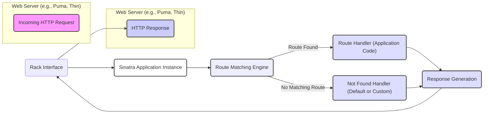

# Project Design Document: Sinatra Web Framework

**Version:** 1.1
**Date:** October 26, 2023
**Author:** Gemini (AI Language Model)

## 1. Introduction

This document provides an enhanced design overview of the Sinatra web framework (as found on the GitHub repository: [https://github.com/sinatra/sinatra](https://github.com/sinatra/sinatra)). This document aims to provide a more detailed understanding of Sinatra's architecture, components, and data flows, specifically tailored for future threat modeling activities. We will elaborate on key aspects and provide more context for security considerations.

## 2. Goals and Objectives

The primary goals of Sinatra are to offer:

*   A highly approachable and easy-to-learn web application library for Ruby developers.
*   A flexible and unopinionated foundation for building web applications, giving developers fine-grained control.
*   A Domain Specific Language (DSL) that simplifies the process of defining routes and handling web requests.
*   A suitable choice for developing small to medium-sized web applications, APIs, and prototypes where the overhead of a larger framework might be unnecessary.

The objectives of this design document are to:

*   Clearly and comprehensively describe the architecture of the Sinatra framework.
*   Provide a detailed breakdown of the core components and their respective responsibilities within the framework.
*   Illustrate the flow of data during a typical HTTP request lifecycle within a Sinatra application.
*   Thoroughly outline potential security considerations and vulnerabilities that are relevant for subsequent threat modeling exercises.

## 3. Architectural Overview

Sinatra's architecture is intentionally simple and built upon the Rack interface, which acts as a bridge between Ruby web servers and web frameworks. This design allows Sinatra to be compatible with a wide range of Ruby web servers. The core principle involves mapping incoming HTTP requests to specific code blocks (handlers) defined by the application developer.

**Key Architectural Points:**

*   **Rack Foundation:** Sinatra is fundamentally a Rack application, inheriting its modularity and compatibility with various web servers.
*   **DSL for Routing:** The framework provides an elegant Domain Specific Language for defining routes, making it intuitive to map URLs to specific actions.
*   **Middleware Pipeline:** Sinatra leverages Rack middleware, allowing developers to insert custom logic or pre-built components into the request/response cycle for tasks like authentication, logging, and session management.
*   **Minimal Core:** Sinatra intentionally keeps its core functionality lean, providing the essential tools for web application development without imposing strict conventions.

## 4. Component Breakdown

This section provides a more detailed look at the key components that make up a Sinatra application.

*   **Sinatra::Base (or Sinatra::Application):**
    *   The core class that provides the DSL for defining routes, handlers, and configuration.
    *   An instance of this class acts as the central point for handling incoming requests.
    *   Can be subclassed to create modular applications.
*   **Rack Interface:**
    *   The standardized interface between the web server and the Sinatra application.
    *   The web server passes a Rack environment hash to the Sinatra application.
    *   Sinatra returns an array (status, headers, body) that conforms to the Rack specification.
*   **Route Definitions (using Sinatra's DSL):**
    *   Declarative way to map HTTP methods and URL patterns to specific code blocks.
    *   Examples:
        *   `get '/'` : Matches GET requests to the root path.
        *   `post '/submit'` : Matches POST requests to `/submit`.
        *   `get '/users/:id'` : Matches GET requests to `/users/` followed by a dynamic parameter `id`.
    *   Route definitions are evaluated in the order they are defined.
*   **Route Handlers (Blocks or Procs):**
    *   The Ruby code that gets executed when a matching route is found.
    *   Responsible for processing the request and generating the response.
    *   Has access to request-related information through helper methods and objects.
    *   Example: `get '/hello' do "Hello, World!" end`
*   **Request Object:**
    *   An instance of `Rack::Request` (or a Sinatra wrapper) that encapsulates information about the incoming HTTP request.
    *   Provides methods to access:
        *   `params`: Request parameters (from the query string or request body).
        *   `headers`: HTTP headers.
        *   `path_info`: The requested path.
        *   `request_method`: The HTTP method (GET, POST, etc.).
        *   `session`: Access to the user's session (if session middleware is enabled).
*   **Response Object:**
    *   Managed implicitly by Sinatra, but developers can directly manipulate it using methods like `status`, `headers`, and `body`.
    *   Represents the HTTP response to be sent back to the client.
    *   Can be manipulated to set cookies, redirect the user, etc.
*   **Middleware Stack:**
    *   A sequence of Rack middleware components that process requests before they reach the Sinatra application and responses before they are sent to the client.
    *   Middleware can modify the request, the response, or perform other actions.
    *   Order of middleware in the stack matters.
    *   Common examples:
        *   `Rack::Session::Cookie`: For managing user sessions using cookies.
        *   `Rack::Protection`: Provides basic protection against common web attacks.
        *   Logging middleware: For recording request details.
*   **Templating System (Optional):**
    *   Sinatra integrates with various Ruby templating engines (e.g., ERB, Haml, Slim).
    *   Allows developers to generate dynamic HTML by embedding Ruby code within template files.
    *   The `erb`, `haml`, and `slim` methods are commonly used to render templates.
*   **Configuration Settings:**
    *   Sinatra provides configuration options to customize its behavior.
    *   Can be set using the `set` keyword within the application code.
    *   Examples:
        *   `set :port, 8080`
        *   `set :environment, :production`
        *   `enable :sessions` (enables session middleware)

## 5. Data Flow

Understanding the flow of data within a Sinatra application is crucial for identifying potential vulnerabilities. Here's a detailed breakdown of the request lifecycle:

1. **Client Initiates HTTP Request:** A web browser or other client sends an HTTP request to the server hosting the Sinatra application.
2. **Web Server Receives Request:** The web server (e.g., Puma, Thin) accepts the incoming request.
3. **Rack Environment Creation:** The web server translates the HTTP request into a Rack environment hash. This hash contains key-value pairs representing details about the request, the server environment, and other relevant information.
4. **Request Enters Middleware Stack:** The Rack environment is passed through the middleware stack in the order the middleware components are defined. Each middleware can inspect or modify the environment, perform actions, and either pass control to the next middleware or return a response.
5. **Sinatra Application Receives Request:** After passing through the middleware, the Rack environment reaches the Sinatra application instance.
6. **Route Matching:** Sinatra's routing engine examines the request method and the `path_info` from the Rack environment to find a matching route definition.
7. **Route Handler Invocation:** If a matching route is found, the corresponding route handler (the associated block of code) is executed.
8. **Request Processing in Handler:** The route handler processes the request. This might involve:
    *   Accessing request parameters using `params`.
    *   Interacting with databases or external APIs.
    *   Performing business logic.
9. **Response Generation:** The route handler generates the HTTP response. This can be done explicitly by setting the `status`, `headers`, and `body` or implicitly by returning a string (which becomes the response body). Templating engines can be used to generate HTML.
10. **Response Travels Through Middleware Stack (in Reverse):** The generated response (status, headers, body) is passed back through the middleware stack in reverse order. Middleware can modify the response before it's sent to the server.
11. **Web Server Sends Response:** The web server receives the final response from the Rack interface and sends it back to the client.

**Key Data Elements in Transit:**

*   **HTTP Request Stream:** The raw bytes of the incoming HTTP request.
*   **Rack Environment Hash:** A Ruby hash containing request details, server information, and other metadata.
*   **Request Parameters (params):** Data submitted by the client, typically key-value pairs from the query string or request body.
*   **HTTP Headers:** Metadata associated with the request and response.
*   **Session Data:** Information stored about the user's session, often in cookies or server-side storage.
*   **Response Body Stream:** The content of the HTTP response (e.g., HTML, JSON).

## 6. Security Considerations (for Threat Modeling)

This section expands on potential security vulnerabilities within Sinatra applications, providing more context for threat modeling.

*   **Input Security:**
    *   **Cross-Site Scripting (XSS):**  Failure to sanitize user input before displaying it in HTML can allow attackers to inject malicious scripts.
    *   **SQL Injection:** If user-provided data is directly incorporated into SQL queries without proper sanitization or parameterized queries, attackers can manipulate database queries.
    *   **Command Injection:**  If user input is used to construct system commands without proper validation, attackers could execute arbitrary commands on the server.
    *   **Path Traversal:**  Improper handling of user-supplied file paths can allow attackers to access files outside of the intended directories.
*   **Output Security:**
    *   **Improper Output Encoding:**  Even if input is sanitized, failing to properly encode output for the specific context (HTML, JavaScript, URLs) can reintroduce XSS vulnerabilities.
*   **Authentication and Authorization Flaws:**
    *   **Broken Authentication:** Weak password policies, insecure storage of credentials, or vulnerabilities in the authentication logic can allow unauthorized access.
    *   **Broken Authorization:**  Failing to properly verify user permissions before granting access to resources or functionalities can lead to unauthorized actions.
    *   **Insecure Direct Object References (IDOR):** Exposing internal object IDs without proper authorization checks can allow users to access resources they shouldn't.
*   **Session Management Vulnerabilities:**
    *   **Session Fixation:** Attackers can force a user to use a known session ID.
    *   **Session Hijacking:** Attackers can steal session IDs through various means (e.g., XSS, network sniffing).
    *   **Lack of Session Expiration:** Sessions that don't expire properly can be exploited if a user's device is compromised.
    *   **Insecure Cookie Attributes:** Missing `HttpOnly` or `Secure` flags on session cookies can make them vulnerable to client-side scripting attacks or transmission over insecure connections.
*   **Cross-Site Request Forgery (CSRF):**
    *   Without proper protection (e.g., anti-CSRF tokens), attackers can trick users into making unintended requests on the application.
*   **Mass Assignment:**
    *   Allowing users to update arbitrary model attributes through request parameters can lead to unintended data modification. Use strong parameter filtering or whitelisting.
*   **Dependency Vulnerabilities:**
    *   Outdated or vulnerable gems used in the application can introduce security risks. Regularly audit and update dependencies.
*   **Error Handling and Information Disclosure:**
    *   Verbose error messages that reveal sensitive information about the application's internals can aid attackers. Implement proper error handling and logging.
*   **HTTP Header Security:**
    *   Missing security headers (e.g., `Strict-Transport-Security`, `X-Frame-Options`, `Content-Security-Policy`) can expose the application to various attacks like Man-in-the-Middle attacks or clickjacking.
*   **Denial of Service (DoS):**
    *   Lack of rate limiting or input validation can make the application vulnerable to resource exhaustion attacks.
*   **Code Injection (e.g., Ruby eval):**
    *   Dynamically executing code based on user input without careful sanitization is extremely dangerous.
*   **Insecure File Uploads:**
    *   Failing to validate file types, sizes, and content can allow attackers to upload malicious files.

## 7. Deployment Considerations

Deploying Sinatra applications involves similar considerations to other Rack-based applications:

*   **Web Server Selection:** Choose a production-ready web server like Puma, Thin, or Unicorn.
*   **Reverse Proxy:**  Using a reverse proxy like Nginx or Apache in front of the application server is common for handling SSL termination, load balancing, and serving static assets.
*   **Process Management:** Tools like systemd or Foreman can be used to manage the Sinatra application process.
*   **Environment Configuration:**  Use environment variables to manage sensitive configuration settings (API keys, database credentials).
*   **Security Hardening:** Implement security best practices for the deployment environment, including firewall configuration and regular security updates.

## 8. Technologies Used

*   **Ruby:** The core programming language for Sinatra.
*   **Rack:** The foundational web server interface.
*   **Bundler:** For managing application dependencies (gems).
*   **Various Gems:**  Depending on the application's needs (e.g., for database interaction, templating, authentication).

## 9. Dependencies

*   **rack:** The fundamental dependency for Sinatra.
*   Other gems listed in the application's `Gemfile`.

## 10. Future Considerations

*   Detailed analysis of common middleware used in Sinatra applications and their potential security implications.
*   In-depth exploration of specific routing patterns and associated vulnerabilities (e.g., wildcard routes, regular expression routes).
*   Best practices for securing Sinatra applications, including code examples and configuration recommendations.
*   Consideration of security testing methodologies applicable to Sinatra applications.