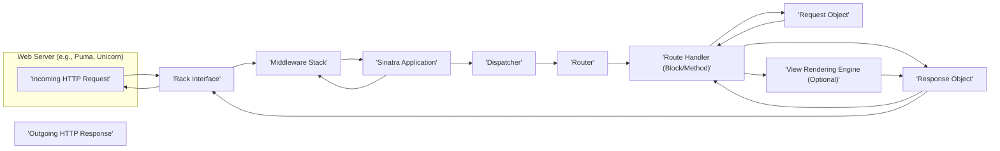

# Project Design Document: Sinatra Web Framework

**Version:** 1.1
**Date:** October 26, 2023
**Author:** AI Software Architect

## 1. Introduction

This document provides an enhanced architectural design of the Sinatra web framework, building upon the previous version. It offers a more detailed explanation of the key components, their interactions, and the overall structure of the framework, with a stronger focus on aspects relevant to security analysis and threat modeling. This document serves as a comprehensive reference for understanding Sinatra's architecture and will be used as a foundational input for subsequent threat modeling activities.

## 2. Goals and Objectives

The primary goals of this enhanced design document are to:

*   Provide a more granular articulation of the architectural components within the Sinatra framework.
*   Elaborate on the interactions and data flow between these components, including specific data passed.
*   Offer a deeper understanding of the framework's internal structure for more effective security analysis.
*   Serve as a refined and more detailed reference point for threat modeling and security assessments.

## 3. Architectural Overview

Sinatra is a lightweight and flexible Domain Specific Language (DSL) written in Ruby for creating web applications with minimal effort. It adheres to the Rack interface, ensuring compatibility with various Ruby web servers.

Here's a more detailed architectural diagram:



## 4. Component Description

This section provides a more detailed description of the key components within the Sinatra framework:

*   **Web Server (e.g., Puma, Unicorn):**  The foundational layer responsible for accepting incoming HTTP requests from clients. It translates network requests into a format understandable by Rack applications. Sinatra relies on external web servers for production deployments.
*   **Rack Interface:** A standardized Ruby interface (`Rack::Handler` and `Rack::Builder`) that defines the communication protocol between web servers and web frameworks. Sinatra applications are essentially Rack applications, receiving a Rack environment hash and returning a Rack response array.
*   **Sinatra Application:** The central component, typically an instance of `Sinatra::Base` or a subclass. It encapsulates the application's routing logic, middleware configuration, and settings. It receives the Rack environment and orchestrates the request processing.
*   **Dispatcher:**  The core logic within the Sinatra application responsible for receiving the Rack environment and determining the appropriate route handler to execute. It iterates through registered routes, matching the incoming request method and path.
    *   It manages the order in which routes are evaluated.
    *   It handles "before" and "after" filters associated with routes.
*   **Router:**  Manages the collection of defined routes. Each route associates an HTTP method (GET, POST, etc.) and a URL pattern with a specific handler (a code block or method).
    *   The router uses pattern matching (including regular expressions) to match incoming request paths.
    *   It extracts parameters from the URL based on the defined patterns.
*   **Route Handler (Block/Method):**  The user-defined Ruby code that executes when a route matches the incoming request. This code contains the core application logic:
    *   Accesses request data through the `request` object.
    *   Performs actions based on the request.
    *   Generates the response, potentially using the `response` object or rendering a view.
*   **Request Object:** An instance of `Sinatra::Request` that provides an interface for accessing information about the incoming HTTP request:
    *   Headers (`request.env`)
    *   Parameters (query string, request body) (`params`)
    *   Path information (`request.path_info`)
    *   Cookies (`request.cookies`)
    *   Session data (`session`)
*   **Response Object:** An instance of `Sinatra::Response` used to construct the HTTP response sent back to the client:
    *   Setting the status code (`response.status = 200`)
    *   Setting headers (`response['Content-Type'] = 'text/html'`)
    *   Setting the response body (`response.body = 'Hello, world!'`)
    *   Managing cookies (`response.set_cookie`)
*   **Middleware Stack:** An ordered collection of Rack middleware components that intercept and process requests before they reach the Sinatra application and responses before they are sent back to the client.
    *   Middleware can modify the request or response.
    *   Examples include logging, authentication, session management, and security headers.
    *   The order of middleware in the stack is significant.
*   **View Rendering Engine (Optional):**  Sinatra integrates with various Ruby templating engines (e.g., ERB, Haml, Slim) to generate dynamic HTML or other output.
    *   Takes data from the route handler and a template file as input.
    *   Produces the final response body.

## 5. Data Flow

The following steps provide a more detailed description of the data flow within a Sinatra application:

1. **Incoming HTTP Request:** A client initiates an HTTP request targeting the web server. This request includes headers, potentially a body, and targets a specific URL.
2. **Rack Interface (Server to Application):** The web server translates the incoming request into a Rack environment hash. This hash contains information like request method, path, headers, and server environment variables. This hash is passed to the first middleware in the stack.
3. **Middleware Processing (Request Phase):** Each middleware in the stack receives the Rack environment. Middleware can:
    *   Inspect and modify the environment.
    *   Short-circuit the request and return a response directly.
    *   Perform actions before passing the request to the next middleware or the Sinatra application.
4. **Sinatra Application Receives Request:** After passing through the middleware stack, the Rack environment reaches the Sinatra application instance.
5. **Dispatcher Invoked:** The Sinatra application's dispatcher receives the Rack environment.
6. **Routing:** The dispatcher iterates through the registered routes in the router. For each route, it checks if the request method and path match the route's definition.
    *   Path matching may involve regular expressions and parameter extraction.
7. **Route Handler Selection:** Once a matching route is found, the dispatcher identifies the associated route handler (the code block or method).
8. **Route Handler Execution:** The selected route handler is executed.
    *   The handler has access to the `request` object, populated with data from the Rack environment.
    *   The handler can interact with external services, databases, etc.
    *   The handler can manipulate the `response` object to set headers, cookies, and the response body.
9. **Optional View Rendering:** If the route handler needs to render a view, it invokes the configured template engine, passing data to be embedded in the template. The template engine generates the HTML or other output for the response body.
10. **Middleware Processing (Response Phase):** After the route handler (and optional view rendering) completes, the `response` object (along with the status and headers) is passed back through the middleware stack in reverse order. Middleware can:
    *   Inspect and modify the response (e.g., add security headers).
    *   Perform logging or other post-processing tasks.
11. **Rack Interface (Application to Server):** The Sinatra application (or the last middleware in the stack) returns a Rack response array: `[status_code, headers_hash, response_body]`.
12. **Outgoing HTTP Response:** The web server receives the Rack response and constructs the final HTTP response, sending it back to the client.

Here's a more detailed flowchart illustrating the data flow:

```mermaid
graph TD
    A["'Incoming Request'"] --> B("'Rack Middleware Stack (Request)'");
    B --> C("'Sinatra Dispatcher'"]);
    C --> D("'Router: Match Route (Method & Path)'");
    D -- "'Route Found'" --> E("'Execute Route Handler'");
    D -- "'No Route Found'" --> F("'Error Handling (e.g., 404)'");
    E --> G("'Access Request Object (Params, Headers, etc.)'");
    E --> H("'Manipulate Response Object (Headers, Body, Cookies)'");
    E --> I("'Optional: Invoke View Rendering Engine'");
    I --> H;
    H --> J("'Rack Middleware Stack (Response)'");
    J --> K("'Outgoing Response'"];
    F --> J;
```

## 6. Security Considerations (Detailed)

This section provides a more detailed examination of security considerations relevant to the Sinatra framework, categorized by component and data flow stage.

*   **Web Server:**
    *   **Vulnerabilities:** Misconfiguration of the web server can lead to vulnerabilities (e.g., exposing sensitive files, insecure TLS settings).
    *   **Threats:**  Man-in-the-middle attacks, denial-of-service attacks.
*   **Rack Interface:**
    *   **Vulnerabilities:** While the interface itself is generally secure, vulnerabilities in specific Rack implementations or middleware can be exploited.
    *   **Threats:**  Request smuggling if the server and application interpret the interface differently.
*   **Middleware Stack:**
    *   **Vulnerabilities:**  Security flaws in individual middleware components (e.g., authentication bypasses, XSS vulnerabilities in logging middleware). Incorrect ordering of middleware can also introduce vulnerabilities.
    *   **Threats:**  Various attacks depending on the middleware's function (e.g., authentication bypass, information disclosure).
*   **Sinatra Application & Dispatcher:**
    *   **Vulnerabilities:**  Improper route handling logic could lead to unintended access or actions.
    *   **Threats:**  Authorization bypass, information disclosure.
*   **Router:**
    *   **Vulnerabilities:**  Regex denial-of-service (ReDoS) if complex regular expressions are used in route definitions. Inconsistent routing logic can lead to unexpected behavior.
    *   **Threats:**  Denial of service, potential for bypassing intended access controls.
*   **Route Handler:**
    *   **Vulnerabilities:**  This is where most application-level vulnerabilities reside:
        *   **Input Validation Issues:** SQL injection, command injection, cross-site scripting (XSS).
        *   **Business Logic Flaws:**  Authorization errors, insecure direct object references (IDOR).
        *   **Output Encoding Issues:**  XSS vulnerabilities.
    *   **Threats:**  Data breaches, unauthorized access, manipulation of data, execution of arbitrary code.
*   **Request Object:**
    *   **Vulnerabilities:**  Reliance on user-controlled data without proper sanitization can lead to injection attacks.
    *   **Threats:**  SQL injection, command injection, XSS.
*   **Response Object:**
    *   **Vulnerabilities:**  Incorrectly setting headers can lead to security issues (e.g., missing security headers). Failure to properly encode output can lead to XSS.
    *   **Threats:**  XSS, clickjacking (if `X-Frame-Options` is missing), information disclosure (if sensitive data is included in headers).
*   **View Rendering Engine:**
    *   **Vulnerabilities:**  Template injection vulnerabilities if user input is directly embedded into templates without proper escaping.
    *   **Threats:**  Remote code execution, XSS.
*   **Session Management:**
    *   **Vulnerabilities:**  Insecure session cookie handling (e.g., lack of `HttpOnly` or `Secure` flags), predictable session IDs, session fixation.
    *   **Threats:**  Session hijacking, unauthorized access.
*   **Error Handling:**
    *   **Vulnerabilities:**  Verbose error messages can leak sensitive information about the application's internal workings.
    *   **Threats:**  Information disclosure, aiding attackers in identifying vulnerabilities.

## 7. Deployment Considerations (Security Focused)

The deployment environment significantly impacts the security posture of a Sinatra application.

*   **Bare Metal Servers/VMs:** Requires careful manual configuration and hardening of the operating system, network, and web server. Security updates and patching are the responsibility of the deployer.
*   **Containers (e.g., Docker):**  Provides isolation but requires secure container image creation and management. Vulnerabilities in base images or misconfigurations in container orchestration can introduce risks.
*   **Platform as a Service (PaaS):**  Often handles infrastructure security, but developers still need to be mindful of application-level security and the PaaS provider's security practices. Shared tenancy can introduce potential risks.
*   **Reverse Proxies (e.g., Nginx, Apache):**  Can enhance security by providing features like TLS termination, request filtering, and protection against common web attacks. Proper configuration is crucial.
*   **Network Security:** Firewalls, intrusion detection/prevention systems (IDS/IPS), and network segmentation are important for protecting the application environment.
*   **Secrets Management:** Securely storing and managing sensitive credentials (e.g., database passwords, API keys) is critical. Avoid hardcoding secrets in the application code.

## 8. Technologies Used

*   **Programming Language:** Ruby
*   **Web Framework:** Sinatra
*   **Web Server Interface:** Rack
*   **Template Engines (Optional):** ERB, Haml, Slim, Liquid, etc.
*   **Testing Frameworks (Optional):** RSpec, Minitest, Cucumber
*   **Web Servers (Deployment):** Puma, Unicorn, Thin, Webrick (development only)
*   **Reverse Proxies (Optional):** Nginx, Apache

## 9. Future Considerations

*   Detailed analysis of specific security best practices for Sinatra development.
*   Exploration of common security-focused middleware for Sinatra applications.
*   Guidance on secure configuration of different deployment environments for Sinatra.
*   Integration with security scanning tools and vulnerability management processes.

This enhanced design document provides a more in-depth understanding of the Sinatra web framework's architecture, with a strong emphasis on security considerations. This detailed information will be invaluable for conducting thorough threat modeling and implementing appropriate security measures.