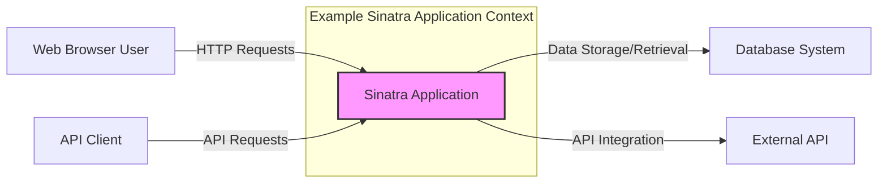
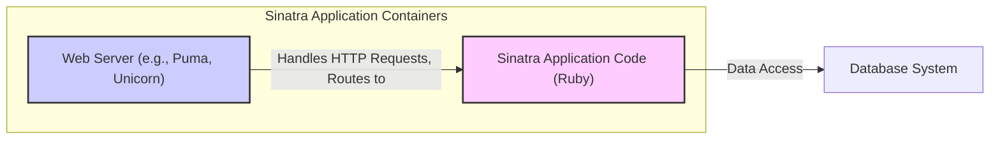
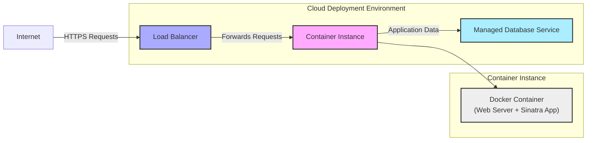

# BUSINESS POSTURE

This project, Sinatra, is a Domain Specific Language (DSL) written in Ruby that provides a minimal and flexible framework for creating web applications. Its primary business priority is to enable rapid development of web applications and APIs with a focus on simplicity and ease of use for developers.

- Business Priorities and Goals:
  - Rapid web application development.
  - Ease of use and developer productivity.
  - Flexibility and minimal framework overhead.
  - Suitable for small to medium-sized web applications, APIs, and prototypes.

- Most Important Business Risks:
  - Security vulnerabilities in applications built with Sinatra due to its minimalist nature and reliance on developer implementation for security controls.
  - Risk of insecure configurations if developers are not security-aware.
  - Potential for supply chain vulnerabilities if dependencies are not managed securely.
  - Risk of data breaches if applications handle sensitive data without proper security measures.

# SECURITY POSTURE

Sinatra, being a lightweight framework, provides the building blocks for web applications but relies heavily on the developer to implement security controls.

- Existing Security Controls:
  - security control: HTTPS support - Implemented through web server configuration (e.g., Nginx, Apache) and application configuration.
  - security control: Session management - Provided by Rack middleware, allowing for session-based authentication.
  - security control: Input validation guidance - Documented best practices for developers to implement input validation within their applications.
  - security control: Protection against common web vulnerabilities - Framework design aims to avoid introducing common vulnerabilities, but developer implementation is crucial.

- Accepted Risks:
  - accepted risk: Reliance on developer responsibility for implementing security controls.
  - accepted risk: Potential for insecure applications if developers lack security expertise.
  - accepted risk: Default configurations might not be secure out-of-the-box and require developer hardening.

- Recommended Security Controls:
  - security control: Implement static application security testing (SAST) tools in the development pipeline to identify potential vulnerabilities in Sinatra applications.
  - security control: Implement dependency vulnerability scanning to identify and manage vulnerabilities in Sinatra application dependencies.
  - security control: Provide secure coding guidelines and training for developers using Sinatra, emphasizing common web security vulnerabilities and best practices.
  - security control: Encourage and facilitate security code reviews for Sinatra applications, especially those handling sensitive data or critical business processes.
  - security control: Implement dynamic application security testing (DAST) for deployed Sinatra applications to identify runtime vulnerabilities.

- Security Requirements:
  - Authentication:
    - Requirement: Applications built with Sinatra should implement robust authentication mechanisms to verify user identity.
    - Requirement: Support for various authentication methods, such as username/password, multi-factor authentication, and integration with identity providers (e.g., OAuth 2.0, SAML).
    - Requirement: Secure storage of authentication credentials, avoiding storing passwords in plaintext.
  - Authorization:
    - Requirement: Applications should implement fine-grained authorization controls to manage user access to resources and functionalities based on roles and permissions.
    - Requirement: Principle of least privilege should be applied, granting users only the necessary permissions.
    - Requirement: Authorization logic should be consistently enforced across the application.
  - Input Validation:
    - Requirement: All user inputs must be validated to prevent injection attacks (e.g., SQL injection, cross-site scripting).
    - Requirement: Input validation should be performed on both client-side and server-side.
    - Requirement: Use parameterized queries or ORM features to prevent SQL injection.
    - Requirement: Encode outputs properly to prevent cross-site scripting (XSS).
  - Cryptography:
    - Requirement: Sensitive data at rest and in transit must be encrypted.
    - Requirement: Use HTTPS to encrypt all communication between clients and the Sinatra application.
    - Requirement: Implement encryption for sensitive data stored in databases or other persistent storage.
    - Requirement: Use strong and up-to-date cryptographic algorithms and libraries.
    - Requirement: Securely manage cryptographic keys.

# DESIGN

This section describes the design of a typical web application built using the Sinatra framework.

## C4 CONTEXT

- Context Diagram Elements:
  - - Name: "Sinatra Application"
    - Type: Software System
    - Description: The web application built using the Sinatra framework. It handles user requests, processes data, and interacts with other systems.
    - Responsibilities:
      - Handling HTTP requests from web browsers and API clients.
      - Implementing application logic and business rules.
      - Interacting with databases for data persistence.
      - Integrating with external APIs for additional functionalities.
    - Security controls:
      - Input validation.
      - Authentication and authorization.
      - Session management.
      - HTTPS enforcement.
      - Security logging and monitoring.

  - - Name: "Web Browser User"
    - Type: Person
    - Description: End-users accessing the web application through a web browser.
    - Responsibilities:
      - Interacting with the application's user interface.
      - Providing input data to the application.
      - Consuming application outputs.
    - Security controls:
      - Browser security features (e.g., Content Security Policy, XSS protection).
      - User awareness training on phishing and social engineering.

  - - Name: "API Client"
    - Type: Software System
    - Description: External systems or applications that interact with the Sinatra application through its API endpoints.
    - Responsibilities:
      - Sending API requests to the application.
      - Receiving and processing API responses.
      - Integrating with the application's functionalities.
    - Security controls:
      - API key management or other API authentication mechanisms.
      - Rate limiting to prevent abuse.
      - Input validation on API requests.

  - - Name: "Database System"
    - Type: Software System
    - Description: A database system used by the Sinatra application to store and retrieve persistent data. Examples include PostgreSQL, MySQL, SQLite.
    - Responsibilities:
      - Storing application data securely and reliably.
      - Providing data access to the Sinatra application.
      - Ensuring data integrity and availability.
    - Security controls:
      - Database access controls and authentication.
      - Data encryption at rest and in transit.
      - Regular database backups.
      - Database vulnerability patching and hardening.

  - - Name: "External API"
    - Type: Software System
    - Description: External services or APIs that the Sinatra application integrates with to provide additional functionalities. Examples include payment gateways, social media APIs, third-party data providers.
    - Responsibilities:
      - Providing external functionalities to the Sinatra application.
      - Authenticating and authorizing requests from the Sinatra application.
      - Ensuring API availability and reliability.
    - Security controls:
      - API authentication and authorization mechanisms.
      - Secure API communication (HTTPS).
      - API usage monitoring and rate limiting.

## C4 CONTAINER

- Container Diagram Elements:
  - - Name: "Web Server (e.g., Puma, Unicorn)"
    - Type: Container
    - Description: The web server responsible for handling incoming HTTP requests and serving the Sinatra application. Examples include Puma, Unicorn, and Webrick (for development).
    - Responsibilities:
      - Accepting HTTP requests from clients.
      - Routing requests to the Sinatra application.
      - Serving static files.
      - Managing application processes.
    - Security controls:
      - HTTPS configuration and TLS termination.
      - Web server hardening (e.g., disabling unnecessary modules, setting appropriate permissions).
      - Request filtering and rate limiting.
      - Logging and monitoring of web server access.

  - - Name: "Sinatra Application Code (Ruby)"
    - Type: Container
    - Description: The Ruby code that implements the Sinatra application logic, routes, and business rules.
    - Responsibilities:
      - Handling application logic and routing.
      - Processing user requests.
      - Interacting with the database and external APIs.
      - Generating HTTP responses.
    - Security controls:
      - Input validation and output encoding within the application code.
      - Authentication and authorization logic implementation.
      - Secure session management.
      - Protection against common web vulnerabilities (e.g., CSRF, injection attacks).
      - Security logging and error handling.

  - - Name: "Database System"
    - Type: Container
    - Description: (Same as in Context Diagram) A database system used by the Sinatra application to store and retrieve persistent data.
    - Responsibilities: (Same as in Context Diagram)
    - Security controls: (Same as in Context Diagram)

## DEPLOYMENT

For a typical cloud deployment, a Sinatra application can be containerized using Docker and deployed to a platform like AWS ECS, Google Kubernetes Engine (GKE), or Heroku. Let's consider a simplified deployment to a cloud platform using containers.

- Deployment Diagram Elements:
  - - Name: "Internet"
    - Type: Environment
    - Description: The public internet, representing external users accessing the application.
    - Responsibilities:
      - Providing network connectivity for users to access the application.
    - Security controls:
      - No direct security controls managed by the application. Reliance on network security measures provided by cloud providers and internet infrastructure.

  - - Name: "Load Balancer"
    - Type: Infrastructure
    - Description: A load balancer distributing incoming traffic across multiple container instances for scalability and high availability.
    - Responsibilities:
      - Distributing traffic evenly across application instances.
      - Performing health checks on application instances.
      - TLS termination and HTTPS management.
    - Security controls:
      - HTTPS enforcement.
      - DDoS protection.
      - Web Application Firewall (WAF) integration (optional).
      - Access control lists (ACLs) to restrict access.

  - - Name: "Container Instance"
    - Type: Infrastructure
    - Description: A virtual machine or container orchestration platform instance running the Docker container.
    - Responsibilities:
      - Hosting and running Docker containers.
      - Providing compute resources for the application.
      - Managing container lifecycle.
    - Security controls:
      - Instance-level security hardening (OS patching, firewall configuration).
      - Container runtime security (e.g., container isolation, security profiles).
      - Access control to container instances.

  - - Name: "Docker Container (Web Server + Sinatra App)"
    - Type: Container
    - Description: A Docker container packaging the web server (e.g., Puma) and the Sinatra application code.
    - Responsibilities:
      - Running the web server and Sinatra application.
      - Serving application requests.
    - Security controls:
      - Container image security scanning for vulnerabilities.
      - Principle of least privilege for container processes.
      - Regular container image updates.

  - - Name: "Managed Database Service"
    - Type: PaaS (Platform as a Service)
    - Description: A managed database service provided by the cloud platform, simplifying database management and operations.
    - Responsibilities:
      - Providing a managed database instance.
      - Handling database backups, patching, and scaling.
      - Ensuring database availability and performance.
    - Security controls:
      - Database access controls and authentication managed by the cloud provider.
      - Data encryption at rest and in transit provided by the cloud provider.
      - Regular security patching and updates managed by the cloud provider.
      - Network isolation for database access.

## BUILD

The build process for a Sinatra application typically involves using Ruby's package manager, Bundler, to manage dependencies and potentially using a CI/CD pipeline for automated builds, testing, and deployment.

```mermaid
flowchart LR
    developer["Developer"] --"Code Changes, Push"--> git_repo["Git Repository\n(e.g., GitHub)"]
    git_repo --"Webhook, Trigger"--> ci_server["CI/CD Server\n(e.g., GitHub Actions)"]
    ci_server --"Checkout Code, Install Dependencies, Run Tests, Build Docker Image, Security Scans"--> build_pipeline["Build Pipeline"]
    build_pipeline --"Push Docker Image"--> container_registry["Container Registry\n(e.g., Docker Hub, ECR)"]
    container_registry --"Deploy Image"--> deployment_environment["Deployment Environment"]

    subgraph "Build Pipeline"
    code_checkout["Code Checkout"]
    dependency_install["Dependency Install\n(Bundler)"]
    unit_tests["Unit Tests"]
    security_scans["Security Scans\n(SAST, Dependency Scan)"]
    docker_build["Docker Image Build"]
    end
    build_pipeline --> code_checkout --> dependency_install --> unit_tests --> security_scans --> docker_build --> build_pipeline

    style developer fill:#cdf,stroke:#333,stroke-width:2px
    style git_repo fill:#ccf,stroke:#333,stroke-width:2px
    style ci_server fill:#fcf,stroke:#333,stroke-width:2px
    style container_registry fill:#acf,stroke:#333,stroke-width:2px
    style deployment_environment fill:#faf,stroke:#333,stroke-width:2px
    style build_pipeline fill:#eee,stroke:#333,stroke-width:2px
```

- Build Process Elements:
  - - Name: "Developer"
    - Type: Person
    - Description: Software developers writing and modifying the Sinatra application code.
    - Responsibilities:
      - Writing secure and functional code.
      - Committing code changes to the Git repository.
      - Running local tests and security checks.
    - Security controls:
      - Secure coding practices training.
      - Code review process.
      - Local development environment security.

  - - Name: "Git Repository (e.g., GitHub)"
    - Type: Tool/Service
    - Description: A version control system used to store and manage the application's source code.
    - Responsibilities:
      - Storing and versioning code changes.
      - Managing code branches and merges.
      - Triggering CI/CD pipelines on code changes.
    - Security controls:
      - Access control to the repository (authentication and authorization).
      - Branch protection rules.
      - Audit logging of repository activities.

  - - Name: "CI/CD Server (e.g., GitHub Actions)"
    - Type: Tool/Service
    - Description: A Continuous Integration and Continuous Delivery server automating the build, test, and deployment process.
    - Responsibilities:
      - Automating the build pipeline.
      - Running tests and security scans.
      - Building and publishing build artifacts (e.g., Docker images).
      - Deploying applications to target environments.
    - Security controls:
      - Secure configuration of CI/CD pipelines.
      - Access control to CI/CD server and pipelines.
      - Secrets management for credentials used in pipelines.
      - Audit logging of CI/CD activities.

  - - Name: "Build Pipeline"
    - Type: Process
    - Description: A series of automated steps executed by the CI/CD server to build, test, and prepare the application for deployment.
    - Responsibilities:
      - Code Checkout: Retrieving the latest code from the Git repository.
      - Dependency Install (Bundler): Installing Ruby dependencies using Bundler.
      - Unit Tests: Running automated unit tests to verify code functionality.
      - Security Scans (SAST, Dependency Scan): Performing static application security testing and dependency vulnerability scanning.
      - Docker Image Build: Building a Docker image containing the application and its dependencies.
    - Security controls:
      - SAST tools to identify code vulnerabilities.
      - Dependency scanning tools to identify vulnerable dependencies.
      - Secure build environment.
      - Integrity checks for build artifacts.

  - - Name: "Container Registry (e.g., Docker Hub, ECR)"
    - Type: Tool/Service
    - Description: A registry for storing and managing Docker images.
    - Responsibilities:
      - Storing Docker images securely.
      - Providing access to Docker images for deployment.
      - Versioning and tagging of Docker images.
    - Security controls:
      - Access control to the container registry.
      - Image vulnerability scanning within the registry.
      - Image signing and verification (optional).

  - - Name: "Deployment Environment"
    - Type: Environment
    - Description: The target environment where the application is deployed and running (e.g., cloud platform, on-premises servers).
    - Responsibilities:
      - Running the deployed application.
      - Providing runtime environment for the application.
    - Security controls:
      - Security controls as described in the DEPLOYMENT section.

# RISK ASSESSMENT

- Critical Business Processes:
  - This depends entirely on the application built using Sinatra. It could range from simple content delivery to critical business operations like e-commerce transactions, financial processing, or healthcare data management. The criticality is defined by the specific application's purpose and impact on the business.

- Data Sensitivity:
  - Similarly, data sensitivity is application-specific. Sinatra applications might handle:
    - Publicly available information (low sensitivity).
    - Personally Identifiable Information (PII) like user names, emails, addresses (medium sensitivity).
    - Sensitive personal data, financial data, health records, or confidential business information (high sensitivity).
  - The sensitivity level dictates the required security controls for data protection (encryption, access control, data loss prevention, etc.).

# QUESTIONS & ASSUMPTIONS

- Questions:
  - What is the specific business purpose of the Sinatra application being designed? (This document assumes a general web application scenario).
  - What type of data will the application handle, and what is its sensitivity level? (Assumed potentially sensitive data requiring security measures).
  - What are the specific compliance requirements for the application (e.g., GDPR, HIPAA, PCI DSS)? (Assumed general web security best practices are relevant).
  - What is the organization's risk appetite? (Assumed a moderate risk appetite requiring reasonable security controls).
  - What existing security infrastructure and tools are already in place? (Assumed standard cloud security services and development tools are available).

- Assumptions:
  - The Sinatra application is intended for deployment in a cloud environment.
  - Security is a relevant concern for the application, requiring implementation of security controls.
  - Developers using Sinatra are expected to have some level of security awareness, but may benefit from guidance and automated security tools.
  - The application will handle some level of user data, potentially including sensitive information.
  - A CI/CD pipeline is used for building and deploying the application.