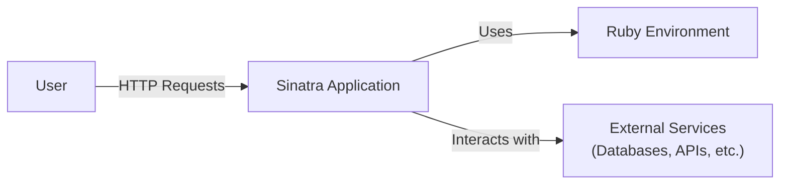
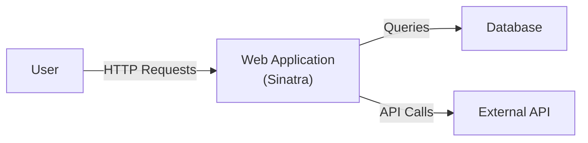
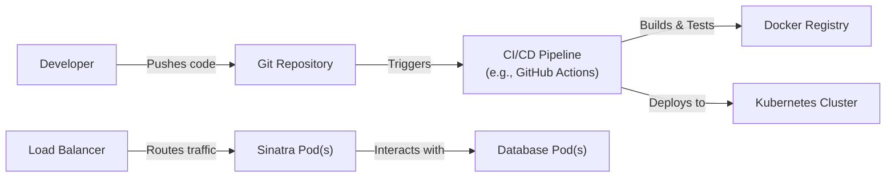

Okay, let's create a design document for the Sinatra project, focusing on aspects relevant for threat modeling.

# BUSINESS POSTURE

Sinatra is a Domain Specific Language (DSL) for quickly creating web applications in Ruby with minimal effort.  It's a popular, lightweight alternative to full-fledged frameworks like Ruby on Rails.

Business Priorities and Goals:

*   Enable rapid development and prototyping of web applications.
*   Provide a simple, easy-to-learn, and understandable framework.
*   Maintain a small, focused codebase with minimal dependencies.
*   Offer flexibility and extensibility for developers to customize behavior.
*   Ensure stability and reliability for production deployments.
*   Foster a vibrant and supportive open-source community.

Most Important Business Risks:

*   Security vulnerabilities in the framework itself or its dependencies could lead to widespread exploitation of applications built with Sinatra.
*   Lack of clear security guidance or best practices could result in developers building insecure applications.
*   Performance bottlenecks or scalability issues could limit the use of Sinatra in high-traffic scenarios.
*   Loss of community interest or maintainer burnout could lead to the project becoming stagnant and vulnerable.
*   Incompatibility with newer Ruby versions or evolving web standards could limit its adoption.

# SECURITY POSTURE

Existing Security Controls:

*   security control: Sinatra itself is a relatively small codebase, reducing the attack surface compared to larger frameworks.
*   security control: The project's reliance on Rack provides a well-defined interface for handling HTTP requests and responses, leveraging Rack's security features (where applicable). Described in Sinatra and Rack documentation.
*   security control: The project encourages the use of established Ruby security best practices (e.g., escaping user input, using secure coding patterns). Described in Sinatra documentation and general Ruby security guides.
*   security control: The project has a history of addressing reported security vulnerabilities, although the frequency and speed of response may vary. Described in GitHub issues and commit history.
*   accepted risk: Sinatra, by design, provides minimal built-in security features beyond basic request handling.  It relies heavily on developers to implement appropriate security measures within their applications.
*   accepted risk: The project's focus on simplicity and flexibility means that developers have significant control over the application's security posture, which can be a double-edged sword.
*   accepted risk: The open-source nature of the project means that vulnerabilities may be discovered and exploited before they are patched.

Recommended Security Controls:

*   security control: Integrate automated security scanning tools (SAST, DAST, dependency analysis) into the development and CI/CD pipeline.
*   security control: Develop and publish comprehensive security documentation and guidelines specifically for Sinatra developers.
*   security control: Establish a clear vulnerability disclosure and response process.
*   security control: Consider adding built-in support for common security features (e.g., CSRF protection, secure headers) as optional extensions or middleware.

Security Requirements:

*   Authentication: Sinatra itself does not provide authentication mechanisms. Developers must implement authentication using external libraries or custom code.  Any authentication solution must be robust against common attacks (e.g., brute-force, session hijacking).
*   Authorization: Sinatra does not include built-in authorization features. Developers are responsible for implementing access control logic within their applications. Authorization mechanisms should follow the principle of least privilege.
*   Input Validation: Sinatra relies on developers to validate all user input thoroughly.  Input validation should be performed on both the client-side (for usability) and the server-side (for security).  Whitelist validation is preferred over blacklist validation.
*   Cryptography: Sinatra does not provide cryptographic utilities directly. Developers should use established Ruby libraries (e.g., OpenSSL, bcrypt) for cryptographic operations.  Cryptographic keys must be managed securely.

# DESIGN

## C4 CONTEXT

Context Diagram Element List:

*   Element:
    *   Name: User
    *   Type: Person
    *   Description: A user interacting with the Sinatra application through a web browser or other client.
    *   Responsibilities: Initiates HTTP requests, views responses.
    *   Security controls: Browser security settings, user awareness of phishing and other attacks.

*   Element:
    *   Name: Sinatra Application
    *   Type: Software System
    *   Description: The web application built using the Sinatra framework.
    *   Responsibilities: Handles HTTP requests, processes data, interacts with external services, generates responses.
    *   Security controls: Input validation, output encoding, authentication, authorization, session management, error handling, secure configuration.

*   Element:
    *   Name: External Services
    *   Type: Software System
    *   Description: External systems that the Sinatra application interacts with, such as databases, APIs, and other services.
    *   Responsibilities: Varies depending on the specific service.
    *   Security controls: Authentication, authorization, encryption in transit, data validation, secure configuration.

*   Element:
    *   Name: Ruby Environment
    *   Type: Software System
    *   Description: The Ruby runtime environment, including the Ruby interpreter and installed gems.
    *   Responsibilities: Executes the Sinatra application code.
    *   Security controls: Secure configuration of the Ruby environment, regular updates to address vulnerabilities.

## C4 CONTAINER

Container Diagram Element List:

*   Element:
    *   Name: User
    *   Type: Person
    *   Description: A user interacting with the Sinatra application.
    *   Responsibilities: Initiates HTTP requests, views responses.
    *   Security controls: Browser security settings, user awareness.

*   Element:
    *   Name: Web Application (Sinatra)
    *   Type: Container: Ruby Web Application
    *   Description: The core Sinatra application, handling requests and responses.
    *   Responsibilities: Routing, request processing, data handling, response generation.
    *   Security controls: Input validation, output encoding, authentication, authorization, session management.

*   Element:
    *   Name: Database
    *   Type: Container: Database
    *   Description: A database used by the Sinatra application to store data.
    *   Responsibilities: Data storage, retrieval, and management.
    *   Security controls: Access control, encryption at rest, data validation, secure configuration.

*   Element:
    *   Name: External API
    *   Type: Container: External Service
    *   Description: An external API that the Sinatra application interacts with.
    *   Responsibilities: Varies depending on the API.
    *   Security controls: Authentication, authorization, encryption in transit, secure configuration.

## DEPLOYMENT

Possible Deployment Solutions:

1.  Traditional Server (e.g., Apache/Nginx + Passenger):  Sinatra application deployed on a dedicated server or virtual machine.
2.  Cloud Platform (e.g., Heroku, AWS Elastic Beanstalk): Sinatra application deployed as a platform-as-a-service (PaaS) offering.
3.  Containerized Deployment (e.g., Docker + Kubernetes): Sinatra application packaged as a Docker container and deployed on a Kubernetes cluster.

Chosen Solution: Containerized Deployment (Docker + Kubernetes)

Deployment Diagram Element List:

*   Element:
    *   Name: Developer
    *   Type: Person
    *   Description: A developer working on the Sinatra application.
    *   Responsibilities: Writes code, commits changes, manages deployments.
    *   Security controls: Strong passwords, multi-factor authentication, secure development environment.

*   Element:
    *   Name: Git Repository
    *   Type: System
    *   Description: The source code repository for the Sinatra application.
    *   Responsibilities: Version control, code storage.
    *   Security controls: Access control, branch protection rules, code review policies.

*   Element:
    *   Name: CI/CD Pipeline (e.g., GitHub Actions)
    *   Type: System
    *   Description: The continuous integration and continuous deployment pipeline.
    *   Responsibilities: Automates building, testing, and deploying the application.
    *   Security controls: Secure configuration, access control, vulnerability scanning.

*   Element:
    *   Name: Docker Registry
    *   Type: System
    *   Description: A registry for storing Docker images.
    *   Responsibilities: Image storage, distribution.
    *   Security controls: Access control, vulnerability scanning, image signing.

*   Element:
    *   Name: Kubernetes Cluster
    *   Type: System
    *   Description: A cluster of machines for running containerized applications.
    *   Responsibilities: Orchestrates containers, manages resources, provides networking.
    *   Security controls: Network policies, role-based access control (RBAC), pod security policies, regular security audits.

*   Element:
    *   Name: Load Balancer
    *   Type: System
    *   Description: Distributes incoming traffic across multiple Sinatra pods.
    *   Responsibilities: Traffic routing, health checks.
    *   Security controls: SSL/TLS termination, DDoS protection, secure configuration.

*   Element:
    *   Name: Sinatra Pod(s)
    *   Type: Container Instance
    *   Description: One or more instances of the Sinatra application running as Docker containers.
    *   Responsibilities: Handles HTTP requests, processes data, interacts with the database.
    *   Security controls: All security controls listed for the "Web Application (Sinatra)" container.

*   Element:
    *   Name: Database Pod(s)
    *   Type: Container Instance
    *   Description: One or more instances of the database running as Docker containers.
    *   Responsibilities: Data storage, retrieval, and management.
    *   Security controls: All security controls listed for the "Database" container.

## BUILD

```mermaid
graph LR
    Developer["Developer"]
    LocalMachine["Local Machine"]
    GitRepo["Git Repository"]
    CI_Server["CI Server\n(e.g., GitHub Actions)"]
    Linters["Linters\n(e.g., RuboCop)"]
    SAST["SAST\n(e.g., Brakeman)"]
    DependencyCheck["Dependency Check\n(e.g., Bundler-Audit)"]
    TestRun["Test Suite"]
    DockerBuild["Docker Build"]
    DockerRegistry["Docker Registry"]

    Developer -- Commits code --> LocalMachine
    LocalMachine -- Pushes code --> GitRepo
    GitRepo -- Triggers webhook --> CI_Server
    CI_Server -- Checks out code --> Linters
    Linters -- Analyzes code --> SAST
    SAST -- Scans for vulnerabilities --> DependencyCheck
    DependencyCheck -- Checks dependencies --> TestRun
    TestRun -- Runs tests --> DockerBuild
    DockerBuild -- Builds image --> DockerRegistry
```

Build Process Description:

1.  Developer commits code changes to their local machine.
2.  Changes are pushed to a Git repository (e.g., GitHub).
3.  A webhook triggers the CI server (e.g., GitHub Actions).
4.  The CI server checks out the code.
5.  Linters (e.g., RuboCop) analyze the code for style and potential errors.
6.  Static Application Security Testing (SAST) tools (e.g., Brakeman) scan the code for security vulnerabilities.
7.  Dependency checking tools (e.g., Bundler-Audit) check for known vulnerabilities in project dependencies.
8.  The test suite is executed.
9.  If all checks and tests pass, a Docker image is built.
10. The Docker image is pushed to a Docker registry.

Security Controls:

*   security control: Use of linters (e.g., RuboCop) to enforce coding standards and identify potential issues.
*   security control: Integration of SAST tools (e.g., Brakeman) to detect security vulnerabilities in the codebase.
*   security control: Dependency checking (e.g., Bundler-Audit) to identify and mitigate vulnerabilities in third-party libraries.
*   security control: Automated test suite to ensure code quality and prevent regressions.
*   security control: Building immutable Docker images to ensure consistent and reproducible deployments.
*   security control: Secure configuration of the CI/CD pipeline and Docker registry.

# RISK ASSESSMENT

Critical Business Processes:

*   Rapid development and deployment of web applications.
*   Maintaining a stable and reliable framework for production use.
*   Protecting user data and ensuring the security of applications built with Sinatra.

Data to Protect and Sensitivity:

*   Source code of the Sinatra framework and applications built with it: Sensitivity varies depending on the application, but could include proprietary logic and sensitive configurations.
*   User data handled by Sinatra applications: Sensitivity varies greatly depending on the application, but could include personally identifiable information (PII), financial data, health data, etc.  This is the most critical data to protect.
*   Configuration data (e.g., database credentials, API keys): Highly sensitive and must be protected from unauthorized access.
*   Logs and monitoring data: Can contain sensitive information and should be protected accordingly.

# QUESTIONS & ASSUMPTIONS

Questions:

*   What is the expected scale of applications built with Sinatra (e.g., number of users, request volume)? This impacts deployment choices and scalability requirements.
*   What specific types of external services are commonly used with Sinatra applications in this context? This helps tailor security recommendations for those services.
*   What is the current level of security expertise among the Sinatra development community? This informs the level of detail needed in security guidance.
*   What is the process for reporting and addressing security vulnerabilities in Sinatra?
*   Are there any existing security audits or penetration tests performed on Sinatra or representative applications?

Assumptions:

*   BUSINESS POSTURE: The primary goal is to provide a lightweight and flexible framework, prioritizing ease of use and rapid development.
*   SECURITY POSTURE: Developers are expected to have a basic understanding of web security principles and are responsible for implementing most security measures within their applications.
*   DESIGN: The deployment environment will likely be a cloud-based platform or a containerized environment, allowing for scalability and flexibility. The build process will include automated testing and security checks.