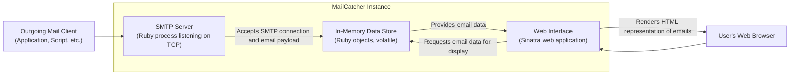

## Project Design Document: MailCatcher (Improved)

**1. Introduction**

This document provides a detailed design overview of the MailCatcher project, an open-source tool designed as a "catch-all" SMTP server combined with a web interface for inspecting captured emails. It is primarily intended for development and testing environments. This document serves as a foundational resource for subsequent threat modeling activities.

**1.1. Project Goals**

*   To offer developers a straightforward and dependable mechanism for examining outgoing emails during software development and testing phases.
*   To present a user-friendly web interface for effortless browsing and analysis of intercepted emails.
*   To mitigate the risk of inadvertently dispatching test emails to actual recipients by intercepting them locally.
*   To accommodate standard email features, including HTML rendering, attachment handling, and support for multiple recipients.

**1.2. Target Audience**

This document is primarily intended for:

*   Security engineers tasked with performing threat modeling and security assessments.
*   Software developers who utilize or contribute to the MailCatcher project.
*   Operations personnel responsible for the deployment and maintenance of MailCatcher instances.

**1.3. Scope**

This document encompasses the core architectural elements and operational functionalities of MailCatcher. The focus is on elucidating the data flow and interactions between its constituent components. Specific implementation details within third-party libraries or granular code-level mechanics are outside the scope of this document.

**2. System Architecture**

MailCatcher's architecture is centered around two principal components: an SMTP server responsible for receiving emails and a web interface for visualizing them. These components collaborate to capture, persist (temporarily), and present email data.

**2.1. Components**

*   **SMTP Server:**
    *   Operates as a network service, listening for incoming SMTP connections on a designated TCP port (default: 1025).
    *   Implements a necessary subset of the Simple Mail Transfer Protocol (SMTP) to facilitate the reception of email messages.
    *   Performs parsing of the incoming email data stream, extracting essential components such as headers (e.g., To, From, Subject), the message body, and any attached files.
    *   Persists the fully received and parsed email data within the in-memory data store.
*   **Web Interface:**
    *   A web application constructed using the Sinatra Ruby framework, providing a lightweight and efficient web server.
    *   Presents a graphical user interface (GUI) accessible through standard web browsers, enabling users to interact with captured emails.
    *   Offers functionalities for browsing the list of captured emails, searching for specific emails based on criteria, and inspecting the detailed content of individual emails.
    *   Renders the email body in both HTML (if present) and plain text formats, ensuring compatibility with various email compositions.
    *   Provides mechanisms to access and download email headers in their raw format and any attached files.
*   **In-Memory Data Store:**
    *   Serves as the temporary storage mechanism for received email messages, holding them as Ruby objects within the application's memory space.
    *   Exposes an internal API that allows the SMTP server component to add newly received emails and the web interface component to retrieve emails for display.
    *   It's crucial to note that the data stored here is transient; all captured emails are lost upon the termination or restart of the MailCatcher process. This inherent volatility can be a security consideration.

**3. Data Flow**

The following sequence outlines the typical path an email takes through the MailCatcher system:

1. An "Outgoing Mail Client," which could be an application, a script, or any software attempting to send an email, establishes a connection to the MailCatcher SMTP server on its designated listening port.
2. The MailCatcher SMTP server accepts the incoming connection and begins the SMTP handshake, receiving the email's content according to the SMTP protocol. This includes information like sender address, recipient addresses, the email subject, the message body, and any attached files.
3. The SMTP server component parses the raw email data stream, structuring it into a more usable format.
4. The parsed email data is then stored as a structured Ruby object within the in-memory data store.
5. A user, intending to view the captured emails, navigates their web browser to the address where the MailCatcher web interface is hosted (typically `http://localhost:1080`).
6. The web browser sends HTTP requests to the MailCatcher web interface to retrieve the list of emails or the content of a specific email.
7. The MailCatcher web interface processes these HTTP requests and interacts with the in-memory data store to fetch the requested email data.
8. The web interface then generates HTML markup, embedding the retrieved email content for display in the browser.
9. This generated HTML response is sent back to the user's web browser.
10. The web browser renders the HTML, allowing the user to view the captured email, including its body, headers, and attachments.

**4. Security Considerations (Detailed)**

*   **Data Confidentiality:** Emails captured by MailCatcher may contain sensitive information (personal data, API keys, etc.).
    *   **Threat:** Unauthorized access to the web interface could expose this sensitive data. The lack of default authentication exacerbates this risk.
    *   **Mitigation:** Implementing authentication and authorization mechanisms for the web interface is crucial in environments where data confidentiality is paramount. Consider using basic authentication, OAuth 2.0, or other suitable methods.
*   **Data Integrity:** While MailCatcher is primarily for inspection, ensuring the integrity of received emails is important.
    *   **Threat:** Although less likely, vulnerabilities in the SMTP parsing logic could potentially be exploited to inject malicious content or manipulate stored email data.
    *   **Mitigation:** Employing robust input validation and sanitization techniques within the SMTP server component is essential. Regularly updating dependencies can also help mitigate known vulnerabilities.
*   **Availability:** The availability of MailCatcher can impact development workflows.
    *   **Threat:** Denial-of-service (DoS) attacks targeting either the SMTP server (e.g., overwhelming it with connection requests) or the web interface (e.g., HTTP flooding) could render MailCatcher unusable.
    *   **Mitigation:** Implementing rate limiting or connection limits on the SMTP server and web interface can help mitigate basic DoS attacks. Deploying MailCatcher behind a reverse proxy with DoS protection capabilities is another strategy.
*   **Access Control:** Restricting access to the web interface is critical.
    *   **Threat:** Without access controls, anyone on the network with access to the MailCatcher instance can view captured emails.
    *   **Mitigation:** As mentioned earlier, implementing authentication is the primary mitigation. Network segmentation and firewall rules can also restrict access to the MailCatcher instance to authorized users or networks.
*   **Input Validation (SMTP):** The SMTP server must rigorously validate incoming email data.
    *   **Threat:** Failure to properly validate inputs could lead to SMTP injection attacks, where attackers inject malicious commands or headers into emails.
    *   **Mitigation:** Strict adherence to SMTP protocol specifications and thorough input validation on all received data is necessary.
*   **Cross-Site Scripting (XSS):** The web interface must be protected against XSS vulnerabilities.
    *   **Threat:** If email content (especially HTML) is not properly sanitized before being rendered in the web interface, malicious scripts could be injected and executed in the user's browser.
    *   **Mitigation:** Employing output encoding or sanitization techniques when rendering email content in the web interface is crucial. Libraries specifically designed for this purpose should be utilized.
*   **Cross-Site Request Forgery (CSRF):** While the default MailCatcher interface has limited actions, future extensions could introduce CSRF risks.
    *   **Threat:** If the web interface allows for actions beyond viewing (e.g., deleting emails) without proper CSRF protection, attackers could potentially trick authenticated users into performing unintended actions.
    *   **Mitigation:** Implementing CSRF tokens or other CSRF prevention mechanisms would be necessary if state-changing actions are added to the web interface.
*   **In-Memory Data Storage:** The transient nature of the in-memory data store has security implications.
    *   **Benefit:** Data is not persisted long-term, reducing the risk of data breaches if the server is compromised after MailCatcher is stopped.
    *   **Limitation:**  Forensic analysis of captured emails after a security incident is not possible once MailCatcher is restarted.

**5. Dependencies**

*   **Ruby (Programming Language):** The core language in which MailCatcher is developed. The specific Ruby version may have security implications.
*   **Sinatra (Web Framework):** A lightweight Ruby web framework used for building the web interface. Vulnerabilities in Sinatra could affect MailCatcher.
*   **Rack (Web Server Interface):** Sinatra is built on Rack, providing an interface between web servers and Ruby frameworks.
*   **Potentially other Ruby Gems:** Depending on the specific version and any customizations, MailCatcher might rely on other Ruby gems for functionalities like:
    *   **SMTP Processing:** Gems for handling SMTP protocol details.
    *   **HTML Rendering/Parsing:** Gems for processing and sanitizing HTML email content.
    *   **Mail Parsing:** Gems for parsing email message formats.

**6. Deployment Considerations**

*   **Local Development Environment:** The most common deployment scenario is on a developer's local machine for testing purposes. In this case, security risks are generally lower but still present if the machine is compromised.
*   **Development/Testing Servers:** MailCatcher might be deployed on shared development or testing servers. In such environments, access control becomes more critical to prevent unauthorized viewing of other developers' captured emails.
*   **Containerization (e.g., Docker):** Deploying MailCatcher within a Docker container provides isolation and simplifies deployment. Container security best practices should be followed.
*   **Network Accessibility:** The SMTP server needs to be accessible on the configured port (default 1025) by the applications sending emails. The web interface needs to be accessible via HTTP, typically on port 1080. Firewall rules should be configured accordingly.
*   **Reverse Proxy:** Deploying MailCatcher behind a reverse proxy (e.g., Nginx, Apache) can provide benefits like SSL termination, load balancing, and added security features (e.g., request filtering, DoS protection).

**7. Conclusion**

This improved design document provides a more detailed and nuanced understanding of the MailCatcher project's architecture, data flow, and security considerations. This information is crucial for conducting a comprehensive threat model, enabling security engineers and developers to identify potential vulnerabilities and implement appropriate security measures. The inherent simplicity of MailCatcher makes it a valuable tool for development, but careful consideration of its security implications, particularly concerning authentication and data confidentiality, is essential, especially when deployed in shared or more exposed environments.