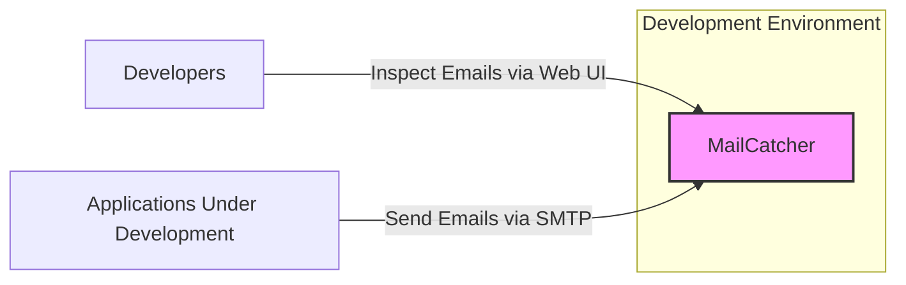
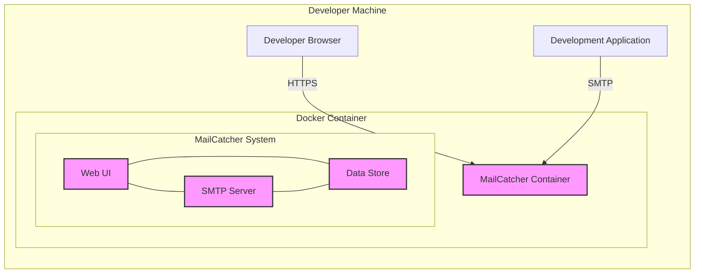

# BUSINESS POSTURE

This project, MailCatcher, aims to provide a simple and secure way for software developers to inspect emails generated by applications during development and testing phases. It intercepts emails sent by applications and presents them in a web interface, preventing test emails from being sent to real users and allowing developers to examine email content, headers, and attachments.

Business priorities for adopting MailCatcher include:
- Faster development cycles by enabling rapid email testing and debugging.
- Reduced risk of accidental emails being sent to real users during testing, protecting brand reputation and user trust.
- Improved software quality by facilitating thorough email functionality testing.

Key business risks associated with MailCatcher include:
- Data leaks if intercepted emails contain sensitive information and MailCatcher is not properly secured.
- Availability disruptions to development workflows if MailCatcher becomes unavailable.
- Misconfiguration leading to emails not being captured or being exposed unintentionally.

# SECURITY POSTURE

Existing security controls:
- security control: Basic access control to the web interface, typically relying on the inherent security of the development environment where it is deployed. (Implementation: Configuration of web server or application framework).
- security control: Isolation within the development environment, limiting exposure to external networks. (Implementation: Network configuration, firewall rules).

Accepted risks:
- accepted risk: Reliance on development environment security for access control.
- accepted risk: Limited auditing and logging capabilities in the default configuration.
- accepted risk: Potential for information disclosure if the development environment is compromised.

Recommended security controls:
- security control: Implement authentication and authorization for accessing the MailCatcher web interface to restrict access to authorized developers.
- security control: Enable HTTPS for the web interface to protect communication in transit, especially if accessing MailCatcher over a network.
- security control: Implement input validation and sanitization to prevent potential injection attacks through email content or headers.
- security control: Regularly update MailCatcher to the latest version to patch known vulnerabilities.
- security control: Consider using a dedicated user account for running MailCatcher to limit the impact of potential compromises.

Security requirements:
- Authentication:
    - Requirement: Access to the MailCatcher web interface should be restricted to authorized developers.
    - Requirement: Implement a mechanism to verify the identity of users accessing the web interface.
- Authorization:
    - Requirement: Once authenticated, users should only be able to access and manage emails within their designated projects or development environments if applicable.
    - Requirement: Implement role-based access control if multiple teams or projects share a MailCatcher instance.
- Input Validation:
    - Requirement: MailCatcher must validate and sanitize email content and headers to prevent injection attacks (e.g., cross-site scripting, header injection).
    - Requirement: Implement checks to prevent processing of excessively large emails that could lead to denial-of-service.
- Cryptography:
    - Requirement: Use HTTPS to encrypt communication between the web browser and the MailCatcher web interface to protect sensitive data in transit.
    - Requirement: Consider encrypting stored emails at rest if they contain highly sensitive information, although this might be less critical for a development tool.

# DESIGN

## C4 CONTEXT



Context Diagram Description:
- Element List:
    - - Name: MailCatcher
        - Type: Software System
        - Description: A tool for capturing and inspecting emails sent by applications during development.
        - Responsibilities:
            - Receive emails via SMTP.
            - Store received emails.
            - Provide a web interface to view and manage captured emails.
        - Security controls:
            - Access control to web interface.
            - Input validation of email content.
    - - Name: Developers
        - Type: Person
        - Description: Software developers who use MailCatcher to test email functionality in their applications.
        - Responsibilities:
            - Access MailCatcher web interface to view captured emails.
            - Configure applications to send emails to MailCatcher's SMTP server.
        - Security controls:
            - Authentication to access development environment and MailCatcher.
    - - Name: Applications Under Development
        - Type: Software System
        - Description: Applications being developed and tested that send emails as part of their functionality.
        - Responsibilities:
            - Generate and send emails via SMTP.
            - Be configured to send emails to MailCatcher's SMTP server during development.
        - Security controls:
            - Secure configuration to send emails to the correct SMTP server (MailCatcher in development, real SMTP in production).

## C4 CONTAINER

```mermaid
flowchart LR
    subgraph "MailCatcher System"
        A["Web UI" <br> (Ruby on Rails)]
        B["SMTP Server" <br> (Ruby)]
        C["Data Store" <br> (In-Memory/File System)]
        A -- "Reads Emails" --> C
        B -- "Stores Emails" --> C
        B -- "Receives Emails" --> Applications
        Developers -- "Inspects Emails" --> A
    end
    Applications["Applications Under Development"]
    Developers["Developers"]
    style A fill:#f9f,stroke:#333,stroke-width:2px
    style B fill:#f9f,stroke:#333,stroke-width:2px
    style C fill:#f9f,stroke:#333,stroke-width:2px
```

Container Diagram Description:
- Element List:
    - - Name: Web UI
        - Type: Container - Web Application
        - Description: A Ruby on Rails application providing a web interface for developers to view and manage captured emails.
        - Responsibilities:
            - Present captured emails to developers in a user-friendly interface.
            - Allow developers to search, view, and delete emails.
            - Handle user authentication and authorization (recommended).
        - Security controls:
            - security control: Web application framework security features (e.g., protection against common web vulnerabilities).
            - security control: Input validation and output encoding to prevent XSS.
            - security control: Authentication and authorization mechanisms.
            - security control: HTTPS for secure communication.
    - - Name: SMTP Server
        - Type: Container - Application
        - Description: A Ruby application that acts as an SMTP server, receiving emails from applications under development.
        - Responsibilities:
            - Listen for SMTP connections on a specified port (e.g., 1025).
            - Receive and parse incoming emails.
            - Store received emails in the data store.
        - Security controls:
            - security control: Limit listening interface to localhost or development network.
            - security control: Input validation of SMTP commands and email content.
            - security control: Rate limiting to prevent abuse.
    - - Name: Data Store
        - Type: Container - Data Store
        - Description:  Stores captured emails. Can be in-memory for simplicity or file-based for persistence.
        - Responsibilities:
            - Persist received emails.
            - Provide access to stored emails for the Web UI.
        - Security controls:
            - security control: Access control to the data store (file system permissions if file-based).
            - security control: Encryption at rest if storing sensitive data (optional, recommended for sensitive environments).

## DEPLOYMENT

Deployment Option: Local Development Environment (Docker)



Deployment Diagram Description:
- Element List:
    - - Name: MailCatcher Container
        - Type: Container - Docker Container
        - Description: A Docker container encapsulating the MailCatcher system.
        - Responsibilities:
            - Provide an isolated environment for MailCatcher to run.
            - Manage resources allocated to MailCatcher.
            - Simplify deployment and portability.
        - Security controls:
            - security control: Container isolation provided by Docker.
            - security control: Image built from trusted base image and regularly updated.
            - security control: Network policies to restrict container network access if needed.
    - - Name: Web UI (within Container)
        - Type: Software Component
        - Description: Web UI component of MailCatcher running inside the Docker container.
        - Responsibilities: Same as Container Diagram description.
        - Security controls: Same as Container Diagram description.
    - - Name: SMTP Server (within Container)
        - Type: Software Component
        - Description: SMTP Server component of MailCatcher running inside the Docker container.
        - Responsibilities: Same as Container Diagram description.
        - Security controls: Same as Container Diagram description.
    - - Name: Data Store (within Container)
        - Type: Software Component
        - Description: Data Store component of MailCatcher running inside the Docker container.
        - Responsibilities: Same as Container Diagram description.
        - Security controls: Same as Container Diagram description.
    - - Name: Developer Browser
        - Type: Software Application
        - Description: Web browser used by developers to access the MailCatcher Web UI.
        - Responsibilities:
            - Render the MailCatcher web interface.
            - Send requests to the MailCatcher Web UI.
        - Security controls:
            - security control: Browser security features.
            - security control: HTTPS communication with MailCatcher.
    - - Name: Development Application
        - Type: Software Application
        - Description: Application under development running on the developer machine, sending emails.
        - Responsibilities:
            - Send emails to the MailCatcher SMTP server.
        - Security controls:
            - security control: Secure configuration to send emails to the correct SMTP server.

## BUILD

```mermaid
flowchart LR
    A[Developer] -- "Code Changes" --> B(Code Repository <br> (GitHub))
    B -- "Push Code" --> C{CI/CD System <br> (e.g., GitHub Actions)}
    C -- "Build & Test" --> D[Build Artifacts <br> (e.g., Docker Image, Gems)]
    D -- "Publish Artifacts" --> E[Artifact Registry <br> (e.g., Docker Hub, Gemfury)]
    style B fill:#ccf,stroke:#333,stroke-width:2px
    style C fill:#ccf,stroke:#333,stroke-width:2px
    style D fill:#ccf,stroke:#333,stroke-width:2px
    style E fill:#ccf,stroke:#333,stroke-width:2px
```

Build Process Description:
- Element List:
    - - Name: Developer
        - Type: Person
        - Description: Software developer writing and modifying the MailCatcher codebase.
        - Responsibilities:
            - Write and commit code changes.
            - Perform local testing.
        - Security controls:
            - security control: Secure coding practices.
            - security control: Code review process.
    - - Name: Code Repository (GitHub)
        - Type: Software Service - Version Control System
        - Description: GitHub repository hosting the MailCatcher source code.
        - Responsibilities:
            - Store and manage source code.
            - Track code changes.
            - Facilitate collaboration.
        - Security controls:
            - security control: Access control to the repository.
            - security control: Branch protection policies.
            - security control: Audit logging of repository activities.
    - - Name: CI/CD System (e.g., GitHub Actions)
        - Type: Software Service - Automation System
        - Description: Automated system for building, testing, and potentially deploying MailCatcher.
        - Responsibilities:
            - Automate build process.
            - Run automated tests (unit, integration).
            - Perform security checks (SAST, dependency scanning).
            - Build and publish artifacts.
        - Security controls:
            - security control: Secure configuration of CI/CD pipelines.
            - security control: Use of trusted build environments.
            - security control: Security scanning tools integration (SAST, dependency checks).
            - security control: Access control to CI/CD system.
    - - Name: Build Artifacts (e.g., Docker Image, Gems)
        - Type: Data - Software Packages
        - Description: Output of the build process, ready for deployment or distribution.
        - Responsibilities:
            - Contain compiled code, dependencies, and configuration.
            - Be verifiable and reproducible.
        - Security controls:
            - security control: Signing of artifacts to ensure integrity and authenticity.
            - security control: Vulnerability scanning of dependencies included in artifacts.
    - - Name: Artifact Registry (e.g., Docker Hub, Gemfury)
        - Type: Software Service - Artifact Storage
        - Description: Repository for storing and distributing build artifacts.
        - Responsibilities:
            - Securely store build artifacts.
            - Provide access to artifacts for deployment.
        - Security controls:
            - security control: Access control to the artifact registry.
            - security control: Vulnerability scanning of stored artifacts.
            - security control: Audit logging of artifact access.

# RISK ASSESSMENT

Critical business process: Software development and testing efficiency. Disruption to MailCatcher can slow down development cycles and potentially lead to delayed releases or undetected email-related bugs.

Data we are trying to protect: Emails captured by MailCatcher. Sensitivity of this data depends on the context of the applications being tested. In many cases, test emails might contain sensitive information like user data, API keys, or internal system details. Therefore, the sensitivity can range from medium to high depending on the specific use case.

# QUESTIONS & ASSUMPTIONS

Questions:
- What is the intended deployment environment for MailCatcher? (Local development, shared development server, CI/CD pipeline?)
- What is the sensitivity of the data that will be captured by MailCatcher? (Are there specific types of sensitive data expected in test emails?)
- Are there any existing authentication or authorization mechanisms required for accessing MailCatcher?
- Are there any specific compliance requirements that MailCatcher needs to adhere to?

Assumptions:
- BUSINESS POSTURE: The primary goal is to improve developer productivity and reduce the risk of sending test emails to real users. Security is important but secondary to usability in a development context.
- SECURITY POSTURE: MailCatcher is primarily used in development and testing environments, so the security posture can be less stringent than production systems. However, basic security controls like access control and input validation are still necessary.
- DESIGN: MailCatcher is designed as a relatively simple system with a Web UI, SMTP server, and data store. Deployment is assumed to be flexible, ranging from local Docker containers to development servers.