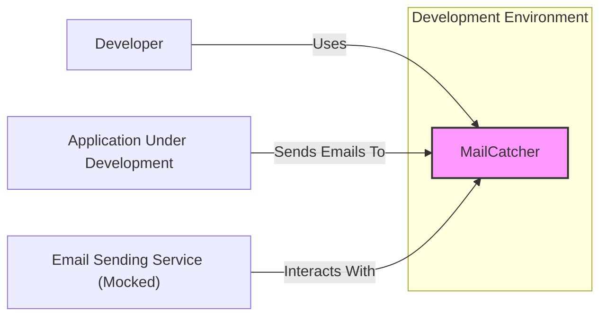
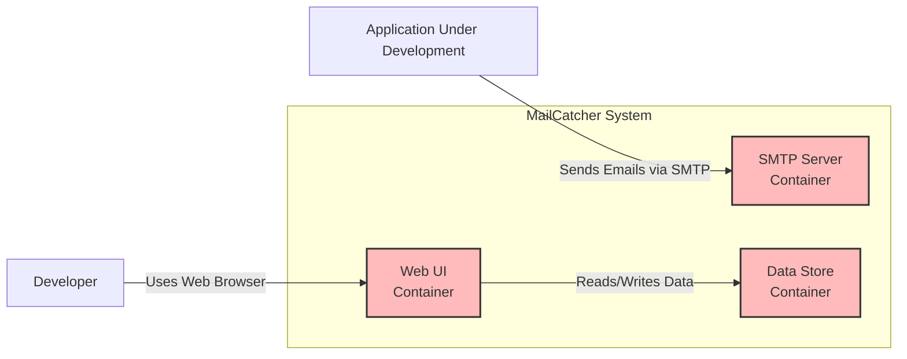
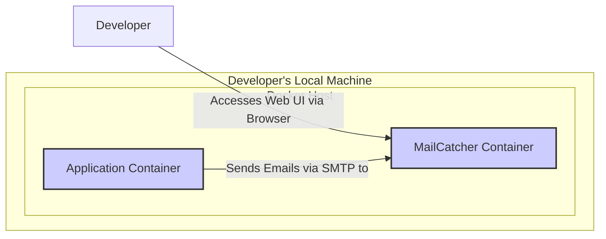
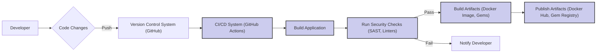

# BUSINESS POSTURE

This project, MailCatcher, aims to provide a development tool for catching emails sent by applications during development and testing. This prevents test emails from being sent to real users and allows developers to inspect and verify emails in a controlled environment.

Business Priorities and Goals:
- Primary goal is to improve developer productivity and efficiency by providing a safe and convenient way to test email functionality.
- Secondary goal is to reduce the risk of sending unintended emails to real users during development and testing phases.
- Tertiary goal is to facilitate easier debugging and verification of email content and formatting.

Business Risks:
- Data Leakage: If not properly secured, sensitive information contained within captured emails could be exposed.
- Availability: If MailCatcher is unavailable, it can disrupt development workflows that rely on email testing.
- Misconfiguration: Incorrect configuration could lead to emails being unintentionally exposed or lost.
- Dependency Risk: Reliance on MailCatcher as a critical development tool could create a dependency risk if the project is not maintained or has issues.

# SECURITY POSTURE

Existing Security Controls:
- security control: Based on the project description and common usage as a development tool, it is assumed that minimal security controls are implemented by default. The primary focus is on functionality and ease of use in development environments, not production security.
- accepted risk: Lack of authentication and authorization for accessing the MailCatcher web interface.
- accepted risk: Data stored in MailCatcher is not encrypted at rest or in transit.
- accepted risk: Input validation might be minimal, as the tool is designed for development environments and assumes trusted input.
- accepted risk: Deployment configurations are assumed to be basic and might not follow security best practices.

Recommended Security Controls:
- security control: Implement authentication and authorization for accessing the MailCatcher web interface to restrict access to authorized developers.
- security control: Implement HTTPS for the web interface to encrypt communication between the browser and MailCatcher.
- security control: Consider options for encrypting stored email data at rest, especially if handling sensitive information in development.
- security control: Implement robust input validation to prevent potential injection attacks, even in a development environment, as vulnerabilities discovered here can highlight issues in production code.
- security control: Provide guidance and recommendations for secure deployment configurations, such as using network segmentation and least privilege principles.

Security Requirements:
- Authentication:
  - Requirement: Access to the MailCatcher web interface should be restricted to authorized developers.
  - Implementation: Implement a basic authentication mechanism (e.g., username/password) or integrate with existing developer authentication systems if applicable.
- Authorization:
  - Requirement: Once authenticated, users should be authorized to view and manage the captured emails. For a development tool, simple authorization might be sufficient (e.g., all authenticated developers have access).
  - Implementation: Implement role-based access control if needed for larger teams, or a simpler access control list for smaller teams.
- Input Validation:
  - Requirement: All inputs to MailCatcher, especially email content and headers, should be validated to prevent injection attacks (e.g., cross-site scripting in the web interface, SMTP header injection).
  - Implementation: Implement input sanitization and validation on both the SMTP server and web interface components.
- Cryptography:
  - Requirement: Communication to the web interface should be encrypted in transit using HTTPS. Consider encryption at rest for stored emails if sensitive data is handled.
  - Implementation: Configure the web server to use HTTPS. Explore options for encrypting stored email data if necessary.

# DESIGN

## C4 CONTEXT

Context Diagram Elements:

- Name: MailCatcher
  - Type: Software System
  - Description: A development tool that acts as a fake SMTP server and web interface to catch and inspect emails sent by applications during development.
  - Responsibilities:
    - Receive emails via SMTP.
    - Store received emails.
    - Provide a web interface to view and manage stored emails.
  - Security controls:
    - security control: Input validation on SMTP input.
    - security control: Potentially authentication and authorization for web interface access (recommended).

- Name: Developer
  - Type: Person
  - Description: Software developers who use MailCatcher to test email functionality in their applications.
  - Responsibilities:
    - Configure applications to send emails to MailCatcher's SMTP server.
    - Use the MailCatcher web interface to inspect captured emails.
  - Security controls:
    - security control: Authentication to access development environment.
    - security control: Authorization to access development tools.

- Name: Application Under Development
  - Type: Software System
  - Description: The application being developed that needs to send emails. Configured to send emails to MailCatcher instead of a real SMTP server during development.
  - Responsibilities:
    - Generate and send emails for testing purposes.
    - Be configured to use MailCatcher's SMTP server.
  - Security controls:
    - security control: Input validation on email content generation.
    - security control: Secure configuration to use MailCatcher in development and real SMTP in production.

- Name: Email Sending Service (Mocked)
  - Type: Software System
  - Description: Represents the intended email sending service that the application would use in production. In development, MailCatcher mocks this service.
  - Responsibilities:
    - In production, send emails to recipients.
    - In development context, its role is conceptually replaced by MailCatcher.
  - Security controls:
    - security control: In production, standard email sending service security controls (authentication, encryption, etc.).
    - security control: In development, MailCatcher needs to securely mock relevant aspects without introducing new vulnerabilities.

## C4 CONTAINER

Container Diagram Elements:

- Name: SMTP Server Container
  - Type: Container
  - Description: A containerized application responsible for receiving emails via the SMTP protocol. It listens on port 1025 (default SMTP port) and processes incoming email messages.
  - Responsibilities:
    - Listen for SMTP connections.
    - Receive and parse email messages.
    - Store received emails in the Data Store Container.
  - Security controls:
    - security control: Input validation of SMTP commands and email content to prevent injection attacks.
    - security control: Rate limiting to prevent abuse.

- Name: Web UI Container
  - Type: Container
  - Description: A containerized web application that provides a user interface for developers to view, inspect, and manage captured emails. It interacts with the Data Store Container to retrieve and display email data.
  - Responsibilities:
    - Provide a web interface for users to interact with MailCatcher.
    - Authenticate and authorize users (recommended).
    - Display stored emails.
    - Allow users to search, view, and delete emails.
  - Security controls:
    - security control: Authentication and authorization to restrict access.
    - security control: HTTPS to encrypt communication.
    - security control: Input validation to prevent XSS and other web-based attacks.
    - security control: Output encoding to prevent XSS when displaying email content.

- Name: Data Store Container
  - Type: Container
  - Description: A containerized data storage component responsible for persisting the captured emails. This could be an in-memory store for simplicity or a persistent database for larger deployments and data retention.
  - Responsibilities:
    - Store received emails.
    - Provide data access to the Web UI Container.
    - Potentially manage data persistence and backups (depending on implementation).
  - Security controls:
    - security control: Access control to the data store, ensuring only authorized components can access it.
    - security control: Encryption at rest if persistent storage is used and sensitive data is handled (recommended for persistent storage).
    - security control: Regular backups if persistent storage is used and data retention is required.

## DEPLOYMENT

Deployment Option: Docker Container in Developer's Local Environment

Deployment Diagram Elements:

- Name: MailCatcher Container
  - Type: Docker Container
  - Description: A Docker container running the MailCatcher application, including the SMTP server, Web UI, and Data Store.
  - Responsibilities:
    - Run the MailCatcher application.
    - Expose the SMTP port (e.g., 1025) and Web UI port (e.g., 1080) to the host machine.
  - Security controls:
    - security control: Use official or trusted Docker image source.
    - security control: Regularly update the Docker image to patch vulnerabilities.
    - security control: Limit resource consumption of the container to prevent denial-of-service.

- Name: Application Container
  - Type: Docker Container
  - Description: A Docker container running the Application Under Development. Configured to send emails to the MailCatcher container's SMTP port.
  - Responsibilities:
    - Run the application code.
    - Send emails to the configured SMTP server (MailCatcher).
  - Security controls:
    - security control: Secure configuration to use MailCatcher's SMTP port.
    - security control: Application-level security controls.

- Name: Developer's Local Machine
  - Type: Physical Machine / Virtual Machine
  - Description: The developer's workstation where Docker is installed and containers are running.
  - Responsibilities:
    - Host the Docker environment.
    - Provide network connectivity for accessing the Web UI.
  - Security controls:
    - security control: Host operating system security controls (firewall, patching, etc.).
    - security control: Physical security of the developer's machine.
    - security control: User account security and access control on the machine.

## BUILD

Build Process Description:

1. Developer makes code changes and pushes them to the Version Control System (e.g., GitHub).
2. The CI/CD System (e.g., GitHub Actions) is triggered by code changes.
3. The CI/CD system initiates the build process, compiling code, packaging dependencies, etc.
4. Security Checks are performed as part of the build process:
   - Static Application Security Testing (SAST) scans the code for potential vulnerabilities.
   - Linters check code style and identify potential code quality issues.
5. If security checks pass, Build Artifacts are created (e.g., Docker image, Ruby gems).
6. If security checks fail, the developer is notified, and the build process stops.
7. If the build is successful, Artifacts are published to artifact repositories (e.g., Docker Hub, Gem Registry).

Build Security Controls:

- security control: Automated Build Process using CI/CD to ensure consistent and repeatable builds.
- security control: Version Control System (e.g., Git) to track code changes and provide auditability.
- security control: Static Application Security Testing (SAST) to identify potential vulnerabilities in the codebase.
- security control: Code Linters to enforce code quality and consistency, reducing potential security issues.
- security control: Dependency Scanning to identify vulnerabilities in third-party libraries and dependencies.
- security control: Secure artifact repositories (e.g., Docker Hub, Gem Registry) with access control and vulnerability scanning.
- security control: Code review process before merging code changes to ensure security considerations are addressed.

# RISK ASSESSMENT

Critical Business Processes:
- Software Development and Testing: MailCatcher directly supports the process of developing and testing applications that send emails. Its availability and security impact the efficiency and reliability of this process.

Data to Protect:
- Email Content: MailCatcher captures and stores email content, which may contain sensitive information depending on the context of the application being developed and tested. This data is considered potentially sensitive.
  - Sensitivity: Medium to High, depending on the data being tested. Could include personal data, API keys, or other confidential information used in testing scenarios.
- Configuration Data: MailCatcher's configuration settings, while likely minimal, should also be protected to prevent unauthorized modification or access.
  - Sensitivity: Low to Medium, depending on the configuration details.

# QUESTIONS & ASSUMPTIONS

Questions:
- What is the expected sensitivity of the data that will be captured by MailCatcher in the development environment? This will help determine the necessary level of security controls.
- Are there any existing authentication or authorization systems in place for developers that MailCatcher could integrate with?
- Is persistent storage of emails required, or is in-memory storage sufficient? Persistent storage would necessitate stronger data protection measures.
- What is the expected scale of usage? Number of developers, frequency of email testing, etc. This will influence the resource requirements and potential performance considerations.

Assumptions:
- BUSINESS POSTURE: The primary business goal is to improve developer productivity in a safe manner. Security is important but should not overly hinder development workflows.
- SECURITY POSTURE: Currently, MailCatcher has minimal security controls, which is acceptable for initial development but needs to be enhanced for broader or more sensitive use cases. The organization has a moderate risk appetite for development tools but wants to avoid data leaks and availability disruptions.
- DESIGN: MailCatcher will be deployed as Docker containers in developer's local environments. The focus is on a simple and easy-to-use design. The build process will be automated using CI/CD and include basic security checks.