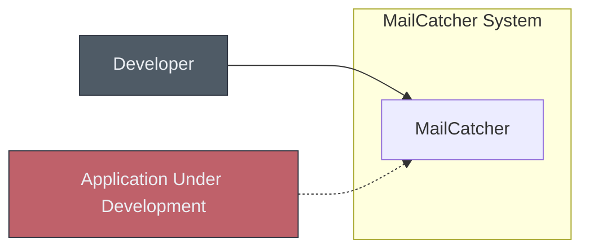
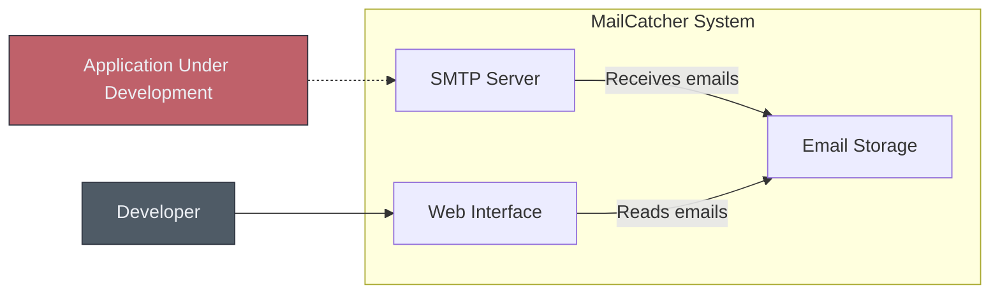
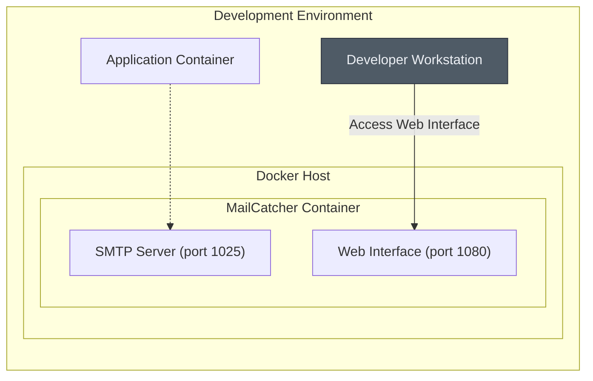
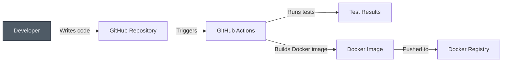

# BUSINESS POSTURE

MailCatcher is a simple SMTP server designed for development and testing purposes. It intercepts emails sent by applications and displays them in a web interface, rather than delivering them to the intended recipients.

Business Priorities and Goals:

*   Enable developers to test email functionality in their applications without sending real emails.
*   Provide a simple and easy-to-use tool for inspecting email content during development.
*   Reduce the risk of accidentally sending test emails to real users.
*   Facilitate debugging of email-related issues in applications.

Most Important Business Risks:

*   Exposure of sensitive information if MailCatcher is accidentally exposed to the public internet.
*   Potential for misuse as a spam relay if not properly secured.
*   Data loss if the intercepted emails are not persisted reliably.

# SECURITY POSTURE

Existing Security Controls:

*   security control: By default, MailCatcher binds to localhost (127.0.0.1), limiting access to the local machine. (Mentioned in the README)
*   security control: The web interface does not implement any authentication or authorization mechanisms. (Implied, as no mention of authentication is made)
*   security control: The SMTP server does not implement any authentication or encryption (no STARTTLS). (Implied, as no mention of authentication is made)
*   accepted risk: MailCatcher is designed for development/testing and is not intended for production use. It is assumed that users will deploy it in a secure, isolated environment.
*   accepted risk: No authentication or authorization is implemented, as it is assumed that access to MailCatcher is restricted to trusted users through network configuration.

Recommended Security Controls:

*   security control: Implement an option for basic authentication on the web interface to prevent unauthorized access.
*   security control: Provide documentation and warnings emphasizing the importance of deploying MailCatcher in a secure environment and avoiding exposure to the public internet.
*   security control: Consider adding an option to enable TLS/SSL for the SMTP server to encrypt communication between the application and MailCatcher, even in a development environment.
*   security control: Implement IP whitelisting to restrict access to the web interface and SMTP server.

Security Requirements:

*   Authentication: No authentication is required by default. Optional basic authentication for the web interface is a recommended security control.
*   Authorization: No authorization is implemented. Access control is assumed to be managed through network configuration (e.g., binding to localhost).
*   Input Validation: The SMTP server should implement basic input validation to prevent common injection attacks. The web interface should properly escape output to prevent XSS vulnerabilities.
*   Cryptography: No encryption is used by default. Optional TLS/SSL for the SMTP server is a recommended security control.

# DESIGN

MailCatcher is a Ruby application built using the EventMachine library. It consists of an SMTP server that intercepts emails and a web interface that displays them.

## C4 CONTEXT

Element Descriptions:

*   Element:
    *   Name: Developer
    *   Type: Person
    *   Description: A software developer using MailCatcher to test email functionality.
    *   Responsibilities:
        *   Configures their application to send emails to MailCatcher.
        *   Uses the MailCatcher web interface to view intercepted emails.
    *   Security Controls:
        *   Access to MailCatcher is restricted to the developer's machine (localhost).

*   Element:
    *   Name: Application Under Development
    *   Type: System
    *   Description: The application being developed that sends emails.
    *   Responsibilities:
        *   Sends emails to the configured SMTP server (MailCatcher).
    *   Security Controls:
        *   None specific to MailCatcher interaction.

*   Element:
    *   Name: MailCatcher
    *   Type: System
    *   Description: The MailCatcher application itself.
    *   Responsibilities:
        *   Intercepts emails sent by applications.
        *   Provides a web interface to view intercepted emails.
    *   Security Controls:
        *   Binds to localhost by default.
        *   No authentication (by default).

## C4 CONTAINER

Element Descriptions:

*   Element:
    *   Name: SMTP Server
    *   Type: Container (Ruby/EventMachine)
    *   Description: The component that listens for incoming SMTP connections and intercepts emails.
    *   Responsibilities:
        *   Receives emails from applications.
        *   Parses email data.
        *   Stores email data in the Email Storage.
    *   Security Controls:
        *   Binds to localhost by default.
        *   No authentication (by default).

*   Element:
    *   Name: Web Interface
    *   Type: Container (Ruby/Sinatra)
    *   Description: The web application that allows users to view intercepted emails.
    *   Responsibilities:
        *   Displays a list of intercepted emails.
        *   Allows users to view individual email content.
        *   Provides an API for accessing email data.
    *   Security Controls:
        *   Binds to localhost by default.
        *   No authentication (by default).

*   Element:
    *   Name: Email Storage
    *   Type: Container (In-Memory/SQLite)
    *   Description: Stores the intercepted email data.
    *   Responsibilities:
        *   Stores email data (headers, body, attachments).
        *   Provides access to email data for the Web Interface.
    *   Security Controls:
        *   Data is stored in memory by default, or optionally in an SQLite database.

*   Element:
    *   Name: Developer
    *   Type: Person
    *   Description: A software developer using MailCatcher to test email functionality.
    *   Responsibilities:
        *   Configures their application to send emails to MailCatcher.
        *   Uses the MailCatcher web interface to view intercepted emails.
    *   Security Controls:
        *   Access to MailCatcher is restricted to the developer's machine (localhost).

*   Element:
    *   Name: Application Under Development
    *   Type: System
    *   Description: The application being developed that sends emails.
    *   Responsibilities:
        *   Sends emails to the configured SMTP server (MailCatcher).
    *   Security Controls:
        *   None specific to MailCatcher interaction.

## DEPLOYMENT

MailCatcher is typically deployed as a standalone application on a developer's local machine or a dedicated testing server.

Possible Deployment Solutions:

1.  Local Machine: Running directly on the developer's workstation.
2.  Dedicated Test Server: Deployed on a separate server within the development network.
3.  Docker Container: Packaged as a Docker container for easy deployment and portability.

Chosen Deployment Solution (Docker Container):

Element Descriptions:

*   Element:
    *   Name: Developer Workstation
    *   Type: Node
    *   Description: The developer's computer.
    *   Responsibilities:
        *   Runs the application under development.
        *   Accesses the MailCatcher web interface.
    *   Security Controls:
        *   Firewall rules may restrict access to the Docker host.

*   Element:
    *   Name: Docker Host
    *   Type: Node
    *   Description: The machine running the Docker engine.
    *   Responsibilities:
        *   Hosts the MailCatcher container.
    *   Security Controls:
        *   Firewall rules should restrict access to the Docker host.

*   Element:
    *   Name: MailCatcher Container
    *   Type: Container
    *   Description: The Docker container running MailCatcher.
    *   Responsibilities:
        *   Runs the SMTP server and web interface.
    *   Security Controls:
        *   Container isolation.
        *   Network ports are explicitly mapped.

*   Element:
    *   Name: SMTP Server (port 1025)
    *   Type: Component
    *   Description: The SMTP server within the MailCatcher container.
    *   Responsibilities:
        *   Listens for incoming SMTP connections on port 1025.
    *   Security Controls:
        *   Access restricted by Docker network configuration.

*   Element:
    *   Name: Web Interface (port 1080)
    *   Type: Component
    *   Description: The web interface within the MailCatcher container.
    *   Responsibilities:
        *   Listens for HTTP connections on port 1080.
    *   Security Controls:
        *   Access restricted by Docker network configuration.

*   Element:
    *   Name: Application Container
    *   Type: Container
    *   Description: The Docker container running application under development.
    *   Responsibilities:
        *   Runs the application under development.
    *   Security Controls:
        *   Container isolation.

## BUILD

MailCatcher is a Ruby application. The build process typically involves installing dependencies using Bundler and running the application using Ruby. There is no specific build artifact produced, other than the installed dependencies.  A Docker image can be built to package the application and its dependencies for deployment.

Build Process Security Controls:

*   security control: GitHub Actions can be used to automate the build process, including running tests and building a Docker image.
*   security control: Dependency management using Bundler ensures that the correct versions of dependencies are installed.
*   security control: GitHub Actions can be configured to run security checks, such as static code analysis (e.g., RuboCop) and vulnerability scanning of dependencies.
*   security control: Docker image can be scanned for vulnerabilities before being pushed to a registry.

# RISK ASSESSMENT

Critical Business Processes:

*   Testing email functionality during application development.
*   Debugging email-related issues.

Data to Protect:

*   Intercepted emails, which may contain sensitive information such as:
    *   Test credentials.
    *   Personally Identifiable Information (PII) used in test data.
    *   Internal system information.

Data Sensitivity:

*   The sensitivity of the data depends on the content of the emails being intercepted. In a development environment, it is likely to contain test data, but this could still include sensitive information if not handled carefully.

# QUESTIONS & ASSUMPTIONS

Questions:

*   Are there any specific compliance requirements (e.g., GDPR, HIPAA) that need to be considered, even in a development environment?
*   What is the expected lifespan of intercepted emails? Should there be an automated cleanup mechanism?
*   Is there a need to support multiple instances of MailCatcher for different development teams or projects?

Assumptions:

*   BUSINESS POSTURE: MailCatcher is used exclusively for development and testing purposes.
*   BUSINESS POSTURE: Users are aware of the security implications of using MailCatcher and will take appropriate precautions.
*   SECURITY POSTURE: The development environment is reasonably secure, and access to MailCatcher is restricted to authorized users.
*   SECURITY POSTURE: No sensitive production data will be used in the development environment.
*   DESIGN: The default in-memory storage is sufficient for most use cases.
*   DESIGN: Developers will configure their applications to use MailCatcher correctly.