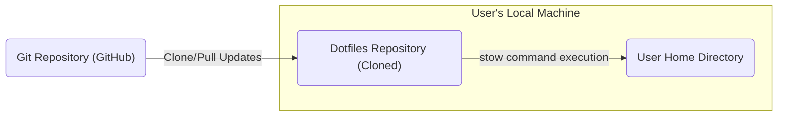
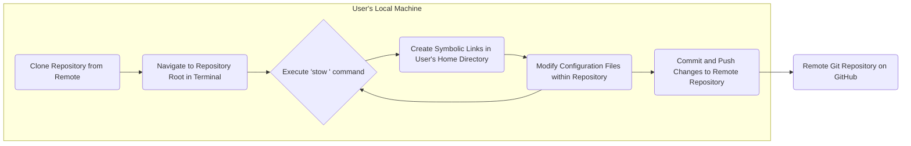
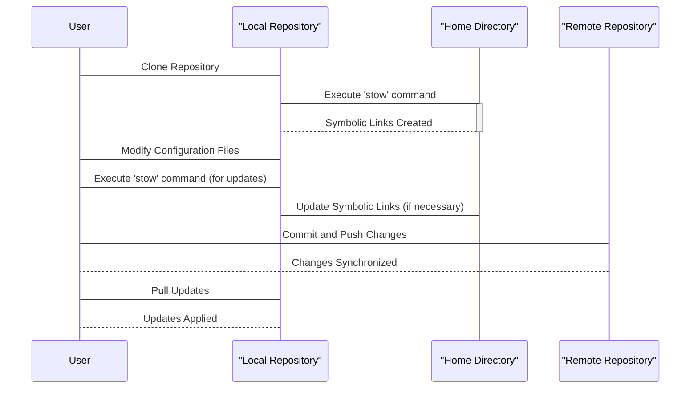

# Project Design Document: skwp/dotfiles

**Version:** 1.1
**Date:** October 26, 2023
**Author:** AI Cloud & Security Architect

## 1. Introduction

This document provides an enhanced design overview of the `skwp/dotfiles` project, a widely used repository for managing personal configuration files (dotfiles) leveraging the `stow` utility. This detailed design serves as a critical foundation for subsequent threat modeling activities, enabling a comprehensive security assessment.

## 2. Goals

* Deliver a refined and more detailed explanation of the `skwp/dotfiles` project's architecture and functionality.
* Clearly identify and describe the interactions between key components.
* Provide a more granular description of the data flow within the system.
* Emphasize potential security concerns from an architectural standpoint, offering more specific examples.
* Serve as an improved and more robust basis for conducting a thorough threat model of the project.

## 3. Non-Goals

* This document remains focused on architectural design and does not include a line-by-line code analysis of every script and configuration file.
* A specific threat model or vulnerability assessment is outside the scope of this document.
* The specific configurations within individual dotfiles for various applications are not detailed here.
* The user's specific operating system or environmental configurations, beyond their interaction with the dotfiles repository, are not addressed.

## 4. Architectural Overview

The `skwp/dotfiles` project employs a straightforward yet powerful architecture for dotfile management. Its core principle involves maintaining well-organized dotfiles within a structured repository and utilizing `stow` to generate symbolic links in the user's home directory, effectively pointing to these organized files.

### 4.1. High-Level Architecture

* **User Home Directory:** The designated location where symbolic links to the actual dotfiles are created, making the configurations active for applications.
* **Dotfiles Repository (Cloned):** A locally stored copy of the `skwp/dotfiles` Git repository. This repository maintains the structured organization of the dotfiles.
* **Git Repository (GitHub):** The remote repository hosted on GitHub, acting as the authoritative source for the dotfiles and their version history.

### 4.2. Detailed Architecture

The operational process involves several distinct stages:

* **Cloning Phase:** The user initiates the process by cloning the `skwp/dotfiles` repository from GitHub to their local machine, establishing the local working copy.
* **Organizational Structure:** The repository is intentionally structured into directories. Each directory typically corresponds to a specific application or area of configuration (e.g., `bash`, `nvim`, `zsh`, `git`).
* **Dotfile Placement within Directories:** Configuration files pertinent to each application are placed within their respective directories inside the repository, ensuring logical grouping.
* **Stowing Operation:** The user navigates their terminal to the root directory of the cloned repository. They then execute the `stow` command, specifying the directory of the application whose dotfiles they want to apply. For example, `stow bash` will create symbolic links in the user's home directory that point to the files located within the `bash` directory in the repository.
* **Updating Mechanism:** To update configurations, the user directly modifies the relevant files within the repository. Subsequently, re-running the `stow` command for the affected directory updates the corresponding symbolic links in the home directory. Often, scripts are used to automate this process for multiple configurations.
* **Synchronization Process:** Modifications made to the local repository can be committed and pushed back to the remote GitHub repository, ensuring the remote backup and enabling sharing across multiple machines. Conversely, updates from the remote repository can be pulled to synchronize the local copy.

## 5. Data Flow

The primary data flow within the `skwp/dotfiles` project centers around the movement and transformation of configuration file data:

* **Authoritative Source:** The remote Git repository hosted on GitHub serves as the definitive source of truth for the dotfiles.
* **Initial Retrieval:** The user initiates the data flow by cloning the repository. This action downloads the complete set of files and their version history to the user's local machine.
* **Local Storage of Files:** The dotfiles are stored as plain text files within the cloned repository directory structure on the user's local file system.
* **Symbolic Link Creation Process:** The `stow` command interprets the directory structure within the repository. Based on this structure, it creates symbolic links in the user's home directory. These links act as pointers, directing applications to the actual configuration files residing within the dotfiles repository.
* **Configuration Loading by Applications:** When an application starts or reloads its configuration, it attempts to read its configuration from specific files located in the user's home directory. Due to the symbolic links created by `stow`, these reads are redirected to the actual configuration files within the dotfiles repository.
* **Applying Updates:** When a user modifies a configuration file within the repository, these changes become effective the next time the application reads its configuration. This typically occurs upon application restart or when a configuration reload command is issued by the user or the application itself.
* **Synchronization with Remote:** Changes made locally can be pushed back to the remote repository, ensuring backups and enabling sharing. Conversely, pulling updates from the remote repository synchronizes the local copy with the latest changes.

## 6. Components

The `skwp/dotfiles` project is composed of the following essential components:

* **Git Repository:** The core component, providing version control and a centralized location for the dotfiles.
* **Configuration Files (Dotfiles):** The fundamental data units, consisting of plain text files that define the configuration settings for various applications and the user's shell environment (e.g., `.bashrc`, `.zshrc`, `init.vim`, `tmux.conf`).
* **Organized Directory Structure:** A crucial element for maintainability, where dotfiles are grouped into directories based on the application or system area they configure.
* **`stow` Utility:** The key tool for managing symbolic links, enabling the redirection of configuration reads from the home directory to the actual files in the repository.
* **Shell Scripts (Potentially):**  Often included to automate common tasks such as initial setup, applying configurations, and updating symbolic links for multiple applications simultaneously. These scripts can streamline the user experience.
* **README File:** Essential documentation providing instructions on how to install, use, and manage the dotfiles repository.
* **`.gitignore` File:** Defines patterns for intentionally untracked files that Git should ignore, preventing sensitive or unnecessary files from being committed to the repository.

## 7. Security Considerations (Pre-Threat Modeling)

While `skwp/dotfiles` primarily focuses on configuration management, several critical security aspects warrant careful consideration during threat modeling:

* **Compromised Source Repository:** The security of the entire dotfile setup hinges on the integrity of the remote Git repository. If an attacker gains control of the GitHub repository, they could inject malicious code into configuration files, potentially leading to arbitrary command execution on users' machines.
* **Malicious Code in Shell Configurations:** Dotfiles that configure the shell environment (`.bashrc`, `.zshrc`, etc.) can execute arbitrary shell commands upon shell initialization. A compromised repository could inject malicious commands that execute with the user's privileges.
* **Symlink Exploitation:** Although `stow` is designed for safe symlink creation, misconfigurations or targeted attacks could potentially manipulate symlinks to overwrite critical system files or expose sensitive data by linking configuration files to unintended locations.
* **Accidental Exposure of Secrets:** Users might inadvertently store sensitive information, such as API keys, passwords, or private keys, directly within their dotfiles. If the repository is public or an attacker gains unauthorized access, this sensitive information could be compromised.
* **Vulnerabilities in `stow`:** The security of the dotfile management process is also dependent on the security of the `stow` utility itself. Any undiscovered vulnerabilities within `stow` could potentially be exploited by malicious actors.
* **Security of the Local Machine:** The overall security is inherently tied to the security posture of the user's local machine. If the local machine is already compromised, the dotfiles repository and its contents could be targeted for manipulation.
* **File Permissions Issues:** Incorrect file permissions within the dotfiles repository or the user's home directory could create security vulnerabilities, allowing unauthorized modification or access to configuration files. For instance, overly permissive permissions on executable scripts could be exploited.
* **Supply Chain Security:**  If the user includes configurations for third-party tools or plugins, the security of those external dependencies also becomes a factor. Compromised plugins or tools could be configured through the dotfiles, leading to indirect security risks.

## 8. Future Considerations

* **In-depth Script Analysis:** A detailed security review of any included shell scripts is crucial to identify potential vulnerabilities within the automated processes. This includes checking for command injection vulnerabilities, insecure file handling, and other common scripting flaws.
* **Exploring Advanced Configuration Management:**  Investigating the potential benefits and drawbacks of using more sophisticated configuration management tools or infrastructure-as-code approaches alongside or as a replacement for `stow`.
* **Implementing Secure Secrets Management:**  Exploring and implementing secure methods for managing sensitive information within dotfiles, such as using dedicated secrets management tools (e.g., `pass`, `Bitwarden CLI`), environment variables (with appropriate safeguards), or encrypted configuration files.
* **Automated Security Scanning:**  Considering the integration of automated security scanning tools to periodically check the dotfiles repository for potential vulnerabilities or exposed secrets.

This enhanced design document provides a more detailed and nuanced understanding of the `skwp/dotfiles` project's architecture and security considerations. This improved foundation will facilitate a more thorough and effective threat modeling process, ultimately contributing to a more secure configuration management strategy.