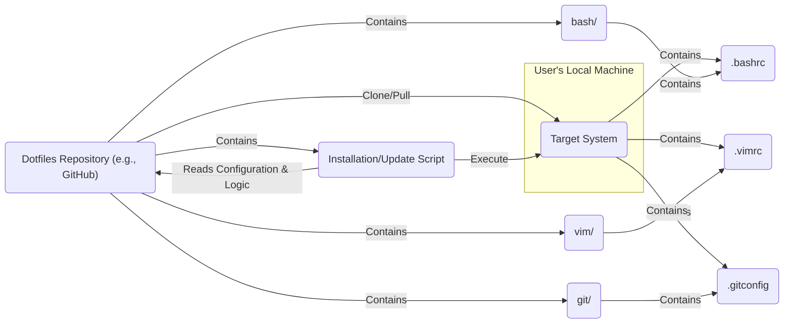

# Project Design Document: Dotfiles Management

**Project Name:** Dotfiles Management (Based on [https://github.com/skwp/dotfiles](https://github.com/skwp/dotfiles))

**Version:** 1.1

**Date:** October 26, 2023

**Author:** AI Software Architect

## 1. Project Overview

This document details the design of a dotfiles management system, drawing inspiration from the structure and methodology of the `skwp/dotfiles` repository. The primary objective of this system is to enable users to effectively manage their personal configuration files (dotfiles) across various machines and environments. This encompasses version control, streamlined deployment, and simplified maintenance of these configurations.

## 2. Goals and Objectives

* **Centralized and Versioned Configuration:** Store all personal configuration files within a single, Git-managed repository, ensuring version history and easy rollback.
* **Effortless Deployment:** Provide a clear and efficient mechanism to apply these configurations to both new and existing systems with minimal manual intervention.
* **Contextual Configuration:** Facilitate environment-specific configuration adjustments, allowing for tailored settings based on the target machine or use case (e.g., distinct configurations for work laptops versus personal desktops).
* **Intuitive Maintainability:** Structure the dotfiles repository in a logical and understandable manner, making it easy to navigate, modify, and extend the configurations.
* **Automated Application:** Automate the process of creating necessary symbolic links and applying the dotfiles to their designated locations within the file system.

## 3. Target Audience

* Individual users seeking a robust method for managing their personal configuration files.
* Software developers and system administrators aiming for consistent and reproducible development environments across multiple machines.
* Users comfortable with command-line interfaces and possessing a foundational understanding of scripting concepts.

## 4. System Architecture

The core of the system is a Git repository housing the dotfiles and accompanying scripts designed for their management.

### 4.1. Components

* **Dotfiles Repository:**
    * **Content:** Contains the actual configuration files (e.g., `.bashrc`, `.vimrc`, `.gitconfig`).
    * **Organization:** Structured into directories reflecting the applications or tools they configure (e.g., `bash/`, `vim/`, `git/`).
    * **Environment Specificity:** May include subdirectories to accommodate environment-specific configurations (e.g., `home/`, `work/`, `linux/`, `macos/`).
    * **Management Script:** Includes a central script (e.g., `install.sh`, `rc.sh`, `bootstrap.sh`) responsible for applying the configurations.
* **Installation/Update Script:**
    * **Responsibility:** A script (typically a shell script) that performs the following actions:
        * **Environment Detection:** Identifies the current operating system, hostname, or other relevant environment variables to determine the appropriate configuration set.
        * **Link Creation:** Establishes symbolic links from the files within the repository to their correct destination paths in the user's home directory (or other relevant locations).
        * **Conditional Logic:** Handles environment-specific configurations by selectively linking files from appropriate subdirectories.
        * **Custom Commands:** May execute additional configuration commands or scripts to further customize the environment (e.g., installing packages, setting preferences).
        * **Idempotency:** Ideally designed to be idempotent, meaning running it multiple times produces the same result.
* **Target System:**
    * **Definition:** The local machine where the dotfiles are being deployed and applied.
    * **Prerequisites:** Requires Git to be installed for cloning the repository.
    * **Execution Environment:** Needs a shell environment (e.g., Bash, Zsh) to execute the installation script.
    * **Configured Applications:** Hosts the applications and tools whose configurations are being managed by the dotfiles.

### 4.2. System Diagram

### 4.3. Data Flow

1. **Repository Acquisition:** The user clones or pulls the dotfiles repository from a remote source (e.g., GitHub) to a designated location on their local machine.
    * Location example: `~/dotfiles`
2. **Script Invocation:** The user navigates to the repository directory and executes the installation/update script.
    * Command example: `cd ~/dotfiles && ./install.sh`
3. **Environment Assessment:** The script begins by identifying the characteristics of the target environment.
    * Examples of checks: Operating system type (`uname`), hostname (`hostname`), existence of specific files or directories.
4. **Configuration Determination:** Based on the environment assessment, the script determines which specific dotfiles and configurations need to be applied.
    * Logic example: If the OS is macOS, link files from the `macos/` subdirectory; otherwise, use files from the base directory or a `linux/` subdirectory.
5. **Symbolic Link Creation:** The script proceeds to create symbolic links.
    * Example: `ln -sf ~/dotfiles/bash/.bashrc ~/.bashrc`
    * Explanation: This command creates a symbolic link named `.bashrc` in the user's home directory that points to the `.bashrc` file within the `bash/` directory of the dotfiles repository. The `-sf` flags ensure that existing links are overwritten.
6. **Optional Customization:** The script may execute additional commands or scripts for further customization.
    * Examples: Installing required software packages, setting specific system preferences, running post-installation scripts for certain applications.
7. **Application Configuration Loading:** When the user launches applications (e.g., opens a terminal, starts Vim), these applications read their configuration settings from the linked files in the home directory.
8. **Configuration Updates:** When the user modifies a dotfile within the repository, the changes are immediately reflected in the linked file, thus affecting the behavior of the corresponding application.
9. **Change Persistence:** The user can then commit these changes to the local repository and push them to the remote repository, ensuring that the configurations are backed up and synchronized.

## 5. Security Considerations

This section details potential security considerations associated with the dotfiles management system, which are crucial for subsequent threat modeling activities.

* **Repository Security:**
    * **Inadvertent Secret Exposure:** The repository might unintentionally contain sensitive information such as API keys, passwords, private keys, or other credentials.
        * Mitigation: Employ techniques like `.gitignore` to exclude sensitive files, use environment variables instead of hardcoding secrets, and consider using dedicated secrets management solutions.
    * **Repository Compromise:** If the repository is compromised (e.g., through account hijacking), malicious code could be injected into the dotfiles or the installation script.
        * Mitigation: Implement strong authentication practices, enable two-factor authentication, regularly review commit history, and consider signing commits.
    * **Public Repository Exposure:** If the repository is publicly accessible, sensitive configuration details or personal preferences might be exposed to a wider audience.
        * Mitigation: Carefully consider the sensitivity of the information stored in the dotfiles and opt for a private repository if necessary.
* **Installation Script Security:**
    * **Malicious Code Execution:** A compromised or poorly written installation script could execute arbitrary commands on the target system with the user's privileges.
        * Mitigation: Thoroughly review the installation script for any potential vulnerabilities, avoid running scripts from untrusted sources, and use linters and static analysis tools.
    * **Path Traversal Vulnerabilities:** The script might be susceptible to path traversal attacks if it doesn't properly sanitize file paths when creating symbolic links or performing other file system operations.
        * Mitigation: Implement robust input validation and sanitization techniques to prevent attackers from manipulating file paths.
    * **Insecure File Permissions:** Incorrect file permissions on the dotfiles or the installation script could allow unauthorized modification or execution.
        * Mitigation: Ensure that files have appropriate permissions (e.g., read-only for configuration files, execute permissions only where necessary).
* **Local System Security:**
    * **Symbolic Link Manipulation:** Malicious actors could potentially manipulate symbolic links to point to sensitive files or directories outside the intended scope, potentially leading to data breaches or privilege escalation.
        * Mitigation: Be cautious about running installation scripts from untrusted sources and regularly review the created symbolic links.
    * **Execution of Untrusted Code Snippets:** If the dotfiles include executable scripts or code snippets (e.g., shell functions, Vim scripts), these could be exploited if they are not carefully reviewed and understood.
        * Mitigation: Only include code from trusted sources and thoroughly examine any external scripts before execution.
    * **Overly Permissive Configurations:** Configuration files might inadvertently grant excessive permissions or expose vulnerabilities in the configured applications.
        * Mitigation: Regularly review application configurations and adhere to security best practices for each application.
* **Dependency Management (If Applicable):** If the installation script relies on external tools or packages (e.g., using `apt-get` or `brew`), vulnerabilities in those dependencies could introduce security risks.
    * Mitigation: Keep external dependencies up-to-date and be aware of any known vulnerabilities. Consider using version pinning to ensure consistent and secure dependency versions.

## 6. Deployment

The deployment process typically involves the following steps to apply the dotfiles to a target system:

1. **Repository Hosting:** Choose a platform to host the Git repository (e.g., GitHub, GitLab, Bitbucket, or a private Git server).
2. **Dotfiles Structuring:** Organize the configuration files within the repository according to a logical and maintainable structure, considering environment-specific needs.
3. **Installation Script Creation:** Develop a robust installation script (e.g., `install.sh`, `bootstrap.sh`) to handle the linking and application of the dotfiles, including environment detection and conditional logic.
    * Example script logic:
        * Check the operating system.
        * Create necessary directories if they don't exist.
        * Iterate through the dotfiles in the repository.
        * Create symbolic links to the corresponding locations in the user's home directory, using environment-specific files when appropriate.
4. **Repository Cloning:** On the target system, clone the dotfiles repository to a designated location.
    * Command example: `git clone <repository_url> ~/dotfiles`
5. **Script Execution:** Navigate to the cloned repository and execute the installation script.
    * Command example: `cd ~/dotfiles && ./install.sh`
6. **Verification and Testing:** After running the script, verify that the dotfiles have been correctly linked and the configurations are applied as expected. Test the configured applications to ensure they are functioning correctly.

## 7. Technologies Used

* **Core Version Control:** Git
* **Primary Scripting Language:** Typically Bash or Zsh shell scripting
* **Common Configuration File Formats:** Plain text files (e.g., `.conf`, `.rc`, `.ini`, `.yaml`, `.json`)
* **Operating System Feature:** Symbolic Links (symlinks)

## 8. Future Considerations

* **Advanced Configuration Management Tools:** Explore the integration of more sophisticated configuration management tools like Ansible, Stow, or GNU Stow for managing dotfiles, especially in more complex scenarios.
* **Secure Secrets Management:** Implement robust methods for managing sensitive information within the dotfiles, such as using environment variables, dedicated secrets management tools (e.g., HashiCorp Vault, `pass`), or Git-crypt/Blackbox for encrypting sensitive files within the repository.
* **Automated Testing and Validation:** Introduce automated testing frameworks to ensure the dotfiles and installation scripts function correctly across different environments and after modifications. This could involve unit tests for the script and integration tests to verify the application of configurations.
* **Enhanced Modularization:** Further modularize the dotfiles structure to improve organization, reusability, and maintainability. This could involve using submodules or more granular directory structures.
* **User Interface Development:** Consider developing a simple user interface (e.g., a command-line tool with more interactive features or a basic GUI) to simplify the management and deployment of dotfiles for less technical users.
* **Rollback Mechanism:** Implement a mechanism to easily rollback to previous versions of the dotfiles in case of unintended changes or errors. This could involve versioning the deployed configurations or having a dedicated rollback script.