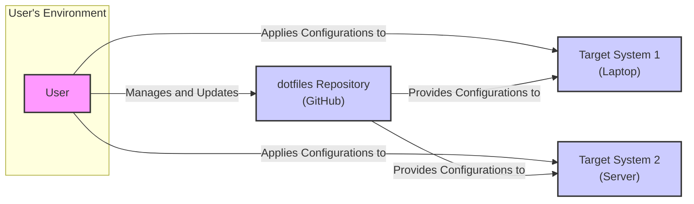
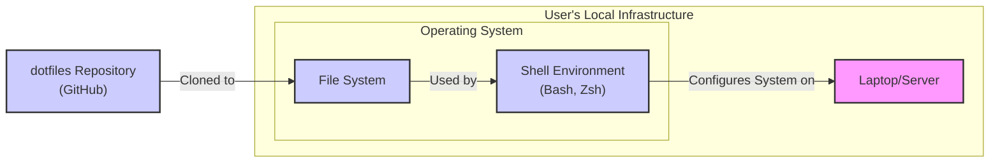
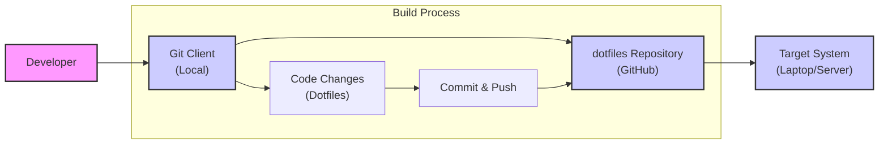

# BUSINESS POSTURE

This project is focused on managing personal configuration files, often referred to as "dotfiles", using version control. The primary goal is to maintain consistency and portability of a user's preferred operating system and application settings across different environments. For individuals, this enhances personal productivity and customization. For organizations, standardized dotfiles can streamline developer onboarding, ensure consistent development environments, and potentially enforce baseline security configurations.

Most important business risks that need to be addressed:
- Risk of exposing sensitive information within dotfiles, such as API keys, passwords, or private keys, if the repository is publicly accessible or improperly secured.
- Risk of misconfiguration or unintended changes introduced through dotfiles, potentially leading to system instability or security vulnerabilities.
- Risk of relying on insecure or outdated configurations if dotfiles are not regularly reviewed and updated.

# SECURITY POSTURE

Existing security controls:
- security control: Version control using Git, providing history and rollback capabilities for configuration changes. Implemented in: GitHub repository.
- security control: Access control to the GitHub repository, managed by GitHub. Implemented in: GitHub repository settings.
- security control: Local file system permissions on the user's machine where dotfiles are applied. Implemented in: Operating system.
- accepted risk: Potential exposure of dotfiles in a public repository if the user chooses to make it public.
- accepted risk: Reliance on user's secure coding practices and awareness of security implications when managing dotfiles.

Recommended security controls:
- security control: Implement secrets management practices to avoid storing sensitive information directly in dotfiles. Use tools like password managers, environment variables, or dedicated secrets management solutions.
- security control: Regularly audit dotfiles for sensitive information and potential security misconfigurations.
- security control: Implement input validation and sanitization in any scripts included in dotfiles to prevent command injection or other vulnerabilities.
- security control: Consider using a private repository for dotfiles, especially if they contain sensitive configurations or are intended for organizational use.

Security requirements:
- Authentication: Not directly applicable to dotfiles themselves, but authentication is required to access the Git repository and the systems where dotfiles are applied.
- Authorization: File system permissions on the target systems control who can apply and modify dotfiles. Repository access controls on GitHub manage who can access and modify the dotfiles repository.
- Input validation: Essential for any scripts within dotfiles to prevent malicious code execution or misconfiguration. Validate inputs to configuration scripts and avoid executing untrusted code.
- Cryptography: Use cryptography to protect sensitive data if it must be stored within dotfiles. Consider encryption at rest for sensitive configuration files or using encrypted secrets management solutions.

# DESIGN

## C4 CONTEXT

Context Diagram Elements:

- Element:
  - Name: User
  - Type: Person
  - Description: The individual who manages and utilizes the dotfiles repository. This user is responsible for updating configurations and applying them to various target systems.
  - Responsibilities: Manages dotfiles, updates configurations, applies configurations to target systems, ensures security of dotfiles.
  - Security controls: User authentication to GitHub, secure coding practices when managing dotfiles, awareness of security risks.

- Element:
  - Name: dotfiles Repository (GitHub)
  - Type: Software System
  - Description: A Git repository hosted on GitHub that stores the user's configuration files (dotfiles). It acts as the central source of truth for configurations.
  - Responsibilities: Stores and versions dotfiles, provides access to dotfiles for users and target systems, manages repository access control.
  - Security controls: GitHub access controls (authentication and authorization), Git version history, repository security settings provided by GitHub.

- Element:
  - Name: Target System 1 (Laptop)
  - Type: Software System
  - Description: A laptop or personal computer where the user applies the dotfiles to configure the operating system and applications.
  - Responsibilities: Executes configuration scripts from dotfiles, applies settings to the local environment, stores and uses configured applications.
  - Security controls: Operating system security controls (user authentication, file system permissions), security configurations applied by dotfiles, endpoint security software.

- Element:
  - Name: Target System 2 (Server)
  - Type: Software System
  - Description: A server or remote machine where the user applies the dotfiles to configure the server environment and applications.
  - Responsibilities: Executes configuration scripts from dotfiles, applies settings to the server environment, hosts and runs server applications.
  - Security controls: Operating system security controls (user authentication, file system permissions), security configurations applied by dotfiles, server hardening, network security controls.

## C4 CONTAINER

```mermaid
flowchart LR
    subgraph "User's Local Machine"
        A["User"]
        B["Git Client\n(Command Line)"]
    end
    C["dotfiles Repository\n(GitHub)"]
    subgraph "Target System\n(Laptop/Server)"
        D["Shell Environment\n(Bash, Zsh)"]
        E["Configuration Scripts\n(Shell Scripts, etc.)"]
        F["Applications\n(VSCode, etc.)"]
    end

    A -- "Pushes/Pulls Changes" --> B
    B -- "Interacts with" --> C
    C -- "Provides Dotfiles" --> D
    D -- "Executes" --> E
    E -- "Configures" --> D
    E -- "Configures" --> F

    style A fill:#f9f,stroke:#333,stroke-width:2px
    style B fill:#ccf,stroke:#333,stroke-width:2px
    style C fill:#ccf,stroke:#333,stroke-width:2px
    style D fill:#ccf,stroke:#333,stroke-width:2px
    style E fill:#ccf,stroke:#333,stroke-width:2px
    style F fill:#ccf,stroke:#333,stroke-width:2px
```

Container Diagram Elements:

- Element:
  - Name: Git Client (Command Line)
  - Type: Application
  - Description: A Git command-line client used by the user to interact with the dotfiles repository on GitHub. It handles version control operations like cloning, pushing, and pulling.
  - Responsibilities: Version control management, communication with the dotfiles repository, local storage of dotfiles.
  - Security controls: User authentication to Git, secure storage of Git credentials, secure communication protocols (HTTPS, SSH).

- Element:
  - Name: dotfiles Repository (GitHub)
  - Type: Data Store
  - Description:  A Git repository hosted on GitHub that persistently stores the dotfiles. It serves as the central storage and version control system for configurations.
  - Responsibilities: Persistent storage of dotfiles, version history, access control, repository management.
  - Security controls: GitHub security controls, data encryption at rest (GitHub managed), access logging, vulnerability scanning by GitHub.

- Element:
  - Name: Shell Environment (Bash, Zsh)
  - Type: Application
  - Description: The shell environment on the target system where configuration scripts are executed and dotfiles are applied. It interprets and runs the scripts to configure the system.
  - Responsibilities: Execution of configuration scripts, environment setup, user interaction.
  - Security controls: Operating system security controls, shell security configurations, user access controls, command history logging.

- Element:
  - Name: Configuration Scripts (Shell Scripts, etc.)
  - Type: Application
  - Description: Scripts within the dotfiles repository that contain the logic to apply configurations to the target system. These scripts automate the setup and customization process.
  - Responsibilities: System configuration, application setup, automation of configuration tasks.
  - Security controls: Input validation within scripts, secure coding practices, script execution permissions, static analysis of scripts (recommended).

- Element:
  - Name: Applications (VSCode, etc.)
  - Type: Application
  - Description: Various applications installed on the target system that are configured by the dotfiles. Examples include text editors, terminal emulators, and other utilities.
  - Responsibilities: Providing user functionality, adhering to configurations set by dotfiles, data processing and storage.
  - Security controls: Application-level security controls, security configurations applied by dotfiles, regular application updates, vulnerability management.

## DEPLOYMENT

Deployment Architecture: Single Instance Deployment

Deployment Diagram Elements:

- Element:
  - Name: Laptop/Server
  - Type: Infrastructure Node
  - Description: Represents the physical or virtual machine where the dotfiles are deployed and applied. This could be a personal laptop, a remote server, or any other system.
  - Responsibilities: Hosting the operating system, running applications, providing computing resources.
  - Security controls: Physical security of the machine, operating system security hardening, network security controls, endpoint security software.

- Element:
  - Name: Operating System
  - Type: Software Environment
  - Description: The operating system installed on the target machine, providing the foundation for running applications and executing configuration scripts.
  - Responsibilities: Resource management, process execution, file system management, user authentication.
  - Security controls: Operating system security features (firewall, access control lists, user permissions), security updates and patching, configuration hardening.

- Element:
  - Name: Shell Environment (Bash, Zsh)
  - Type: Software Component
  - Description: The shell environment within the operating system that interprets and executes configuration scripts from the dotfiles.
  - Responsibilities: Script execution, command interpretation, environment variable management.
  - Security controls: Shell security configurations, command history logging, restricted shell environments (if needed).

- Element:
  - Name: File System
  - Type: Data Store
  - Description: The local file system on the target machine where dotfiles are cloned and configuration files are stored and applied.
  - Responsibilities: Persistent storage of dotfiles, configuration files, application data.
  - Security controls: File system permissions, disk encryption (if enabled), access control lists.

- Element:
  - Name: dotfiles Repository (GitHub)
  - Type: External System
  - Description: The remote Git repository hosted on GitHub, serving as the source of truth for the dotfiles.
  - Responsibilities: Version control, remote storage, access management.
  - Security controls: GitHub security controls, repository access permissions, data encryption in transit and at rest (GitHub managed).

## BUILD

Build Process Description:

The build process for dotfiles is typically manual and developer-driven. It involves the following steps:

1. Developer makes changes to dotfiles locally using a text editor or IDE.
2. Developer uses a Git client to stage, commit, and push changes to the remote dotfiles repository on GitHub.
3. On the target system, the user pulls the latest changes from the dotfiles repository.
4. User executes configuration scripts within the dotfiles to apply the updated configurations to the target system.

Security Controls in Build Process:

- security control: Developer workstation security: Ensuring the developer's local machine is secure and free from malware to prevent compromised dotfiles.
- security control: Code review (optional): For organizational use, consider code reviews of dotfile changes to catch potential errors or security issues before they are pushed.
- security control: Git commit signing: Using signed Git commits to verify the authenticity and integrity of changes.
- security control: Repository access control: Restricting write access to the dotfiles repository to authorized developers.
- security control: Static analysis (recommended): Implement static analysis tools to scan configuration scripts for potential security vulnerabilities or misconfigurations before committing changes. This could include linters and security scanners for shell scripts or other configuration languages.

# RISK ASSESSMENT

Critical business process we are trying to protect:
- Personal productivity and efficiency by maintaining consistent and customized working environments.
- For organizations, standardization of developer environments, potentially impacting onboarding speed and consistency of development practices.

Data we are trying to protect and their sensitivity:
- Configuration data: This includes settings for operating systems, applications, and development tools. Sensitivity varies depending on the content. Some configuration data might be considered low sensitivity (e.g., UI themes), while others can be highly sensitive (e.g., API keys, credentials, private keys).
- Scripts: Configuration scripts themselves are code and should be treated with appropriate security considerations. Malicious scripts could compromise the target system.
- Personal preferences: Dotfiles can also contain personal preferences and customizations, which, while not necessarily sensitive in a security context, are valuable to the user.

# QUESTIONS & ASSUMPTIONS

Questions:
- Is this dotfiles repository intended for personal use or organizational use?
- What type of data is expected to be stored within these dotfiles? Are there any sensitive credentials or secrets?
- What are the target environments where these dotfiles will be applied (personal laptops, servers, specific operating systems)?
- Is there any existing security policy or standard that needs to be considered for managing these dotfiles?
- Is there a need for automated security checks or validation of dotfiles before deployment?

Assumptions:
- The dotfiles repository is primarily for personal use, although the design can be adapted for organizational use.
- Dotfiles are expected to contain a mix of configuration settings and potentially some scripts for automation.
- Target environments are assumed to be Unix-like systems (Linux, macOS), but the principles can be applied to other operating systems as well.
- There is no specific existing security policy provided, so general security best practices are assumed.
- Automated security checks are not currently implemented but are recommended as a security enhancement.