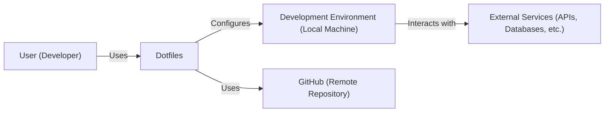
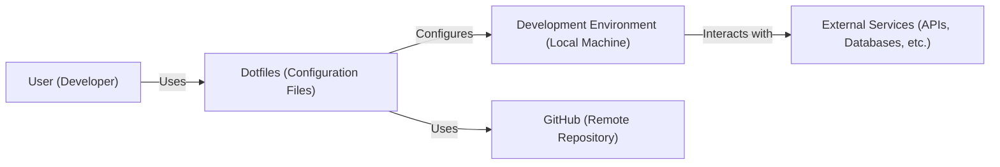
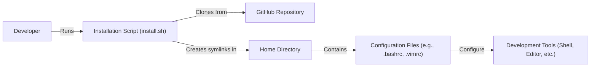
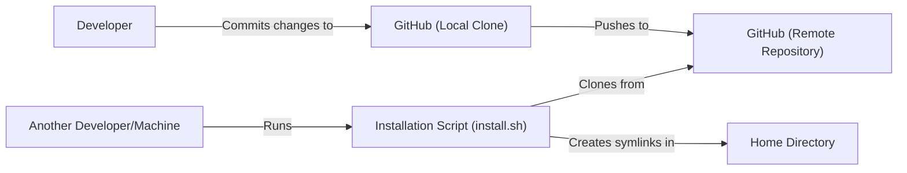

Okay, let's create a design document for the provided GitHub repository.

# BUSINESS POSTURE

Business Priorities and Goals:

*   Streamline developer environment setup and configuration.
*   Ensure consistency of development environment across different machines.
*   Reduce onboarding time for new projects or team members.
*   Maintain a personalized and efficient development workflow.
*   Version control and backup of configuration files.

Most Important Business Risks:

*   Exposure of sensitive information (API keys, passwords, etc.) if the repository is accidentally made public or accessed by unauthorized individuals.
*   Loss of productivity due to inconsistent or broken development environments.
*   Difficulty in recovering from system failures or hardware changes if dotfiles are not properly managed.
*   Introduction of vulnerabilities or malicious code through compromised dependencies or configurations.
*   Inability to reproduce a specific development environment state if version control is not used effectively.

# SECURITY POSTURE

Existing Security Controls:

*   security control: Version control using Git (described in the repository itself). This allows tracking changes, reverting to previous states, and collaborating on configurations.
*   security control: The repository is currently private. This limits access to authorized users only.
*   security control: Potentially, manual reviews of configuration changes before committing to the repository.

Accepted Risks:

*   accepted risk: Potential for accidental exposure of sensitive information if best practices are not followed (e.g., storing secrets directly in dotfiles).
*   accepted risk: Reliance on the security of GitHub's infrastructure and services.
*   accepted risk: Limited protection against sophisticated attacks targeting the developer's machine or GitHub account.

Recommended Security Controls:

*   security control: Implement a secrets management solution. This could involve using a dedicated secrets manager (e.g., HashiCorp Vault, AWS Secrets Manager, Azure Key Vault, SOPS, git-crypt) or environment variables for sensitive data.  Avoid storing secrets directly in the dotfiles.
*   security control: Regularly audit dotfiles for sensitive information and outdated configurations.
*   security control: Enable two-factor authentication (2FA) for the GitHub account.
*   security control: Use a strong and unique password for the GitHub account.
*   security control: Consider using a dedicated SSH key for accessing GitHub, separate from other SSH keys.
*   security control: Regularly review and update dependencies used in the dotfiles (e.g., shell plugins, themes).
*   security control: Implement a mechanism for verifying the integrity of downloaded scripts or configurations (e.g., checksums, digital signatures).

Security Requirements:

*   Authentication:
    *   GitHub access should be protected by strong authentication (password + 2FA).
    *   SSH key-based authentication should be used for Git operations where possible.
*   Authorization:
    *   Access to the repository should be restricted to authorized users only (currently achieved by making the repository private).
*   Input Validation:
    *   Any scripts or configurations that accept user input should validate that input to prevent injection vulnerabilities.
    *   Configuration files should be checked for syntax errors and unexpected values.
*   Cryptography:
    *   Sensitive data should be encrypted at rest and in transit.  This is particularly relevant for secrets management.
    *   SSH keys should be generated using strong cryptographic algorithms.

# DESIGN

## C4 CONTEXT

C4 Context Element List:

*   User (Developer):
    *   Name: User (Developer)
    *   Type: Person
    *   Description: The developer who uses the dotfiles to configure their development environment.
    *   Responsibilities: Managing their dotfiles, setting up their environment, developing software.
    *   Security controls: Strong password, 2FA for GitHub account, secure SSH key management.

*   Dotfiles:
    *   Name: Dotfiles
    *   Type: Software System
    *   Description: The collection of configuration files that define the developer's environment.
    *   Responsibilities: Providing a consistent and personalized development environment.
    *   Security controls: Version control, private repository, secrets management (recommended).

*   Development Environment (Local Machine):
    *   Name: Development Environment (Local Machine)
    *   Type: Environment
    *   Description: The developer's local machine, configured by the dotfiles.
    *   Responsibilities: Running development tools, executing code, interacting with external services.
    *   Security controls: Operating system security updates, firewall, antivirus software (not directly managed by dotfiles, but relevant).

*   GitHub (Remote Repository):
    *   Name: GitHub (Remote Repository)
    *   Type: External System
    *   Description: The remote Git repository hosted on GitHub, used to store and manage the dotfiles.
    *   Responsibilities: Providing version control, collaboration features, and backup for the dotfiles.
    *   Security controls: GitHub's built-in security features, private repository setting.

*   External Services (APIs, Databases, etc.):
    *   Name: External Services (APIs, Databases, etc.)
    *   Type: External Systems
    *   Description: Any external services that the developer interacts with from their development environment.
    *   Responsibilities: Providing specific functionalities required by the developer's projects.
    *   Security controls: Dependent on the specific services; should use secure authentication and authorization mechanisms.

## C4 CONTAINER

In this simple case, the Container diagram is very similar to the Context diagram. The "Dotfiles" system is essentially a single container.

C4 Container Element List:

*   Dotfiles (Configuration Files):
    *   Name: Dotfiles (Configuration Files)
    *   Type: Container
    *   Description:  A collection of scripts, configuration files, and potentially other resources that define the developer's environment.  This includes shell configurations (bash, zsh), editor settings (vim, neovim), and other tool configurations.
    *   Responsibilities:  Storing and applying configuration settings.
    *   Security controls:  Version control, regular audits for sensitive information, secrets management (recommended).

* All other elements are the same as in the C4 Context diagram.

## DEPLOYMENT

Possible Deployment Solutions:

1.  Manual Cloning and Symlinking: The developer manually clones the repository and creates symbolic links to the appropriate locations in their home directory.
2.  Automated Installation Script: The repository includes an installation script (e.g., `install.sh`) that automates the cloning, symlinking, and potentially other setup tasks.
3.  Dotfiles Manager: Using a dedicated dotfiles manager (e.g., `stow`, `yadm`, `chezmoi`) to handle the deployment and management of the dotfiles.

Chosen Solution (Automated Installation Script): This approach provides a balance between simplicity and automation.

Deployment Element List:

*   Developer:
    *   Name: Developer
    *   Type: Person
    *   Description: The user who is deploying the dotfiles.
    *   Responsibilities: Running the installation script.
    *   Security controls: Secure SSH key management, strong GitHub credentials.

*   Installation Script (install.sh):
    *   Name: Installation Script (install.sh)
    *   Type: Script
    *   Description: A script that automates the deployment of the dotfiles.
    *   Responsibilities: Cloning the repository, creating symlinks, running setup commands.
    *   Security controls: Input validation (if accepting any user input), error handling, potentially checking for existing configurations before overwriting.

*   GitHub Repository:
    *   Name: GitHub Repository
    *   Type: Remote Repository
    *   Description: The remote Git repository containing the dotfiles.
    *   Responsibilities: Storing the dotfiles and providing version control.
    *   Security controls: Private repository, GitHub's security features.

*   Home Directory:
    *   Name: Home Directory
    *   Type: File System Location
    *   Description: The user's home directory, where the dotfiles will be linked.
    *   Responsibilities: Containing the user's configuration files.
    *   Security controls: Operating system file permissions.

*   Configuration Files (e.g., .bashrc, .vimrc):
    *   Name: Configuration Files (e.g., .bashrc, .vimrc)
    *   Type: Files
    *   Description: The actual configuration files that control the behavior of various tools.
    *   Responsibilities: Defining the settings for shells, editors, and other applications.
    *   Security controls: Regular audits for sensitive information, avoiding hardcoded secrets.

*   Development Tools (Shell, Editor, etc.):
    *   Name: Development Tools (Shell, Editor, etc.)
    *   Type: Applications
    *   Description: The tools that are configured by the dotfiles.
    *   Responsibilities: Providing the developer's working environment.
    *   Security controls: Regular updates, secure configurations.

## BUILD

This project doesn't have a traditional "build" process in the sense of compiling code. However, there is a process of assembling and deploying the dotfiles. The closest analogy to a "build" is the execution of the installation script.

Build Process Security Controls:

*   security control: Code Review: While not a formal build step, reviewing changes to the dotfiles before committing them is crucial for security.
*   security control: Secrets Management: As mentioned earlier, a secrets management solution should be used to prevent sensitive information from being included in the repository.
*   security control: Dependency Management: If the dotfiles include any external dependencies (e.g., shell plugins), these should be regularly reviewed and updated to avoid vulnerabilities.
*   security control: Linting/Static Analysis: Tools like ShellCheck can be used to identify potential issues in shell scripts. This could be integrated into a pre-commit hook or a CI pipeline.

# RISK ASSESSMENT

Critical Business Processes:

*   Software Development: The primary business process is the developer's ability to write, test, and deploy code efficiently.
*   Environment Setup: Quickly setting up a consistent development environment is crucial for productivity.

Data Sensitivity:

*   Configuration Files: Generally low sensitivity, but could contain sensitive information if best practices are not followed.
*   Secrets (API Keys, Passwords): High sensitivity. These should *not* be stored directly in the dotfiles.
*   Personalization Data: Low sensitivity, but may contain information that the developer prefers to keep private.

# QUESTIONS & ASSUMPTIONS

Questions:

*   Are there any specific compliance requirements (e.g., company policies) that need to be considered?
*   What is the expected frequency of updates to the dotfiles?
*   Will multiple developers be using and contributing to this repository?
*   What specific external services will the development environment interact with?
*   Are there any existing tools or scripts used for managing secrets or configurations?
*   What operating systems are targeted?

Assumptions:

*   BUSINESS POSTURE: The primary goal is to improve developer productivity and maintain a consistent development environment. The risk appetite is relatively low, as accidental exposure of sensitive information could have significant consequences.
*   SECURITY POSTURE: The developer has a basic understanding of security best practices. The repository is currently private, providing a baseline level of security.
*   DESIGN: The dotfiles are primarily shell configurations and editor settings. The deployment process involves cloning the repository and creating symbolic links. The developer is using a Unix-like operating system (Linux or macOS).