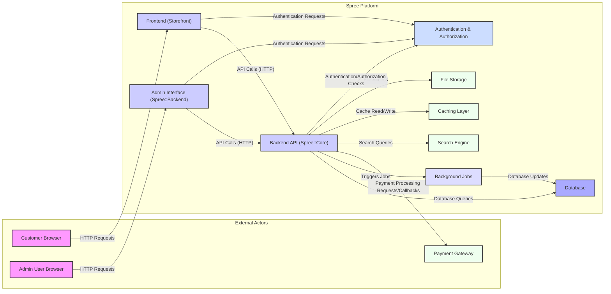

## Project Design Document: Spree E-commerce Platform for Threat Modeling (Improved)

**1. Introduction**

This document provides an enhanced architectural overview of the Spree e-commerce platform (as represented by the codebase at [https://github.com/spree/spree](https://github.com/spree/spree)) specifically tailored for threat modeling activities. It details the key components, data flows, and technologies involved, offering a robust foundation for identifying potential security vulnerabilities and risks. This document is intended for security professionals, developers, and anyone involved in the security assessment of the Spree platform. The improvements in this version aim to provide more granular detail and a stronger security focus.

**2. Project Overview**

Spree is a modular, open-source e-commerce platform built using the Ruby on Rails framework. It offers a comprehensive suite of features necessary for building and managing online stores, including product catalog management, order processing, user account management, payment gateway integrations, shipping configurations, and reporting. Its extensible architecture, leveraging Rails engines, allows for significant customization and the addition of new functionalities through extensions.

**3. System Architecture**

The Spree platform adheres to the Model-View-Controller (MVC) architectural pattern inherent in Ruby on Rails applications. The following components and their interactions are crucial for understanding the system's security posture:

*   **Frontend (Storefront):**
    *   Presents the user interface for customers interacting with the online store.
    *   Built using a combination of HTML, CSS, JavaScript, and a server-side templating engine (typically ERB).
    *   Handles user interactions, displays product information, manages the shopping cart, and facilitates the checkout process.
    *   Communicates with the Backend API via HTTP requests (often AJAX).
    *   May incorporate client-side JavaScript frameworks for enhanced interactivity.

*   **Backend API (Spree::Core):**
    *   The central component housing the core business logic and data access layer of the Spree platform.
    *   Implemented as a Ruby on Rails engine.
    *   Receives requests from the Frontend and other external systems.
    *   Manages data persistence through ActiveRecord, the Rails ORM.
    *   Enforces authentication and authorization policies for accessing resources.
    *   Provides RESTful API endpoints for managing core e-commerce entities like products, orders, users, promotions, and payments.

*   **Admin Interface (Spree::Backend):**
    *   A dedicated web interface for administrators to manage and configure the Spree store.
    *   Built as a separate Rails engine within the Spree application.
    *   Provides functionalities for product catalog management, order fulfillment, user administration, report generation, and system configuration.
    *   Interacts with the same Backend API (Spree::Core) but often with elevated privileges.

*   **Database (Persistence Layer):**
    *   Stores all persistent data for the Spree application.
    *   Typically a relational database system such as PostgreSQL (recommended), MySQL, or SQLite.
    *   Contains tables for products, users, orders, payments, shipping information, and other relevant data.

*   **Background Jobs (Asynchronous Processing):**
    *   Handles time-consuming and non-interactive tasks asynchronously.
    *   Often implemented using Active Job with a background processing library like Sidekiq or Resque.
    *   Examples include sending emails (order confirmations, password resets), processing payment callbacks, and generating reports.

*   **Payment Gateway Integrations:**
    *   Facilitates secure communication with third-party payment processors (e.g., Stripe, PayPal, Braintree).
    *   Handles the secure transmission of payment information and the processing of transactions.
    *   Often involves webhooks or callbacks from the payment gateway to update order statuses.

*   **Search Engine (Optional):**
    *   An external service (e.g., Elasticsearch, Solr) used to provide advanced product search capabilities.
    *   Product data is indexed in the search engine for efficient and relevant search results.
    *   The Backend API interacts with the search engine to perform search queries.

*   **Caching Layer (Optional):**
    *   Improves application performance by storing frequently accessed data in memory.
    *   Commonly implemented using Redis or Memcached.
    *   Reduces the load on the database by serving cached responses.

*   **File Storage (Optional):**
    *   Used for storing media files such as product images and other assets.
    *   Can be a local filesystem or a cloud-based object storage service like AWS S3.

*   **Authentication and Authorization Service:**
    *   Manages user authentication (verifying identity) and authorization (granting access to resources).
    *   Often implemented using gems like Devise within the Rails application.
    *   Handles user registration, login, password management, and session management.

**4. System Architecture Diagram**

**5. Data Flow Diagrams**

These diagrams illustrate the flow of data for critical functionalities, highlighting potential security touchpoints:

*   **User Login:**
    *   User submits login credentials (username/email and password) via the Frontend or Admin Interface.
    *   The Frontend/Admin Interface sends an authentication request to the Backend API.
    *   The Backend API forwards the credentials to the Authentication & Authorization service.
    *   The Authentication & Authorization service verifies the credentials against the user database.
    *   Upon successful authentication, the Authentication & Authorization service creates a session.
    *   A session identifier (e.g., cookie) is returned to the Frontend/Admin Interface.
    *   Subsequent requests from the user include the session identifier for authorization.

*   **Adding a Product to Cart:**
    *   User browses products on the Frontend.
    *   User selects a product and adds it to their cart.
    *   The Frontend sends an "add to cart" request to the Backend API, including product ID and quantity.
    *   The Backend API retrieves product information from the Database.
    *   The Backend API updates the user's cart (stored in the session or database).
    *   The Backend API sends a success response back to the Frontend.

*   **Processing an Order:**
    *   User proceeds to checkout on the Frontend.
    *   User enters shipping and billing information.
    *   The Frontend sends order details to the Backend API.
    *   The Backend API validates the order data.
    *   The Backend API interacts with the Payment Gateway to process payment information.
    *   The Payment Gateway returns a transaction status to the Backend API.
    *   Upon successful payment, the Backend API creates an order record in the Database.
    *   The Backend API triggers background jobs for order confirmation emails and inventory updates.

*   **Administering Products:**
    *   Admin user logs into the Admin Interface.
    *   Admin user navigates to the product management section.
    *   Admin user creates or edits product details (name, description, price, images).
    *   The Admin Interface sends API requests to the Backend API to create or update product records.
    *   The Backend API validates the input data and updates the product information in the Database.
    *   Product images may be uploaded and stored in File Storage.

**6. Key Technologies**

*   **Programming Language:** Ruby
*   **Framework:** Ruby on Rails
*   **Database:** PostgreSQL (recommended), MySQL, SQLite
*   **Frontend Technologies:** HTML, CSS, JavaScript
*   **Templating Engine:** ERB (default), potentially others
*   **Background Jobs:** Active Job, Sidekiq, Resque
*   **Payment Processing:** Integrations with various payment gateways (e.g., Stripe, PayPal, Braintree)
*   **Search Engine (Optional):** Elasticsearch, Solr
*   **Caching (Optional):** Redis, Memcached
*   **File Storage (Optional):** AWS S3, local filesystem
*   **Authentication and Authorization:** Devise (common), custom implementations
*   **API Style:** RESTful

**7. Security Considerations and Potential Threats**

This section outlines key security considerations and potential threats that should be the focus of threat modeling exercises:

*   **Authentication and Authorization Vulnerabilities:**
    *   Brute-force attacks against login forms.
    *   Weak or default credentials.
    *   Insecure session management (e.g., session fixation, session hijacking).
    *   Insufficient protection against Cross-Site Request Forgery (CSRF).
    *   Authorization bypass vulnerabilities allowing access to unauthorized resources or actions.

*   **Input Validation and Data Sanitization Issues:**
    *   Cross-Site Scripting (XSS) vulnerabilities due to unsanitized user input.
    *   SQL Injection vulnerabilities arising from improperly sanitized database queries.
    *   Command Injection vulnerabilities if user input is used in system commands.
    *   Path Traversal vulnerabilities when handling file uploads or access.

*   **Payment Processing Security:**
    *   Exposure of sensitive payment information during transmission or storage.
    *   Vulnerabilities in payment gateway integrations.
    *   Compliance with PCI DSS requirements for handling credit card data.
    *   Risk of man-in-the-middle attacks during payment processing.

*   **Data Protection and Privacy:**
    *   Inadequate encryption of sensitive data at rest and in transit.
    *   Insufficient protection of Personally Identifiable Information (PII).
    *   Data breaches due to unauthorized access.

*   **Access Control and Privilege Escalation:**
    *   Improperly configured access controls allowing unauthorized access to administrative functionalities.
    *   Vulnerabilities that allow users to escalate their privileges.

*   **Third-Party Dependencies and Integrations:**
    *   Vulnerabilities in third-party libraries (gems) used by the application.
    *   Security risks associated with external integrations (e.g., payment gateways, search engines).

*   **API Security:**
    *   Lack of proper authentication and authorization for API endpoints.
    *   Exposure of sensitive data through API responses.
    *   Denial-of-service attacks against API endpoints.
    *   Mass assignment vulnerabilities.

*   **File Upload Vulnerabilities:**
    *   Uploading malicious files that can be executed on the server.
    *   Storage of uploaded files in publicly accessible locations.

*   **Background Job Security:**
    *   Potential for unauthorized execution or manipulation of background jobs.
    *   Exposure of sensitive data processed by background jobs.

*   **Error Handling and Logging:**
    *   Information leakage through verbose error messages.
    *   Insufficient or insecure logging practices.

**8. Assumptions and Constraints**

*   This design document reflects the general architecture of Spree as found in the core repository. Specific implementations and customizations may introduce variations.
*   The focus is primarily on the web application components. Infrastructure security aspects are not explicitly detailed but are crucial for a complete security assessment.
*   The specific versions of technologies used can impact security vulnerabilities and should be considered during threat modeling.
*   This document assumes a standard deployment model for a web application.

**9. Conclusion**

This improved design document provides a more detailed and security-focused overview of the Spree e-commerce platform's architecture. It highlights key components, data flows, and potential security considerations to facilitate effective threat modeling. By understanding these aspects, security professionals can better identify, analyze, and mitigate potential security risks associated with the Spree platform. This document should serve as a valuable resource for security assessments and ongoing security efforts.