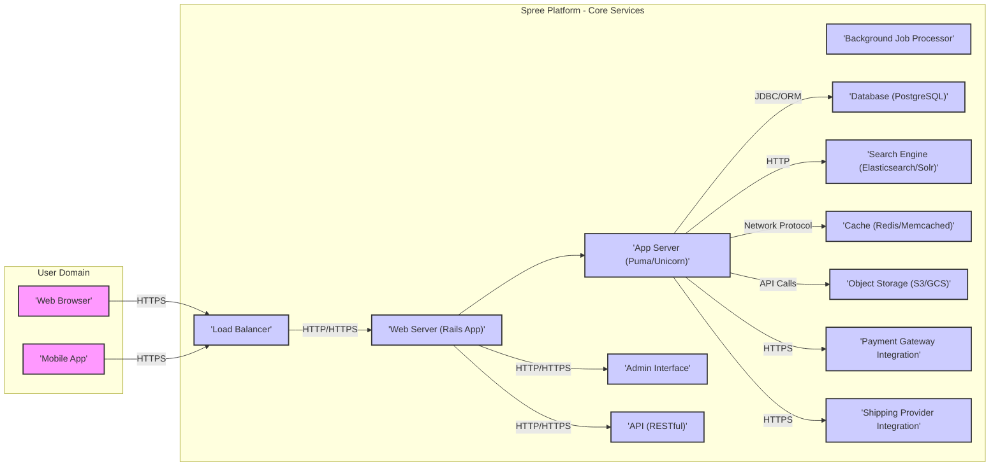

# Project Design Document: Spree E-commerce Platform

**Version:** 1.1
**Date:** October 26, 2023
**Author:** AI Software Architect

## 1. Introduction

This document provides an enhanced and detailed design of the Spree e-commerce platform (based on the project at [https://github.com/spree/spree](https://github.com/spree/spree)). This design will serve as a robust foundation for subsequent threat modeling activities. The document outlines the key components, their interactions, data flow with a security focus, and technologies involved, providing greater clarity and depth for security analysis.

## 2. Goals and Objectives

*   To provide a clear, comprehensive, and security-focused architectural overview of the Spree platform.
*   To identify the major components and their specific responsibilities, highlighting potential security boundaries and interfaces.
*   To illustrate the data flow within the system with an emphasis on sensitive data handling and potential vulnerabilities.
*   To highlight key technologies and dependencies, noting their security characteristics and potential risks.
*   To establish a solid and detailed foundation for identifying potential security threats, vulnerabilities, and attack vectors.

## 3. High-Level Architecture

## 4. Component Design

This section provides a more detailed breakdown of the key components of the Spree platform, emphasizing their security responsibilities and potential vulnerabilities.

*   **User Interface Components:**
    *   **Web Browser:** The client-side application where users interact with the storefront. Potential client-side vulnerabilities (e.g., XSS) need consideration.
    *   **Mobile App (Optional):**  A native or hybrid application. Security considerations include API security, secure storage of credentials, and potential reverse engineering.

*   **Infrastructure Components:**
    *   **Load Balancer:** Distributes traffic and can provide basic DDoS protection. It's crucial for SSL termination and should be configured securely to prevent man-in-the-middle attacks.
    *   **Web Server (Rails Application):**  The core of the Spree application, responsible for handling requests, routing, and serving content. Vulnerabilities in the Rails application code are a primary concern (e.g., injection flaws, authentication bypasses).
    *   **Application Server (Puma/Unicorn):** Executes the Rails application code. Security considerations include process isolation and resource management.
    *   **Background Job Processor (Sidekiq/Resque):**  Handles asynchronous tasks. Securely handling sensitive data within background jobs and preventing unauthorized job execution are important.

*   **Data Storage and Management Components:**
    *   **Database (PostgreSQL):** Stores persistent data. Security measures include access control, encryption at rest, and protection against SQL injection.
    *   **Search Engine (Elasticsearch/Solr):** Provides search functionality. Security considerations include preventing data breaches through search queries and securing the search index.
    *   **Cache (Redis/Memcached):**  Stores frequently accessed data. Sensitive data in the cache needs appropriate security measures, as it's often in-memory.
    *   **Object Storage (Object Storage - AWS S3/Google Cloud Storage):** Stores media files. Access control and preventing unauthorized access to stored assets are key security concerns.

*   **External Integration Components:**
    *   **Payment Gateway Integration:**  Handles sensitive payment information. This integration must be PCI DSS compliant, using secure APIs and tokenization to minimize direct handling of credit card details. Secure redirection and validation are crucial.
    *   **Shipping Provider Integration:** Connects with shipping carriers. Security considerations include protecting API keys and preventing manipulation of shipping information.

*   **Administrative Interface Component:**
    *   **Admin Interface:** A privileged interface. Strong authentication (e.g., multi-factor authentication), authorization, and audit logging are essential to prevent unauthorized access and actions.

*   **API Component:**
    *   **API (RESTful):**  Provides a programmatic interface. Security measures include authentication (e.g., OAuth 2.0), authorization, rate limiting, and input validation to prevent abuse and unauthorized access.

## 5. Data Flow with Security Focus

This section details the flow of data, highlighting security considerations at each stage.

*   **Browsing Products:**
    *   User (Web Browser/Mobile App) sends an HTTPS request to the Load Balancer. **(Ensures encrypted communication)**
    *   Load Balancer forwards the request to a Web Server instance.
    *   Web Server (Rails Application) queries the Database for product information. **(Potential for SQL injection if queries are not parameterized)**
    *   Optionally, the Web Server may query the Cache or Search Engine. **(Ensure sensitive data is not inadvertently exposed in the cache or search index)**
    *   Product images are retrieved from Object Storage. **(Ensure proper access controls on the storage bucket)**
    *   The Web Server renders the product listing, sanitizing output to prevent XSS, and sends it back to the User over HTTPS.

*   **Adding Item to Cart:**
    *   User (Web Browser/Mobile App) sends an HTTPS "add to cart" request.
    *   Load Balancer forwards the request to a Web Server instance.
    *   Web Server updates the user's cart information in the Database or a secure session store (backed by Redis/Memcached with appropriate security configurations). **(Protect against session hijacking and ensure data integrity)**
    *   The updated cart information is sent back to the User over HTTPS.

*   **User Registration/Login:**
    *   User (Web Browser/Mobile App) submits registration or login details over HTTPS.
    *   Load Balancer forwards the request to a Web Server instance.
    *   Web Server securely hashes and salts passwords before storing them in the Database. **(Use strong hashing algorithms)**
    *   Upon successful authentication, a secure session token is generated and stored (e.g., in a cookie with HttpOnly and Secure flags). **(Prevent session fixation and unauthorized access)**

*   **Placing an Order:**
    *   User (Web Browser/Mobile App) submits order details and payment information over HTTPS.
    *   Load Balancer forwards the request to a Web Server instance.
    *   Web Server validates the order and securely transmits payment information to the Payment Gateway Integration. **(Avoid storing raw credit card details. Use tokenization where possible.)**
    *   The Payment Gateway processes the payment and sends a response back to the Web Server.
    *   Upon successful payment, the order is created in the Database. **(Ensure data integrity and audit logging)**
    *   Background Job Processor is notified to handle tasks like sending order confirmation emails. **(Ensure sensitive data in emails is handled securely)** and initiating shipping processing via the Shipping Provider Integration. **(Securely manage API keys)**

*   **Administering Products:**
    *   Admin User interacts with the Admin Interface over HTTPS.
    *   The Admin Interface sends requests to the Web Server.
    *   Web Server authenticates the admin user using strong credentials and potentially multi-factor authentication.
    *   Web Server interacts with the Database to manage product information. **(Implement proper authorization to restrict access based on roles)**
    *   Product images are uploaded to Object Storage. **(Ensure only authorized admins can upload and manage assets)**
    *   The Search Engine index is updated.

## 6. Technology Stack and Security Implications

This section outlines the primary technologies and their inherent security considerations.

*   **Programming Language: Ruby:** Requires careful coding practices to avoid vulnerabilities like mass assignment and insecure deserialization.
*   **Framework: Ruby on Rails:** While providing security features, it's crucial to keep the framework updated and follow secure coding guidelines to prevent common Rails vulnerabilities.
*   **Database: PostgreSQL:** Offers robust security features like access controls and encryption. Proper configuration and maintenance are essential.
*   **Application Servers: Puma, Unicorn:** Security considerations include process isolation and resource limits to prevent denial-of-service attacks.
*   **Background Job Processing: Sidekiq, Resque:** Securely handling and processing sensitive data within background jobs is critical. Ensure proper authorization for job execution.
*   **Search Engine: Elasticsearch, Solr:**  Secure configuration is necessary to prevent unauthorized access to the search index and potential data leaks through search queries.
*   **Caching: Redis, Memcached:** Data stored in the cache should be treated with care, especially sensitive information. Consider encryption and access controls.
*   **Frontend Technologies: HTML, CSS, JavaScript:** Prone to client-side vulnerabilities like XSS. Employing Content Security Policy (CSP) and proper input/output sanitization is crucial.
*   **API Format: RESTful JSON:**  Security relies on proper authentication and authorization mechanisms (e.g., OAuth 2.0, JWT).

## 7. Deployment Considerations and Security Best Practices

*   **Cloud Platforms (AWS, GCP, Azure):** Leverage cloud-native security services like firewalls, identity and access management (IAM), and encryption services.
*   **Containerization (Docker, Kubernetes):** Implement security best practices for container images, registries, and orchestration platforms. Regularly scan images for vulnerabilities.
*   **Infrastructure as Code (IaC) (Terraform, CloudFormation):** Securely manage infrastructure configurations and secrets.
*   **Continuous Integration/Continuous Deployment (CI/CD):** Integrate security testing (static analysis, dynamic analysis, vulnerability scanning) into the CI/CD pipeline.
*   **Secrets Management:** Utilize secure secrets management solutions (e.g., HashiCorp Vault, AWS Secrets Manager) to avoid hardcoding sensitive credentials.
*   **Regular Security Audits and Penetration Testing:**  Proactively identify and address potential vulnerabilities.
*   **Web Application Firewall (WAF):**  Protect against common web attacks like SQL injection and XSS.
*   **Intrusion Detection/Prevention Systems (IDS/IPS):** Monitor network traffic for malicious activity.

## 8. Security Considerations (Detailed for Threat Modeling)

This section provides a more granular view of security considerations, directly relevant for threat modeling exercises.

*   **Authentication and Authorization:**
    *   Weak password policies.
    *   Lack of multi-factor authentication for administrators.
    *   Insecure session management (e.g., predictable session IDs).
    *   Insufficient role-based access control.
    *   Vulnerabilities in authentication logic leading to bypasses.
*   **Input Validation:**
    *   SQL injection vulnerabilities in database queries.
    *   Cross-site scripting (XSS) vulnerabilities in user-generated content or application output.
    *   Command injection vulnerabilities.
    *   Path traversal vulnerabilities.
    *   Insufficient validation of file uploads.
*   **Data Protection:**
    *   Storing sensitive data (e.g., credit card numbers) without encryption.
    *   Lack of encryption in transit (e.g., not using HTTPS).
    *   Insufficient access controls on databases and storage.
    *   Data breaches due to insecure API endpoints.
    *   Exposure of sensitive data in logs or error messages.
*   **Payment Security:**
    *   Non-compliance with PCI DSS standards.
    *   Vulnerabilities in payment gateway integration.
    *   Man-in-the-middle attacks during payment processing.
    *   Storing sensitive authentication data for payment gateways insecurely.
*   **Session Management:**
    *   Session fixation vulnerabilities.
    *   Session hijacking vulnerabilities.
    *   Insecure storage of session tokens.
    *   Lack of session timeout mechanisms.
*   **Cross-Site Scripting (XSS):**
    *   Reflected XSS vulnerabilities.
    *   Stored XSS vulnerabilities.
    *   DOM-based XSS vulnerabilities.
    *   Insufficient output encoding.
*   **Cross-Site Request Forgery (CSRF):**
    *   Lack of CSRF protection tokens.
    *   Predictable CSRF tokens.
*   **Dependency Management:**
    *   Using outdated libraries with known vulnerabilities.
    *   Lack of vulnerability scanning for dependencies.
*   **API Security:**
    *   Lack of authentication or weak authentication schemes.
    *   Insufficient authorization controls.
    *   Rate limiting not implemented or improperly configured.
    *   Exposure of sensitive data through API responses.
*   **Admin Interface Security:**
    *   Default or weak administrative credentials.
    *   Lack of access restrictions to the admin interface.
    *   Vulnerabilities allowing privilege escalation.

## 9. Future Considerations with Security in Mind

*   **Enhanced Security Features:** Implementing features like multi-factor authentication for all users, web application firewalls (WAFs), and more robust intrusion detection systems (IDS).
*   **Regular Penetration Testing and Vulnerability Assessments:**  Proactive security evaluations to identify and address weaknesses.
*   **Security Audits of Third-Party Integrations:**  Ensuring the security of integrated services like payment gateways and shipping providers.
*   **Implementation of a Security Information and Event Management (SIEM) System:**  Centralized logging and security monitoring.
*   **Adopting a DevSecOps Approach:** Integrating security practices throughout the software development lifecycle.

This enhanced design document provides a more detailed and security-focused overview of the Spree e-commerce platform's architecture. It is intended to be a valuable and comprehensive resource for conducting thorough and effective threat modeling.
