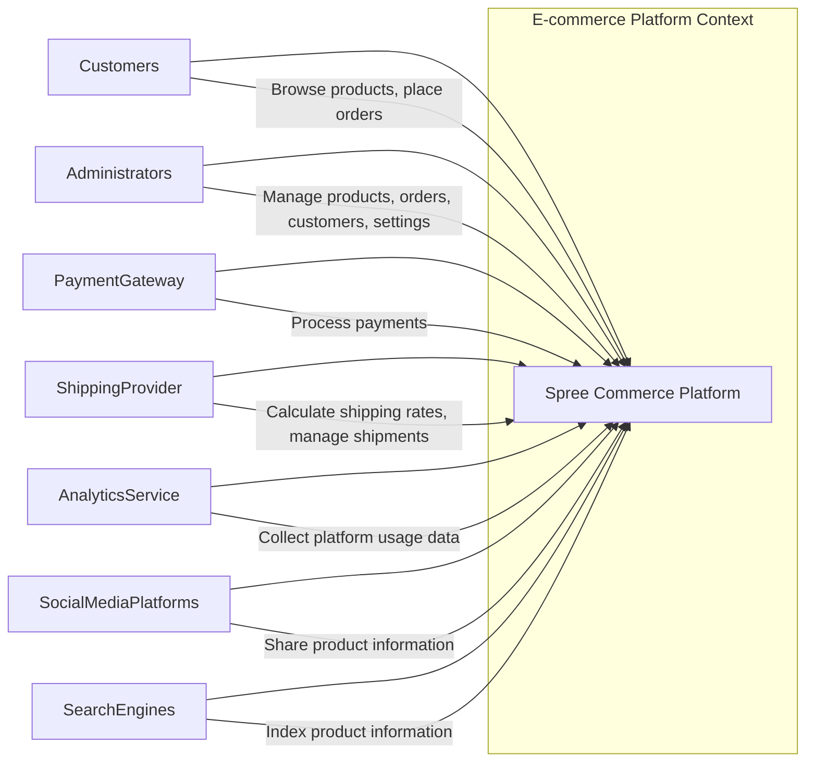
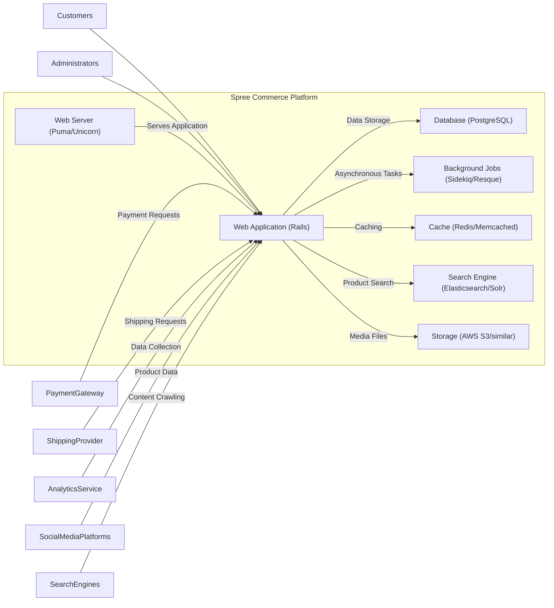
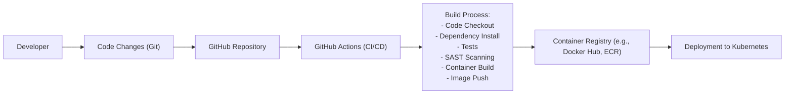

# BUSINESS POSTURE

This project is an open-source e-commerce platform called Spree Commerce. It aims to provide a flexible and customizable solution for businesses to build online stores.

- Business priorities:
  - Provide a robust and feature-rich e-commerce platform.
  - Enable businesses to quickly set up and manage online stores.
  - Offer a customizable and extensible platform to meet diverse business needs.
  - Foster a strong community around the platform for support and contributions.
- Business goals:
  - Increase adoption and usage of Spree Commerce.
  - Expand the platform's features and capabilities.
  - Maintain a high level of quality and stability.
  - Ensure the platform remains competitive in the e-commerce market.
- Most important business risks:
  - Security vulnerabilities leading to data breaches and financial losses.
  - Platform instability causing downtime and lost sales.
  - Lack of community support hindering adoption and development.
  - Competition from other e-commerce platforms.
  - Difficulty in customization and integration leading to project failures.

# SECURITY POSTURE

- Existing security controls:
  - security control: HTTPS enforcement for secure communication. Implemented at web server and application level.
  - security control: Authentication and authorization mechanisms provided by Ruby on Rails framework and Spree Commerce application. Implemented within the application code.
  - security control: Input validation implemented using Rails framework validations and custom application logic. Implemented within the application code.
  - security control: Protection against common web vulnerabilities (e.g., CSRF, XSS) provided by Ruby on Rails framework. Implemented within the framework.
- Accepted risks:
  - accepted risk: Reliance on community contributions for security vulnerability identification and patching.
  - accepted risk: Potential for misconfigurations during deployment by users leading to security weaknesses.
  - accepted risk: Third-party extensions and integrations may introduce security vulnerabilities.
- Recommended security controls:
  - security control: Implement regular security vulnerability scanning for dependencies and application code.
  - security control: Conduct penetration testing to identify and address potential security weaknesses.
  - security control: Establish a security incident response plan to handle security breaches effectively.
  - security control: Implement security awareness training for developers and administrators.
  - security control: Enforce secure coding practices and conduct code reviews with security focus.
  - security control: Implement dependency scanning and management to track and update vulnerable dependencies.
- Security requirements:
  - Authentication:
    - Requirement: Secure authentication for administrators to manage the platform.
    - Requirement: Secure customer authentication for account access and order placement.
    - Requirement: Support for strong password policies and multi-factor authentication for administrators.
  - Authorization:
    - Requirement: Role-based access control for administrators to manage different aspects of the platform.
    - Requirement: Authorization to ensure customers can only access their own order and account information.
    - Requirement: API authorization to control access to platform APIs.
  - Input validation:
    - Requirement: Validate all user inputs to prevent injection attacks (SQL injection, XSS, etc.).
    - Requirement: Sanitize user inputs before displaying them to prevent XSS vulnerabilities.
    - Requirement: Validate file uploads to prevent malicious file uploads.
  - Cryptography:
    - Requirement: Use strong encryption algorithms for storing sensitive data (e.g., passwords, payment information).
    - Requirement: Securely manage encryption keys.
    - Requirement: Use HTTPS for all communication to protect data in transit.
    - Requirement: Implement secure storage for sensitive data at rest.

# DESIGN

## C4 CONTEXT



- Context Diagram Elements:
  - Element:
    - Name: Customers
    - Type: Person
    - Description: Users who browse products and place orders on the online store.
    - Responsibilities: Browse product catalog, add products to cart, place orders, manage account information.
    - Security controls: Authentication, authorization, password management, secure session management.
  - Element:
    - Name: Administrators
    - Type: Person
    - Description: Users who manage the Spree Commerce platform, including products, orders, customers, and settings.
    - Responsibilities: Manage product catalog, process orders, manage customer accounts, configure platform settings, generate reports.
    - Security controls: Strong authentication (MFA), role-based access control, audit logging, secure session management.
  - Element:
    - Name: Payment Gateway
    - Type: External System
    - Description: Third-party service for processing online payments (e.g., Stripe, PayPal).
    - Responsibilities: Securely process customer payments, handle payment transactions, provide payment status updates.
    - Security controls: PCI DSS compliance, secure API integration, encryption of payment data.
  - Element:
    - Name: Shipping Provider
    - Type: External System
    - Description: Third-party service for calculating shipping rates and managing shipments (e.g., UPS, FedEx).
    - Responsibilities: Calculate shipping costs, provide shipping options, manage shipment tracking, provide shipping status updates.
    - Security controls: Secure API integration, data encryption in transit.
  - Element:
    - Name: Analytics Service
    - Type: External System
    - Description: Third-party service for collecting and analyzing platform usage data (e.g., Google Analytics).
    - Responsibilities: Track website traffic, user behavior, sales data, generate reports.
    - Security controls: Data anonymization, secure data transmission, compliance with data privacy regulations.
  - Element:
    - Name: Social Media Platforms
    - Type: External System
    - Description: Social media platforms (e.g., Facebook, Twitter, Instagram) for sharing product information and marketing.
    - Responsibilities: Share product information, drive traffic to the online store, engage with customers.
    - Security controls: Secure API integration, data privacy considerations.
  - Element:
    - Name: Search Engines
    - Type: External System
    - Description: Search engines (e.g., Google, Bing) that index the online store's product information.
    - Responsibilities: Index website content, make products discoverable through search results.
    - Security controls: SEO optimization, robots.txt configuration.

## C4 CONTAINER



- Container Diagram Elements:
  - Element:
    - Name: Web Application (Rails)
    - Type: Container
    - Description: Ruby on Rails application that handles user requests, business logic, and presentation for the e-commerce platform.
    - Responsibilities: Handle HTTP requests, manage user sessions, implement business logic, render web pages, interact with other containers.
    - Security controls: Input validation, output encoding, authentication, authorization, session management, protection against common web vulnerabilities (CSRF, XSS, SQL Injection), security libraries and frameworks (Rails security features).
  - Element:
    - Name: Database (PostgreSQL)
    - Type: Container
    - Description: PostgreSQL database for persistent storage of application data, including product information, customer data, orders, and settings.
    - Responsibilities: Store and retrieve application data, ensure data integrity and consistency, provide data persistence.
    - Security controls: Database access control, encryption at rest, regular backups, database hardening, monitoring and auditing.
  - Element:
    - Name: Background Jobs (Sidekiq/Resque)
    - Type: Container
    - Description: Background job processing system (e.g., Sidekiq or Resque) for handling asynchronous tasks such as sending emails, processing orders, and generating reports.
    - Responsibilities: Process background tasks, manage job queues, ensure reliable task execution.
    - Security controls: Secure job processing, input validation for job arguments, monitoring of job queues.
  - Element:
    - Name: Web Server (Puma/Unicorn)
    - Type: Container
    - Description: Web server (e.g., Puma or Unicorn) that serves the Ruby on Rails application and handles incoming HTTP requests.
    - Responsibilities: Accept HTTP requests, route requests to the application server, serve static files, manage connections.
    - Security controls: Web server hardening, HTTPS configuration, access logging, rate limiting, DDoS protection.
  - Element:
    - Name: Cache (Redis/Memcached)
    - Type: Container
    - Description: In-memory caching system (e.g., Redis or Memcached) to improve application performance by caching frequently accessed data.
    - Responsibilities: Cache data, reduce database load, improve response times.
    - Security controls: Access control, secure configuration, data encryption in transit (if applicable).
  - Element:
    - Name: Search Engine (Elasticsearch/Solr)
    - Type: Container
    - Description: Search engine (e.g., Elasticsearch or Solr) for providing product search functionality.
    - Responsibilities: Index product data, provide search capabilities, improve search relevance.
    - Security controls: Access control, secure configuration, input validation for search queries.
  - Element:
    - Name: Storage (AWS S3/similar)
    - Type: Container
    - Description: Object storage service (e.g., AWS S3 or similar) for storing media files such as product images and attachments.
    - Responsibilities: Store and retrieve media files, provide scalable storage.
    - Security controls: Access control, encryption at rest, data integrity checks, secure access policies.

## DEPLOYMENT

Deployment Solution: Cloud-based deployment using containerization and orchestration on a platform like AWS, GCP, or Azure.

```mermaid
flowchart LR
    subgraph "Cloud Environment (AWS)"
      subgraph "Kubernetes Cluster"
        Node1["Node 1"]
        Node2["Node 2"]
        PodWebApp1["Pod: Web App 1"]
        PodWebApp2["Pod: Web App 2"]
        PodDB["Pod: Database"]
        PodCache["Pod: Cache"]
        PodSearch["Pod: Search Engine"]
        PodJobs["Pod: Background Jobs"]
        Node1 -- PodWebApp1
        Node1 -- PodDB
        Node2 -- PodWebApp2
        Node2 -- PodCache
        Node2 -- PodSearch
        Node1 -- PodJobs
      end
      LoadBalancer["Load Balancer"]
      ObjectStorage["Object Storage (S3)"]
      ManagedDatabase["Managed Database Service (RDS)"]
      ManagedCache["Managed Cache Service (ElastiCache)"]
      ManagedSearch["Managed Search Service (Elasticsearch Service)"]
    end
    Internet -- LoadBalancer
    LoadBalancer -- PodWebApp1
    LoadBalancer -- PodWebApp2
    PodWebApp1 -- ManagedDatabase
    PodWebApp2 -- ManagedDatabase
    PodWebApp1 -- ManagedCache
    PodWebApp2 -- ManagedCache
    PodWebApp1 -- ManagedSearch
    PodWebApp2 -- ManagedSearch
    PodWebApp1 -- ObjectStorage
    PodWebApp2 -- ObjectStorage
    PodJobs -- ManagedDatabase
```

- Deployment Diagram Elements:
  - Element:
    - Name: Cloud Environment (AWS)
    - Type: Environment
    - Description: Cloud infrastructure provided by AWS (Amazon Web Services).
    - Responsibilities: Provide underlying infrastructure for hosting the application, including compute, storage, and networking resources.
    - Security controls: AWS security controls, VPC configuration, security groups, IAM roles, compliance certifications.
  - Element:
    - Name: Kubernetes Cluster
    - Type: Infrastructure
    - Description: Kubernetes cluster for container orchestration and management.
    - Responsibilities: Deploy and manage containers, scale application instances, provide service discovery and load balancing within the cluster.
    - Security controls: Kubernetes RBAC, network policies, pod security policies, container image security scanning, cluster security hardening.
  - Element:
    - Name: Node 1, Node 2
    - Type: Infrastructure
    - Description: Worker nodes within the Kubernetes cluster, providing compute resources for running containers.
    - Responsibilities: Execute containers, provide compute resources, manage node resources.
    - Security controls: Operating system hardening, security patching, node security monitoring.
  - Element:
    - Name: Pod: Web App 1, Pod: Web App 2
    - Type: Container Instance
    - Description: Instances of the Web Application container running within Kubernetes pods.
    - Responsibilities: Serve web application requests, execute application logic.
    - Security controls: Container security, application-level security controls.
  - Element:
    - Name: Pod: Database
    - Type: Container Instance
    - Description: Instance of the Database container running within a Kubernetes pod. Alternatively, a managed database service can be used.
    - Responsibilities: Provide database services within the cluster.
    - Security controls: Container security, database security controls. In case of managed service - managed service security controls.
  - Element:
    - Name: Pod: Cache
    - Type: Container Instance
    - Description: Instance of the Cache container running within a Kubernetes pod. Alternatively, a managed cache service can be used.
    - Responsibilities: Provide caching services within the cluster.
    - Security controls: Container security, cache security controls. In case of managed service - managed service security controls.
  - Element:
    - Name: Pod: Search Engine
    - Type: Container Instance
    - Description: Instance of the Search Engine container running within a Kubernetes pod. Alternatively, a managed search service can be used.
    - Responsibilities: Provide search engine services within the cluster.
    - Security controls: Container security, search engine security controls. In case of managed service - managed service security controls.
  - Element:
    - Name: Pod: Background Jobs
    - Type: Container Instance
    - Description: Instance of the Background Jobs container running within a Kubernetes pod.
    - Responsibilities: Process background jobs within the cluster.
    - Security controls: Container security, background job processing security controls.
  - Element:
    - Name: Load Balancer
    - Type: Infrastructure
    - Description: Cloud load balancer to distribute traffic across Web Application pods.
    - Responsibilities: Distribute incoming traffic, provide high availability and scalability.
    - Security controls: Load balancer security configuration, DDoS protection, SSL termination.
  - Element:
    - Name: Object Storage (S3)
    - Type: Managed Service
    - Description: AWS S3 for storing media files.
    - Responsibilities: Scalable and durable object storage.
    - Security controls: AWS S3 security controls, access policies, encryption at rest.
  - Element:
    - Name: Managed Database Service (RDS)
    - Type: Managed Service
    - Description: AWS RDS for PostgreSQL managed database service.
    - Responsibilities: Managed database service, automated backups, high availability.
    - Security controls: AWS RDS security controls, database encryption, access control.
  - Element:
    - Name: Managed Cache Service (ElastiCache)
    - Type: Managed Service
    - Description: AWS ElastiCache for Redis/Memcached managed cache service.
    - Responsibilities: Managed caching service, high performance caching.
    - Security controls: AWS ElastiCache security controls, access control, encryption in transit and at rest.
  - Element:
    - Name: Managed Search Service (Elasticsearch Service)
    - Type: Managed Service
    - Description: AWS Elasticsearch Service for managed search engine.
    - Responsibilities: Managed search engine service, scalable search capabilities.
    - Security controls: AWS Elasticsearch Service security controls, access control, data encryption.

## BUILD



- Build Process Elements:
  - Element:
    - Name: Developer
    - Type: Person
    - Description: Software developer contributing code to the Spree Commerce project.
    - Responsibilities: Write code, commit changes, create pull requests.
    - Security controls: Secure development environment, code review, security training.
  - Element:
    - Name: Code Changes (Git)
    - Type: Artifact
    - Description: Code changes committed by developers using Git version control.
    - Responsibilities: Track code changes, manage versions, facilitate collaboration.
    - Security controls: Access control to Git repository, branch protection, commit signing.
  - Element:
    - Name: GitHub Repository
    - Type: System
    - Description: GitHub repository hosting the Spree Commerce source code.
    - Responsibilities: Store source code, manage branches, track issues, facilitate collaboration.
    - Security controls: GitHub access controls, branch protection rules, vulnerability scanning (Dependabot).
  - Element:
    - Name: GitHub Actions (CI/CD)
    - Type: System
    - Description: GitHub Actions for automated Continuous Integration and Continuous Deployment.
    - Responsibilities: Automate build, test, and deployment processes, run security checks.
    - Security controls: Secure workflow configuration, secret management, access control to workflows, audit logging.
  - Element:
    - Name: Build Process
    - Type: Process
    - Description: Automated build process defined in GitHub Actions workflows.
    - Responsibilities: Compile code, run tests, perform security scans (SAST), build container images, push images to registry.
    - Security controls: SAST scanning, dependency scanning, container image scanning, secure build environment, minimized build dependencies.
  - Element:
    - Name: Container Registry (e.g., Docker Hub, ECR)
    - Type: System
    - Description: Container registry for storing and managing container images.
    - Responsibilities: Store container images, manage image versions, provide image access control.
    - Security controls: Container registry access control, image scanning, vulnerability scanning, content trust (image signing).
  - Element:
    - Name: Deployment to Kubernetes
    - Type: Process
    - Description: Automated deployment of container images from the registry to the Kubernetes cluster.
    - Responsibilities: Deploy application updates, manage application lifecycle in Kubernetes.
    - Security controls: Secure deployment pipelines, Kubernetes RBAC, deployment validation.

# RISK ASSESSMENT

- Critical business processes we are trying to protect:
  - Product catalog management: Maintaining accurate and up-to-date product information.
  - Order processing: Securely and reliably processing customer orders from placement to fulfillment.
  - Payment processing: Securely handling customer payment information and transactions.
  - Customer account management: Securely managing customer accounts and personal information.
  - Inventory management: Tracking and managing product inventory levels.
- Data we are trying to protect and their sensitivity:
  - Customer Personally Identifiable Information (PII): Name, address, email, phone number, order history. Sensitivity: High. Requires strong protection due to privacy regulations and potential for identity theft.
  - Payment card information (PCI): Credit card numbers, expiration dates, CVV codes. Sensitivity: Critical. Requires strict PCI DSS compliance and strong encryption.
  - Administrator credentials: Usernames and passwords for platform administrators. Sensitivity: Critical. Compromise can lead to full platform control.
  - Product information: Product descriptions, prices, images. Sensitivity: Medium. Important for business operations and marketing.
  - Order data: Order details, shipping information, transaction history. Sensitivity: Medium. Important for business operations and customer service.
  - Analytics data: Website traffic, user behavior data. Sensitivity: Low to Medium. Can be used for business insights and marketing, but less sensitive than PII or PCI.

# QUESTIONS & ASSUMPTIONS

- Questions:
  - What is the specific deployment environment for Spree Commerce (e.g., AWS, GCP, Azure, on-premise)?
  - Are there any existing security tools or services in place (e.g., WAF, vulnerability scanners, SIEM)?
  - What is the security maturity level of the organization using Spree Commerce?
  - Are there any specific compliance requirements (e.g., PCI DSS, GDPR, HIPAA)?
  - What is the expected scale and performance requirements for the platform?
  - Are there any specific third-party integrations planned or in use?
- Assumptions:
  - The project will be deployed in a cloud environment for scalability and resilience.
  - Security is a high priority for the project due to the nature of e-commerce and handling sensitive data.
  - Standard security best practices for web applications and cloud deployments will be followed.
  - The organization using Spree Commerce has some level of technical expertise to manage and maintain the platform.
  - The platform will handle customer PII and potentially payment card information, requiring strong security measures.