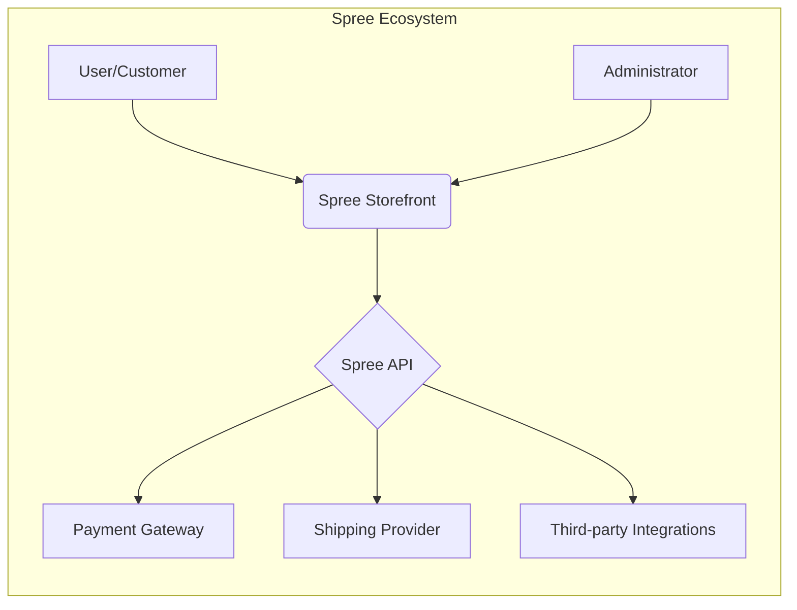
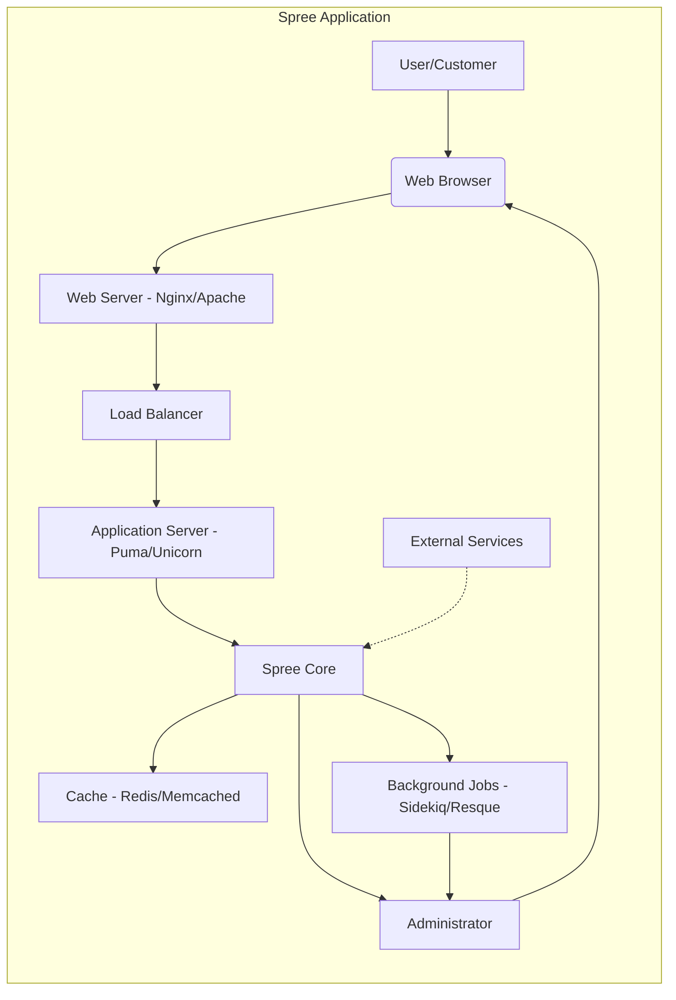
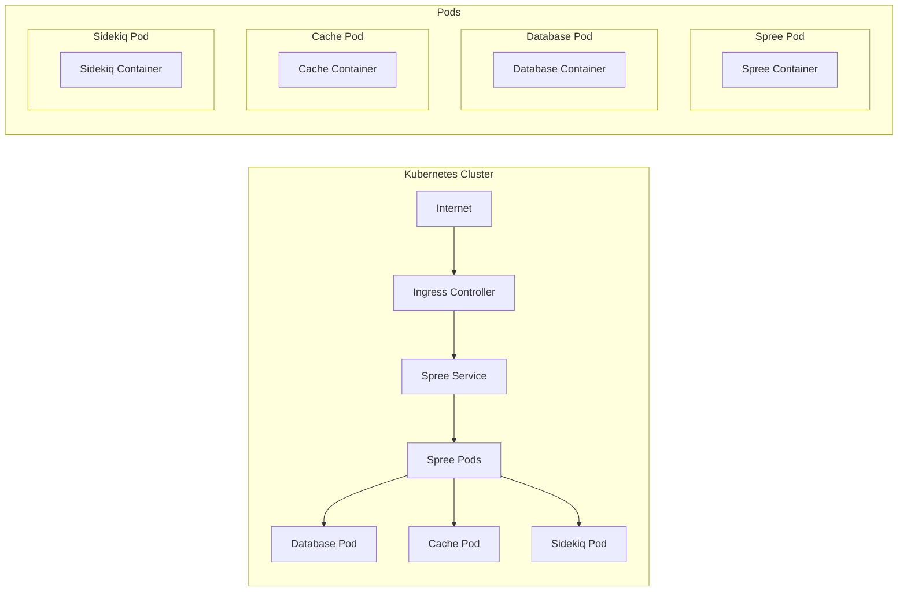
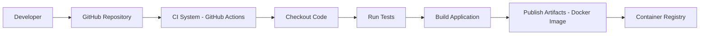

Okay, let's create a design document for the Spree e-commerce platform based on the provided GitHub repository.

# BUSINESS POSTURE

Spree is an open-source e-commerce platform built on Ruby on Rails.  It's designed to be a flexible and customizable solution for businesses of all sizes, from startups to larger enterprises.  The primary business goals are:

*   Provide a robust and scalable platform for online sales.
*   Enable merchants to manage products, inventory, orders, and customers.
*   Offer a customizable storefront to match brand identity.
*   Support various payment gateways and shipping methods.
*   Facilitate integrations with third-party services (e.g., analytics, marketing).
*   Maintain a vibrant open-source community for ongoing development and support.

Key business priorities:

*   Revenue generation through online sales.
*   Customer satisfaction and retention.
*   Brand reputation and trust.
*   Operational efficiency in managing the e-commerce business.
*   Adaptability to changing market demands and business needs.

Most important business risks:

*   Loss of sales due to platform downtime or performance issues.
*   Data breaches compromising customer data (PII, payment information).
*   Fraudulent transactions impacting revenue and reputation.
*   Inability to scale the platform to meet growing demand.
*   Lack of compliance with relevant regulations (e.g., PCI DSS, GDPR).
*   Vulnerabilities in third-party integrations.

# SECURITY POSTURE

Based on the GitHub repository and general knowledge of Ruby on Rails applications, here's an assessment of Spree's security posture:

Existing security controls:

*   security control: Authentication: User authentication mechanisms (likely using Devise or a similar gem) to manage user accounts and access control. Implemented in Spree's authentication modules and controllers.
*   security control: Authorization: Role-based access control (RBAC) to restrict access to different parts of the platform based on user roles (e.g., admin, customer). Implemented using CanCanCan or a similar authorization library, defined in ability models.
*   security control: Input Validation: Validation of user inputs to prevent common web vulnerabilities like cross-site scripting (XSS) and SQL injection. Implemented using Rails' built-in validation helpers and potentially custom validators.
*   security control: Session Management: Secure session management using cookies and server-side session storage. Likely using Rails' default session management mechanisms.
*   security control: Encryption: Encryption of sensitive data at rest (e.g., database encryption) and in transit (e.g., HTTPS). Implemented using Rails' encryption features and HTTPS configuration.
*   security control: Payment Gateway Integration: Secure integration with payment gateways using industry-standard protocols and APIs (e.g., PCI DSS compliance). Implemented in Spree's payment processing modules.
*   security control: Regular Updates: Dependency management to keep Rails and other gems up-to-date, addressing security vulnerabilities. Managed through Bundler and Gemfile.
*   security control: CSRF Protection: Rails' built-in protection against Cross-Site Request Forgery attacks. Automatically included in Rails applications.

Accepted risks:

*   accepted risk: Reliance on third-party gems: Spree, like any Rails application, depends on numerous third-party gems. Vulnerabilities in these gems could impact the platform's security.
*   accepted risk: Customization complexity: The high degree of customization offered by Spree can introduce security risks if not implemented carefully.
*   accepted risk: Open-source nature: While beneficial for transparency and community contributions, the open-source nature of Spree means that vulnerabilities are publicly visible.
*   accepted risk: Deployment variability: Spree can be deployed in various environments, and the security of the deployment environment is the responsibility of the deployer.

Recommended security controls (high priority):

*   security control: Implement a robust Web Application Firewall (WAF) to protect against common web attacks.
*   security control: Conduct regular penetration testing and vulnerability scanning to identify and address security weaknesses.
*   security control: Implement a strong Content Security Policy (CSP) to mitigate XSS attacks.
*   security control: Implement multi-factor authentication (MFA) for administrative users.
*   security control: Implement security logging and monitoring to detect and respond to security incidents.
*   security control: Implement rate limiting to prevent brute-force attacks and denial-of-service.

Security Requirements:

*   Authentication:
    *   Strong password policies (length, complexity, expiration).
    *   Protection against brute-force attacks (account lockout, rate limiting).
    *   Secure password reset mechanisms.
    *   Optional multi-factor authentication.

*   Authorization:
    *   Fine-grained access control based on user roles and permissions.
    *   Principle of least privilege (users should only have access to what they need).
    *   Regular review of user roles and permissions.

*   Input Validation:
    *   Validation of all user inputs on both the client-side and server-side.
    *   Whitelisting of allowed characters and formats.
    *   Encoding of output to prevent XSS.

*   Cryptography:
    *   Use of strong, industry-standard cryptographic algorithms (e.g., AES, RSA, SHA-256).
    *   Secure key management practices.
    *   Encryption of sensitive data at rest and in transit.
    *   Proper use of hashing for passwords (e.g., bcrypt, scrypt).

# DESIGN

## C4 CONTEXT

Element Descriptions:

*   1.  Name: User/Customer
    *   Type: Person
    *   Description: A person who interacts with the Spree storefront to browse products, place orders, and manage their account.
    *   Responsibilities: Browsing products, adding items to cart, placing orders, managing account information, providing payment details.
    *   Security controls: Authentication, authorization, session management, data encryption (HTTPS).

*   2.  Name: Spree Storefront
    *   Type: Software System
    *   Description: The customer-facing web application that provides the user interface for interacting with the Spree platform.
    *   Responsibilities: Displaying products, handling user interactions, managing the shopping cart, processing orders, interacting with the Spree API.
    *   Security controls: Input validation, output encoding, CSRF protection, session management, HTTPS.

*   3.  Name: Spree API
    *   Type: Software System
    *   Description: The backend API that handles business logic, data access, and interactions with external services.
    *   Responsibilities: Managing products, inventory, orders, customers, processing payments, handling shipping, integrating with third-party services.
    *   Security controls: Authentication, authorization, input validation, data encryption, API security best practices.

*   4.  Name: Payment Gateway
    *   Type: External System
    *   Description: A third-party service that processes payments (e.g., Stripe, PayPal).
    *   Responsibilities: Securely processing payment transactions, handling sensitive payment data.
    *   Security controls: PCI DSS compliance, encryption, fraud detection.

*   5.  Name: Shipping Provider
    *   Type: External System
    *   Description: A third-party service that handles shipping and logistics (e.g., UPS, FedEx).
    *   Responsibilities: Providing shipping rates, generating shipping labels, tracking shipments.
    *   Security controls: API security, data encryption.

*   6.  Name: Third-party Integrations
    *   Type: External System
    *   Description: Various third-party services that can be integrated with Spree (e.g., analytics, marketing, CRM).
    *   Responsibilities: Varies depending on the specific integration.
    *   Security controls: API security, data encryption, secure integration practices.

*   7.  Name: Administrator
    *   Type: Person
    *   Description: A person who manages the Spree platform, including products, orders, customers, and settings.
    *   Responsibilities: Configuring the platform, managing content, monitoring performance, managing users.
    *   Security controls: Strong authentication (MFA recommended), authorization, session management, HTTPS.

## C4 CONTAINER

Element Descriptions:

*   1.  Name: User/Customer
    *   Type: Person
    *   Description: A person interacting with the Spree storefront.
    *   Responsibilities: Browsing, purchasing, managing account.
    *   Security controls: Authentication, authorization, session management.

*   2.  Name: Web Browser
    *   Type: Software System
    *   Description: The user's web browser.
    *   Responsibilities: Rendering the Spree storefront, handling user input.
    *   Security controls: Browser security settings, HTTPS.

*   3.  Name: Web Server (Nginx/Apache)
    *   Type: Software System
    *   Description: The web server that receives requests from the user's browser.
    *   Responsibilities: Serving static content, proxying requests to the application server.
    *   Security controls: HTTPS configuration, WAF (recommended).

*   4.  Name: Load Balancer
    *   Type: Software System
    *   Description: Distributes incoming traffic across multiple application server instances.
    *   Responsibilities: Ensuring high availability and scalability.
    *   Security controls: SSL termination, health checks.

*   5.  Name: Application Server (Puma/Unicorn)
    *   Type: Software System
    *   Description: The Ruby on Rails application server that runs the Spree code.
    *   Responsibilities: Handling application logic, interacting with the database and other services.
    *   Security controls: Application-level security controls (authentication, authorization, etc.).

*   6.  Name: Spree Core
    *   Type: Software System
    *   Description: The core Spree application code.
    *   Responsibilities: All e-commerce functionality.
    *   Security controls: All previously mentioned security controls.

*   7.  Name: Database (PostgreSQL/MySQL)
    *   Type: Software System
    *   Description: The database that stores Spree data (products, orders, customers, etc.).
    *   Responsibilities: Data persistence and retrieval.
    *   Security controls: Database security configuration, encryption at rest (recommended).

*   8.  Name: Cache (Redis/Memcached)
    *   Type: Software System
    *   Description: A caching system to improve performance.
    *   Responsibilities: Storing frequently accessed data in memory.
    *   Security controls: Access control, data encryption (if sensitive data is cached).

*   9.  Name: Background Jobs (Sidekiq/Resque)
    *   Type: Software System
    *   Description: A system for processing background tasks (e.g., sending emails, processing images).
    *   Responsibilities: Asynchronous task execution.
    *   Security controls: Input validation, secure queue management.

*   10. Name: Administrator
    *   Type: Person
    *   Description: A person who manages the Spree platform.
    *   Responsibilities: Configuring the platform, managing content, monitoring performance.
    *   Security controls: Strong authentication (MFA recommended), authorization.

*   11. Name: External Services
    *   Type: External System
    *   Description: Payment gateways, shipping providers, and other third-party integrations.
    *   Responsibilities: Varies depending on the service.
    *   Security controls: API security, data encryption.

## DEPLOYMENT

Spree can be deployed in various ways, including:

1.  Traditional server deployment (e.g., using Capistrano to deploy to a VPS).
2.  Platform-as-a-Service (PaaS) deployment (e.g., Heroku).
3.  Containerized deployment (e.g., using Docker and Kubernetes).

We'll describe the containerized deployment using Docker and Kubernetes, as it's a modern and scalable approach.

Element Descriptions:

*   1.  Name: Internet
    *   Type: External
    *   Description: The public internet.
    *   Responsibilities: Routing traffic to the Kubernetes cluster.
    *   Security controls: Firewall, DDoS protection.

*   2.  Name: Ingress Controller
    *   Type: Software System
    *   Description: Manages external access to the services within the Kubernetes cluster.
    *   Responsibilities: Routing traffic to the appropriate services, SSL termination.
    *   Security controls: HTTPS configuration, WAF (recommended).

*   3.  Name: Spree Service
    *   Type: Software System
    *   Description: A Kubernetes service that exposes the Spree application.
    *   Responsibilities: Load balancing traffic across multiple Spree pods.
    *   Security controls: Network policies.

*   4.  Name: Spree Pods
    *   Type: Software System
    *   Description: Kubernetes pods running the Spree application container.
    *   Responsibilities: Running the Spree application.
    *   Security controls: Container security best practices, resource limits.

*   5.  Name: Database Pod
    *   Type: Software System
    *   Description: A Kubernetes pod running the database container.
    *   Responsibilities: Running the database.
    *   Security controls: Database security configuration, network policies.

*   6.  Name: Cache Pod
    *   Type: Software System
    *   Description: A Kubernetes pod running the cache container.
    *   Responsibilities: Running the caching system.
    *   Security controls: Access control, network policies.

*   7.  Name: Sidekiq Pod
    *   Type: Software System
    *   Description: A Kubernetes pod running the Sidekiq container.
    *   Responsibilities: Running background jobs.
    *   Security controls: Secure queue management, network policies.

*   8. Name: Spree Container
    *   Type: Container
    *   Description: Docker container with Spree application.
    *   Responsibilities: Running the Spree application.
    *   Security controls: Container security best practices.

*   9. Name: Database Container
    *   Type: Container
    *   Description: Docker container with database.
    *   Responsibilities: Running the database.
    *   Security controls: Database security configuration.

*   10. Name: Cache Container
    *   Type: Container
    *   Description: Docker container with cache.
    *   Responsibilities: Running the caching system.
    *   Security controls: Access control.

*   11. Name: Sidekiq Container
    *   Type: Container
    *   Description: Docker container with Sidekiq.
    *   Responsibilities: Running background jobs.
    *   Security controls: Secure queue management.

## BUILD

The Spree build process typically involves the following steps:

1.  Developer commits code to the GitHub repository.
2.  A Continuous Integration (CI) system (e.g., GitHub Actions, CircleCI, Jenkins) is triggered.
3.  The CI system checks out the code.
4.  The CI system runs tests (unit tests, integration tests).
5.  The CI system builds the application (e.g., compiles assets, creates a Docker image).
6.  The CI system publishes the build artifacts (e.g., pushes the Docker image to a registry).

Security controls in the build process:

*   security control: Code review: All code changes should be reviewed by another developer before merging.
*   security control: Static analysis: Use static analysis tools (e.g., RuboCop, Brakeman) to identify potential security vulnerabilities in the code.
*   security control: Dependency checking: Use tools like bundler-audit to check for known vulnerabilities in dependencies.
*   security control: Container scanning: Scan Docker images for vulnerabilities before pushing them to a registry.
*   security control: Secure build environment: Ensure the CI system is configured securely and has limited access to sensitive resources.
*   security control: Signed commits: Developers should sign their commits to ensure authenticity.

# RISK ASSESSMENT

Critical business processes to protect:

*   Order processing: Ensuring that orders are processed correctly and efficiently.
*   Payment processing: Securely handling customer payment information.
*   Inventory management: Maintaining accurate inventory levels to avoid stockouts or overselling.
*   Customer data management: Protecting customer PII and order history.

Data to protect and their sensitivity:

*   Customer Personally Identifiable Information (PII): Name, address, email, phone number (High sensitivity).
*   Payment card information: Card number, expiry date, CVV (Highest sensitivity - subject to PCI DSS).
*   Order history: Purchase details, shipping information (Medium sensitivity).
*   Product data: Product descriptions, prices, images (Low sensitivity).
*   Authentication credentials: Usernames and hashed passwords (High sensitivity).

# QUESTIONS & ASSUMPTIONS

Questions:

*   What specific payment gateways are planned to be integrated?
*   What are the expected traffic volumes and scaling requirements?
*   Are there any specific compliance requirements beyond PCI DSS and GDPR?
*   What third-party integrations are planned?
*   What is the current level of security awareness and training among developers?
*   What is the budget allocated for security tools and services?

Assumptions:

*   BUSINESS POSTURE: The primary business goal is to generate revenue through online sales.
*   BUSINESS POSTURE: The company has a moderate risk appetite, balancing innovation with security.
*   SECURITY POSTURE: The development team follows secure coding practices.
*   SECURITY POSTURE: The deployment environment will be secured according to industry best practices.
*   DESIGN: The platform will be deployed using a containerized approach (Docker/Kubernetes).
*   DESIGN: The database will be PostgreSQL or MySQL.
*   DESIGN: Redis or Memcached will be used for caching.
*   DESIGN: Sidekiq or Resque will be used for background jobs.
*   DESIGN: The system will be designed for high availability and scalability.