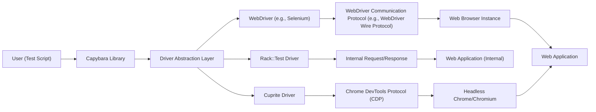
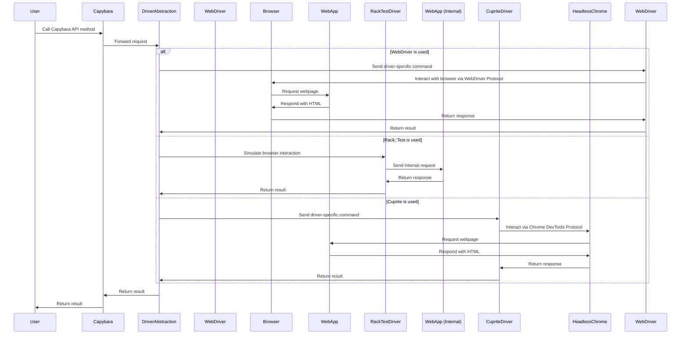

# Project Design Document: Capybara Web Automation Library

**Version:** 1.1
**Date:** October 26, 2023
**Author:** AI Software Architect

## 1. Introduction

This document provides an enhanced design overview of the Capybara web automation library, building upon the previous version. It details the system architecture, key components, data flow, and security considerations with greater clarity and depth. This document is intended to serve as a robust foundation for subsequent threat modeling activities.

## 2. Goals and Objectives

The primary goal of Capybara remains to offer a user-friendly and reliable library for automating interactions with web applications. Key objectives are:

*   To provide an intuitive, high-level API for simulating common user interactions with web elements (e.g., clicking links, filling forms, submitting data).
*   To abstract the complexities of underlying browser automation drivers, supporting multiple implementations (e.g., Selenium, Rack::Test, Cuprite).
*   To ensure API consistency across different driver implementations, allowing for easier switching and maintenance.
*   To empower developers to write readable, maintainable, and robust automated tests for web applications.
*   To effectively handle interactions with modern, JavaScript-intensive web applications, including those using AJAX and dynamic content.

## 3. System Architecture

Capybara's architecture centers around a core library that acts as an intermediary between the user's test script and the specific browser driver. This abstraction layer is crucial for maintaining flexibility and supporting various testing scenarios.

**Components:**

*   **User (Test Script):** The entity, typically a software developer or QA engineer, who writes and executes automated tests using the Capybara library.
*   **Capybara Library:** The central component, providing the high-level API and core functionalities for web automation. It receives instructions from the user's test script and translates them into driver-agnostic commands.
*   **Driver Abstraction Layer:** A critical internal layer within Capybara that shields the core library from the implementation details of specific browser drivers. It defines a common interface that all drivers must adhere to.
*   **WebDriver (e.g., Selenium):** An external, industry-standard library that enables control of real web browser instances (e.g., Chrome, Firefox, Safari). It communicates with the browser via the WebDriver Wire Protocol.
*   **Rack::Test Driver:** A lightweight, in-process driver used for testing web applications without launching a full browser. It directly interacts with the application's Rack interface.
*   **Cuprite Driver:** A driver that leverages the Chrome DevTools Protocol (CDP) to interact with headless Chrome or Chromium browsers. This offers a faster and more resource-efficient alternative to Selenium in some scenarios.
*   **WebDriver Communication Protocol (e.g., WebDriver Wire Protocol):** The standardized protocol used by WebDriver to send commands to and receive responses from web browsers.
*   **Internal Request/Response:** The mechanism for direct communication between the Rack::Test driver and the web application when running in the same process.
*   **Chrome DevTools Protocol (CDP):** A protocol that allows tools to instrument, inspect, debug, and profile Chromium-based browsers. Cuprite uses this to control the browser.
*   **Web Browser Instance:** A running instance of a web browser (e.g., Chrome, Firefox) that renders and interacts with the target web application.
*   **Web Application (Internal):** The instance of the web application being tested when using the Rack::Test driver, running within the same process as the test.
*   **Headless Chrome/Chromium:** A version of the Chrome or Chromium browser that runs without a graphical user interface. This is often used in CI/CD environments for automated testing.
*   **Web Application:** The target web application that Capybara interacts with, either through a real browser or via a simulated environment.

## 4. Data Flow

The data flow in Capybara depends on the chosen driver. Here's a breakdown of the typical flows:

**Scenario 1: Using WebDriver (e.g., Selenium)**

1. The **User (Test Script)** invokes a method on the **Capybara Library** (e.g., `visit('/products')`, `find_field('search').fill_in('keyword')`, `click_button('Search')`).
2. The **Capybara Library** receives the request and delegates it to the **Driver Abstraction Layer**.
3. The **Driver Abstraction Layer** forwards the command to the **WebDriver**.
4. The **WebDriver** translates the command into instructions compliant with the **WebDriver Communication Protocol**.
5. These instructions are sent over the network to the **Web Browser Instance**.
6. The **Web Browser Instance** executes the instructions, interacting with the **Web Application** and receiving the resulting HTML, CSS, and JavaScript.
7. The **Web Browser Instance** sends a response back to the **WebDriver** via the **WebDriver Communication Protocol**, including information about the page state and elements.
8. The **WebDriver** processes the response and returns the relevant data to the **Driver Abstraction Layer**.
9. The **Driver Abstraction Layer** provides the result back to the **Capybara Library**.
10. The **Capybara Library** returns the outcome of the interaction to the **User (Test Script)**.

**Scenario 2: Using Rack::Test Driver**

1. The **User (Test Script)** calls a method on the **Capybara Library**.
2. The **Capybara Library** forwards the request to the **Driver Abstraction Layer**.
3. The **Driver Abstraction Layer** directs the request to the **Rack::Test Driver**.
4. The **Rack::Test Driver** simulates an HTTP request directly to the **Web Application (Internal)** using **Internal Request/Response**.
5. The **Web Application (Internal)** processes the request and returns an HTTP response.
6. The **Rack::Test Driver** receives the response and provides the relevant information (e.g., HTML content, status code) to the **Driver Abstraction Layer**.
7. The **Driver Abstraction Layer** returns the result to the **Capybara Library**.
8. The **Capybara Library** returns the result to the **User (Test Script)**.

**Scenario 3: Using Cuprite Driver**

1. The **User (Test Script)** calls a method on the **Capybara Library**.
2. The **Capybara Library** forwards the request to the **Driver Abstraction Layer**.
3. The **Driver Abstraction Layer** sends the command to the **Cuprite Driver**.
4. The **Cuprite Driver** translates the command into instructions using the **Chrome DevTools Protocol (CDP)**.
5. These instructions are sent to the **Headless Chrome/Chromium**.
6. The **Headless Chrome/Chromium** executes the instructions, interacting with the **Web Application**.
7. The **Headless Chrome/Chromium** sends responses back to the **Cuprite Driver** via the **CDP**.
8. The **Cuprite Driver** processes the responses and returns the relevant data to the **Driver Abstraction Layer**.
9. The **Driver Abstraction Layer** provides the result back to the **Capybara Library**.
10. The **Capybara Library** returns the outcome to the **User (Test Script)**.

## 5. Key Components

This section provides a more detailed explanation of Capybara's core components:

*   **Session:** Represents a single user's interaction with a web application within a test. It encapsulates the browser state, including cookies, history, and the current page.
    *   Responsibilities:
        *   Maintaining the current URL and navigation history.
        *   Managing cookies and session storage.
        *   Providing methods for navigating the application (e.g., `visit`, `go_back`, `go_forward`).
        *   Delegating the finding and manipulation of web elements to the underlying driver.
        *   Handling asynchronous JavaScript execution and waiting for page updates.
*   **Node:** Represents a specific HTML element on the web page. It provides an abstraction layer over the driver's representation of the element.
    *   Responsibilities:
        *   Providing methods for interacting with the element (e.g., `click`, `fill_in`, `select`, `check`).
        *   Retrieving element attributes (e.g., `text`, `value`, `class`).
        *   Evaluating JavaScript within the context of the element.
        *   Representing the element in a driver-agnostic manner, hiding driver-specific implementation details.
*   **Driver:** The interface responsible for communicating with the underlying browser automation mechanism. Each supported driver implements this interface.
    *   Responsibilities:
        *   Translating Capybara's abstract commands (e.g., "find a button with text 'Submit'") into driver-specific instructions.
        *   Managing the lifecycle of the browser instance (for drivers like WebDriver and Cuprite).
        *   Simulating browser requests and responses (for the Rack::Test driver).
        *   Returning information about the web page's structure and the properties of its elements.
        *   Handling timeouts and waiting for elements to appear or become interactable.
*   **DSL (Domain Specific Language):** The set of user-facing methods provided by Capybara for interacting with web pages. It offers a fluent and expressive syntax for writing tests.
    *   Responsibilities:
        *   Providing a high-level, readable API for common web interactions.
        *   Abstracting away the complexities of interacting with different drivers.
        *   Enabling users to write concise and maintainable test code.
        *   Providing methods for finding elements based on various criteria (e.g., CSS selectors, XPath expressions, text content).
*   **Configuration:** Allows users to customize Capybara's behavior and settings.
    *   Responsibilities:
        *   Setting the default driver to be used for tests.
        *   Configuring timeouts for various operations (e.g., element finding, page load).
        *   Registering custom selectors and matchers to extend Capybara's capabilities.
        *   Defining error handling strategies and logging levels.

## 6. Security Considerations

This section expands on the security considerations relevant to using Capybara, particularly in automated testing environments:

*   **Secure Handling of Credentials:** Test scripts often need to interact with applications requiring authentication.
    *   **Threat:** Hardcoding credentials in test scripts exposes them in version control and can lead to unauthorized access.
    *   **Mitigation:** Utilize secure secrets management techniques such as environment variables, dedicated secrets vaults (e.g., HashiCorp Vault), or CI/CD platform secrets management features. Avoid storing credentials directly in code.
*   **Cross-Site Scripting (XSS) Vulnerabilities in Test Data:** While Capybara primarily interacts with the application, the data used in tests can pose risks.
    *   **Threat:** Injecting malicious scripts into test data that is then processed by the application could trigger XSS vulnerabilities, even in a testing context.
    *   **Mitigation:** Sanitize or encode test data that is intended to be input into text fields or other areas where it might be rendered by the browser. Be mindful of the potential for stored XSS if test data persists in the application's database.
*   **Information Disclosure through Test Output and Error Messages:** Detailed logs and error messages generated during test execution can reveal sensitive information.
    *   **Threat:** Error messages might expose internal application details, database schema information, or API keys.
    *   **Mitigation:** Configure logging levels appropriately for different environments. Avoid logging sensitive data. Review test output and error messages to ensure they don't inadvertently disclose confidential information.
*   **Security of Underlying Drivers and Browsers:** Capybara relies on external drivers and browsers.
    *   **Threat:** Vulnerabilities in WebDriver, browser binaries, or their dependencies can be exploited.
    *   **Mitigation:** Keep WebDriver, browser versions, and their dependencies up-to-date with the latest security patches. Regularly scan dependencies for known vulnerabilities using tools like `bundler-audit` for Ruby projects.
*   **Man-in-the-Middle (MITM) Attacks on WebDriver Communication:** When using remote WebDriver instances, the communication channel can be a target.
    *   **Threat:** Attackers could intercept or manipulate commands and responses between Capybara and the remote browser.
    *   **Mitigation:** Ensure secure communication channels (e.g., HTTPS) are used for communication with remote WebDriver servers. Consider using secure tunneling or VPNs.
*   **Risk of Unintended Actions in Non-Production Environments:** Tests can inadvertently modify data or trigger actions in the application.
    *   **Threat:** Tests run against shared development or staging environments could lead to data corruption or unintended side effects.
    *   **Mitigation:** Design tests to be idempotent or implement proper setup and teardown procedures to ensure a clean state. Isolate test environments and restrict access.
*   **Dependency Vulnerabilities in Capybara and its Ecosystem:** Like any software project, Capybara and its dependencies can have vulnerabilities.
    *   **Threat:** Exploiting vulnerabilities in Capybara or its dependencies could compromise the testing environment or potentially the application under test.
    *   **Mitigation:** Regularly update Capybara and its dependencies. Use dependency scanning tools to identify and address known vulnerabilities.
*   **Access Control to Test Infrastructure:** Restricting access to the systems running Capybara tests is crucial.
    *   **Threat:** Unauthorized access to test servers or CI/CD pipelines could allow malicious actors to modify tests, inject vulnerabilities, or gain access to sensitive information.
    *   **Mitigation:** Implement strong access control measures, including authentication and authorization, for all test infrastructure components. Follow the principle of least privilege.

## 7. Deployment

Capybara is typically deployed as a Ruby gem within the development and testing infrastructure of a web application project.

*   **Local Development Environment:** Developers include the `capybara` gem in their project's `Gemfile` as a development dependency. Tests are executed locally using a chosen driver (often Rack::Test for speed or a specific browser driver for more realistic testing).
*   **Continuous Integration/Continuous Deployment (CI/CD) Pipelines:** Capybara tests are a common component of CI/CD pipelines.
    *   The `capybara` gem is installed as part of the pipeline's setup process.
    *   Headless browsers (e.g., Chrome headless, Firefox headless) are often used with drivers like Selenium or Cuprite in CI/CD environments for automated browser testing without a graphical interface.
    *   Configuration for the appropriate driver and browser is managed within the CI/CD pipeline configuration.
*   **Dedicated Test Environments:** Organizations may set up dedicated test environments where Capybara tests are executed against deployed versions of the application.
    *   This might involve using remote WebDriver grids (e.g., Selenium Grid) to distribute test execution across multiple browser instances and operating systems.
    *   Environment-specific configurations for Capybara (e.g., application URL, timeouts) are managed for these environments.

## 8. Technologies Used

*   **Ruby:** The primary programming language in which Capybara is written.
*   **WebDriver (via Selenium):** A widely used library for automating web browsers.
*   **Rack::Test:** A Ruby library for testing Rack-based applications at the HTTP level.
*   **Cuprite:** A Ruby driver for Capybara that uses the Chrome DevTools Protocol to control headless Chrome/Chromium.
*   **Web Browsers:** Chrome, Firefox, Safari, Edge, and others, depending on the chosen WebDriver configuration.
*   **HTML, CSS, JavaScript:** The fundamental technologies of the web applications being tested by Capybara.
*   **WebDriver Wire Protocol:** The communication protocol used by Selenium WebDriver.
*   **Chrome DevTools Protocol (CDP):** The protocol used by Cuprite to interact with Chromium-based browsers.

This revised document provides a more detailed and comprehensive design overview of the Capybara project. It offers a stronger foundation for understanding the system's architecture, data flow, and security considerations, making it more effective for subsequent threat modeling activities.