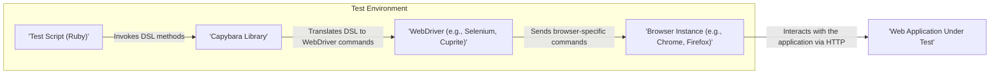
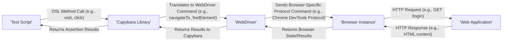

## Project Design Document: Capybara for Threat Modeling (Improved)

**1. Introduction**

This document provides an enhanced design overview of the Capybara project, based on the GitHub repository: [https://github.com/teamcapybara/capybara](https://github.com/teamcapybara/capybara). This improved document is specifically tailored to facilitate comprehensive threat modeling activities. It details the architecture, components with their responsibilities, data flow with emphasis on trust boundaries, and key technologies involved in Capybara's operation. The aim is to provide a clear understanding of the system's inner workings to identify potential security vulnerabilities.

**2. Project Overview**

Capybara is a Ruby gem designed to simulate user interaction with web applications for automated testing. It offers a high-level Domain Specific Language (DSL) that allows testers and developers to write expressive integration tests. These tests interact with the application through a web browser instance, which can be a visible browser or a headless browser. Capybara's primary goal is to enable verification of web application functionality from an end-user perspective, ensuring that the application behaves as expected when interacted with through a browser.

**3. Architectural Diagram**

**4. Component Descriptions**

* **Test Script (Ruby):**
    * **Responsibility:** Defines the test scenarios using Capybara's DSL. Specifies user actions and expected outcomes.
    * **Details:** Written in Ruby and executed by a Ruby interpreter within the testing environment. Contains logic for setting up test conditions, interacting with the web application, and asserting results.
    * **Security Relevance:** May contain sensitive data (e.g., test credentials). Vulnerabilities in the test script logic could lead to incorrect test results or unintended actions.

* **Capybara Library:**
    * **Responsibility:** Provides the high-level DSL for interacting with web applications and translates these commands into instructions for the underlying WebDriver. Manages browser sessions and element interaction.
    * **Details:** A Ruby gem that abstracts away the complexities of direct browser interaction. Acts as an intermediary between the test script and the WebDriver.
    * **Security Relevance:** Potential vulnerabilities within the Capybara library itself could be exploited. Incorrect handling of user input from the test script could lead to unexpected WebDriver behavior.

* **WebDriver (e.g., Selenium WebDriver, Cuprite):**
    * **Responsibility:** Provides a platform-neutral interface to control web browsers. Receives commands from Capybara and translates them into browser-specific actions.
    * **Details:** A separate library or tool that communicates with the browser instance. Different WebDriver implementations exist for different browsers.
    * **Security Relevance:** Vulnerabilities in the WebDriver implementation could allow malicious actors to control the browser outside the intended test scope. The communication channel between Capybara and the WebDriver is a potential attack surface.

* **Browser Instance (e.g., Chrome, Firefox):**
    * **Responsibility:** The actual web browser where the web application is rendered and interacted with. Executes JavaScript and handles HTTP requests/responses.
    * **Details:** Can be a visible browser window or a headless instance. Receives commands from the WebDriver to navigate, find elements, and perform actions.
    * **Security Relevance:** The browser itself can have vulnerabilities. The browser's security settings and extensions can impact the test environment. The communication between the WebDriver and the browser is a critical point.

* **Web Application Under Test:**
    * **Responsibility:** The target web application being tested. Receives requests from the browser controlled by Capybara and sends back responses.
    * **Details:** Resides in a separate environment. The focus of the testing process.
    * **Security Relevance:** The vulnerabilities within the web application are what the tests are designed to indirectly uncover. The interaction with the test framework should not introduce new vulnerabilities.

**5. Data Flow Diagram**

**Detailed Data Flow with Security Considerations:**

* **Test Script to Capybara Library:** The test script initiates actions using Capybara's DSL. *Potential Threat:* Maliciously crafted DSL calls could potentially exploit vulnerabilities in the Capybara library if not properly validated.
* **Capybara Library to WebDriver:** Capybara translates the DSL commands into WebDriver-specific instructions. *Potential Threat:*  If the translation process is flawed, it could lead to unexpected or harmful commands being sent to the WebDriver. The communication channel itself could be vulnerable if not secured (though typically within the local machine).
* **WebDriver to Browser Instance:** The WebDriver communicates with the browser using a specific protocol (e.g., WebDriver protocol, Chrome DevTools Protocol). *Potential Threat:* Vulnerabilities in the WebDriver or the browser's communication protocol could be exploited to gain unauthorized control over the browser. Man-in-the-middle attacks on this communication channel (though less likely in a local testing setup) are a concern.
* **Browser Instance to Web Application:** The browser interacts with the web application using standard HTTP requests and responses. *Potential Threat:* Standard web application security vulnerabilities (e.g., XSS, CSRF, SQL Injection) can be triggered and potentially exploited through the automated testing process. The browser's security settings and extensions can influence this interaction.
* **Web Application to Browser Instance:** The web application responds to the browser's requests. *Potential Threat:* Malicious content in the response could potentially compromise the browser instance or the testing environment.
* **Feedback Loop:** The results of the browser interaction are passed back through the WebDriver and Capybara to the test script for assertions. *Potential Threat:* Tampering with the results during this feedback loop could lead to false positives or negatives in the test results.

**6. Technology Stack**

* **Core Language:** Ruby (for Capybara library and test scripts)
* **Dependency Management:** Bundler
* **Testing Frameworks (Commonly Used):**
    * RSpec
    * Minitest
* **WebDriver Implementations (Examples):**
    * Selenium WebDriver (supports multiple browsers via browser-specific drivers)
    * Cuprite (for Chromium-based browsers using Chrome DevTools Protocol)
    * Watir (Ruby library that leverages browser automation)
* **Browsers Used for Testing:**
    * Google Chrome (and Chromium)
    * Mozilla Firefox
    * Apple Safari
    * Microsoft Edge
    * Headless Browsers (e.g., Headless Chrome, Headless Firefox)
* **Operating System:** Platform independent (dependent on Ruby and browser/WebDriver compatibility)

**7. Key Interactions and Interfaces**

* **Test Script <-> Capybara Library Interface:**  Ruby method calls defined by the Capybara DSL. This interface is crucial for defining test logic and interacting with the web application. Security considerations involve ensuring proper input validation and preventing malicious DSL usage.
* **Capybara Library <-> WebDriver Interface:** Communication using the WebDriver protocol, typically involving JSON over HTTP. This interface defines how Capybara instructs the browser. Security focuses on the integrity and confidentiality of the commands being exchanged.
* **WebDriver <-> Browser Instance Interface:** Browser-specific communication mechanisms. For example, Selenium uses native events or browser extensions, while Cuprite uses the Chrome DevTools Protocol. Security concerns relate to vulnerabilities in these underlying communication protocols and the potential for unauthorized control.
* **Browser Instance <-> Web Application Interface:** Standard HTTP requests and responses. This is the standard web communication layer, and security considerations are those of typical web application security (e.g., TLS/SSL, HTTP security headers).

**8. Security Considerations (Detailed)**

This section elaborates on potential security threats associated with Capybara and its environment.

* **Test Environment Isolation:**
    * **Threat:** If the test environment is not properly isolated, test actions could inadvertently affect production systems or expose sensitive data.
    * **Mitigation:** Implement network segmentation and access controls to isolate the test environment. Use dedicated infrastructure for testing.

* **Insecure Test Data:**
    * **Threat:** Using production data or sensitive personal information in tests can lead to data breaches if the test environment is compromised.
    * **Mitigation:** Use anonymized or synthetic data for testing. Implement data masking techniques.

* **Vulnerabilities in WebDriver Implementations:**
    * **Threat:** Security flaws in the WebDriver software could be exploited to gain unauthorized access to the testing machine or the browser instance.
    * **Mitigation:** Keep WebDriver versions up-to-date. Obtain WebDriver binaries from trusted sources.

* **Browser Instance Vulnerabilities:**
    * **Threat:** Outdated or vulnerable browser versions used for testing can be exploited.
    * **Mitigation:** Regularly update the browser versions used for testing. Configure browser security settings appropriately.

* **Malicious Test Scripts:**
    * **Threat:** A compromised or malicious test script could perform unintended actions on the web application or the testing environment.
    * **Mitigation:** Implement code review processes for test scripts. Control access to test script repositories.

* **Exposure of Sensitive Information in Test Logs:**
    * **Threat:** Test logs might contain sensitive data (e.g., API keys, passwords) if not handled carefully.
    * **Mitigation:** Implement secure logging practices. Sanitize or redact sensitive information from logs. Securely store and access test logs.

* **Man-in-the-Middle Attacks on WebDriver Communication:**
    * **Threat:** Although less likely in a local setup, if the communication between Capybara and the WebDriver is intercepted, malicious commands could be injected.
    * **Mitigation:** Ensure the testing environment is on a trusted network. Consider using secure communication channels if testing involves remote WebDriver instances.

* **Dependency Vulnerabilities:**
    * **Threat:** Vulnerabilities in the Capybara gem itself or its dependencies could be exploited.
    * **Mitigation:** Regularly audit and update gem dependencies using tools like `bundle audit`.

* **Insecure Handling of Browser Cookies and Storage:**
    * **Threat:** Test scripts might inadvertently expose or manipulate cookies and local storage in ways that could create security vulnerabilities.
    * **Mitigation:** Be mindful of how test scripts interact with browser storage mechanisms. Clear browser data between tests if necessary.

**9. Conclusion**

This improved design document provides a more detailed and security-focused overview of the Capybara project. By understanding the architecture, components, data flow, and potential threats, security professionals can effectively conduct threat modeling exercises to identify and mitigate potential vulnerabilities. This document serves as a crucial foundation for ensuring the security of both the testing process and the web applications being tested.