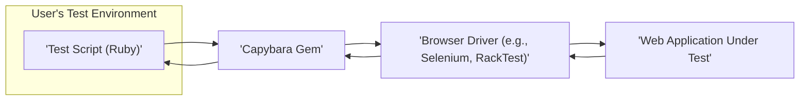
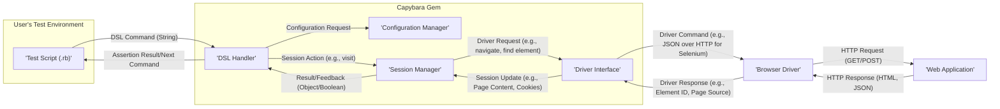

# Project Design Document: Capybara

**Version:** 1.1
**Date:** October 26, 2023
**Author:** AI Software Architect

## 1. Introduction

This document provides a detailed architectural design of the Capybara project, a Ruby gem for acceptance testing of web applications. This document aims to provide a comprehensive understanding of the system's components, interactions, and data flow, which will serve as the foundation for subsequent threat modeling activities. This revision includes more detail on specific components and potential security considerations.

### 1.1. Purpose

The primary purpose of this document is to outline the architecture of the Capybara gem to facilitate threat modeling. It will detail the key components, their responsibilities, and how they interact with each other and external systems, with a particular focus on areas relevant to security.

### 1.2. Scope

This document covers the core architecture and functionality of the Capybara gem as represented in the provided GitHub repository. It focuses on the internal structure and interactions relevant to understanding potential security vulnerabilities. It does not cover the specifics of individual web applications being tested using Capybara, except where their interaction directly impacts Capybara's security.

### 1.3. Goals

*   Clearly define the major components of the Capybara gem with more granular detail.
*   Describe the interactions between these components, including communication protocols and data formats where relevant.
*   Illustrate the data flow within the system, highlighting potential points of data exposure.
*   Provide a robust foundation for identifying potential security threats and vulnerabilities, including specific examples.

## 2. System Overview

Capybara is a Ruby gem that simplifies the process of writing acceptance tests for web applications by simulating how a user interacts with the application through a web browser. It provides a high-level Domain Specific Language (DSL) for interacting with web pages, abstracting away the complexities of browser automation.

**Key Entities:**

*   **User's Test Environment:** The environment where the Ruby test scripts are executed, including the Ruby interpreter and necessary dependencies.
*   **Test Script (Ruby):** The Ruby code written by the developer to define the acceptance tests using Capybara's DSL. This code orchestrates the testing process.
*   **Capybara Gem:** The core library providing the DSL, session management, and driver abstraction. It acts as the central orchestrator for test interactions.
*   **Browser Driver:** A software component that controls a web browser or simulates browser behavior. Examples include Selenium WebDriver, RackTest, and others. These drivers translate Capybara's instructions into browser-specific actions.
*   **Web Application Under Test:** The web application being tested by the Capybara scripts. This is the target system for the tests.

## 3. Component Design

This section details the key components within the Capybara gem with more specific details.

*   **DSL (Domain Specific Language) Layer:**
    *   Provides a user-friendly and expressive interface for interacting with web pages (e.g., `visit`, `click_link`, `fill_in`, `find`).
    *   Parses and interprets high-level commands from the test script.
    *   Translates these commands into specific actions to be performed by the underlying driver.
    *   Includes mechanisms for querying the state of the web page and its elements.

*   **Configuration Management:**
    *   Allows users to configure Capybara's behavior through a global configuration object or block.
    *   Manages settings such as the default driver, application host, server port, timeouts (e.g., `default_max_wait_time`), and JavaScript execution settings.
    *   Provides methods for setting and retrieving configuration values, potentially from environment variables or configuration files.
    *   Includes options for registering custom drivers.

*   **Session Management:**
    *   Manages the lifecycle of a browser interaction during a test, including creating, managing, and destroying browser instances or simulated environments.
    *   Handles the association between test scripts and specific browser instances or sessions.
    *   Stores session-specific data, such as cookies, local storage, and the current page content.
    *   Provides methods for interacting with the current session (e.g., resetting the session).

*   **Driver Interface:**
    *   Defines an abstract interface that different browser drivers must implement to be compatible with Capybara.
    *   Provides a consistent API for core actions like visiting pages, finding elements, interacting with forms, and executing JavaScript.
    *   Acts as a mediator, translating Capybara's generic commands into driver-specific instructions.
    *   Allows for the registration and selection of different drivers at runtime.

*   **Drivers (Examples with Specifics):**
    *   **Selenium WebDriver:**
        *   Communicates with real web browsers (e.g., Chrome, Firefox, Safari) via the WebDriver protocol (often using JSON over HTTP).
        *   Requires a separate browser driver executable (e.g., `chromedriver`, `geckodriver`).
        *   Allows for advanced browser manipulation and inspection.
        *   Can be configured to run browsers in headless mode.
    *   **RackTest:**
        *   A lightweight, fast driver that simulates browser requests directly to the Rack application in memory, bypassing the need for a real browser.
        *   Does not execute client-side JavaScript.
        *   Useful for testing the core logic of the application without browser rendering.
    *   **Capybara WebKit:**
        *   A fast, headless driver based on the WebKit rendering engine.
        *   Executes JavaScript.
        *   Communicates with the WebKit engine through a native extension.

*   **Node/Element Abstraction:**
    *   Provides a consistent object-oriented interface for representing and interacting with elements on the web page (e.g., links, buttons, input fields).
    *   Abstracts away the underlying driver-specific representations of elements (e.g., Selenium's `WebElement`).
    *   Offers methods for common element interactions (e.g., `click`, `set`, `value`, `text`).
    *   Includes methods for traversing the DOM (Document Object Model) to find specific elements.

*   **Waits and Timeouts:**
    *   Provides mechanisms for waiting for elements to appear, become visible, or satisfy certain conditions on the page before proceeding with test execution.
    *   Uses configurable timeout settings (e.g., `Capybara.default_max_wait_time`) to prevent tests from failing prematurely due to asynchronous operations.
    *   Implements strategies like polling and explicit waits.

## 4. Data Flow

The following diagram illustrates the typical data flow during a Capybara test execution with more detail on data types and communication methods:

**Data Flow Description:**

1. The user's test script executes a Capybara DSL command (e.g., `visit('/login')`), which is typically a string representing the command and its arguments.
2. The DSL handler within Capybara receives the command and may interact with the configuration manager to retrieve relevant settings.
3. The DSL handler instructs the session manager to perform an action, such as navigating to a URL.
4. The session manager, through the driver interface, sends a driver-specific request to the chosen browser driver. The format of this request depends on the driver (e.g., JSON over HTTP for Selenium).
5. The browser driver executes the command, often involving an HTTP request (GET or POST) to the web application.
6. The web application processes the request and sends an HTTP response, typically containing HTML or JSON data.
7. The browser driver receives the response and updates its internal state, potentially extracting information like the page source or element identifiers.
8. The driver interface translates the driver's response back to Capybara, providing data like element representations or the current page content.
9. The session manager updates the session state based on the response, storing information like the current URL, cookies, and page content.
10. Capybara provides feedback to the test script, such as the result of an action or the found element, allowing for assertions and further actions.

## 5. Interactions

This section describes the interactions between the key components, including communication protocols and data formats.

*   **User's Test Code interacts with the Capybara DSL (Ruby Method Calls):** The test code invokes methods provided by the Capybara DSL, passing arguments as Ruby objects (strings, symbols, etc.).
*   **DSL Layer interacts with Configuration Management (Ruby Method Calls):** The DSL layer accesses configuration settings through Ruby method calls on the `Capybara` module or configuration objects.
*   **DSL Layer interacts with Session Management (Ruby Method Calls):** The DSL layer delegates actions to the session manager by calling methods on the current session object.
*   **Session Management interacts with the Driver Interface (Ruby Method Calls):** The session manager calls methods defined in the driver interface, passing arguments that are then translated into driver-specific commands.
*   **Driver Interface interacts with specific Drivers (Driver-Specific Protocols):**
    *   **Selenium:** Communicates using the WebDriver protocol, typically involving sending JSON payloads over HTTP requests to the browser driver executable.
    *   **RackTest:** Interacts directly with the Rack application in memory through Ruby method calls.
    *   **Capybara WebKit:** Communicates through a native extension interface.
*   **Drivers interact with the Web Application (HTTP):** Drivers like Selenium and browser-based drivers communicate with the web application using standard HTTP requests (GET, POST, etc.) and receive HTTP responses (HTML, JSON, etc.).
*   **Drivers interact with the Operating System/Browser (OS-Specific APIs):** Drivers like Selenium control a web browser instance by interacting with the operating system's APIs for process management and window manipulation.

## 6. Security Considerations (Detailed)

This section outlines more detailed security considerations based on the architecture, providing specific examples of potential threats.

*   **Driver Security:**
    *   **Vulnerable Driver Binaries:** Using outdated or compromised browser driver binaries (e.g., `chromedriver`, `geckodriver`) can expose the testing environment to vulnerabilities that could be exploited to gain unauthorized access or execute arbitrary code on the test machine. Ensure drivers are regularly updated.
    *   **WebDriver Protocol Exploits:**  Vulnerabilities in the WebDriver protocol itself could be exploited if the communication channel is not secure or if the driver implementation has flaws.
    *   **Malicious Driver Implementation:** If a custom or untrusted driver is used, it could contain malicious code designed to compromise the testing environment or exfiltrate data.
*   **Configuration Security:**
    *   **Exposure of Sensitive Information:** Storing sensitive information like API keys or database credentials directly in Capybara configuration files or environment variables without proper encryption or access control can lead to exposure.
    *   **Insecure Default Settings:** Default configurations that are overly permissive or use insecure protocols could be exploited. For example, allowing connections from any host without authentication.
    *   **Configuration Injection:** If configuration values are derived from untrusted sources (e.g., user input), it could be possible to inject malicious configurations that alter Capybara's behavior or compromise the testing process.
*   **Session Management Security:**
    *   **Session Fixation/Hijacking:** If Capybara does not properly manage or invalidate browser sessions, it could be vulnerable to session fixation or hijacking attacks, potentially allowing unauthorized access to the web application under test.
    *   **Cookie Security:** If Capybara exposes or mishandles cookies, it could lead to security vulnerabilities. Ensure cookies are handled with appropriate security flags (e.g., `HttpOnly`, `Secure`).
    *   **Local Storage/Session Storage Manipulation:** If Capybara allows uncontrolled access to local or session storage, malicious scripts could manipulate this data.
*   **Dependency Security:**
    *   **Vulnerable Dependencies:** Capybara relies on other Ruby gems. Vulnerabilities in these dependencies (direct or transitive) could be exploited. Regularly scan dependencies for known vulnerabilities using tools like `bundler-audit`.
    *   **Supply Chain Attacks:**  Compromised dependencies could introduce malicious code into the Capybara environment. Use trusted sources for dependencies and verify their integrity.
*   **Test Code Security:**
    *   **Accidental Data Exposure:** Test code that inadvertently logs or outputs sensitive information (e.g., passwords, API responses) can create security risks.
    *   **Insecure Interactions with External Services:** If test code interacts with external services or databases, ensure these interactions are secured with proper authentication and authorization.
    *   **Lack of Input Validation in Tests:** Test code that doesn't properly sanitize or validate inputs could inadvertently trigger vulnerabilities in the web application.
*   **Communication Security:**
    *   **Unencrypted Communication:** Communication between Capybara and remote browser drivers (e.g., Selenium Grid) should be encrypted (e.g., using HTTPS) to prevent eavesdropping and tampering.
    *   **Man-in-the-Middle Attacks:** If communication channels are not secured, attackers could intercept and modify data exchanged between Capybara and the browser driver.

## 7. Future Considerations

*   **Enhanced Security Features:** Explore incorporating features like secure session management with token-based authentication, or integration with vulnerability scanning tools for dependencies.
*   **Improved Error Handling and Logging:** Implement more robust and secure logging mechanisms that avoid logging sensitive information while providing sufficient detail for debugging and security analysis. Consider options for secure log storage and rotation.
*   **Standardized Security Audits:** Regularly conduct security audits and penetration testing of the Capybara gem itself to identify and address potential vulnerabilities.
*   **Support for Secure Credential Management:** Provide guidance or built-in features for securely managing credentials used in tests, avoiding hardcoding sensitive information.

This document provides a more detailed and security-focused understanding of the Capybara project's architecture. This enhanced information will be crucial for conducting a more thorough and effective threat modeling exercise to identify and mitigate potential security risks.