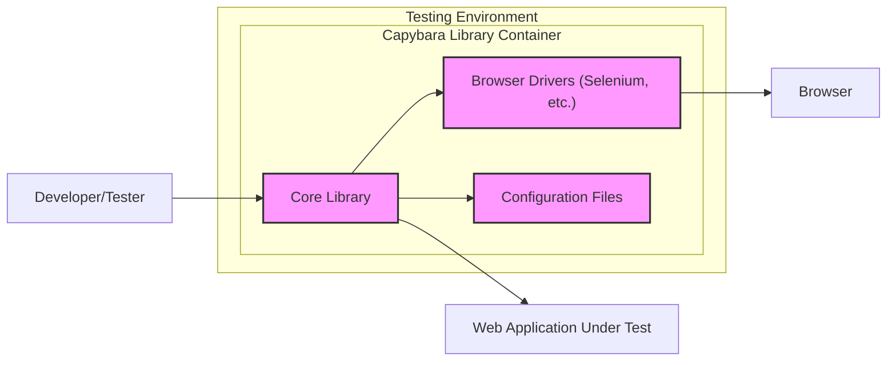
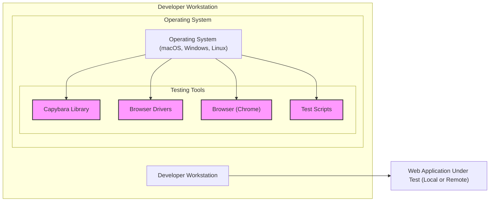
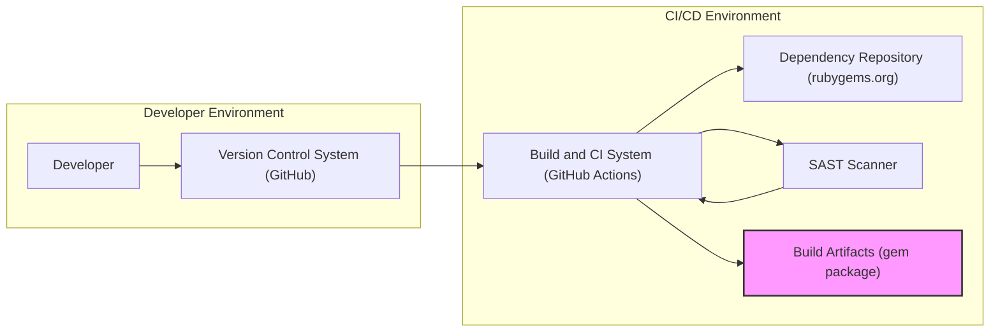

# BUSINESS POSTURE

- Business Priorities and Goals:
  - Goal: To provide a flexible and reliable tool for automated web application testing.
  - Goal: To enable developers and testers to write effective and maintainable integration and acceptance tests.
  - Goal: To improve software quality and reduce bugs in web applications by facilitating comprehensive testing.
  - Priority: Ease of use and developer productivity are high priorities to encourage adoption and effective testing practices.
  - Priority: Compatibility with various web browsers and testing frameworks is important to cater to a wide range of projects.

- Business Risks:
  - Risk: Security vulnerabilities in Capybara itself could be exploited to compromise testing environments or applications under test.
  - Risk: Improper use of Capybara in test scripts could inadvertently introduce security vulnerabilities in the applications being tested (e.g., exposing sensitive data in logs).
  - Risk: Lack of maintenance and updates could lead to incompatibility with newer browsers or security issues remaining unpatched.
  - Risk: Dependency on third-party libraries (like browser drivers) introduces supply chain risks if those dependencies are compromised.
  - Risk: If used in production-like environments for monitoring, misconfigurations could lead to unintended actions or data exposure.

# SECURITY POSTURE

- Existing Security Controls:
  - security control: Code hosted on GitHub - provides version control and transparency. Implemented: GitHub repository.
  - security control: Open Source project - community review and scrutiny can help identify potential vulnerabilities. Implemented: Open Source nature of the project.
  - security control: Issue tracking on GitHub - allows reporting and tracking of bugs and potential security issues. Implemented: GitHub Issues.
  - accepted risk: Reliance on community contributions for security fixes - response time and quality of fixes may vary.
  - accepted risk: Vulnerabilities in dependencies - Capybara relies on external libraries, which may have their own vulnerabilities.

- Recommended Security Controls:
  - security control: Implement automated dependency scanning to identify and address vulnerabilities in third-party libraries.
  - security control: Integrate static application security testing (SAST) tools into the development and CI/CD pipeline to identify potential code-level vulnerabilities.
  - security control: Establish a clear process for reporting and handling security vulnerabilities, including a security policy and contact information.
  - security control: Perform regular security code reviews, especially for critical components and contributions from external sources.
  - security control: Implement input validation and sanitization within Capybara's core logic to prevent potential injection attacks if test scripts are crafted maliciously.

- Security Requirements:
  - Authentication:
    - Requirement: Capybara itself does not require authentication as it is a library used within testing code. However, test scripts using Capybara might need to handle authentication to access applications under test.
    - Requirement: Securely manage credentials used in test scripts for authentication. Avoid hardcoding credentials in scripts; use environment variables or secure vault mechanisms.
  - Authorization:
    - Requirement: Capybara's authorization is implicitly managed by the test scripts and the permissions of the user running the tests.
    - Requirement: Ensure test environments and applications under test have appropriate authorization controls to prevent unauthorized access or actions during testing.
  - Input Validation:
    - Requirement: Capybara should handle user-provided inputs in test scripts safely to prevent unexpected behavior or vulnerabilities.
    - Requirement: Test scripts should validate inputs to the applications under test to ensure data integrity and security.
  - Cryptography:
    - Requirement: Capybara itself might not directly implement cryptography. However, if test scripts handle sensitive data or interact with secure endpoints (HTTPS), ensure proper handling of encryption and secure communication.
    - Requirement: If Capybara stores any temporary data (e.g., session information), consider encrypting sensitive data at rest or in transit.

# DESIGN

## C4 CONTEXT

```mermaid
flowchart LR
    subgraph "Testing Environment"
        C(["Capybara Library"])
    end
    U1["Developer/Tester"] --> C
    S1["Web Application Under Test"] <-- C
    S2["Browser (Chrome, Firefox, etc.)"] <-- C
    S3["CI/CD Pipeline"] --> C
    S4["Dependency Repositories (rubygems.org)"] --> C

    style C fill:#f9f,stroke:#333,stroke-width:2px
```

- Context Diagram Elements:
  - - Name: Developer/Tester
    - Type: Person
    - Description: Software developers and quality assurance testers who use Capybara to write and execute automated tests for web applications.
    - Responsibilities: Writes test scripts using Capybara, executes tests, analyzes test results.
    - Security controls: Responsible for writing secure test scripts, managing test credentials securely, and using Capybara in a safe manner.
  - - Name: Capybara Library
    - Type: Software System
    - Description: The Capybara library itself, providing an API for interacting with web applications through browser automation.
    - Responsibilities: Provides a high-level API for web automation, interacts with browser drivers, handles browser interactions.
    - Security controls: Input validation within the library, dependency management, secure build process, vulnerability scanning.
  - - Name: Web Application Under Test
    - Type: Software System
    - Description: The web application being tested by Capybara. This could be any web application, internal or external.
    - Responsibilities: Provides the functionality being tested, handles user interactions, manages data.
    - Security controls: Application-level security controls (authentication, authorization, input validation, etc.), secure deployment, vulnerability management.
  - - Name: Browser (Chrome, Firefox, etc.)
    - Type: Software System
    - Description: Web browsers used by Capybara to interact with the web application under test. Capybara uses browser drivers (e.g., Selenium) to control these browsers.
    - Responsibilities: Renders web pages, executes JavaScript, interacts with web elements.
    - Security controls: Browser security features (sandboxing, security updates), secure browser driver implementations.
  - - Name: CI/CD Pipeline
    - Type: Software System
    - Description: Continuous Integration and Continuous Delivery pipelines where automated tests using Capybara are executed as part of the software delivery process.
    - Responsibilities: Automates build, test, and deployment processes, executes test suites, reports test results.
    - Security controls: Secure CI/CD pipeline configuration, access controls, secure storage of credentials, vulnerability scanning of pipeline components.
  - - Name: Dependency Repositories (rubygems.org)
    - Type: External System
    - Description: External repositories like rubygems.org from where Capybara and its dependencies are downloaded during development and build processes.
    - Responsibilities: Hosts and provides software packages and libraries.
    - Security controls: Package signing, vulnerability scanning of hosted packages (external control, but dependency management is crucial).

## C4 CONTAINER



- Container Diagram Elements:
  - - Name: Core Library
    - Type: Library
    - Description: The main Capybara library code, providing the core API and functionality for web automation.
    - Responsibilities: Handles user API requests, manages browser interactions through drivers, implements core features like element finding and action execution.
    - Security controls: Input validation, secure coding practices, SAST scanning, code reviews, vulnerability scanning of dependencies.
  - - Name: Browser Drivers (Selenium, etc.)
    - Type: Library/Executable
    - Description: Browser-specific drivers (like Selenium WebDriver) that allow Capybara to control web browsers.
    - Responsibilities: Translates Capybara commands into browser-specific actions, communicates with the browser.
    - Security controls: Dependency management, ensuring drivers are downloaded from trusted sources, keeping drivers updated to patch vulnerabilities.
  - - Name: Configuration Files
    - Type: Files
    - Description: Configuration files used by Capybara to customize its behavior, such as default browser settings, timeouts, and other options.
    - Responsibilities: Stores configuration settings, allows users to customize Capybara.
    - Security controls: Secure storage of configuration files, avoiding storing sensitive information directly in configuration files (use environment variables or secure vaults for credentials).

## DEPLOYMENT

- Deployment Options:
  - Option 1: Local Development Environment - Developers run tests locally on their workstations.
  - Option 2: CI/CD Pipeline Environment - Tests are executed in a CI/CD pipeline as part of the automated build and deployment process.
  - Option 3: Dedicated Test Environment - A separate environment specifically set up for running automated tests.

- Detailed Deployment (Option 1: Local Development Environment):



- Deployment Diagram Elements (Local Development Environment):
  - - Name: Developer Workstation
    - Type: Infrastructure
    - Description: The local computer used by a developer or tester to write and run Capybara tests.
    - Responsibilities: Provides the environment for running tests, including operating system, testing tools, and network connectivity.
    - Security controls: Workstation security controls (OS hardening, antivirus, firewall), user access controls, secure storage of test scripts and credentials.
  - - Name: Operating System (macOS, Windows, Linux)
    - Type: Software
    - Description: The operating system running on the developer workstation.
    - Responsibilities: Provides the base platform for running applications and tools.
    - Security controls: OS security updates, security configurations, user account management.
  - - Name: Capybara Library
    - Type: Software Component
    - Description: The Capybara library installed on the developer workstation.
    - Responsibilities: Provides the testing API and interacts with browser drivers.
    - Security controls: Software installation from trusted sources, keeping the library updated.
  - - Name: Browser Drivers
    - Type: Software Component
    - Description: Browser drivers (e.g., ChromeDriver) installed on the developer workstation.
    - Responsibilities: Enables Capybara to control web browsers.
    - Security controls: Downloading drivers from official sources, keeping drivers updated.
  - - Name: Browser (Chrome)
    - Type: Software Application
    - Description: A web browser (e.g., Google Chrome) installed on the developer workstation, used for running tests.
    - Responsibilities: Renders web pages and executes JavaScript for testing.
    - Security controls: Browser security settings, keeping the browser updated.
  - - Name: Test Scripts
    - Type: Data/Code
    - Description: Test scripts written by developers using Capybara.
    - Responsibilities: Define the test scenarios and interactions with the web application.
    - Security controls: Secure storage of test scripts, avoiding hardcoding sensitive information, input validation in test scripts.
  - - Name: Web Application Under Test (Local or Remote)
    - Type: Software System
    - Description: The web application being tested, which can be running locally on the workstation or remotely.
    - Responsibilities: Provides the application functionality being tested.
    - Security controls: Application-level security controls, network security if the application is remote.

## BUILD



- Build Process Diagram Elements:
  - - Name: Developer
    - Type: Person
    - Description: Software developer who writes and commits code changes to the Capybara project.
    - Responsibilities: Writes code, performs local testing, commits code changes.
    - Security controls: Secure development practices, code reviews, workstation security.
  - - Name: Version Control System (GitHub)
    - Type: Software System
    - Description: GitHub repository hosting the Capybara source code.
    - Responsibilities: Version control, code storage, collaboration platform.
    - Security controls: Access controls, branch protection, audit logs, vulnerability scanning of repository.
  - - Name: Build and CI System (GitHub Actions)
    - Type: Software System
    - Description: GitHub Actions used for automated build, test, and release processes.
    - Responsibilities: Automates build process, runs tests, performs security checks, creates build artifacts.
    - Security controls: Secure CI/CD pipeline configuration, access controls, secret management, build environment security, vulnerability scanning of pipeline components.
  - - Name: Dependency Repository (rubygems.org)
    - Type: External System
    - Description: RubyGems repository where Capybara dependencies are hosted and downloaded during the build process.
    - Responsibilities: Provides software packages and libraries.
    - Security controls: Package signing, vulnerability scanning of hosted packages (external control, but dependency management is crucial).
  - - Name: SAST Scanner
    - Type: Software Tool
    - Description: Static Application Security Testing tool integrated into the CI/CD pipeline to scan the Capybara codebase for potential vulnerabilities.
    - Responsibilities: Performs static code analysis, identifies potential security flaws.
    - Security controls: Tool configuration, vulnerability reporting, integration with CI/CD pipeline.
  - - Name: Build Artifacts (gem package)
    - Type: Data/Software
    - Description: The packaged Capybara library (gem file) produced by the build process.
    - Responsibilities: Distributable artifact of the Capybara library.
    - Security controls: Signing of artifacts, secure storage and distribution of artifacts.

# RISK ASSESSMENT

- Critical Business Processes:
  - Business Process: Software Development and Quality Assurance.
  - Description: Capybara supports the critical process of ensuring software quality through automated testing, which is essential for delivering reliable and functional web applications.
  - Protection Goal: Maintain the integrity and reliability of the software development and release pipeline. Prevent introduction of vulnerabilities through compromised testing tools or processes.

- Data Sensitivity:
  - Data Type: Test Scripts.
  - Sensitivity: Medium. Test scripts may contain business logic, application workflows, and potentially sensitive data like API endpoints or data structures. Exposure could reveal application functionality or weaknesses.
  - Protection Goal: Maintain confidentiality and integrity of test scripts.
  - Data Type: Application Data accessed during tests.
  - Sensitivity: High to Low (depending on application). Capybara interacts with the application under test, potentially accessing and manipulating sensitive user data, financial information, or personal details.
  - Protection Goal: Prevent unauthorized access, modification, or disclosure of application data during testing. Ensure secure handling of credentials and sensitive data within test environments and scripts.
  - Data Type: Build Artifacts (gem package).
  - Sensitivity: Medium. Compromised build artifacts could lead to distribution of vulnerable or malicious versions of Capybara.
  - Protection Goal: Maintain integrity and authenticity of build artifacts. Ensure secure distribution channels.

# QUESTIONS & ASSUMPTIONS

- Questions:
  - Question: What is the intended deployment environment for Capybara in the user's context? (Local development, CI/CD, dedicated test environment, production monitoring?)
  - Question: What level of security maturity does the user's organization have? (Startup, Fortune 500, etc.) This will influence the risk appetite and feasibility of implementing certain security controls.
  - Question: Are there specific compliance requirements that need to be considered (e.g., GDPR, HIPAA, PCI DSS) when using Capybara for testing applications that handle sensitive data?
  - Question: What types of web applications will be tested using Capybara? (Public facing websites, internal applications, applications handling highly sensitive data?)

- Assumptions:
  - Assumption: Capybara is primarily used for functional and integration testing of web applications, not for security testing in the sense of penetration testing or vulnerability scanning of Capybara itself.
  - Assumption: The user is concerned with the security of their software development lifecycle and wants to ensure that Capybara is used and built in a secure manner.
  - Assumption: The organization using Capybara has a general need to improve their security posture and is looking for practical and actionable recommendations.
  - Assumption: The deployment scenario described in detail (Local Development Environment) is a common and relevant use case for Capybara.
  - Assumption: GitHub Actions is used as a representative CI/CD system for illustrating the build process, but other CI/CD systems could be used as well.