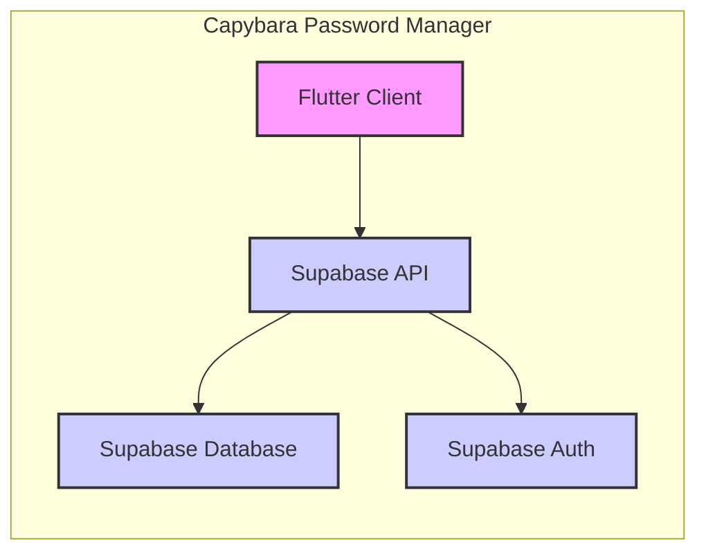

Okay, let's dive into designing a comprehensive document for the Capybara project, focusing on security and architecture.

# BUSINESS POSTURE

Business Priorities and Goals:

The Capybara project aims to create a user-friendly, secure, and efficient password manager.  Key priorities include:

*   Providing a secure alternative to browser-based password storage and weak password practices.
*   Offering a seamless user experience across multiple devices (implied by the use of Flutter).
*   Building trust with users through transparency (open-source) and robust security measures.
*   Potentially, future monetization through premium features or enterprise versions (this is a common model for password managers, but not explicitly stated in the repository).
*   Minimizing operational overhead through a serverless architecture.

Most Important Business Risks:

*   Data Breach:  The most critical risk is a compromise of the user's encrypted password vault. This would severely damage user trust and could have legal and financial repercussions.
*   Loss of User Data:  Data loss due to infrastructure failure, bugs, or user error could lead to significant user frustration and churn.
*   Compromise of Encryption Keys: If the keys used to encrypt user data are compromised, the entire security model collapses.
*   Service Unavailability:  Since this is a password manager, unavailability can prevent users from accessing critical services, causing significant disruption.
*   Reputational Damage:  Any security incident, even a minor one, could significantly harm the project's reputation and adoption rate, especially given the sensitive nature of the data handled.
*   Supply Chain Attacks: Compromise of dependencies or build tools could introduce vulnerabilities.

# SECURITY POSTURE

Existing Security Controls (as inferred from the repository):

*   security control: End-to-End Encryption (E2EE): User data is encrypted on the client-side before being sent to the server. This is evident from the use of client-side encryption libraries and the serverless architecture (which implies the server doesn't have access to decryption keys). Implemented in Flutter application.
*   security control: Use of Supabase: Supabase provides built-in security features like Row Level Security (RLS) and PostgreSQL's security model. Implemented in Supabase.
*   security control: Authentication with Supabase Auth: Leverages Supabase's authentication services, which likely include features like password hashing and secure session management. Implemented in Supabase and Flutter application.
*   security control: Open-Source Codebase:  Allows for community scrutiny and auditing of the code for vulnerabilities. Implemented in GitHub repository.

Accepted Risks:

*   accepted risk: Reliance on Supabase: The project's security is heavily dependent on the security of Supabase's infrastructure and services. While Supabase is generally reputable, there's an inherent risk in relying on a third-party provider.
*   accepted risk: User Device Security: The security of the user's device (phone, computer) is outside the project's direct control. A compromised device could expose the user's master password or decrypted data.
*   accepted risk: Limited Formal Security Audits: While the code is open-source, there's no mention of formal security audits or penetration testing, which are crucial for identifying subtle vulnerabilities.

Recommended Security Controls (High Priority):

*   security control: Implement a robust key management strategy. This should include secure generation, storage, and rotation of encryption keys. Consider using a Hardware Security Module (HSM) or a dedicated key management service (KMS) if feasible.
*   security control: Conduct regular security audits and penetration testing by independent security experts.
*   security control: Implement a Web Application Firewall (WAF) to protect against common web attacks, even though the backend is serverless. Supabase might offer this, or a separate service could be used.
*   security control: Implement rate limiting and brute-force protection on authentication endpoints to prevent attackers from guessing passwords.
*   security control: Implement comprehensive logging and monitoring to detect and respond to suspicious activity.
*   security control: Establish a vulnerability disclosure program to encourage responsible reporting of security issues.
*   security control: Implement Multi-Factor Authentication (MFA) as an option for users, adding an extra layer of security.

Security Requirements:

*   Authentication:
    *   Strong password policies (minimum length, complexity requirements).
    *   Secure password hashing (e.g., using Argon2, bcrypt, or scrypt).
    *   Protection against brute-force attacks (rate limiting, account lockout).
    *   Support for Multi-Factor Authentication (MFA).
    *   Secure session management (e.g., using HttpOnly and Secure cookies, short session timeouts).

*   Authorization:
    *   Principle of Least Privilege: Users should only have access to the data and functionality they need.
    *   Role-Based Access Control (RBAC) if different user roles are introduced in the future.
    *   Supabase Row Level Security (RLS) should be meticulously configured to ensure data isolation between users.

*   Input Validation:
    *   All user-supplied input (passwords, usernames, etc.) should be strictly validated to prevent injection attacks and other vulnerabilities.
    *   Use of parameterized queries or ORMs to prevent SQL injection (relevant for any database interactions).

*   Cryptography:
    *   Use of strong, well-vetted encryption algorithms (e.g., AES-256, ChaCha20).
    *   Secure generation of random numbers using cryptographically secure pseudorandom number generators (CSPRNGs).
    *   Proper implementation of encryption modes (e.g., GCM, CTR with HMAC) to ensure both confidentiality and integrity.
    *   Regular review of cryptographic practices to ensure they remain up-to-date with industry best practices.

# DESIGN

## C4 CONTEXT

```mermaid
graph LR
    subgraph Capybara System
        A[Capybara Password Manager]
    end
    B[User] --> A
    C[Supabase] <-- A
    D[External Websites/Services] <-- B

    style A fill:#f9f,stroke:#333,stroke-width:2px
    style B fill:#ccf,stroke:#333,stroke-width:2px
    style C fill:#ccf,stroke:#333,stroke-width:2px
    style D fill:#ccf,stroke:#333,stroke-width:2px
```

Element Descriptions:

*   Element:
    *   Name: User
    *   Type: Person
    *   Description: A person who uses the Capybara Password Manager to store and manage their passwords.
    *   Responsibilities:
        *   Creating and managing their password vault.
        *   Authenticating with the Capybara application.
        *   Using the application to access their passwords.
        *   Maintaining the security of their own device.
    *   Security controls:
        *   Strong password for their Capybara account.
        *   Potentially using Multi-Factor Authentication (MFA).
        *   Keeping their device secure (e.g., using antivirus software, keeping the OS updated).

*   Element:
    *   Name: Capybara Password Manager
    *   Type: Software System
    *   Description: The password management application itself, consisting of a Flutter-based client and a Supabase backend.
    *   Responsibilities:
        *   Providing a user interface for managing passwords.
        *   Encrypting and decrypting user data.
        *   Authenticating users.
        *   Storing encrypted data securely in Supabase.
        *   Synchronizing data across devices (if implemented).
    *   Security controls:
        *   End-to-End Encryption (E2EE).
        *   Supabase Auth for authentication.
        *   Supabase Row Level Security (RLS) for data isolation.
        *   Input validation.
        *   (Recommended) Rate limiting, brute-force protection, MFA.

*   Element:
    *   Name: Supabase
    *   Type: External System (Backend-as-a-Service)
    *   Description: A cloud platform providing database, authentication, and other backend services.
    *   Responsibilities:
        *   Storing encrypted user data.
        *   Providing authentication services.
        *   Enforcing Row Level Security (RLS).
        *   Providing a secure infrastructure.
    *   Security controls:
        *   Supabase's built-in security features (RLS, PostgreSQL security).
        *   (Assumed) Infrastructure security measures implemented by Supabase.

*   Element:
    *   Name: External Websites/Services
    *   Type: External System
    *   Description: The various websites and online services that users store their passwords for in Capybara.
    *   Responsibilities:
        *   Authenticating users based on the credentials provided by the user (often retrieved from Capybara).
    *   Security controls:
        *   These are outside the control of the Capybara project.  The security of these services is the responsibility of their respective providers.

## C4 CONTAINER



Element Descriptions:

*   Element:
    *   Name: Flutter Client
    *   Type: Mobile App (and potentially Web/Desktop App)
    *   Description: The user interface of the Capybara application, built using the Flutter framework.
    *   Responsibilities:
        *   Rendering the user interface.
        *   Handling user input.
        *   Performing client-side encryption and decryption.
        *   Communicating with the Supabase API.
    *   Security controls:
        *   End-to-End Encryption (E2EE) implementation.
        *   Secure storage of encryption keys (using Flutter's secure storage capabilities).
        *   Input validation.

*   Element:
    *   Name: Supabase API
    *   Type: API
    *   Description: The interface provided by Supabase for interacting with the database and authentication services.
    *   Responsibilities:
        *   Receiving requests from the Flutter client.
        *   Authenticating requests.
        *   Routing requests to the appropriate Supabase service (database or auth).
    *   Security controls:
        *   Authentication and authorization checks.
        *   (Assumed) Protection against common web attacks (e.g., DDoS, injection).

*   Element:
    *   Name: Supabase Database
    *   Type: Database (PostgreSQL)
    *   Description: The PostgreSQL database hosted on Supabase, used to store encrypted user data.
    *   Responsibilities:
        *   Storing encrypted password vault data.
        *   Enforcing Row Level Security (RLS).
    *   Security controls:
        *   Supabase Row Level Security (RLS).
        *   (Assumed) Database security measures implemented by Supabase (e.g., encryption at rest, access controls).

*   Element:
    *   Name: Supabase Auth
    *   Type: Authentication Service
    *   Description: The authentication service provided by Supabase.
    *   Responsibilities:
        *   Handling user registration and login.
        *   Managing user sessions.
        *   Providing authentication tokens.
    *   Security controls:
        *   Secure password hashing.
        *   (Assumed) Protection against common authentication attacks.
        *   (Recommended) Support for Multi-Factor Authentication (MFA).

## DEPLOYMENT

Possible Deployment Solutions:

1.  **Mobile App Stores (iOS and Android):** The primary deployment target for the Flutter client.
2.  **Web Application (if a web version is built):** Could be hosted on Supabase Hosting, Netlify, Vercel, or other static site hosting platforms.
3.  **Desktop Application (if a desktop version is built):** Could be distributed through app stores or directly as downloadable executables.

Chosen Deployment Solution (for detailed description): **Mobile App Stores (iOS and Android)**

```mermaid
graph LR
    subgraph Development Environment
        A[Developer Workstation] --> B[Git Repository (GitHub)]
    end
    subgraph Build Environment
        B --> C[CI/CD Pipeline (e.g., GitHub Actions)]
    end
    subgraph Distribution
        C --> D[App Store Connect (iOS)]
        C --> E[Google Play Console (Android)]
    end
    subgraph User Devices
        D --> F[User's iOS Device]
        E --> G[User's Android Device]
    end

    style A fill:#f9f,stroke:#333,stroke-width:2px
    style B fill:#ccf,stroke:#333,stroke-width:2px
    style C fill:#ccf,stroke:#333,stroke-width:2px
    style D fill:#ccf,stroke:#333,stroke-width:2px
    style E fill:#ccf,stroke:#333,stroke-width:2px
    style F fill:#ccf,stroke:#333,stroke-width:2px
    style G fill:#ccf,stroke:#333,stroke-width:2px
```

Element Descriptions:

*   Element:
    *   Name: Developer Workstation
    *   Type: Infrastructure
    *   Description: The local machine where developers write and test code.
    *   Responsibilities: Code development, local testing, committing code to the repository.
    *   Security controls: Secure coding practices, local security measures (e.g., antivirus, firewall).

*   Element:
    *   Name: Git Repository (GitHub)
    *   Type: Infrastructure
    *   Description: The remote repository hosting the project's source code.
    *   Responsibilities: Version control, collaboration, code review.
    *   Security controls: Access controls, branch protection rules, code review policies.

*   Element:
    *   Name: CI/CD Pipeline (e.g., GitHub Actions)
    *   Type: Infrastructure
    *   Description: An automated pipeline that builds, tests, and deploys the application.
    *   Responsibilities: Building the application, running tests, creating release artifacts, deploying to app stores.
    *   Security controls: Secure configuration of the pipeline, use of secrets management, code signing.

*   Element:
    *   Name: App Store Connect (iOS)
    *   Type: Platform
    *   Description: Apple's platform for managing and distributing iOS applications.
    *   Responsibilities: App review, distribution to users, managing app metadata.
    *   Security controls: Apple's app review process, code signing requirements.

*   Element:
    *   Name: Google Play Console (Android)
    *   Type: Platform
    *   Description: Google's platform for managing and distributing Android applications.
    *   Responsibilities: App review, distribution to users, managing app metadata.
    *   Security controls: Google's app review process, code signing requirements.

*   Element:
    *   Name: User's iOS Device
    *   Type: Device
    *   Description: An iPhone or iPad running the Capybara app.
    *   Responsibilities: Running the application, storing user data locally (encrypted).
    *   Security controls: Device security features (e.g., passcode, biometric authentication), iOS security model.

*   Element:
    *   Name: User's Android Device
    *   Type: Device
    *   Description: An Android phone or tablet running the Capybara app.
    *   Responsibilities: Running the application, storing user data locally (encrypted).
    *   Security controls: Device security features (e.g., passcode, biometric authentication), Android security model.

## BUILD

```mermaid
graph LR
    A[Developer Workstation] -->|Commit & Push| B[GitHub Repository]
    B -->|Trigger| C[GitHub Actions (CI/CD)]
    C -->|Build Flutter App| D[Build Artifacts (APK, IPA)]
    C -->|Run Tests| E[Test Results]
    C -->|Code Analysis (SAST)| F[Security Scan Results]
    C -->|Dependency Check| G[Dependency Vulnerabilities]
    C -->|Sign Artifacts| H[Signed Artifacts]
    H -->|Publish| I[App Store Connect / Google Play Console]

    style A fill:#f9f,stroke:#333,stroke-width:2px
    style B fill:#ccf,stroke:#333,stroke-width:2px
    style C fill:#ccf,stroke:#333,stroke-width:2px
    style D fill:#ccf,stroke:#333,stroke-width:2px
    style E fill:#ccf,stroke:#333,stroke-width:2px
    style F fill:#ccf,stroke:#333,stroke-width:2px
    style G fill:#ccf,stroke:#333,stroke-width:2px
    style H fill:#ccf,stroke:#333,stroke-width:2px
    style I fill:#ccf,stroke:#333,stroke-width:2px
```

Build Process Description:

1.  **Development:** Developers write code on their local workstations and commit changes to the GitHub repository.
2.  **Trigger:** A push to a specific branch (e.g., `main` or a release branch) triggers the GitHub Actions CI/CD pipeline.
3.  **Build:** The pipeline builds the Flutter application for the target platforms (iOS and Android), creating build artifacts (APK for Android, IPA for iOS).
4.  **Testing:** Automated tests (unit tests, integration tests) are executed to ensure code quality and functionality.
5.  **Code Analysis (SAST):** Static Application Security Testing (SAST) tools are used to scan the codebase for potential security vulnerabilities. Examples include linters and dedicated SAST scanners.
6.  **Dependency Check:** The project's dependencies are scanned for known vulnerabilities using tools like Dependabot or Snyk.
7.  **Signing:** The build artifacts are digitally signed using the appropriate developer certificates.
8.  **Publish:** The signed artifacts are uploaded to App Store Connect (for iOS) and Google Play Console (for Android) for distribution.

Security Controls in Build Process:

*   security control: **GitHub Actions:** Provides a secure and automated environment for building and testing the application.
*   security control: **Secrets Management:** Sensitive information (e.g., API keys, signing certificates) should be stored securely as secrets within GitHub Actions.
*   security control: **SAST Tools:** Help identify security vulnerabilities in the codebase early in the development lifecycle.
*   security control: **Dependency Scanning:** Helps prevent the use of vulnerable third-party libraries.
*   security control: **Code Signing:** Ensures the integrity and authenticity of the application, preventing tampering.
*   security control: **Branch Protection Rules (GitHub):** Enforce policies like requiring code reviews before merging changes to protected branches.

# RISK ASSESSMENT

Critical Business Processes to Protect:

*   User Authentication and Authorization: Ensuring only legitimate users can access their password vaults.
*   Data Encryption and Decryption: Protecting the confidentiality and integrity of user data.
*   Data Storage and Retrieval: Ensuring data is stored securely and reliably.
*   Data Synchronization (if implemented): Securely synchronizing data across user devices.

Data to Protect and Sensitivity:

*   **User Passwords (Highest Sensitivity):** The most critical data to protect.  Exposure would have severe consequences for users.
*   **Usernames/Emails (High Sensitivity):**  Can be used for phishing attacks or to identify users on other services.
*   **Website/Service URLs (Medium Sensitivity):**  Can reveal information about the user's online activity.
*   **Other Password Vault Data (e.g., notes, secure notes) (Medium to High Sensitivity):**  Depending on the content, this data could be highly sensitive.
*   **Encryption Keys (Highest Sensitivity):**  The compromise of these keys would render all encrypted data vulnerable.
*   **Authentication Tokens (High Sensitivity):**  Could be used to impersonate users.

# QUESTIONS & ASSUMPTIONS

Questions:

*   What is the specific key management strategy being used?  How are encryption keys generated, stored, and rotated?
*   Are there any plans for formal security audits or penetration testing?
*   What are the specific Supabase Row Level Security (RLS) policies in place?
*   What are the plans for handling user data recovery in case of lost master passwords or device loss?
*   What level of logging and monitoring is implemented?
*   Is there a plan for handling potential denial-of-service (DoS) attacks?
*   Are there plans to support Multi-Factor Authentication (MFA)?
*   What specific Flutter secure storage mechanisms are being used?
*   What is the process for updating dependencies and addressing vulnerabilities?
*   Is there a disaster recovery plan in place for the Supabase backend?

Assumptions:

*   BUSINESS POSTURE: The project prioritizes security and user trust above rapid feature development.
*   BUSINESS POSTURE: The project aims for long-term sustainability and growth.
*   SECURITY POSTURE: Supabase is configured securely, including the use of Row Level Security (RLS).
*   SECURITY POSTURE: Developers follow secure coding practices.
*   SECURITY POSTURE: The Flutter client uses secure storage mechanisms for sensitive data.
*   DESIGN: The Supabase API is the primary communication channel between the client and the backend.
*   DESIGN: The CI/CD pipeline is securely configured and uses secrets management.
*   DESIGN: The application is designed to handle potential network interruptions gracefully.
*   DESIGN: The project will adhere to the security guidelines and requirements of the iOS and Android app stores.