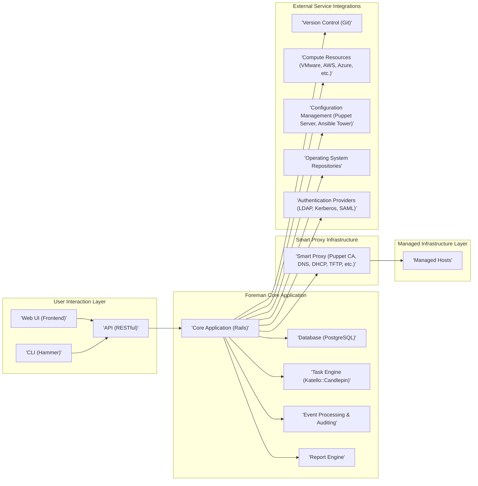
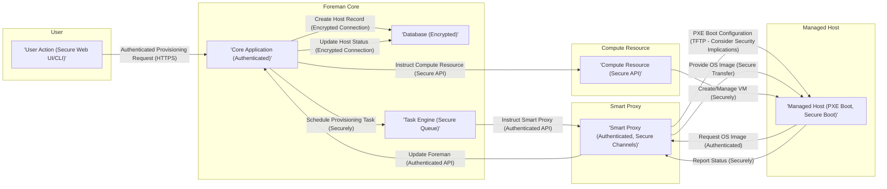
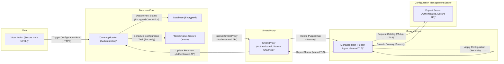

## Project Design Document: Foreman (Improved)

**1. Introduction**

This document provides an enhanced architectural design of the Foreman project, an open-source platform for the comprehensive lifecycle management of physical and virtual servers. This detailed design serves as a robust foundation for subsequent threat modeling activities. It meticulously outlines the key components, their interactions, data flows, and security considerations, offering a deeper understanding of the system's architecture.

**2. Goals**

* Present a more detailed and refined overview of the Foreman architecture.
* Provide enhanced descriptions of key components and their specific responsibilities, including security aspects.
* Illustrate the interactions and data flows between components with greater clarity and precision.
* Emphasize and expand upon the security considerations for each component and interaction, including potential threats.
* Serve as a more comprehensive and actionable basis for future threat modeling exercises.

**3. Target Audience**

This document is intended for a broader audience involved in the security and development of the Foreman project:

* Security architects and engineers responsible for threat modeling and security assessments.
* Software developers contributing to the Foreman project.
* Operations teams involved in deploying, managing, and securing Foreman instances.
* Technical stakeholders requiring a detailed understanding of the Foreman architecture.

**4. Project Overview**

Foreman is a sophisticated and mature application designed to automate the entire server lifecycle, encompassing provisioning, configuration management, patching, and monitoring. Its strength lies in its ability to integrate seamlessly with a diverse range of infrastructure providers, configuration management tools (such as Puppet and Ansible), and operating systems. The core functionality is centered around the efficient and secure management of hosts and their associated lifecycles, from initial deployment to decommissioning.

**5. High-Level Architecture**

**6. Component Descriptions (Enhanced)**

* **Web UI (Frontend):**
    * Provides a user-friendly graphical interface for interacting with Foreman's features.
    * Built using Ruby on Rails and associated web technologies (HTML, CSS, JavaScript).
    * Handles user authentication and authorization, ensuring only authenticated and authorized users can access specific functionalities.
    * Communicates with the Core Application exclusively via the secure RESTful API.
    * Security considerations include protection against XSS, CSRF, and other web-based attacks.

* **CLI (Hammer):**
    * A powerful command-line interface for managing Foreman, offering an alternative to the Web UI.
    * Provides similar functionality to the Web UI, enabling automation and scripting of Foreman tasks.
    * Interacts with the Core Application through the authenticated and authorized RESTful API.
    * Security relies on the security of the underlying API communication and secure storage of user credentials or API tokens.

* **API (RESTful):**
    * A comprehensive and well-defined RESTful API serves as the primary interface for programmatic access to Foreman's capabilities.
    * Used internally by the Web UI and CLI, as well as for external integrations with other systems.
    * Enforces strict authentication (e.g., API keys, OAuth 2.0) and fine-grained authorization for all incoming requests.
    * Security measures include input validation, rate limiting, and protection against common API vulnerabilities.

* **Core Application (Rails):**
    * The central and most critical component of Foreman, built upon the robust Ruby on Rails framework.
    * Implements the core application logic, manages data models, and enforces business rules.
    * Receives and processes requests from the UI, CLI, and API, orchestrating interactions with other components.
    * Responsible for managing the overall state of the system and ensuring data integrity.
    * Security considerations include protection against common web application vulnerabilities, secure dependency management, and proper handling of sensitive data.

* **Database (PostgreSQL):**
    * Stores Foreman's persistent data, including detailed host information, configuration settings, user accounts, audit logs, and more.
    * Critical for the operation and data integrity of the entire system.
    * Access is strictly controlled and limited to the Core Application.
    * Security measures include encryption at rest and in transit, strong access controls, and regular backups.

* **Task Engine (Katello::Candlepin):**
    * Manages asynchronous tasks within Foreman, such as host provisioning, configuration management runs, software updates, and other long-running operations.
    * Ensures reliable and auditable execution of these tasks, even in the face of failures.
    * Security considerations involve secure task queuing and execution, preventing unauthorized task manipulation.

* **Event Processing & Auditing:**
    * Responsible for processing events generated by managed hosts, Smart Proxies, and external systems.
    * Stores and analyzes event data for monitoring, reporting, and auditing purposes.
    * Provides a detailed audit trail of actions performed within Foreman.
    * Security focuses on data integrity and preventing tampering with audit logs.

* **Report Engine:**
    * Generates reports based on data stored within Foreman, providing insights into managed infrastructure.
    * Allows users to create custom reports based on various criteria.
    * Security considerations involve ensuring only authorized users can access sensitive reporting data.

* **Smart Proxy (Puppet CA, DNS, DHCP, TFTP, etc.):**
    * Acts as a secure intermediary between the Foreman Core and the managed infrastructure.
    * Provides essential services like Puppet certificate signing, DNS and DHCP management, TFTP for PXE booting, and potentially others.
    * Deployed strategically closer to the managed hosts for network efficiency and enhanced security.
    * Communicates with the Core Application via a dedicated, authenticated API.
    * Security is paramount, requiring secure communication channels, strict access controls, and regular security updates.

* **Managed Hosts:**
    * The physical or virtual servers and devices being managed by Foreman.
    * May have agents installed for communication and management, depending on the specific functionalities being used.
    * Security relies on proper configuration, regular patching, and secure communication with Foreman components.

* **Version Control (Git):**
    * Used for storing and managing configuration data as code, such as Puppet environments, Ansible playbooks, and other configuration files.
    * Provides version history and facilitates collaboration on infrastructure configuration.
    * Access control and secure authentication are crucial for protecting sensitive configuration data.

* **Compute Resources (VMware, AWS, Azure, etc.):**
    * Represents the underlying infrastructure platforms where virtual machines are created, managed, and operated.
    * Foreman integrates with their respective APIs to automate VM provisioning and management.
    * Secure storage and management of API credentials are vital.

* **Configuration Management (Puppet Server, Ansible Tower):**
    * External systems responsible for enforcing desired configurations on managed hosts.
    * Foreman orchestrates configuration management runs on these systems.
    * Secure communication and authentication with these systems are essential.

* **Operating System Repositories:**
    * Sources for software packages used for provisioning and patching managed hosts.
    * Foreman manages access and synchronization of these repositories, ensuring access to the correct software versions.
    * Security involves using trusted repositories and verifying package integrity.

* **Authentication Providers (LDAP, Kerberos, SAML):**
    * External systems used for authenticating Foreman users.
    * Allows integration with existing organizational identity management systems.
    * Secure configuration and communication with these providers are critical.

**7. Data Flow Diagrams (More Specific)**

**7.1 Detailed Host Provisioning Workflow (with Security Focus):**

**7.2 Detailed Configuration Management Run (with Security Focus):**

**8. Security Considerations (Expanded)**

This section provides a more detailed breakdown of security considerations, including potential threats and mitigation strategies.

* **Web UI (Frontend):**
    * **Threats:** Cross-Site Scripting (XSS), Cross-Site Request Forgery (CSRF), Session Hijacking, Clickjacking, Credential Stuffing.
    * **Mitigations:** Strict input validation and output encoding, anti-CSRF tokens, secure session management (HTTPOnly, Secure flags), Content Security Policy (CSP), regular security updates, rate limiting for login attempts, multi-factor authentication (MFA).

* **CLI (Hammer):**
    * **Threats:** Man-in-the-Middle attacks on API communication, insecure storage of API keys/tokens, unauthorized access if credentials are compromised.
    * **Mitigations:** Enforce HTTPS for API communication, secure storage of credentials (e.g., using credential managers), proper handling of API keys and tokens, regular security audits.

* **API (RESTful):**
    * **Threats:** Injection attacks (SQL injection, command injection), Broken Authentication and Authorization, Excessive Data Exposure, Lack of Resources & Rate Limiting, Security Misconfiguration.
    * **Mitigations:** Strong authentication mechanisms (API keys, OAuth 2.0), fine-grained authorization controls, input validation and sanitization, output encoding, rate limiting, regular security audits and penetration testing, proper error handling to avoid information leakage, HTTPS enforcement.

* **Core Application (Rails):**
    * **Threats:** Common web application vulnerabilities (e.g., mass assignment, insecure redirects), dependency vulnerabilities, insecure file uploads, denial-of-service attacks.
    * **Mitigations:** Secure coding practices, regular dependency updates and vulnerability scanning, input validation, protection against CSRF, secure file handling, rate limiting, regular security audits and penetration testing.

* **Database (PostgreSQL):**
    * **Threats:** SQL injection (if not properly mitigated in the Core Application), unauthorized access, data breaches, data tampering.
    * **Mitigations:** Strong access controls, encryption at rest and in transit (TLS/SSL), regular backups, principle of least privilege for database users, monitoring for suspicious activity.

* **Task Engine (Katello::Candlepin):**
    * **Threats:** Unauthorized task execution, manipulation of task queues, information disclosure through task details.
    * **Mitigations:** Secure task queuing mechanisms, authentication and authorization for task creation and management, input validation for task parameters.

* **Event Processing & Auditing:**
    * **Threats:** Tampering with audit logs, injection of malicious events, unauthorized access to event data.
    * **Mitigations:** Secure storage of audit logs, integrity checks for audit data, access controls for viewing and managing events.

* **Report Engine:**
    * **Threats:** Unauthorized access to sensitive reporting data, information disclosure.
    * **Mitigations:** Role-based access control for report access, secure generation and delivery of reports.

* **Smart Proxy (Puppet CA, DNS, DHCP, TFTP, etc.):**
    * **Threats:** Man-in-the-Middle attacks, unauthorized access to services, DNS spoofing, DHCP starvation, TFTP vulnerabilities.
    * **Mitigations:** Mutual authentication with the Foreman Core (e.g., using certificates), secure communication channels (TLS/SSL), access controls for each service, regular security updates for proxy services, secure configuration of individual services.

* **Managed Hosts:**
    * **Threats:** Compromised agents, unauthorized access, malware infections, data breaches.
    * **Mitigations:** Secure agent communication (e.g., mutual TLS), strong access controls on hosts, regular patching and vulnerability scanning, endpoint security solutions.

* **Version Control (Git):**
    * **Threats:** Unauthorized access to repositories, accidental or malicious modification of configuration data, exposure of sensitive information in commit history.
    * **Mitigations:** Strong access controls and authentication for Git repositories, secure storage of credentials, regular security audits of repository access.

* **Compute Resources (VMware, AWS, Azure, etc.):**
    * **Threats:** Compromised API credentials, unauthorized access to cloud resources, misconfiguration of cloud security settings.
    * **Mitigations:** Secure storage and management of API credentials (e.g., using secrets management tools), principle of least privilege for Foreman's access to cloud resources, regular review of cloud security configurations.

* **Configuration Management (Puppet Server, Ansible Tower):**
    * **Threats:** Man-in-the-Middle attacks, unauthorized access to configuration management systems, injection of malicious configurations.
    * **Mitigations:** Secure communication channels (TLS/SSL), strong authentication and authorization with configuration management systems.

* **Operating System Repositories:**
    * **Threats:** Supply chain attacks, malware in repositories, compromised packages.
    * **Mitigations:** Using trusted and verified repositories, verifying package integrity (e.g., using checksums), implementing secure repository mirroring.

* **Authentication Providers (LDAP, Kerberos, SAML):**
    * **Threats:** Credential compromise, man-in-the-middle attacks, misconfiguration leading to authentication bypass.
    * **Mitigations:** Secure communication protocols (LDAPS, Kerberos over HTTPS), strong configuration of authentication providers, regular security audits of authentication integration.

**9. Deployment Considerations (Strengthened)**

The security of a Foreman deployment is heavily influenced by its deployment architecture. Key security considerations include:

* **Network Segmentation:** Isolating Foreman components and managed infrastructure on separate network segments with strict firewall rules to limit lateral movement in case of a breach.
* **Firewall Rules (Detailed):** Implementing granular firewall rules to allow only necessary communication between components, restricting access from untrusted networks. For example, only allowing HTTPS traffic to the Web UI and API.
* **Intrusion Detection/Prevention Systems (IDS/IPS):** Deploying network and host-based IDS/IPS to monitor for malicious activity and potentially block attacks.
* **Security Hardening (Comprehensive):** Applying security hardening best practices to all systems involved, including operating systems, web servers, databases, and Foreman itself. This includes disabling unnecessary services, patching vulnerabilities promptly, and configuring secure defaults.
* **Regular Security Audits and Penetration Testing:** Conducting periodic security assessments to identify vulnerabilities and weaknesses in the deployment.
* **Secure Key Management:** Implementing a secure system for managing sensitive keys and certificates used by Foreman and its components.
* **Monitoring and Logging:** Implementing comprehensive monitoring and logging of all Foreman components to detect and respond to security incidents. Centralized logging is crucial for analysis.
* **Disaster Recovery and Business Continuity:** Planning for disaster recovery and business continuity to ensure the availability and integrity of Foreman in case of an outage or attack.

**10. Future Considerations (More Concrete)**

* **Enhanced Containerization (Docker, Kubernetes) Security:** Exploring and implementing best practices for securing containerized Foreman deployments, including image scanning, network policies, and secure secrets management within Kubernetes.
* **Integration with Security Information and Event Management (SIEM) systems:** Implementing robust integration with SIEM systems for centralized security monitoring, alerting, and incident response.
* **Advanced Threat Detection and Response (EDR/XDR):** Investigating and potentially integrating with EDR/XDR solutions for enhanced threat detection and automated response capabilities on Foreman servers and managed hosts.
* **Immutable Infrastructure Principles:** Exploring the adoption of immutable infrastructure principles for Foreman components to improve security and resilience.
* **Formal Security Audits and Certifications:** Pursuing formal security audits and certifications (e.g., SOC 2) to demonstrate a commitment to security best practices.

**11. Conclusion**

This improved design document provides a more detailed and comprehensive architectural overview of the Foreman project, with a strong emphasis on security considerations. By outlining the key components, their interactions, data flows, and potential threats, this document serves as a valuable resource for conducting thorough threat modeling and implementing robust security controls. This document will be continuously reviewed and updated to reflect the evolving nature of the Foreman project and the ever-changing security landscape.