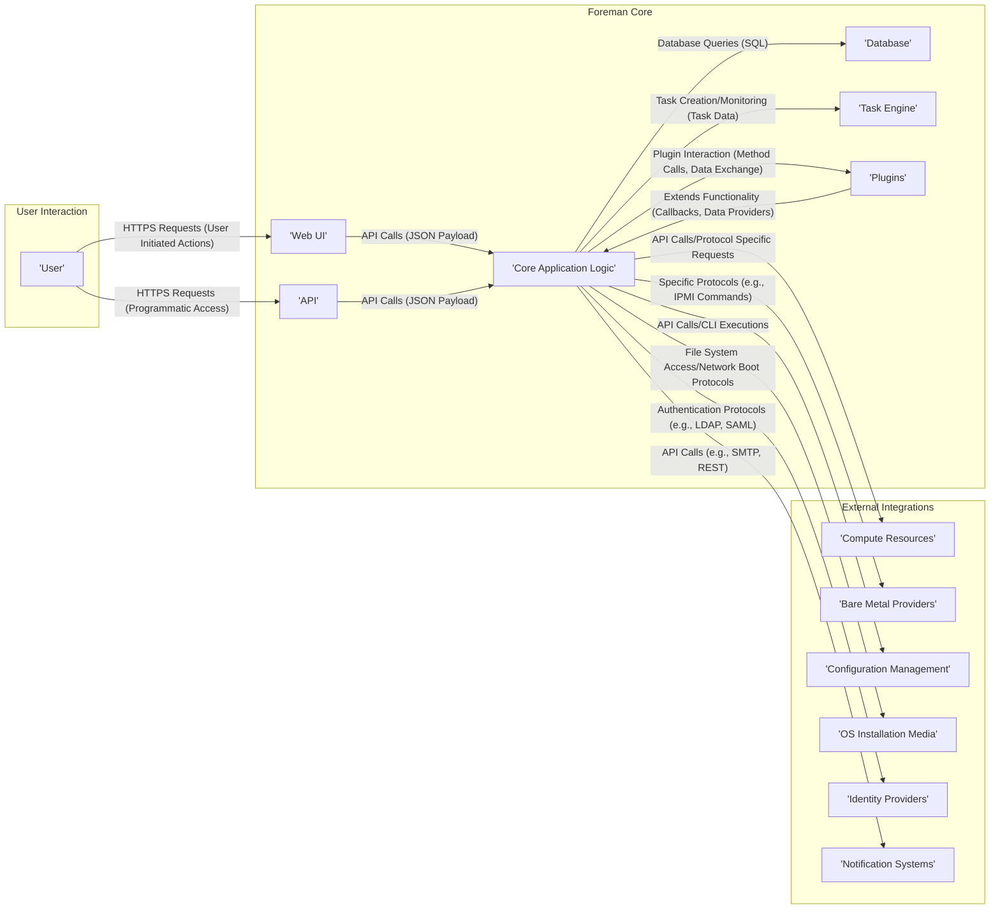
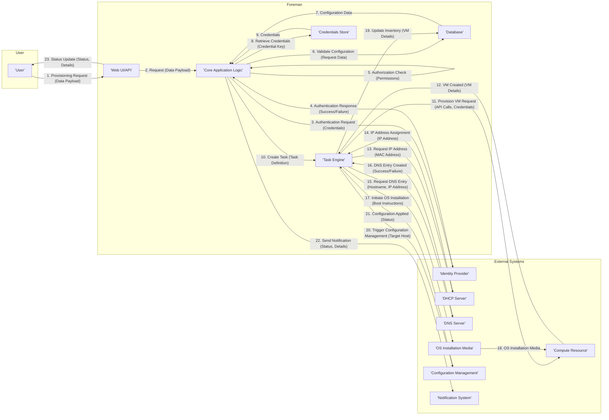
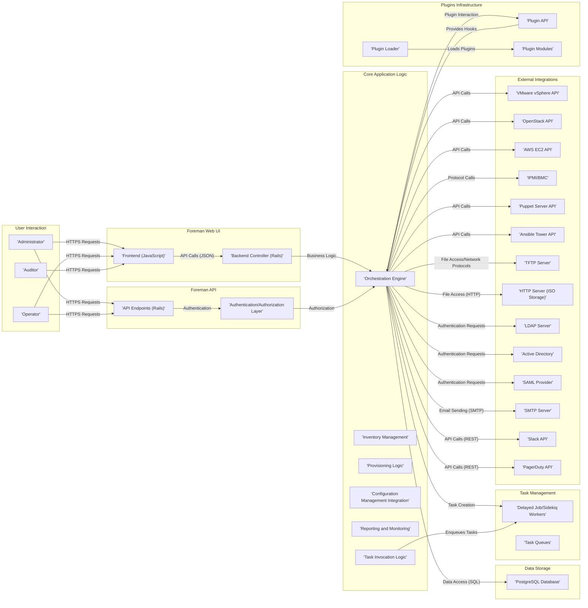

# Project Design Document: Foreman

**Version:** 1.1
**Date:** October 26, 2023
**Author:** AI Software Architect

## 1. Introduction

This document provides an enhanced architectural design of the Foreman project, an open-source platform for the comprehensive lifecycle management of physical and virtual servers. This detailed design is specifically intended to support thorough threat modeling activities, offering a clear and in-depth understanding of the system's components, data flow pathways, and inter-component interactions. This revision aims to provide greater clarity and detail compared to the initial version.

## 2. Goals and Objectives

*   Present a refined and more detailed overview of the Foreman system architecture.
*   Clearly define the responsibilities and functionalities of each key component.
*   Elaborate on the interactions and data flow between the various components, specifying data types where relevant.
*   Provide a comprehensive list of the technologies employed within the system.
*   Serve as an improved foundation for identifying potential security vulnerabilities and attack vectors during the threat modeling process.

## 3. Target Audience

*   Security engineers and architects responsible for conducting threat modeling and security assessments.
*   Development teams involved in the development, maintenance, and extension of Foreman.
*   Operations teams responsible for the deployment, configuration, and ongoing management of Foreman instances.
*   Technical stakeholders requiring a deep understanding of Foreman's internal architecture and operational mechanisms.

## 4. System Overview

Foreman is a robust and widely adopted open-source platform that streamlines and automates the entire lifecycle management of servers, encompassing both physical and virtual infrastructure. This includes critical operations such as server provisioning, automated configuration management, software patching and updates, and comprehensive monitoring. Foreman achieves this by seamlessly integrating with a diverse range of infrastructure providers, operating systems, and industry-standard configuration management tools, presenting a unified and centralized management interface.

## 5. System Architecture

The Foreman architecture is structured around several interconnected key components, each with specific responsibilities:

*   **Web UI:** This is the primary graphical interface through which users interact with Foreman. It provides a user-friendly way to manage infrastructure, view reports, and configure the system. It communicates with the backend via API calls.
*   **API:** A comprehensive RESTful API allows for programmatic access to nearly all of Foreman's functionalities. This enables integration with other systems, automation through scripts, and the development of custom tools. The API typically returns data in JSON format.
*   **Core Application Logic:** This central component, primarily implemented using the Ruby on Rails framework, orchestrates tasks, manages the system's data models, enforces business rules, and handles the overall workflow of Foreman.
*   **Database:** Foreman relies on a persistent data store, primarily PostgreSQL, to store configuration data, inventory information about managed hosts, user credentials, and historical task execution data.
*   **Task Engine:** This component manages asynchronous and background tasks, such as provisioning workflows, software installations, and configuration management runs. It ensures that long-running operations do not block the main application flow.
*   **Plugins:** Foreman's architecture is highly extensible through a plugin system. Plugins allow users to add new features, integrate with additional external systems, and customize the platform's behavior without modifying the core codebase.
*   **External Integrations:** A crucial aspect of Foreman is its ability to interact with various external systems:
    *   **Compute Resources (e.g., VMware vSphere, OpenStack, Amazon EC2):**  Used for provisioning and managing the lifecycle of virtual machines. Foreman interacts with their respective APIs.
    *   **Bare Metal Providers (e.g., systems supporting IPMI/BMC):** Enables out-of-band management functions like power control, remote console access, and BIOS configuration for physical servers.
    *   **Configuration Management Tools (e.g., Puppet, Ansible):** Foreman orchestrates these tools to enforce desired configurations on managed hosts. It communicates with their APIs or command-line interfaces.
    *   **Operating System Installation Media (e.g., ISO images, PXE boot infrastructure):** Used during the provisioning process to install operating systems on target machines.
    *   **Identity Providers (e.g., LDAP, Active Directory, SAML providers):** For authenticating users and managing their access permissions within Foreman.
    *   **Notification Systems (e.g., Email servers, Slack, PagerDuty):** Used to send alerts and notifications about system events and task statuses.



## 6. Data Flow

To illustrate the data flow, let's consider the scenario of provisioning a new virtual machine:

1. **User Request:** An administrator or operator initiates a request to provision a new virtual machine. This request is submitted through the **'Web UI'** or directly via the **'API'**, typically containing details like hostname, operating system, resources, and network configuration.
2. **Request Processing:** The **'Web UI'** or **'API'** endpoint receives the request and forwards it to the **'Core Application Logic'**.
3. **Authentication and Authorization:** The **'Core Application Logic'** first authenticates the user against configured **'Identity Providers'** and then authorizes the action based on the user's roles and permissions. This involves exchanging authentication tokens or credentials.
4. **Data Validation:** The **'Core Application Logic'** validates the provisioning request against predefined templates, available resources, and configurations stored in the **'Database'**.
5. **Task Creation:** Upon successful validation, the **'Core Application Logic'** creates a provisioning task and assigns it to the **'Task Engine'**. The task includes details of the VM to be provisioned and the steps involved.
6. **Compute Resource Interaction:** The **'Task Engine'**, guided by the **'Core Application Logic'**, interacts with the designated **'Compute Resources'** (e.g., VMware vSphere API) by sending API calls with necessary credentials (retrieved securely). This results in the creation of the virtual machine on the hypervisor.
7. **Network Configuration:** Foreman might interact with external systems like **'DHCP Server'** and **'DNS Server'** to allocate an IP address and create DNS records for the new VM.
8. **OS Installation:** Foreman utilizes the configured **'OS Installation Media'** (e.g., via PXE boot orchestrated through a TFTP server or by providing cloud-init configurations) to install the operating system on the newly created virtual machine.
9. **Configuration Management:** Once the operating system is installed, Foreman triggers the configured **'Configuration Management'** tool (e.g., Puppet agent or Ansible playbook) on the new machine. Foreman communicates with the configuration management server to initiate the configuration process.
10. **Inventory Update:** The **'Core Application Logic'** updates the **'Database'** with the details of the newly provisioned machine, including its IP address, operating system, and configuration status.
11. **Notification:** Optionally, the system sends notifications about the provisioning status (success or failure) through configured **'Notification Systems'** like email or Slack.
12. **User Feedback:** The **'Web UI'** or **'API'** provides feedback to the initiating user about the progress and completion of the provisioning process.



## 7. Key Technologies

*   **Primary Programming Languages:** Ruby (for the core application logic), JavaScript (for the web UI frontend).
*   **Web Application Framework:** Ruby on Rails.
*   **Database System:** Primarily PostgreSQL. Other databases might be supported with varying levels of functionality.
*   **Web Server:** Typically deployed behind a reverse proxy like Nginx or Apache, using a Ruby application server such as Puma or Unicorn.
*   **Background Task Processing:** Often utilizes libraries like Delayed Job or Sidekiq for managing asynchronous tasks.
*   **API Communication:** RESTful API principles with data exchanged primarily in JSON format.
*   **User Interface Technologies:** HTML, CSS, and JavaScript, often leveraging frameworks like PatternFly for UI components.
*   **Authentication and Authorization:**  Devise (a Ruby gem) for local authentication, with support for integration with external identity providers via protocols like LDAP, Active Directory, and SAML.

## 8. Deployment Model

Foreman offers flexibility in its deployment architecture, allowing it to be adapted to various organizational needs and scales:

*   **Single Server Deployment:** All core Foreman components (Web UI, API, Core Logic, Database, Task Engine) are installed and run on a single server. This model is suitable for smaller environments, development, or testing purposes.
*   **Separate Database Server Deployment:** The PostgreSQL database is hosted on a dedicated server, separate from the application server(s). This improves performance and scalability by isolating the database workload.
*   **Load-Balanced Web/API Servers:** Multiple instances of the Foreman Web UI and API are deployed behind a load balancer. This enhances availability and performance by distributing incoming requests across multiple servers.
*   **Satellite Architecture (using Foreman with Katello):** For managing software content, updates, and errata in larger, geographically distributed environments, Foreman can be deployed in conjunction with Katello (another open-source project). This architecture involves a central Foreman instance and multiple satellite servers.

## 9. Security Considerations (High-Level)

Security is a paramount concern in Foreman's design and operation. Key security considerations include:

*   **Robust Authentication and Authorization:** Securely verifying user identities through local accounts or integration with external identity providers. Enforcing granular access control based on user roles and permissions to restrict access to sensitive functionalities and data.
*   **Data Encryption:** Employing encryption for sensitive data both at rest (e.g., encrypting the database) and in transit (enforcing HTTPS for all web traffic and API communication). Securely managing encryption keys is crucial.
*   **Input Validation and Sanitization:** Rigorously validating all user inputs to prevent common web application vulnerabilities such as SQL injection, cross-site scripting (XSS), and command injection.
*   **Secure Communication with External Systems:** Ensuring secure communication with external infrastructure providers and services by using appropriate protocols (e.g., HTTPS, SSH), securely storing and managing API keys and credentials, and verifying server certificates.
*   **Regular Security Updates and Patching:** Maintaining Foreman and its underlying operating system and dependencies with the latest security patches to address known vulnerabilities promptly.
*   **Secrets Management:** Securely storing and managing sensitive credentials required for integrating with external systems. Avoid storing secrets directly in configuration files; instead, utilize secure vault solutions or environment variables.
*   **Auditing and Logging:** Maintaining comprehensive audit logs of user actions and system events to facilitate security monitoring, incident response, and compliance requirements.
*   **Protection Against Common Web Attacks:** Implementing security best practices to mitigate risks from common web application attacks, such as CSRF (Cross-Site Request Forgery) and session hijacking.

## 10. Assumptions and Constraints

*   This design document primarily focuses on the core Foreman project and its fundamental architecture. Specific plugins and extensions might introduce additional components and complexities not explicitly detailed here.
*   The architecture described may have minor variations depending on the specific version of Foreman being used and the set of installed plugins.
*   Detailed configuration specifics, such as network configurations or specific plugin settings, are outside the scope of this document.
*   The emphasis is on the logical architecture and the interaction of components, rather than the underlying physical infrastructure or cloud deployment details.

## 11. Future Considerations

*   Further modularization of the core application to enhance maintainability and scalability.
*   Enhanced support for containerized deployments (e.g., running Foreman within Kubernetes).
*   Improved scalability and performance optimizations for managing increasingly large and complex environments.
*   Deeper integration with cloud-native technologies and services.
*   Continued development of the plugin ecosystem to extend Foreman's capabilities.

## Appendix A: System Component Diagram (Detailed)



## Appendix B: Data Flow Diagram (Detailed Provisioning)

```mermaid
graph LR
    subgraph "User"
        UA["'Administrator/Operator'"]
    end
    subgraph "Foreman Web UI/API"
        WB["'Web UI Frontend'"]
        WC["'Web UI Backend/API Endpoint'"]
    end
    subgraph "Foreman Core"
        CA["'Authentication/Authorization'"]
        CB["'Provisioning Orchestrator'"]
        CC["'Template Engine'"]
        CD["'Task Scheduler'"]
        CE["'Inventory Database'"]
        CF["'Credentials Store'"]
        CG["'Audit Logger'"]
    end
    subgraph "External Systems"
        EA["'Identity Provider (LDAP/AD)'"]
        EB["'Compute Resource (vSphere/AWS)'"]
        EC["'DHCP Server'"]
        ED["'DNS Server'"]
        EE["'PXE Boot Server (TFTP)'"]
        EF["'OS Image Repository (HTTP)'"]
        EG["'Configuration Management Server (Puppet/Ansible)'"]
    end

    UA -- "1. Initiate Provisioning Request (JSON Payload)" --> WB
    WB -- "2. API Request (JSON Payload)" --> WC
    WC -- "3. Authentication Request (Credentials)" --> CA
    CA -- "4. Verify Credentials (Credentials)" --> EA
    EA -- "5. Authentication Response (Success/Failure)" --> CA
    CA -- "6. Authorization Check (Permissions)" --> CB
    CB -- "7. Retrieve Configuration/Templates (Template ID)" --> CE
    CE -- "8. Configuration Data (Template Data)" --> CB
    CB -- "9. Retrieve Credentials (Credential Alias)" --> CF
    CF -- "10. Credentials (API Keys, Passwords)" --> CB
    CB -- "11. Request VM Creation (VM Specs, Credentials)" --> EB
    EB -- "12. VM Created (VM ID, Details)" --> CB
    CB -- "13. Request IP Address (MAC Address)" --> EC
    EC -- "14. IP Address Assignment (IP Address)" --> CB
    CB -- "15. Request DNS Entry (Hostname, IP Address)" --> ED
    ED -- "16. DNS Entry Created (Success/Failure)" --> CB
    CB -- "17. Trigger PXE Boot (Boot Parameters)" --> EE
    EE -- "18. Request Boot Files (Filename)" --> EB
    EB -- "19. Boot Files" --> EE
    EE -- "20. Request OS Image (Image URL)" --> EF
    EF -- "21. OS Image" --> EE
    CB -- "22. Update Inventory (VM Details)" --> CE
    CB -- "23. Trigger Configuration Management (Target Host Details)" --> EG
    EG -- "24. Configuration Applied (Status, Logs)" --> CB
    CB -- "25. Log Provisioning Event (Event Details)" --> CG
    CB -- "26. Provisioning Complete (Status, Details)" --> WC
    WC -- "27. Status Update (Status, Details)" --> UA
