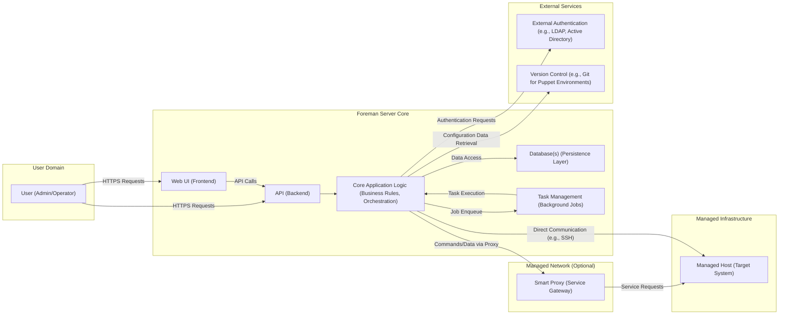
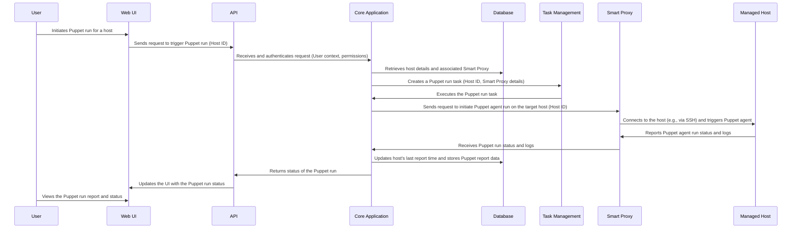

## Project Design Document: Foreman

**Project Name:** Foreman

**Project Repository:** https://github.com/theforeman/foreman

**Document Version:** 1.1

**Date:** October 26, 2023

**Author:** AI Software Architect

**1. Introduction**

This document provides an enhanced architectural overview of the Foreman project, building upon the previous version. It aims to provide a more detailed description of the system's components, their interactions, and the overall data flow, specifically tailored for threat modeling purposes. This document will serve as a more robust foundation for identifying potential security vulnerabilities and attack vectors.

**2. Goals and Objectives**

The primary goal of Foreman is to provide a comprehensive and centralized platform for the lifecycle management of physical and virtual servers, simplifying and automating complex IT infrastructure tasks. Key objectives include:

*   Automated provisioning and de-provisioning of operating systems on bare metal servers, virtual machines, and cloud instances.
*   Seamless integration with configuration management tools (e.g., Puppet, Ansible) for consistent system configuration.
*   Efficient patch management and software updates across managed hosts.
*   Detailed inventory management and comprehensive reporting on managed infrastructure.
*   Secure remote execution of commands and scripts on managed hosts.
*   Extensible architecture through plugins and integrations with various infrastructure providers (e.g., VMware, AWS, Azure, OpenStack).
*   Improved operational efficiency and reduced administrative overhead through automation.

**3. High-Level Architecture**

Foreman employs a client-server architecture with a central Foreman server orchestrating management tasks. Optional Smart Proxies extend the reach of the Foreman server into different network segments.

**4. Key Components and Interactions**

*   **User (Admin/Operator):**  Human users who interact with Foreman to manage the infrastructure. They authenticate to the system and perform actions through the Web UI or API.
*   **Web UI (Frontend):**  A browser-based graphical interface built using technologies like JavaScript and interacting with the Foreman API. It presents data and allows users to initiate management tasks.
*   **API (Backend):** A RESTful API providing programmatic access to Foreman's functionalities. It handles authentication, authorization, request processing, and data serialization. It's the primary interface for the Web UI, command-line tools (`hammer`), and external integrations.
*   **Core Application Logic (Business Rules, Orchestration):** The central component containing the core business logic of Foreman. It handles:
    *   User authentication and authorization based on roles and permissions.
    *   Orchestration of provisioning workflows, including interactions with Smart Proxies and managed hosts.
    *   Management of host objects, including their lifecycle, parameters, and relationships.
    *   Integration logic for configuration management tools (e.g., triggering Puppet runs, retrieving reports).
    *   Policy enforcement and compliance checks.
    *   Event processing and notifications.
*   **Database(s) (Persistence Layer):** Stores persistent data for Foreman, including:
    *   Host inventory details (hardware, software, network configuration).
    *   User accounts, roles, and permissions.
    *   Configuration data for managed hosts and Foreman itself.
    *   Task history and audit logs.
    *   Settings, preferences, and global parameters.
    *   Typically uses PostgreSQL or MySQL. Access is managed by the Core Application Logic.
*   **Task Management (Background Jobs):**  Manages asynchronous tasks that can take time to complete, such as operating system provisioning, configuration management runs, and remote command execution. It uses a background processing library like Sidekiq, which relies on a message broker (e.g., Redis).
*   **Smart Proxy (Service Gateway):** An optional component deployed in managed networks to provide services closer to the managed hosts. It acts as a gateway for Foreman, reducing the need for direct communication from the Foreman server to every host. Key responsibilities include:
    *   **DHCP Server:**  Provides IP address assignment to managed hosts during provisioning.
    *   **DNS Server:**  Manages DNS records for managed hosts.
    *   **TFTP Server:**  Serves boot files (e.g., PXE bootloaders) to managed hosts during provisioning.
    *   **Puppet CA:**  Acts as a Certificate Authority for Puppet in environments where Foreman manages Puppet certificates.
    *   **Ansible Execution:**  Executes Ansible playbooks on managed hosts.
    *   **Realm Proxy:**  Provides integration with identity management systems like Active Directory or FreeIPA.
    *   Communication with the Foreman server is typically over HTTPS, often secured with client certificates.
*   **Managed Host (Target System):** The physical or virtual servers being managed by Foreman. Agents or remote execution mechanisms (e.g., SSH, WinRM) are used for communication and management.
*   **External Authentication (e.g., LDAP, Active Directory):** Foreman can integrate with external authentication providers to manage user accounts and authentication.
*   **Version Control (e.g., Git for Puppet Environments):** Foreman can integrate with version control systems to manage configuration management code (e.g., Puppet environments, Ansible playbooks).

**5. Data Flow**

Let's examine the data flow for a common operation: triggering a Puppet configuration management run on a managed host.

**6. Security Considerations (Pre-Threat Modeling)**

This section outlines potential security considerations that will be crucial for subsequent threat modeling.

*   **Authentication and Authorization:**
    *   **User Authentication:** Secure authentication mechanisms for users accessing the Web UI and API (e.g., password-based, multi-factor authentication, integration with external providers like LDAP/AD).
    *   **API Authentication:** Secure authentication for API clients (e.g., token-based authentication, OAuth 2.0).
    *   **Role-Based Access Control (RBAC):** Granular control over user permissions and access to resources within Foreman.
    *   **Smart Proxy Authentication:** Secure authentication and authorization for communication between the Foreman server and Smart Proxies (e.g., client certificates, shared secrets).
    *   **Managed Host Authentication:** Secure authentication mechanisms for Foreman and Smart Proxies to access managed hosts (e.g., SSH keys, WinRM credentials).
*   **Data Security:**
    *   **Data at Rest Encryption:** Encryption of sensitive data stored in the database (e.g., passwords, API keys, configuration data).
    *   **Data in Transit Encryption:** Mandatory use of HTTPS for all communication between users, the Web UI, the API, and Smart Proxies. TLS configuration and certificate management are critical.
    *   **Secure Secrets Management:** Secure storage and retrieval of secrets used for integrations (e.g., cloud provider credentials, SSH private keys). Avoid storing secrets in plain text.
*   **Input Validation:**
    *   Strict validation and sanitization of all user inputs received through the Web UI and API to prevent injection attacks (e.g., SQL injection, cross-site scripting).
*   **Communication Security:**
    *   Secure configuration of communication channels between components, ensuring the use of encrypted protocols (e.g., HTTPS, SSH with strong ciphers).
    *   Regular review and updates of cryptographic libraries and protocols.
*   **Vulnerability Management:**
    *   Regularly patching and updating Foreman and its dependencies to address known security vulnerabilities.
    *   Implementing a process for tracking and remediating security vulnerabilities.
*   **Auditing and Logging:**
    *   Comprehensive logging of user actions, API calls, system events, and security-related events for auditing and incident response.
    *   Secure storage and management of audit logs.
*   **Smart Proxy Security:**
    *   Secure deployment and hardening of Smart Proxy servers.
    *   Restricting network access to Smart Proxies.
    *   Regularly updating Smart Proxy software.
*   **Remote Execution Security:**
    *   Secure configuration of remote execution mechanisms (e.g., SSH key management, secure WinRM configuration).
    *   Auditing of remote commands executed on managed hosts.
*   **Third-Party Integrations:**
    *   Careful evaluation of the security posture of third-party integrations and plugins.
    *   Secure configuration and management of integration credentials.

**7. Deployment Considerations**

The security architecture of Foreman can be influenced by the deployment model:

*   **On-Premise:** Requires careful consideration of network segmentation, firewall rules, and physical security of the Foreman server and Smart Proxies.
*   **Cloud Environments:** Leveraging cloud provider security services (e.g., security groups, IAM roles, encryption services) is crucial. Securely managing access keys and API credentials for cloud integrations is paramount.
*   **Containerized Deployments:** Requires securing the container runtime environment and managing container images to prevent vulnerabilities. Securely managing secrets within containers is also important.

**8. Technologies Used**

*   **Programming Languages:** Ruby (primarily), JavaScript
*   **Framework:** Ruby on Rails
*   **Database:** PostgreSQL, MySQL
*   **Task Management:** Sidekiq (using Redis as a message broker)
*   **Web Server:** Typically Apache or Nginx
*   **Operating System (Server):** Various Linux distributions (e.g., CentOS, Ubuntu, Red Hat Enterprise Linux)
*   **Communication Protocols:** HTTP/HTTPS, SSH, DNS, DHCP, TFTP, potentially WinRM
*   **Authentication Protocols:**  Potentially LDAP, Kerberos, SAML

This enhanced design document provides a more detailed and security-focused overview of the Foreman project's architecture, making it a more effective resource for conducting thorough threat modeling.