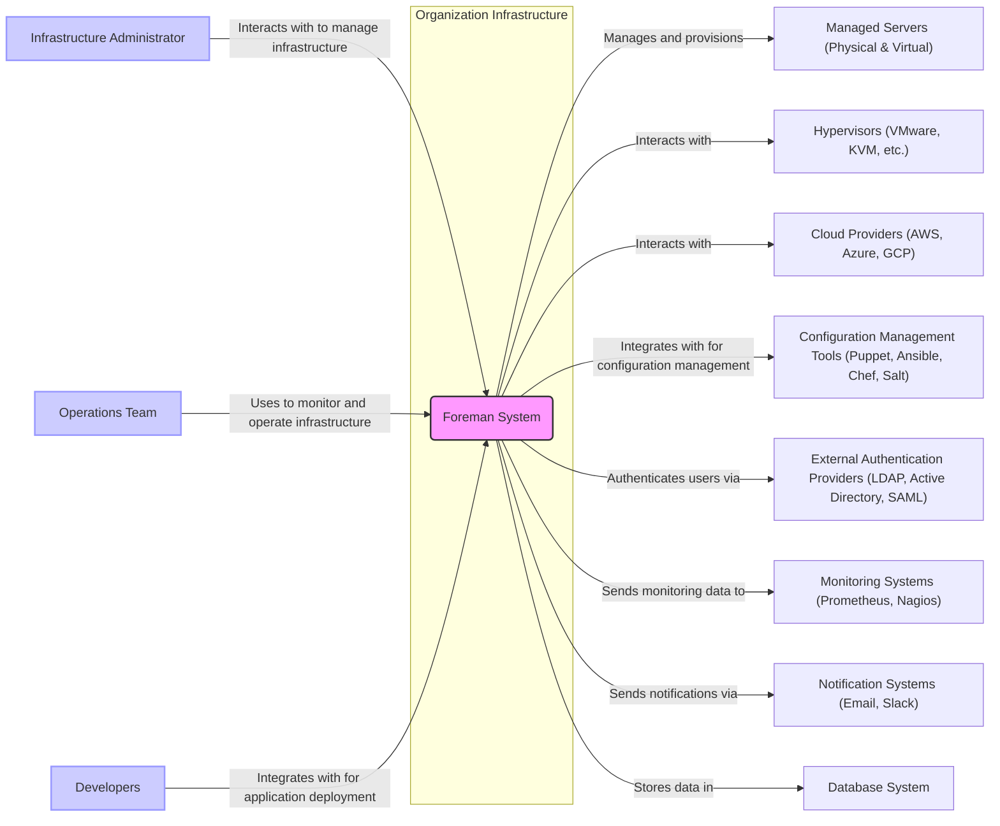
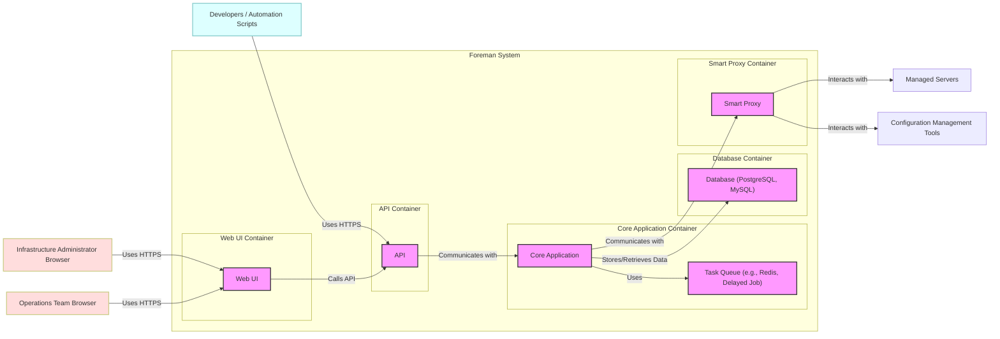
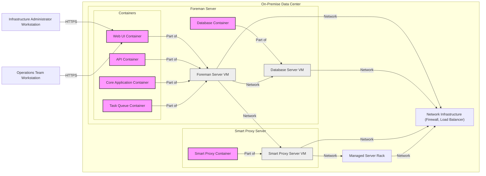
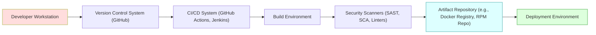

# BUSINESS POSTURE

- Business Priorities and Goals:
  - Goal: Provide a comprehensive open-source platform for managing the lifecycle of physical and virtual servers.
  - Goal: Streamline and automate server provisioning, configuration management, patching, and monitoring.
  - Goal: Offer integration with diverse infrastructure providers (e.g., VMware, OpenStack, AWS, Azure, Google Cloud) and configuration management tools (e.g., Puppet, Chef, Ansible, Salt).
  - Priority: Stability and reliability of the infrastructure management platform to ensure continuous operation of managed systems.
  - Priority: Security of managed infrastructure and the Foreman platform itself to prevent unauthorized access and control.
  - Priority: Extensibility and adaptability to support evolving infrastructure technologies and user needs.

- Business Risks:
  - Business Risk: Downtime or misconfiguration of managed infrastructure due to errors or vulnerabilities in Foreman, leading to service disruptions and financial losses.
  - Business Risk: Security breaches through Foreman, allowing unauthorized access to managed servers and sensitive data.
  - Business Risk: Lack of adoption or community support, hindering the long-term viability and development of Foreman.
  - Business Risk: Complexity of setup and maintenance, leading to high operational costs and user frustration.
  - Business Risk: Incompatibility with new infrastructure technologies or configuration management tools, limiting Foreman's applicability.

# SECURITY POSTURE

- Existing Security Controls:
  - security control: Code reviews are likely performed by maintainers and community contributors as part of the open-source development process. (Implemented in: GitHub Pull Request process)
  - security control: Security vulnerability scanning and static analysis tools are likely used in CI/CD pipelines. (Implemented in: CI/CD pipelines, details not specified in input)
  - security control: Regular security updates and patches are released by the Foreman project. (Implemented in: Release management process, details not specified in input)
  - security control: Authentication and authorization mechanisms are implemented within Foreman to control access to the platform and managed resources. (Implemented in: Foreman application code, details not specified in input)
  - security control: Input validation is likely performed in various parts of the application to prevent common web vulnerabilities. (Implemented in: Foreman application code, details not specified in input)
  - security control: Encryption of sensitive data in transit (HTTPS) and at rest (database encryption might be optional and configurable). (Implemented in: Web server configuration for HTTPS, database configuration for encryption, details not specified in input)

- Accepted Risks:
  - accepted risk: Open-source nature implies public code visibility, potentially exposing vulnerabilities to malicious actors if not promptly addressed.
  - accepted risk: Reliance on community contributions for security fixes might lead to delays in patching critical vulnerabilities compared to commercial solutions with dedicated security teams.
  - accepted risk: Complexity of the system and its integrations might introduce subtle security vulnerabilities that are difficult to detect through automated scanning alone.

- Recommended Security Controls:
  - security control: Implement a dedicated security team or assign security champions within the development team to proactively manage security risks.
  - security control: Conduct regular penetration testing and vulnerability assessments by external security experts.
  - security control: Implement a security incident response plan to effectively handle security breaches and minimize damage.
  - security control: Enhance security awareness training for developers and operators to promote secure coding practices and configuration management.
  - security control: Implement and enforce multi-factor authentication for administrative access to Foreman.
  - security control: Implement robust logging and monitoring of security-related events for auditing and incident detection.
  - security control: Integrate Software Composition Analysis (SCA) tools into the CI/CD pipeline to manage dependencies and identify vulnerable libraries.

- Security Requirements:
  - Authentication:
    - requirement: Secure authentication mechanism for users accessing the Foreman web UI and API.
    - requirement: Support for multiple authentication methods (e.g., local accounts, LDAP, Active Directory, SAML, OAuth).
    - requirement: Strong password policies and enforcement.
    - requirement: Session management with appropriate timeouts and invalidation.
    - requirement: API authentication using tokens or API keys.
  - Authorization:
    - requirement: Role-Based Access Control (RBAC) to manage user permissions and restrict access to specific features and resources.
    - requirement: Granular authorization policies to control actions on managed servers and infrastructure components.
    - requirement: Audit logging of authorization decisions and access attempts.
  - Input Validation:
    - requirement: Comprehensive input validation for all user inputs to prevent injection attacks (e.g., SQL injection, command injection, cross-site scripting).
    - requirement: Input sanitization and encoding to mitigate cross-site scripting vulnerabilities.
    - requirement: Rate limiting and input validation to prevent denial-of-service attacks.
  - Cryptography:
    - requirement: Use of HTTPS for all communication between clients and the Foreman server.
    - requirement: Encryption of sensitive data at rest in the database (e.g., passwords, API keys, secrets).
    - requirement: Secure storage and management of cryptographic keys.
    - requirement: Use of strong and up-to-date cryptographic algorithms and libraries.

# DESIGN

## C4 CONTEXT

- Context Diagram Elements:
  - - Name: Foreman System
    - Type: Software System
    - Description: The Foreman system is the central infrastructure lifecycle management platform. It provides features for provisioning, configuration management, patching, and monitoring of servers and infrastructure.
    - Responsibilities:
      - Manage the lifecycle of physical and virtual servers.
      - Provision new servers across various infrastructure providers.
      - Integrate with configuration management tools to automate server configuration.
      - Provide a web UI and API for user interaction and automation.
      - Store system data and configuration in a database.
      - Integrate with external systems for authentication, monitoring, and notifications.
    - Security controls:
      - Authentication and authorization mechanisms.
      - Input validation and output encoding.
      - HTTPS for web UI and API access.
      - Database encryption (optional).
      - Audit logging.

  - - Name: Infrastructure Administrator
    - Type: Person
    - Description: Users responsible for setting up, configuring, and maintaining the Foreman system and the managed infrastructure.
    - Responsibilities:
      - Install and configure the Foreman system.
      - Define infrastructure policies and configurations within Foreman.
      - Manage user accounts and permissions in Foreman.
      - Troubleshoot issues related to Foreman and managed infrastructure.
    - Security controls:
      - Strong password management.
      - Multi-factor authentication (recommended).
      - Access control to Foreman system administration interfaces.

  - - Name: Operations Team
    - Type: Person
    - Description: Users who utilize Foreman to monitor and operate the managed infrastructure on a daily basis.
    - Responsibilities:
      - Monitor the health and performance of managed servers through Foreman.
      - Perform routine operations tasks such as patching and restarting servers using Foreman.
      - Respond to alerts and incidents related to managed infrastructure.
    - Security controls:
      - Role-based access control within Foreman to limit operational privileges.
      - Audit logging of operations activities.

  - - Name: Developers
    - Type: Person
    - Description: Software developers who may integrate their application deployment workflows with Foreman.
    - Responsibilities:
      - Utilize Foreman's API to automate application deployments and infrastructure provisioning.
      - Integrate Foreman into CI/CD pipelines.
      - Consume infrastructure resources managed by Foreman.
    - Security controls:
      - API access control and authentication.
      - Secure storage of API credentials.
      - Adherence to secure coding practices when integrating with Foreman API.

  - - Name: Managed Servers (Physical & Virtual)
    - Type: Software System / Infrastructure
    - Description: Physical and virtual servers that are managed and provisioned by Foreman. These servers host applications and services.
    - Responsibilities:
      - Host applications and services.
      - Run agents or clients for configuration management and monitoring.
      - Enforce security policies pushed by Foreman.
    - Security controls:
      - Operating system hardening.
      - Security patching managed by Foreman.
      - Access control lists and firewalls.
      - Intrusion detection systems (IDS) (potentially managed externally).

  - - Name: Hypervisors (VMware, KVM, etc.)
    - Type: Software System / Infrastructure
    - Description: Hypervisor platforms that host virtual machines managed by Foreman.
    - Responsibilities:
      - Provide virtualized compute resources.
      - Manage virtual machine lifecycle.
      - Integrate with Foreman API for VM provisioning and management.
    - Security controls:
      - Hypervisor security hardening.
      - Access control to hypervisor management interfaces.
      - Network segmentation.

  - - Name: Cloud Providers (AWS, Azure, GCP)
    - Type: Software System / Infrastructure
    - Description: Public cloud platforms that provide infrastructure as a service (IaaS) resources managed by Foreman.
    - Responsibilities:
      - Provide cloud compute, storage, and network resources.
      - Integrate with Foreman API for resource provisioning and management.
      - Manage cloud infrastructure security.
    - Security controls:
      - Cloud provider security controls (IAM, security groups, etc.).
      - Foreman integration with cloud provider security features.

  - - Name: Configuration Management Tools (Puppet, Ansible, Chef, Salt)
    - Type: Software System
    - Description: Configuration management systems integrated with Foreman to automate server configuration and management.
    - Responsibilities:
      - Enforce desired server configurations.
      - Automate software installation and updates.
      - Integrate with Foreman for policy management and reporting.
    - Security controls:
      - Secure configuration management practices.
      - Secrets management within configuration management tools.
      - Agent-server communication security.

  - - Name: External Authentication Providers (LDAP, Active Directory, SAML)
    - Type: Software System
    - Description: External systems used for user authentication in Foreman.
    - Responsibilities:
      - Authenticate users based on organizational directories or identity providers.
      - Provide user identity information to Foreman.
    - Security controls:
      - Secure configuration of authentication providers.
      - Secure communication protocols (e.g., LDAPS, HTTPS).

  - - Name: Monitoring Systems (Prometheus, Nagios)
    - Type: Software System
    - Description: External monitoring systems that receive metrics and alerts from Foreman and managed servers.
    - Responsibilities:
      - Collect and analyze monitoring data.
      - Generate alerts based on predefined thresholds.
      - Provide dashboards and visualizations of infrastructure health.
    - Security controls:
      - Secure integration with monitoring systems.
      - Access control to monitoring data.

  - - Name: Notification Systems (Email, Slack)
    - Type: Software System
    - Description: Systems used by Foreman to send notifications to users or teams.
    - Responsibilities:
      - Deliver notifications about events and alerts from Foreman.
    - Security controls:
      - Secure configuration of notification systems.
      - Secure transmission of notification data.

  - - Name: Database System
    - Type: Software System
    - Description: Database system used by Foreman to store configuration data, inventory, and operational data.
    - Responsibilities:
      - Persist Foreman data.
      - Provide data access to Foreman application.
      - Ensure data integrity and availability.
    - Security controls:
      - Database access control.
      - Database encryption at rest (optional).
      - Regular database backups.

## C4 CONTAINER

- Container Diagram Elements:
  - - Name: Web UI
    - Type: Container - Web Application
    - Description: Provides the graphical user interface for administrators and operators to interact with Foreman. Built using Ruby on Rails and HTML/JavaScript.
    - Responsibilities:
      - Present user interface for Foreman features.
      - Handle user authentication and authorization.
      - Communicate with the API container to perform actions.
      - Render data and visualizations for users.
    - Security controls:
      - HTTPS for all web traffic.
      - Session management and CSRF protection.
      - Input validation and output encoding.
      - Authentication and authorization checks.

  - - Name: API
    - Type: Container - Web Application
    - Description: Provides a RESTful API for programmatic access to Foreman functionality. Used by the Web UI, automation scripts, and integrations. Built using Ruby on Rails.
    - Responsibilities:
      - Expose Foreman features through a REST API.
      - Handle API authentication and authorization (API keys, tokens).
      - Process API requests and interact with the Core Application.
      - Return data in JSON or XML format.
    - Security controls:
      - HTTPS for all API traffic.
      - API authentication and authorization mechanisms.
      - Input validation and output encoding.
      - Rate limiting and API request throttling.

  - - Name: Core Application
    - Type: Container - Application Server
    - Description: The main application logic of Foreman. Handles business logic, orchestration, and data processing. Built using Ruby on Rails.
    - Responsibilities:
      - Implement core Foreman features (provisioning, CM integration, etc.).
      - Manage data models and business logic.
      - Interact with the Task Queue for asynchronous tasks.
      - Communicate with the Database for data persistence.
      - Communicate with Smart Proxies for infrastructure interactions.
    - Security controls:
      - Secure coding practices.
      - Input validation and data sanitization.
      - Authorization checks for all operations.
      - Secure communication with other containers.

  - - Name: Task Queue (e.g., Redis, Delayed Job)
    - Type: Container - Data Store / Message Queue
    - Description: A task queue system used for asynchronous task processing in Foreman. Examples include Redis or Delayed Job.
    - Responsibilities:
      - Queue and manage background tasks (e.g., provisioning jobs, configuration management runs).
      - Ensure reliable task execution and retries.
      - Improve application responsiveness by offloading tasks.
    - Security controls:
      - Access control to the task queue system.
      - Secure configuration of the task queue.
      - Encryption of sensitive data in task payloads (if applicable).

  - - Name: Database (PostgreSQL, MySQL)
    - Type: Container - Database
    - Description: Relational database used to store Foreman's persistent data, including configuration, inventory, and operational data. Examples include PostgreSQL or MySQL.
    - Responsibilities:
      - Persist Foreman data.
      - Provide data access to the Core Application.
      - Ensure data integrity and availability.
      - Handle database backups and recovery.
    - Security controls:
      - Database access control and authentication.
      - Database encryption at rest (optional).
      - Regular database backups.
      - Database hardening and security patching.

  - - Name: Smart Proxy
    - Type: Container - Application
    - Description: A component that acts as a proxy and agent to interact with managed infrastructure. Deployed closer to the managed servers and infrastructure. Can handle tasks like DHCP, DNS, TFTP, Puppet CA, etc.
    - Responsibilities:
      - Communicate with managed servers and infrastructure components.
      - Provide services like DHCP, DNS, TFTP, Puppet CA.
      - Execute commands and scripts on managed servers.
      - Act as a secure intermediary between Foreman Core and managed infrastructure.
    - Security controls:
      - Secure communication with Foreman Core (e.g., using certificates).
      - Access control to Smart Proxy services.
      - Input validation and output encoding.
      - Principle of least privilege for proxy operations.

## DEPLOYMENT

- Deployment Options:
  - Option 1: On-Premise Deployment - Foreman and all its components are deployed on servers within the organization's own data center.
  - Option 2: Cloud Deployment - Foreman and its components are deployed on cloud infrastructure (e.g., AWS, Azure, GCP).
  - Option 3: Hybrid Deployment - Some Foreman components are on-premise, while others are in the cloud, or Foreman manages both on-premise and cloud infrastructure.

- Detailed Deployment (On-Premise Deployment - Example):

- Deployment Diagram Elements:
  - - Name: Foreman Server VM
    - Type: Virtual Machine
    - Description: Virtual machine hosting the main Foreman application containers (Web UI, API, Core Application, Task Queue).
    - Responsibilities:
      - Provide compute resources for Foreman application containers.
      - Host the core Foreman services.
    - Security controls:
      - Operating system hardening.
      - Security patching.
      - Network firewall rules.
      - Access control to VM console.

  - - Name: Web UI Container
    - Type: Container
    - Description: Containerized Web UI application.
    - Responsibilities:
      - Serve the Foreman web interface.
    - Security controls:
      - As described in Container Diagram.

  - - Name: API Container
    - Type: Container
    - Description: Containerized API application.
    - Responsibilities:
      - Provide the Foreman API.
    - Security controls:
      - As described in Container Diagram.

  - - Name: Core Application Container
    - Type: Container
    - Description: Containerized Core Application.
    - Responsibilities:
      - Run the core Foreman logic.
    - Security controls:
      - As described in Container Diagram.

  - - Name: Task Queue Container
    - Type: Container
    - Description: Containerized Task Queue system.
    - Responsibilities:
      - Manage asynchronous tasks.
    - Security controls:
      - As described in Container Diagram.

  - - Name: Database Server VM
    - Type: Virtual Machine
    - Description: Virtual machine hosting the Database container.
    - Responsibilities:
      - Provide compute resources for the Database container.
    - Security controls:
      - Operating system hardening.
      - Security patching.
      - Network firewall rules.
      - Access control to VM console.

  - - Name: Database Container
    - Type: Container
    - Description: Containerized Database system (e.g., PostgreSQL, MySQL).
    - Responsibilities:
      - Store Foreman data.
    - Security controls:
      - As described in Container Diagram.

  - - Name: Smart Proxy Server VM
    - Type: Virtual Machine
    - Description: Virtual machine hosting the Smart Proxy container.
    - Responsibilities:
      - Provide compute resources for the Smart Proxy container.
    - Security controls:
      - Operating system hardening.
      - Security patching.
      - Network firewall rules.
      - Access control to VM console.

  - - Name: Smart Proxy Container
    - Type: Container
    - Description: Containerized Smart Proxy application.
    - Responsibilities:
      - Interact with managed infrastructure.
    - Security controls:
      - As described in Container Diagram.

  - - Name: Managed Server Rack
    - Type: Infrastructure
    - Description: Rack of physical servers being managed by Foreman.
    - Responsibilities:
      - Host applications and services.
      - Be managed by Foreman.
    - Security controls:
      - Security policies enforced by Foreman.
      - Physical security of the data center.

  - - Name: Network Infrastructure (Firewall, Load Balancer)
    - Type: Infrastructure
    - Description: Network components providing security and load balancing for Foreman deployment.
    - Responsibilities:
      - Control network access to Foreman components.
      - Distribute traffic to Foreman Server VMs (Load Balancer - optional).
      - Protect Foreman from external threats (Firewall).
    - Security controls:
      - Firewall rules and network segmentation.
      - Load balancer security configuration (if used).
      - Intrusion detection/prevention systems (IDS/IPS) (potentially external).

## BUILD

- Build Process Description:
  - Developer Workstation: Developers write code, perform local testing, and commit changes to the Version Control System.
  - Version Control System (GitHub): Source code repository for Foreman project. Manages code changes, branches, and releases.
    - security control: Branch protection rules to enforce code review and prevent direct commits to main branches.
    - security control: Access control to the repository to restrict who can contribute code.
  - CI/CD System (GitHub Actions, Jenkins): Automated system for building, testing, and deploying Foreman. Triggers builds on code changes.
    - security control: Secure configuration of CI/CD pipelines and agents.
    - security control: Access control to CI/CD system and build configurations.
    - security control: Audit logging of CI/CD activities.
  - Build Environment: Isolated and controlled environment where the Foreman software is compiled, packaged, and tested.
    - security control: Hardened build environment to prevent tampering.
    - security control: Use of trusted build tools and dependencies.
    - security control: Regular security updates of the build environment.
  - Security Scanners (SAST, SCA, Linters): Automated security tools integrated into the CI/CD pipeline to detect vulnerabilities in code and dependencies.
    - security control: Static Application Security Testing (SAST) to identify code-level vulnerabilities.
    - security control: Software Composition Analysis (SCA) to identify vulnerabilities in third-party libraries and dependencies.
    - security control: Code linters to enforce coding standards and best practices.
  - Artifact Repository (e.g., Docker Registry, RPM Repo): Repository for storing build artifacts (e.g., Docker images, RPM packages) ready for deployment.
    - security control: Access control to the artifact repository to restrict who can publish and download artifacts.
    - security control: Vulnerability scanning of artifacts in the repository.
    - security control: Content trust and signing of artifacts to ensure integrity and authenticity.
  - Deployment Environment: Target environment where Foreman is deployed (e.g., on-premise servers, cloud infrastructure).
    - security control: Secure deployment processes and automation.
    - security control: Infrastructure as Code (IaC) to manage deployment configurations securely.
    - security control: Post-deployment security validation and monitoring.

# RISK ASSESSMENT

- Critical Business Processes:
  - Critical Business Process: Server Provisioning - Automated and reliable provisioning of new servers is crucial for scaling infrastructure and responding to business demands. Failure can lead to delays in service deployment and business opportunities.
  - Critical Business Process: Configuration Management - Consistent and automated configuration management ensures servers are properly configured and compliant with security policies. Misconfiguration can lead to security vulnerabilities and service disruptions.
  - Critical Business Process: Patch Management - Timely and effective patch management is essential for mitigating known vulnerabilities and maintaining system security. Delayed patching can expose systems to exploits and breaches.
  - Critical Business Process: Infrastructure Monitoring - Continuous monitoring of infrastructure health and performance is vital for proactive issue detection and prevention of outages. Lack of monitoring can lead to undetected failures and prolonged downtime.

- Data Sensitivity:
  - Sensitive Data: Passwords and API Keys - Foreman stores credentials for accessing managed servers, hypervisors, cloud providers, and configuration management tools. Compromise of these credentials could lead to widespread unauthorized access. Sensitivity: High.
  - Sensitive Data: Configuration Data - Foreman stores configuration data for managed servers, including network settings, application configurations, and security policies. Exposure of this data could reveal infrastructure details and potential vulnerabilities. Sensitivity: Medium to High.
  - Sensitive Data: Audit Logs - Foreman logs user activities and system events, which may contain sensitive information. Access to audit logs should be restricted to authorized personnel. Sensitivity: Medium.
  - Sensitive Data: Database Backups - Backups of the Foreman database contain all the data mentioned above and must be protected accordingly. Sensitivity: High.
  - Non-Sensitive Data: Inventory Data - Information about managed servers, such as hostnames, IP addresses, operating systems, and installed software. While not directly sensitive, this data can be used for reconnaissance by attackers. Sensitivity: Low to Medium.

# QUESTIONS & ASSUMPTIONS

- Questions:
  - Question: What is the intended scale of the Foreman deployment (number of managed servers, users, etc.)? This will influence scalability and performance requirements.
  - Question: What are the specific compliance requirements for the organization using Foreman (e.g., PCI DSS, HIPAA, GDPR)? This will impact security control selection and implementation.
  - Question: What is the organization's risk appetite and security maturity level? This will help prioritize security controls and accepted risks.
  - Question: What are the specific infrastructure providers and configuration management tools that Foreman needs to integrate with? This will affect integration complexity and security considerations.
  - Question: What is the expected level of customization and extension required for Foreman? This will influence design decisions and security implications of customizations.

- Assumptions:
  - Assumption: The organization deploying Foreman prioritizes security and reliability of its infrastructure management platform.
  - Assumption: Foreman will be deployed in a network environment with appropriate network security controls (firewalls, network segmentation).
  - Assumption: The organization has personnel with the necessary skills to deploy, configure, and operate Foreman securely.
  - Assumption: The organization will follow security best practices for operating systems, databases, and other infrastructure components supporting Foreman.
  - Assumption: The described deployment scenario (on-premise) is a representative example, and other deployment options are also possible.