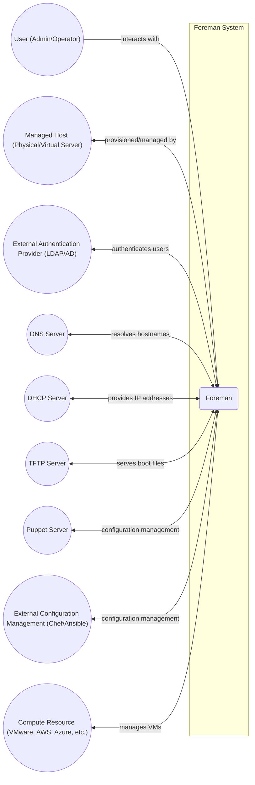
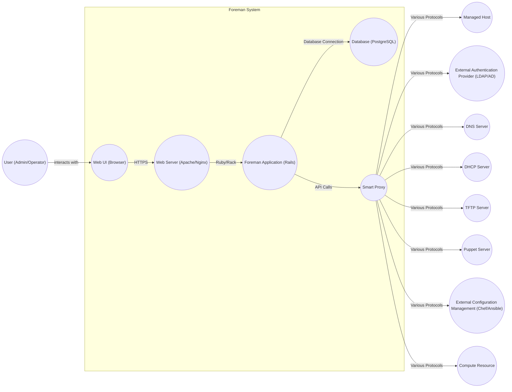
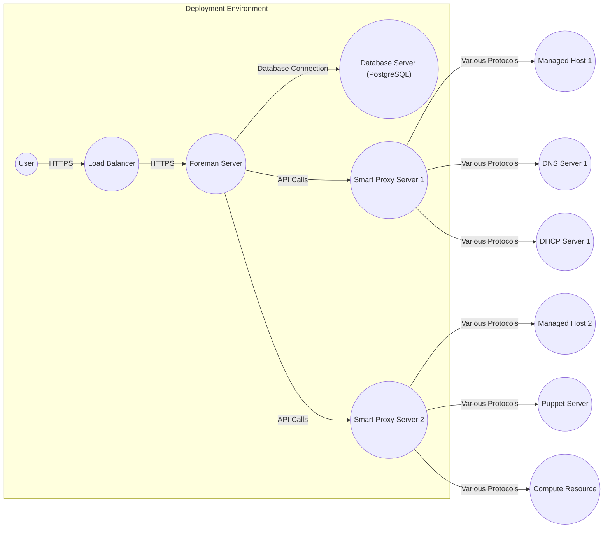
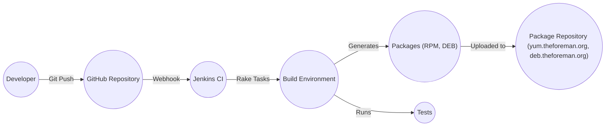

Okay, let's create a design document for the Foreman project.

# BUSINESS POSTURE

Foreman is an open-source project, and its primary business goal is to provide a complete lifecycle management tool for physical and virtual servers. It aims to simplify and automate repetitive system administration tasks. While not a commercial product in the traditional sense, its "business" priorities revolve around:

*   User Adoption and Community Growth: The project's success depends on a vibrant community of users and contributors.
*   Feature Completeness: Providing a comprehensive set of features to manage all aspects of server provisioning and management.
*   Integration and Extensibility: Allowing users to integrate Foreman with their existing infrastructure and tools through plugins and APIs.
*   Stability and Reliability: Ensuring that Foreman is a stable and reliable platform for managing critical infrastructure.
*   Maintainability: Keeping the codebase clean, well-documented, and easy to maintain and extend.

Business Risks:

*   Loss of Community Interest: If the project fails to attract and retain users and contributors, it could become stagnant and eventually obsolete.
*   Security Vulnerabilities: As a tool that manages critical infrastructure, security vulnerabilities in Foreman could have severe consequences for its users.
*   Competition: Other open-source and commercial tools offer similar functionality, so Foreman needs to differentiate itself and remain competitive.
*   Lack of Resources: As an open-source project, Foreman relies on volunteer contributions, which can be unpredictable.
*   Technical Debt: If the codebase is not well-maintained, technical debt can accumulate, making it harder to add new features and fix bugs.

# SECURITY POSTURE

Foreman, being a server management tool, inherently deals with sensitive operations and data. Therefore, a strong security posture is crucial.

Existing Security Controls (based on the GitHub repository and general knowledge of the project):

*   security control: Authentication: Foreman supports multiple authentication methods, including LDAP, Active Directory, and internal database authentication. Described in documentation and code.
*   security control: Authorization: Foreman implements Role-Based Access Control (RBAC) to restrict user access to specific resources and actions. Described in documentation and code.
*   security control: Auditing: Foreman provides audit logs to track user actions and changes to the system. Described in documentation and code.
*   security control: Secure Communication: Foreman uses HTTPS to encrypt communication between the server and clients. Described in documentation and code.
*   security control: Regular Updates: The Foreman project releases regular updates to address security vulnerabilities and bug fixes. Described in release notes.
*   security control: Plugin Architecture: Foreman's plugin architecture allows for extending functionality, but also introduces a potential attack vector if plugins are not carefully vetted. Described in documentation.
*   security control: Input validation: Foreman validates user input. Described in code.

Accepted Risks:

*   accepted risk: Plugin Security: While Foreman itself may be secure, third-party plugins could introduce vulnerabilities. Users are responsible for vetting the plugins they install.
*   accepted risk: Deployment Environment: Foreman's security depends partly on the security of the underlying operating system and network infrastructure.
*   accepted risk: User Management: The security of Foreman relies on proper user management practices, such as strong passwords and timely revocation of access.

Recommended Security Controls:

*   Implement regular penetration testing and vulnerability scanning.
*   Provide detailed security hardening guidelines for production deployments.
*   Implement a robust security review process for all code contributions, especially for plugins.
*   Consider implementing multi-factor authentication (MFA).
*   Implement Content Security Policy (CSP) to mitigate XSS attacks.
*   Implement Subresource Integrity (SRI) to ensure that fetched resources haven't been tampered with.

Security Requirements:

*   Authentication:
    *   Support for strong password policies.
    *   Support for multi-factor authentication.
    *   Secure storage of user credentials.
    *   Protection against brute-force attacks.
*   Authorization:
    *   Fine-grained access control based on roles and permissions.
    *   Principle of least privilege.
    *   Regular review of user permissions.
*   Input Validation:
    *   Validate all user input on the server-side.
    *   Use a whitelist approach to input validation whenever possible.
    *   Protect against common web vulnerabilities like XSS, SQL injection, and CSRF.
*   Cryptography:
    *   Use strong, industry-standard cryptographic algorithms.
    *   Securely manage cryptographic keys.
    *   Use HTTPS for all communication.
    *   Properly validate certificates.

# DESIGN

## C4 CONTEXT

Element Descriptions:

*   Element:
    *   Name: User (Admin/Operator)
    *   Type: Person
    *   Description: A system administrator or operator who uses Foreman to manage servers.
    *   Responsibilities: Interacting with the Foreman web UI or API to provision, configure, and monitor servers.
    *   Security controls: Authentication, Authorization, Auditing.

*   Element:
    *   Name: Foreman
    *   Type: Software System
    *   Description: The Foreman server application.
    *   Responsibilities: Providing a central point of management for servers, handling provisioning requests, interacting with external systems.
    *   Security controls: Authentication, Authorization, Auditing, Secure Communication, Input Validation.

*   Element:
    *   Name: Managed Host (Physical/Virtual Server)
    *   Type: Software System
    *   Description: A server that is being managed by Foreman.
    *   Responsibilities: Running the operating system and applications, receiving configuration updates from Foreman.
    *   Security controls: Dependent on the OS and applications running on the host, managed through Foreman.

*   Element:
    *   Name: External Authentication Provider (LDAP/AD)
    *   Type: Software System
    *   Description: An external directory service used for user authentication.
    *   Responsibilities: Authenticating users who log in to Foreman.
    *   Security controls: Authentication, Secure Communication (LDAPS).

*   Element:
    *   Name: DNS Server
    *   Type: Software System
    *   Description: A server that resolves hostnames to IP addresses.
    *   Responsibilities: Providing DNS resolution for Foreman and managed hosts.
    *   Security controls: DNSSEC (recommended).

*   Element:
    *   Name: DHCP Server
    *   Type: Software System
    *   Description: A server that provides IP addresses to managed hosts.
    *   Responsibilities: Assigning IP addresses, default gateways, and other network configuration parameters.
    *   Security controls: Secure configuration, access control.

*   Element:
    *   Name: TFTP Server
    *   Type: Software System
    *   Description: A server that serves boot files for network booting (PXE).
    *   Responsibilities: Providing boot images and configuration files to managed hosts.
    *   Security controls: Access control, file integrity checks.

*   Element:
    *   Name: Puppet Server
    *   Type: Software System
    *   Description: A Puppet master server used for configuration management.
    *   Responsibilities: Managing the configuration of managed hosts using Puppet.
    *   Security controls: Secure Communication (HTTPS), Authentication, Authorization.

*   Element:
    *   Name: External Configuration Management (Chef/Ansible)
    *   Type: Software System
    *   Description: Alternative configuration management systems that can be integrated with Foreman.
    *   Responsibilities: Managing the configuration of managed hosts.
    *   Security controls: Dependent on the specific configuration management system.

*   Element:
    *   Name: Compute Resource (VMware, AWS, Azure, etc.)
    *   Type: Software System
    *   Description: A virtualization platform or cloud provider used to provision virtual machines.
    *   Responsibilities: Creating, managing, and deleting virtual machines.
    *   Security controls: Dependent on the specific compute resource.

## C4 CONTAINER

Element Descriptions:

*   Element:
    *   Name: Web UI (Browser)
    *   Type: Web Browser
    *   Description: The user interface for interacting with Foreman.
    *   Responsibilities: Displaying information to the user, sending user requests to the server.
    *   Security controls: Browser security settings, HTTPS.

*   Element:
    *   Name: Web Server (Apache/Nginx)
    *   Type: Web Server
    *   Description: The web server that hosts the Foreman application.
    *   Responsibilities: Handling HTTP requests, serving static content, proxying requests to the Foreman application.
    *   Security controls: HTTPS configuration, access control, web server security hardening.

*   Element:
    *   Name: Foreman Application (Rails)
    *   Type: Web Application
    *   Description: The core Foreman application, built using Ruby on Rails.
    *   Responsibilities: Handling business logic, interacting with the database and Smart Proxies.
    *   Security controls: Authentication, Authorization, Auditing, Input Validation, Secure coding practices.

*   Element:
    *   Name: Database (PostgreSQL)
    *   Type: Database
    *   Description: The database that stores Foreman's data.
    *   Responsibilities: Storing information about hosts, users, settings, etc.
    *   Security controls: Database security hardening, access control, encryption at rest (recommended).

*   Element:
    *   Name: Smart Proxy
    *   Type: Software Component
    *   Description: A proxy server that handles communication with external systems.
    *   Responsibilities: Interacting with DNS, DHCP, TFTP, Puppet, and other services.
    *   Security controls: Secure communication, authentication, authorization (depending on the service being proxied).

## DEPLOYMENT

Foreman can be deployed in several ways:

1.  **Standalone Server:** Foreman and all its components (database, Smart Proxy, etc.) are installed on a single physical or virtual server.
2.  **Distributed Deployment:** Foreman components are distributed across multiple servers. This can improve performance and scalability. For example, the database and Smart Proxies can be installed on separate servers.
3.  **High Availability (HA) Deployment:** Multiple Foreman servers are configured in a cluster to provide redundancy and failover.
4.  **Containerized Deployment:** Foreman and its components are deployed as containers using Docker or Kubernetes.

We will describe the **Distributed Deployment** in detail, as it represents a good balance between complexity and scalability/reliability.

Element Descriptions:

*   Element:
    *   Name: Foreman Server
    *   Type: Server
    *   Description: The main Foreman application server.
    *   Responsibilities: Handling web requests, processing business logic.
    *   Security controls: OS hardening, firewall, intrusion detection system.

*   Element:
    *   Name: Database Server (PostgreSQL)
    *   Type: Server
    *   Description: The server hosting the PostgreSQL database.
    *   Responsibilities: Storing Foreman's data.
    *   Security controls: Database hardening, firewall, encryption at rest, regular backups.

*   Element:
    *   Name: Smart Proxy Server 1
    *   Type: Server
    *   Description: A server hosting a Smart Proxy instance.
    *   Responsibilities: Communicating with managed hosts, DNS, and DHCP.
    *   Security controls: OS hardening, firewall, secure communication with managed services.

*   Element:
    *   Name: Smart Proxy Server 2
    *   Type: Server
    *   Description: A server hosting a Smart Proxy instance.
    *   Responsibilities: Communicating with managed hosts, Puppet, and the compute resource.
    *   Security controls: OS hardening, firewall, secure communication with managed services.

*   Element:
    *   Name: Load Balancer
    *   Type: Network Device
    *   Description: A load balancer that distributes traffic to the Foreman server(s).
    *   Responsibilities: Distributing incoming traffic, providing SSL termination (optional).
    *   Security controls: Firewall, intrusion detection system, secure configuration.

*   Element:
    *   Name: User
    *   Type: Person
    *   Description: End user accessing Foreman web interface.
    *   Responsibilities: Using web browser to access Foreman.
    *   Security controls: Strong password, up-to-date browser, secure network connection.

*   Element:
    *   Name: Managed Host 1
    *   Type: Server
    *   Description: Server managed by Foreman.
    *   Responsibilities: Running services.
    *   Security controls: OS hardening, firewall, secure communication with Smart Proxy.

*   Element:
    *   Name: Managed Host 2
    *   Type: Server
    *   Description: Server managed by Foreman.
    *   Responsibilities: Running services.
    *   Security controls: OS hardening, firewall, secure communication with Smart Proxy.

*   Element:
    *   Name: DNS Server 1
    *   Type: Server
    *   Description: DNS server used by Foreman.
    *   Responsibilities: Resolving hostnames.
    *   Security controls: DNSSEC, secure configuration.

*   Element:
    *   Name: DHCP Server 1
    *   Type: Server
    *   Description: DHCP server used by Foreman.
    *   Responsibilities: Providing IP addresses.
    *   Security controls: Secure configuration, access control.

*   Element:
    *   Name: Puppet Server
    *   Type: Server
    *   Description: Puppet server used by Foreman.
    *   Responsibilities: Managing configuration of hosts.
    *   Security controls: Secure communication, authentication, authorization.

*   Element:
    *   Name: Compute Resource
    *   Type: Cloud Provider/Virtualization Platform
    *   Description: Cloud or virtualization platform used by Foreman.
    *   Responsibilities: Managing virtual machines.
    *   Security controls: Dependent on the specific platform.

## BUILD

Foreman uses a combination of tools and processes for building and packaging the software. The build process is largely automated using Rake tasks and shell scripts.

Build Process Description:

1.  **Code Commit:** Developers commit code changes to the GitHub repository.
2.  **Continuous Integration (CI):** A webhook triggers a build in Jenkins CI.
3.  **Build Environment:** Jenkins sets up a build environment (e.g., using Docker containers).
4.  **Rake Tasks:** Rake tasks are executed to compile code, run tests, and generate packages.
5.  **Tests:** Unit tests, integration tests, and linters are run to ensure code quality and identify potential issues.
6.  **Package Generation:** Packages (RPM and DEB) are created for different Linux distributions.
7.  **Package Repository:** The generated packages are uploaded to a package repository (yum.theforeman.org, deb.theforeman.org).

Security Controls in the Build Process:

*   security control: Code Review: All code changes are reviewed by other developers before being merged.
*   security control: Automated Testing: Unit tests and integration tests are run automatically as part of the build process.
*   security control: Static Analysis: Linters and static analysis tools are used to identify potential code quality and security issues.
*   security control: Dependency Management: Dependencies are managed using Bundler, and their versions are tracked.
*   security control: Build Environment Isolation: The build environment is isolated (e.g., using Docker containers) to prevent contamination from the host system.
*   security control: Signed Packages: Packages are likely signed with a GPG key to ensure their integrity and authenticity (needs verification).

# RISK ASSESSMENT

*   Critical Business Processes:
    *   Server Provisioning: Automating the process of deploying new servers.
    *   Configuration Management: Ensuring that servers are configured consistently and correctly.
    *   Lifecycle Management: Managing servers throughout their entire lifecycle, from provisioning to decommissioning.
    *   User and Permission Management: Controlling access to Foreman and managed resources.

*   Data Sensitivity:
    *   Hostnames and IP addresses: Confidential.
    *   Operating system and software versions: Confidential.
    *   User credentials (if stored locally): Highly Confidential.
    *   Configuration data (e.g., Puppet manifests): Confidential, may contain secrets.
    *   Audit logs: Confidential.
    *   API Keys and Tokens: Highly Confidential.

# QUESTIONS & ASSUMPTIONS

*   Questions:
    *   What is the specific threat model that the Foreman project is using (if any)?
    *   Are there any specific compliance requirements (e.g., PCI DSS, HIPAA) that need to be considered?
    *   What is the process for reporting and handling security vulnerabilities?
    *   Are there any plans to implement additional security features, such as MFA or integration with security information and event management (SIEM) systems?
    *   What is the exact process for signing packages?
    *   Are there any specific security hardening guidelines for production deployments?

*   Assumptions:
    *   The Foreman project follows secure coding practices.
    *   The build process is secure and prevents the introduction of malicious code.
    *   Users are responsible for securing their own infrastructure and following best practices for user management.
    *   The Foreman project has a process for responding to security vulnerabilities.
    *   The underlying operating system and network infrastructure are secure.
    *   Third-party plugins are vetted by users before installation.
    *   Regular backups of the Foreman database are performed.
    *   Smart Proxies are deployed securely and communicate with managed services using secure protocols.