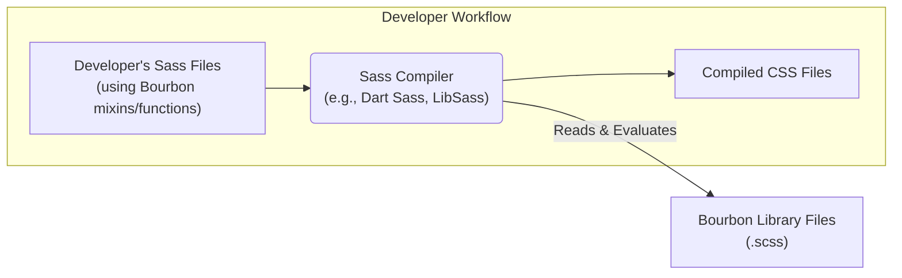
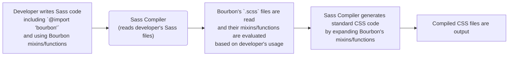

# Project Design Document: Bourbon Sass Library

**Version:** 1.1
**Date:** October 26, 2023
**Author:** AI Software Architect

## 1. Introduction

This document provides an enhanced design overview of the Bourbon Sass library, an open-source collection of Sass mixins and functions intended to simplify and streamline CSS development. This refined document aims to provide a more robust foundation for subsequent threat modeling activities.

## 2. Goals

The primary goals of the Bourbon project are:

* **Provision of Reusable CSS Patterns:** To offer a curated library of well-tested and frequently used CSS patterns, encapsulated as easily accessible Sass mixins and functions.
* **Simplification of CSS Development:** To significantly reduce the amount of repetitive and verbose CSS code that developers are required to write manually.
* **Promotion of Design Consistency:** To encourage the adoption of standardized and best-practice CSS techniques across diverse projects, leading to more uniform and predictable styling.
* **Enhancement of Code Maintainability:** To make CSS codebases easier to understand, modify, and maintain over time by abstracting common patterns.
* **Improvement of Developer Productivity:** To accelerate the CSS development workflow, allowing developers to focus on higher-level design concerns.

## 3. Architecture Overview

Bourbon is not a standalone application or service but rather a library designed for integration into web development projects that utilize the Sass preprocessor. Its architecture revolves around providing reusable Sass code that developers can import and leverage within their own Sass stylesheets during the compilation process.

**Key Architectural Components:**

* **Sass Mixins:**  These are the fundamental building blocks of Bourbon. They are reusable blocks of Sass code that, when included, generate specific CSS declarations. They encapsulate common CSS patterns and vendor prefixes, significantly reducing boilerplate.
* **Sass Functions:**  These are utility functions written in Sass that perform calculations or return values. They are used within Sass stylesheets, often in conjunction with mixins, to provide dynamic values and enhance flexibility.
* **Configuration Variables (Minimal):** While Bourbon emphasizes convention over configuration, it may include a limited set of global Sass variables to allow for basic customization of its output.
* **Documentation:**  Comprehensive documentation is crucial for developers to understand how to effectively use Bourbon's mixins and functions. This typically includes usage examples and parameter descriptions.
* **Test Suite:**  A rigorous test suite ensures that the mixins and functions generate the expected CSS output and maintain consistency across different versions of Sass compilers. This is vital for the reliability of the library.

## 4. Component Details

This section provides a more detailed look at the key components within the Bourbon library.

* **Sass Mixins:**
    * Reside in `.scss` files organized within the Bourbon library's directory structure.
    * Are incorporated into a developer's Sass rules using the `@include` directive followed by the mixin's name.
    * Abstract away complex or repetitive CSS property declarations.
    * **Examples:**
        * `clearfix()`:  Generates the necessary CSS to clear floated elements.
        * `border-radius($radius)`:  Generates cross-browser `border-radius` properties.
        * `linear-gradient($direction, $color-stops...)`: Creates linear gradient backgrounds with vendor prefixes.
        * `transition($properties, $duration, $easing)`:  Applies CSS transitions with vendor prefixes.
* **Sass Functions:**
    * Are also located in `.scss` files within the Bourbon library.
    * Are invoked directly within Sass property values or other Sass logic.
    * Perform operations or return specific values based on input.
    * **Examples:**
        * `em($pixels, $context)`: Converts pixel values to em units based on a context.
        * `rem($pixels)`: Converts pixel values to rem units.
        * `tint($color, $percentage)`: Lightens a given color by a specified percentage.
        * `shade($color, $percentage)`: Darkens a given color by a specified percentage.
* **Configuration Variables:**
    * Global Sass variables that, if present, can be redefined by developers to alter Bourbon's default behavior.
    * Typically found at the beginning of Bourbon's core files.
    * **Example (Hypothetical):**  A variable to control the default unit for certain spacing mixins.
* **Documentation:**
    * Typically provided as Markdown files within the repository or as code comments within the Sass files themselves.
    * Clearly explains the purpose, correct usage, available parameters, and expected output of each mixin and function.
    * Often includes practical examples demonstrating how to implement the components.
* **Test Suite:**
    * Implemented using a Sass testing framework (e.g., True).
    * Comprises individual test cases that compile Sass code utilizing Bourbon and then assert that the resulting CSS output precisely matches the expected CSS.
    * Plays a critical role in ensuring the library's functionality and preventing regressions during development.

## 5. Data Flow

The "data flow" in the context of Bourbon describes how the library's code is utilized and transformed within a developer's project during the Sass compilation process.

**Detailed Flow:**

1. **Developer Integration:** The developer integrates Bourbon into their project by including the main Bourbon Sass file (typically `bourbon`) using the `@import` directive within their Sass stylesheets.
2. **Mixin and Function Invocation:** The developer utilizes Bourbon's mixins and functions within their Sass rules. Mixins are included using `@include`, and functions are called directly within property values or other Sass expressions.
3. **Sass Compilation Initiation:** The developer triggers the Sass compilation process using their chosen Sass compiler (e.g., `sass`, `node-sass`, `dart-sass`).
4. **Bourbon Code Evaluation:** The Sass compiler encounters the `@import 'bourbon'` statement and loads Bourbon's Sass files. When it encounters Bourbon mixin inclusions or function calls, it evaluates the corresponding code within the Bourbon library.
5. **CSS Generation:** Bourbon's mixins and functions generate standard CSS declarations based on their defined logic and any parameters provided by the developer during invocation. The Sass compiler effectively replaces the mixin calls with the generated CSS.
6. **CSS Output:** The Sass compiler outputs standard CSS files containing the styles generated by Bourbon, combined with the developer's own CSS rules.
7. **Deployment and Browser Rendering:** The generated CSS files are then deployed as part of the web application and are subsequently interpreted by web browsers to style the HTML content.

## 6. Security Considerations (Initial)

While Bourbon, as a Sass library, presents a lower direct security risk compared to runtime code, several potential areas warrant consideration for threat modeling:

* **Supply Chain Vulnerabilities:**
    * **Compromised Package Repository:** If the Bourbon package on a package manager (e.g., npm, RubyGems) is compromised, malicious code could be injected into developer projects during installation.
    * **Dependency Vulnerabilities (Indirect):** Although Bourbon has minimal direct dependencies, vulnerabilities in any of its transitive dependencies could pose a risk.
* **Malicious Mixins/Functions (Low Probability but High Impact):**
    * While highly unlikely in a reputable open-source project, the possibility exists for malicious actors to introduce mixins or functions that generate unexpected or harmful CSS. This could lead to:
        * **Denial of Service (DoS) via CSS Bomb:** Generating extremely large or computationally expensive CSS that could severely impact browser rendering performance.
        * **Indirect Information Disclosure:**  Crafted CSS could potentially exploit browser rendering quirks to leak information, though this is a less direct threat.
        * **Style Injection Attacks:** While Bourbon itself doesn't directly cause this, malicious mixins could be designed to make it easier for developers to inadvertently introduce style injection vulnerabilities if they are not careful with user-supplied data.
* **Build Process Security:**
    * The security of the Sass compilation process is crucial. If the build environment is compromised, malicious code could be injected during compilation, even if Bourbon's code is inherently safe. This includes ensuring the integrity of the Sass compiler itself.
* **Documentation Security:**
    * If the official documentation is compromised, attackers could mislead developers into using Bourbon in insecure ways or introduce vulnerabilities through incorrect usage patterns.
* **Lack of Updates and Maintenance:**
    * If the Bourbon project becomes unmaintained, it may not receive necessary security updates to address newly discovered vulnerabilities in Sass compilers or CSS specifications, potentially leading to compatibility issues or security risks down the line.

## 7. Deployment

Bourbon is deployed as a library that developers integrate into their projects. Common deployment methods include:

* **Package Managers:**
    * **npm (Node Package Manager):** Installation via `npm install bourbon --save-dev`. This is the most common method for JavaScript-based projects.
    * **Yarn:** Installation via `yarn add bourbon --dev`. A popular alternative to npm.
    * **RubyGems:** For Ruby on Rails projects, Bourbon can be included by adding `gem 'bourbon'` to the project's Gemfile and running `bundle install`.
* **Manual Download:** Developers can download the source code directly from the official GitHub repository and include the Bourbon files within their project's asset pipeline. This method offers more control but requires manual updates.
* **CDN (Content Delivery Network - Less Common):** While less typical for Sass libraries, it might be theoretically possible to link to Bourbon files hosted on a CDN, though this is generally not recommended due to the nature of Sass compilation.

Once integrated, developers import Bourbon into their Sass files using the `@import 'bourbon';` directive. The specific path may vary depending on the installation method and project structure.

## 8. Assumptions and Constraints

* **Sass Preprocessor Dependency:** It is a fundamental assumption that developers utilizing Bourbon are employing a Sass preprocessor (e.g., Dart Sass, LibSass) as part of their development workflow.
* **Standard Web Development Environment:** The design assumes a typical web development environment with the necessary tooling for Sass compilation, dependency management, and version control.
* **Open Source Nature and Community Driven:** Bourbon is an open-source project, and its development and maintenance are primarily driven by the contributions of the open-source community.
* **Focus on CSS Generation:** Bourbon's core responsibility is the generation of CSS through its provided mixins and functions. It does not handle JavaScript or other front-end scripting logic.
* **Semantic Versioning:** It is assumed that the Bourbon project adheres to semantic versioning principles for releases, allowing developers to understand the scope of changes and potential breaking changes between versions.

This improved document provides a more detailed and nuanced design overview of the Bourbon Sass library, offering a stronger foundation for comprehensive threat modeling. The next step would involve a deeper analysis of the identified security considerations, potentially using frameworks like STRIDE, to systematically identify potential threats and vulnerabilities.