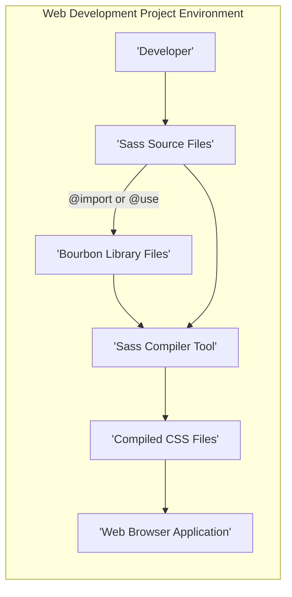

## Project Design Document: Bourbon Sass Library

**Version:** 1.1
**Date:** October 26, 2023
**Author:** Gemini (AI Language Model)

### 1. Project Overview

This document details the design of the Bourbon Sass library, a collection of Sass mixins, functions, and utilities intended to simplify and standardize CSS development. This document serves as a foundation for threat modeling, providing a clear understanding of Bourbon's architecture, components, and interactions to identify potential vulnerabilities and attack vectors.

Bourbon is not a standalone application but a library designed for integration into web development projects that utilize the Sass preprocessor. It offers syntactic conveniences and ensures cross-browser compatibility for common CSS patterns during the Sass compilation phase.

### 2. Goals

* **Standardize CSS patterns:** Offer a curated collection of well-tested, commonly used CSS patterns encapsulated as Sass mixins and functions.
* **Simplify CSS authoring:** Reduce the amount of verbose CSS code developers need to write manually.
* **Improve cross-browser consistency:** Abstract away vendor prefixes and address browser-specific CSS implementations.
* **Promote code reusability:** Encourage the use of modular and reusable styling components within projects.

### 3. Non-Goals

* **Server-side processing or data management:** Bourbon's functionality is limited to CSS preprocessing.
* **Comprehensive CSS framework functionality:** Bourbon provides utilities, not a full framework with pre-defined layouts or UI components.
* **JavaScript interaction or manipulation:** Bourbon's scope is strictly within the realm of CSS.
* **Dynamic CSS modification at runtime:** Bourbon's influence is during the Sass compilation stage, not during a user's active browsing session.

### 4. Target Audience

The primary users of Bourbon are front-end web developers who incorporate the Sass preprocessor into their development workflows for building websites and web applications.

### 5. Architecture

Bourbon's architecture revolves around its integration as a dependency within a web development project's Sass compilation process. Understanding this architecture is crucial for identifying potential points of compromise.

**Architectural Components:**

* **Developer:** The individual writing Sass code and integrating the Bourbon library into their project. This is a potential point of introduction for malicious code if the developer's environment is compromised.
* **Sass Source Files:** The project's Sass stylesheets where developers utilize Bourbon's mixins and functions. Malicious code could be injected here.
* **Bourbon Library Files:** The collection of Sass files provided by the Bourbon project, containing the mixins, functions, and variables. A compromised library is a significant threat.
* **Sass Compiler Tool:** Software (e.g., Dart Sass, LibSass) that processes Sass files, including Bourbon, to generate standard CSS. Vulnerabilities in the compiler itself are a concern.
* **Compiled CSS Files:** The output of the Sass compilation process, containing the final CSS rules applied to the website. Errors here could lead to visual issues or potentially be exploited.
* **Web Browser Application:** The application used by end-users to view the website, rendering the compiled CSS. While Bourbon's direct impact here is limited, issues in the generated CSS can affect the user experience and potentially introduce client-side vulnerabilities.

**Interaction Workflow:**

1. The **Developer** authors Sass code within the **Sass Source Files**.
2. The **Developer** includes the **Bourbon Library Files** into their Sass files using `@import` or `@use` directives. This establishes a dependency.
3. The **Sass Compiler Tool** reads and processes the **Sass Source Files**, including the code from the **Bourbon Library Files**.
4. The **Sass Compiler Tool** executes the Bourbon mixins and functions, generating corresponding standard CSS.
5. The **Sass Compiler Tool** outputs the compiled **CSS Files**.
6. The **Web Browser Application** loads and renders the **Compiled CSS Files**, applying the styles to the web page content.

### 6. Data Flow

The "data" in this context primarily refers to the Sass code and its transformation into CSS. Understanding this flow helps identify where manipulation or injection could occur.

* **Input (Sass Code):** Sass code written by the developer, incorporating directives to utilize Bourbon's features. This is the initial point where potentially malicious code could be introduced.
* **Processing (Sass Compilation):** The Sass compiler reads the Sass files and executes the logic defined within Bourbon's mixins and functions. This involves text parsing, string manipulation, and CSS rule generation. Vulnerabilities in the compiler's processing logic are a concern.
* **Output (CSS Code):** Standard CSS code generated by the Sass compiler, reflecting the styles defined by Bourbon and the developer's code. Errors or unexpected output here can have visual or functional consequences.

### 7. Key Components of the Bourbon Library

The Bourbon library is organized into distinct categories of Sass files, each serving a specific purpose. Understanding these components is essential for assessing potential vulnerabilities within the library itself.

* **Mixins:**
    * Reusable blocks of Sass code that generate multiple CSS declarations.
    * Examples: Mixins for gradients, transitions, transformations, and clearfix.
    * Accept arguments to customize the generated CSS output.
    * Potential threat: Logic errors within mixins could lead to unexpected or insecure CSS.
* **Functions:**
    * Sass functions that return specific values for use within CSS declarations.
    * Examples: Functions for color manipulation, unit calculations, and retrieving variable values.
    * Potential threat: Errors in function logic could lead to incorrect or insecure CSS values.
* **Variables:**
    * Sass variables used to store reusable values for colors, breakpoints, and other design tokens.
    * Promote consistency and maintainability.
    * Potential threat: While less direct, incorrect variable usage within mixins or functions could lead to issues.
* **Helpers:**
    * Utility Sass code that supports the functionality of mixins and functions.
    * May include internal functions or variable definitions.
    * Potential threat: Errors in helper functions could indirectly impact the security or functionality of mixins.
* **Settings (Potentially):**
    * Some Bourbon versions might include settings files to customize default behaviors.
    * Potential threat: Incorrectly configured settings could lead to unintended styling or behavior.

### 8. Security Considerations for Threat Modeling

This section outlines potential security considerations relevant for threat modeling activities.

* **Supply Chain Vulnerabilities:**
    * **Compromised Bourbon Library:** A malicious actor could compromise the Bourbon library repository or distribution channels, injecting malicious code into the mixins, functions, or variables. This would affect all projects using the compromised version.
        * **Impact:** Introduction of arbitrary CSS, potentially leading to phishing attacks (e.g., overlaying fake login forms), defacement, or browser exploits if the CSS triggers browser vulnerabilities.
    * **Compromised Sass Compiler:** Vulnerabilities in the Sass compiler itself could be exploited during the processing of Bourbon's code, potentially leading to arbitrary code execution during compilation or the generation of malicious CSS.
        * **Impact:**  Potentially severe, allowing attackers to gain control of the build process or inject malicious code into the final CSS.
* **Logic Errors within Bourbon:**
    * **Unintended CSS Output:** Bugs or vulnerabilities in Bourbon's mixins or functions could result in the generation of CSS that breaks the intended layout, introduces accessibility issues, or creates opportunities for visual spoofing.
        * **Impact:** While not directly a classical security vulnerability, this can degrade the user experience and potentially be leveraged in social engineering attacks.
    * **CSS Injection via Mixin Parameters (Less Likely but Possible):** If mixins are not carefully designed and sanitize inputs, there's a theoretical risk of CSS injection if a developer uses dynamic data to populate mixin parameters (though this is not the typical use case for a CSS library).
        * **Impact:**  Could allow for the injection of arbitrary CSS, similar to a compromised library.
* **Denial of Service (Compilation Phase):**
    * **Extremely Complex Mixins:** While unlikely, overly complex or inefficient mixins could theoretically slow down the Sass compilation process, potentially leading to denial of service during development or deployment.
        * **Impact:** Primarily affects development workflows, not a direct runtime security issue.

**Important Note:** Bourbon operates solely during the Sass compilation phase. It does not handle user input, interact with databases, or perform any runtime operations in the browser. This significantly limits the types of vulnerabilities that are directly applicable. The primary attack vectors involve compromising the library itself or the tools used to process it.

### 9. Deployment

Bourbon is integrated into web development projects as a dependency. Common deployment methods include:

* **Package Managers (npm, Yarn):** Installing Bourbon as a project dependency using package managers. This is the most common method.
    * **Threat:** Risk of installing a compromised package if the registry is compromised or if a malicious package is disguised as Bourbon.
* **Direct Download:** Downloading the Bourbon source files and including them directly in the project's Sass directory.
    * **Threat:** Risk of downloading a compromised version from an untrusted source.

Once included, developers use `@import` or `@use` directives in their Sass files to access Bourbon's functionalities.

### 10. Technology Stack

* **Primary Language:** Sass (Syntactically Awesome Style Sheets)
* **Core Dependency:** Requires a Sass compiler (e.g., Dart Sass, LibSass) for processing.
* **Distribution Mechanisms:** Primarily distributed via package managers (npm, Yarn) and as source files on platforms like GitHub.

This revised design document provides a more detailed and security-focused overview of the Bourbon Sass library. It emphasizes the architecture, data flow, and potential security considerations relevant for conducting thorough threat modeling.