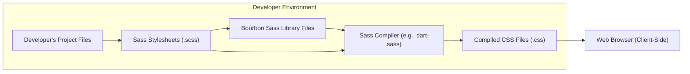
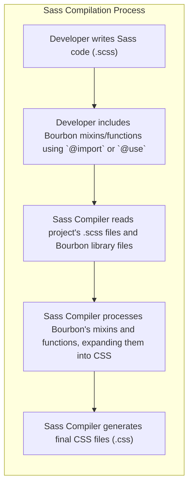

# Project Design Document: Bourbon Sass Library

**Version:** 1.1
**Date:** October 26, 2023
**Author:** AI Software Architect

## 1. Introduction

This document provides an enhanced design overview of the Bourbon Sass library, an open-source collection of Sass mixins and functions designed to simplify and streamline CSS development. This detailed description of Bourbon's architecture, components, and data flow is intended to serve as a robust foundation for subsequent threat modeling activities. Understanding these aspects is crucial for identifying potential vulnerabilities and security considerations.

## 2. Goals and Non-Goals

### 2.1. Goals

*   Present a refined and more detailed architectural overview of the Bourbon Sass library.
*   Clearly identify and describe the key components within the library and their interactions.
*   Illustrate the data flow involved when utilizing Bourbon within a web development project, emphasizing the compilation process.
*   Thoroughly explore potential security considerations relevant to a front-end library like Bourbon, focusing on supply chain and development practices.
*   Provide a comprehensive and well-structured document specifically tailored for effective threat modeling.

### 2.2. Non-Goals

*   Provide an exhaustive, line-by-line code analysis of every mixin and function within the Bourbon library.
*   Detail the intricate implementation specifics of each feature within Bourbon's codebase.
*   Offer a comparative analysis of Bourbon against other CSS frameworks, libraries, or methodologies.
*   Include performance benchmarks, optimization techniques, or detailed performance characteristics of Bourbon.

## 3. Architectural Overview

Bourbon is designed as a library to be integrated into web development projects that leverage the Sass preprocessor. It is not a standalone application or service. Its architecture revolves around providing reusable Sass code snippets (mixins) and utility functions that generate standard CSS during the compilation process.

### 3.1. High-Level Architecture

*   **Developer's Project Files:** Represents the entirety of the web development project where Bourbon is being utilized.
*   **Sass Stylesheets (.scss):** These are the files where developers write their CSS styles, incorporating Bourbon's mixins and functions.
*   **Bourbon Sass Library Files:** The collection of `.scss` files that constitute the Bourbon library, containing mixins, functions, and variables.
*   **Sass Compiler (e.g., dart-sass):** A software tool responsible for processing Sass files, including those from the Bourbon library, and transforming them into standard CSS. Examples include `dart-sass`, `libsass`, or the Sass implementation within build tools.
*   **Compiled CSS Files (.css):** The output generated by the Sass compiler, containing the final CSS rules that are interpreted by web browsers.
*   **Web Browser (Client-Side):** The application used by end-users to view the web page, rendering the content based on the provided CSS.

### 3.2. Component-Level Architecture

Bourbon's internal structure is organized into a directory structure containing various Sass files, each responsible for specific functionalities. Key component categories include:

*   **Mixins:** Reusable blocks of Sass code that generate CSS declarations. These are the core feature of Bourbon. Examples include:
    *   `_prefixer.scss`: Contains mixins for automatically adding vendor prefixes to CSS properties.
    *   `_clearfix.scss`: Provides a mixin for clearing floated elements.
    *   `_transition.scss`: Offers mixins for creating CSS transitions with cross-browser compatibility.
    *   Mixins for layout purposes (e.g., grid systems, positioning).
    *   Mixins for typography (e.g., font styling, text manipulation).
    *   Mixins for handling media queries.
*   **Functions:** Sass functions that perform calculations or return specific CSS values, enhancing the flexibility of styling. Examples include:
    *   Color manipulation functions (e.g., lightening, darkening, adjusting opacity).
    *   Unit conversion functions (though less common in Bourbon).
    *   Functions for retrieving values from variables.
*   **Variables:** Sass variables that define default values for colors, spacing units, breakpoints, and other style-related properties used within the mixins and functions. These provide a degree of customization.
*   **Settings (Implicit):** While Bourbon doesn't have explicit configuration files, its variables act as implicit settings that can be overridden in a project's Sass files to customize Bourbon's behavior.

### 3.3. Data Flow

The data flow when using Bourbon within a web development project involves the following steps:

1. **Developer writes Sass code (.scss):** Developers create and modify `.scss` files, writing their styles and incorporating Bourbon's features.
2. **Include Bourbon mixins/functions:** Developers use the `@import` rule (for older Sass versions) or the `@use` rule (for newer modular Sass) to include Bourbon's functionality within their Sass stylesheets. This makes Bourbon's mixins and functions available for use.
3. **Sass Compiler reads files:** The Sass compiler is invoked (either through a command-line tool, a build process, or a development server). It reads the developer's `.scss` files and the necessary files from the Bourbon library.
4. **Sass Compiler processes:** The compiler interprets the Sass code. When a Bourbon mixin is encountered, the compiler replaces the mixin inclusion with the corresponding CSS declarations defined within that mixin. Functions are evaluated, and their return values are inserted into the CSS.
5. **Sass Compiler generates CSS:** The Sass compiler outputs standard CSS files based on the processed Sass code, including the expanded Bourbon mixins and function results. These CSS files are then used by the web browser to style the web page.

## 4. Security Considerations

While Bourbon is a front-end library and does not directly handle sensitive user data or server-side logic, several security considerations are relevant:

*   **Supply Chain Security:**
    *   **Compromised Package Repositories:** Bourbon is typically obtained through package managers like npm or RubyGems. If these repositories are compromised, malicious versions of Bourbon could be distributed, potentially injecting harmful CSS or other code into projects. **Threat Example:** A compromised Bourbon version could include CSS that redirects users to phishing sites or subtly alters the appearance of the website to deceive users.
    *   **Dependency Vulnerabilities (Indirect):** While Bourbon itself has minimal direct dependencies, the tools used to manage it (e.g., `npm`, `yarn`, `bundler`) and the Sass compiler are dependencies. Vulnerabilities in these tools could indirectly impact the security of projects using Bourbon. **Threat Example:** A vulnerability in the Sass compiler could allow for arbitrary file access during the compilation process.
    *   **Integrity Checks:**  Lack of proper integrity checks (e.g., using checksums or verifying signatures) during the installation of Bourbon could allow for the installation of tampered packages.
*   **Code Quality and Potential for Unexpected Behavior:**
    *   **Logic Errors in Mixins/Functions:** Bugs or logical errors within Bourbon's code could lead to unexpected CSS output, potentially causing layout issues that could be exploited or exposing sensitive information. **Threat Example:** A flawed clearfix mixin could lead to content overlapping in unexpected ways, potentially obscuring important security warnings.
    *   **CSS Injection (Indirect Risk):** While Bourbon doesn't directly handle user input, vulnerabilities in the application's Sass compilation process or the dynamic generation of Sass that includes user-controlled data could indirectly lead to CSS injection vulnerabilities. Bourbon's mixins could then amplify the impact of such injections. **Threat Example:** If a user-controlled string is inadvertently used in a Sass variable that is then used within a Bourbon mixin for generating a CSS rule, it could lead to arbitrary CSS being injected.
*   **Denial of Service (DoS) through Compilation Complexity:**
    *   **Excessive Compilation Time:**  While less of a runtime threat, extremely complex Sass files that heavily utilize deeply nested Bourbon mixins could lead to very long compilation times, potentially disrupting the development process or build pipelines. This could be a concern in large projects. **Threat Example:** A malicious actor could submit a pull request with excessively complex Sass that significantly slows down the project's build process.
*   **Accidental Information Disclosure:**
    *   **Verbose Error Messages:**  In development environments, overly verbose error messages from the Sass compiler (potentially triggered by issues within Bourbon or its interaction with project code) could inadvertently reveal sensitive information about the project's structure or dependencies.

## 5. Deployment

Bourbon itself is not "deployed" as a running application. Instead, it is integrated into a web development project during the development and build phases. Its impact is realized through the compiled CSS that is ultimately deployed.

*   **Installation:** Developers install Bourbon as a development dependency using a package manager:
    *   `npm install bourbon --save-dev` (for Node.js projects)
    *   `gem install bourbon` (for Ruby on Rails projects)
*   **Integration:** Bourbon's Sass files are then included in the project's Sass stylesheets using `@import 'bourbon';` (for older Sass) or `@use 'bourbon';` (for newer modular Sass).
*   **Compilation:** During the project's build process, a Sass compiler processes the project's Sass files, including Bourbon, to generate standard CSS files. This compilation step is crucial.
*   **Deployment of Compiled Assets:** The generated CSS files are then deployed as static assets along with the rest of the web application to the web server. The end-users' browsers download and apply these CSS files.

## 6. Future Considerations

*   **Staying Updated:** Regularly updating Bourbon to the latest version is crucial to benefit from bug fixes, performance improvements, and potential security patches.
*   **Community Health:** The activity and responsiveness of the Bourbon community are important factors for long-term support and the availability of updates.
*   **Adoption of Modern CSS:** As CSS standards evolve, developers might consider transitioning to native CSS features or more modern CSS-in-JS solutions, potentially reducing reliance on libraries like Bourbon. This is a long-term architectural consideration.
*   **Security Audits:** For projects with strict security requirements, periodic security audits of Bourbon (or the tools used with it) might be considered.

This enhanced design document provides a more detailed and nuanced understanding of the Bourbon Sass library's architecture, components, and data flow, with a stronger emphasis on security considerations relevant for threat modeling. This information should enable more effective identification and mitigation of potential risks associated with its use.